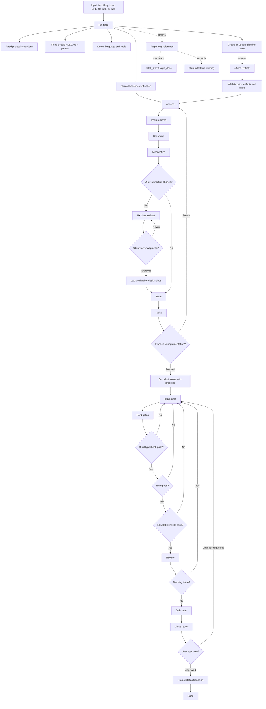

# Ticket Pipeline E2E

Project-agnostic ticket lifecycle skill for taking one ticket from discovery to
reviewed implementation and user-approved close.

## Workflow

## Reference Loading

`SKILL.md` stays lean and loads focused references only when needed:

- `references/ralph-loop.md` for agentic apps with Ralph tooling.
- `references/language-typescript.md` for TypeScript/JavaScript projects.
- `references/language-python.md` for Python projects.
- `references/language-rust.md` for Rust projects.
- `references/language-go.md` for Go projects.

Project docs always win over generic language references.
