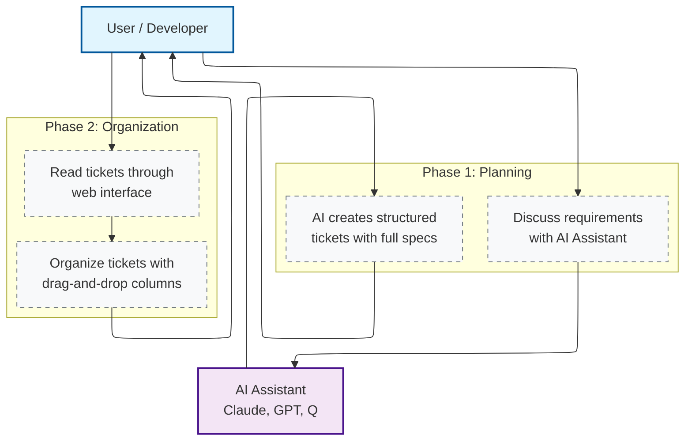
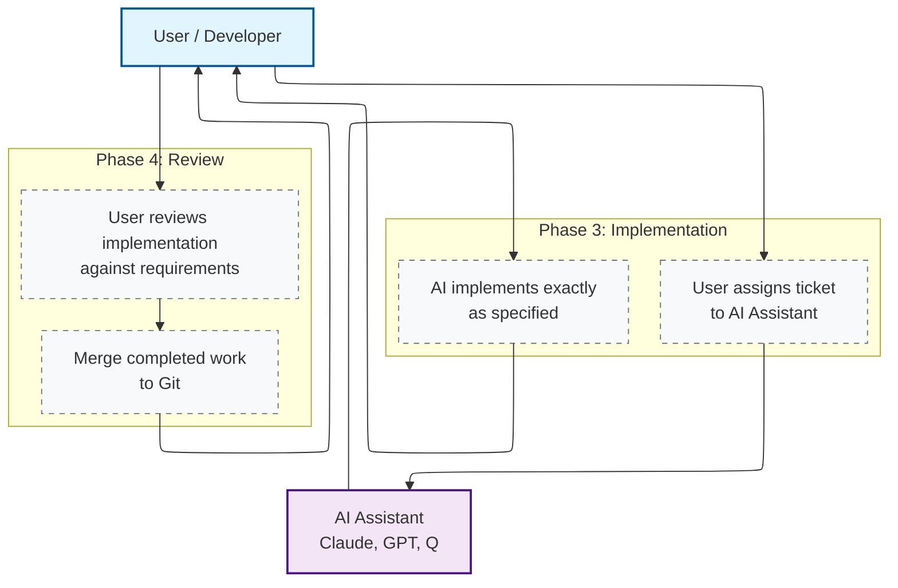

# Markdown Ticket Board

**Organize project tickets as markdown files with AI-powered workflow**

Transform scattered documentation into an organized, version-controlled project management system. <br>

Discuss features with LLM → LLM creates structured tickets → Review → LLM implements code → You review and organize.


## ⚡ Quick Start
### Start the application
#### Docker
```bash
git clone https://github.com/andkirby/markdown-ticket.git
cd markdown-ticket
bin/dc up -d

claude mcp add --scope user --transport http mdt-all http://localhost:3012/mcp
```

Or use MCP connection with STDIO transport:
```bash
claude mcp remove mdt-all --scope user # delete existing MCP 
claude mcp add --scope user mdt-all docker -- exec --env MCP_HTTP_ENABLED=false -i mdt-mcp node /app/mcp-server/dist/index.js
```

#### Local Setup
```bash
# Build JavaScript code
npm run build:all

# Production (built JavaScript files)
./start.sh              # Start fronend/backend production servers

# Add MCP into Claude Code, transport: STDIO 
claude mcp add mdt-all node $PWD/mcp-server/dist/index.js
```

## **Access Points:**
- **Web Interface**: Docker http://localhost:5174 | Local http://localhost:4173 (production) | http://localhost:5173 (development)
- **MCP Endpoint**: Docker http://localhost:3012/mcp | Local `mcp-server/dist/index.js`

🚨 **Note**: MCP integration is required for the full AI-driven workflow. Without it, you only have a basic ticket viewer.

---

## 🎯 What It Does

**Solves three fundamental problems with AI-driven development:**

### 1. **Markdown Management**
Anyone can create markdown files, but managing them at scale becomes challenging. Files get scattered, navigation breaks down, and tracking progress requires manual hunting through directories.

### 2. **AI Context Persistence**
LLMs have limited context windows and forget previous conversations. This system keeps everything organized and accessible across AI sessions, so no decisions get lost.

### 3. **Specification-Driven Workflow**
Create detailed specifications first, then let AI implement exactly what was specified. This eliminates ambiguity and ensures requirements are actually met.

**The result:** Your scattered markdown files become an organized, version-controlled knowledge base that both AI and humans can work with effectively.

---

## 🔄 How It Works

### Planning & Organization



### Implementation & Review



### The Workflow Explained

**Phase 1: Planning** - Discuss requirements with AI assistants using **crafted prompts** for best results. AI creates structured tickets with all necessary sections:
- Description, Rationale, Solution Analysis
- Implementation Specification and Acceptance Criteria

💡 **Pro Tip**: Use the provided prompt template at `prompts/mdt-ticket-creation.md` for consistent, high-quality tickets that AI can implement effectively. Please provide feedback on its effectiveness; it would be greatly appreciated.

**Phase 2: Organization** - Navigate tickets and documents through a beautiful interface with proper formatting, code highlighting, and Mermaid diagrams. Drag and drop tickets between columns to update status.

**Phase 3: Implementation** - When a ticket is ready, give it to AI. AI reads the complete specification and implements exactly what was specified - writes code, tests, and documentation.

**Phase 4: Review** - Review the implementation against requirements, run automated tests, and merge the completed work with confidence.

**Every step is tracked in Git, creating a complete history from discussion to deployment.**

---

## 🌟 Key Features

### 📖 **Content Consumption**
- **Beautiful markdown rendering** with proper formatting and syntax highlighting
- **Interactive Mermaid diagrams** with zoom controls for architecture visualizations
- **Document navigation** for both tickets AND all project documents

### 🎯 **Organization**
- **Drag and drop** tickets between status columns
- **Visual status tracking** for progress and priorities
- **Multi-project support** to switch between projects instantly
- **All content stored** in standard markdown files with YAML frontmatter

### 🤖 **AI Integration**
- **Native MCP integration** for AI assistants to read, create, and update tickets
- **Persistent context** across AI sessions - no more lost decisions
- **Structured ticket generation** with all required sections
- **Specification-driven implementation** ensuring code matches requirements

### 🔧 **Technical Foundation**
- **Git-based storage** - everything version-controlled alongside your code
- **No database required** - works with your existing filesystem
- **Real-time updates** across all interfaces
- **Production-ready Docker** deployment with single command

---

## 🤖 AI Assistant Integration

**Built for the AI era** - Native MCP (Model Context Protocol) server lets AI assistants read, create, and update tickets directly.

**Available Tools**: `list_projects`, `get_project_info`, `list_crs`, `get_cr`, `create_cr`, `update_cr_status`, `manage_cr_sections`, and more.

**For detailed setup and memory configuration**, see **[docs/MCP_SERVER_GUIDE.md](docs/MCP_SERVER_GUIDE.md)**.

---

## 🐳 Docker Deployment

Production-ready deployment with single command:

```bash
# Production
bin/dc up -d

# Development
MDT_DOCKER_MODE=dev bin/dc up -d
# or add MDT_DOCKER_MODE=dev into .env[.local]
```

**MCP Endpoint**: http://localhost:3012/mcp (for HTTP transport setup)

**Features**: Secure by default, volume mounting, auto-discovery of projects. See **[docs/DOCKER_GUIDE.md](docs/DOCKER_GUIDE.md)** for detailed configuration.

---

## 🔄 Workflow Integration

### Git Workflow
Your entire project state is tracked in Git alongside code:

```bash
git add docs/CRs/
git commit -m "Add user authentication ticket (PROJ-001)"
git push
```

### Team Collaboration
- **No merge conflicts** on project management data
- **Pull requests** include both code and ticket changes
- **Code reviews** show requirement context alongside implementation
- **Complete history** for all decisions and changes

---

## 🎯 Who This Is For

### ✅ Perfect For
- **Solo developers working with AI assistance** who need to keep track of decisions and progress
- **Engineers who maintain architectural documents** and feature specifications
- **Anyone frustrated with AI context limits** and losing track of important decisions
- **Developers managing feature requests** and change requests for existing projects
- **Projects that require structured documentation** and specification-driven workflow

**This tool shines when AI and humans collaborate on software development through structured tickets and specifications.**

---

## 📈 What's New

- **v0.7.1** (2025-11-14): CLI project management tool, flexible MCP section matching, ticket numbering fixes, and documentation improvements

- **v0.7.0** (2025-11-12): Complete Docker containerization, advanced configuration management, enhanced MCP HTTP transport

- **v0.6.0** (2025-10-18): Smart link reliability fixes, project management improvements, and MCP optimizations

- **v0.5.0** (2025-10-14): Smart links, Table of Contents, H1 title management, enhanced MCP tools

See **[RELEASE_NOTES.md](RELEASE_NOTES.md)** for detailed version history.

---

## 🛠 Development

### Setup
```bash
npm install          # Install all dependencies

# Development Mode (hot-reload, TypeScript)
./start-dev.sh       # Start both dev servers (port 5173)
# or
npm run dev:full     # Start both dev servers

# Production Mode (built JavaScript files)
./start.sh           # Start both production servers (port 4173)
# Build first if needed:
./start.sh build     # Build then start production servers

npm run test:e2e     # Run Playwright tests
npm run lint         # Code quality checks
```

### Access Links / Port Configuration
- **Development Frontend**: http://localhost:5173 (Vite dev server)
- **Production Frontend**: http://localhost:4173 (Vite preview server)
- **Backend**: http://localhost:3001 (Express.js API)
- **MCP Server**: http://localhost:3012/mcp (for AI integration)

### Architecture
- **Frontend**: React + TypeScript + Vite + Tailwind CSS
- **Backend**: Express.js + Node.js with SSE for real-time updates
- **MCP Server**: Model Context Protocol server for AI integration
- **Storage**: File system with markdown + YAML frontmatter
- **No Database**: Everything is version-controlled with Git

### Project Structure
```
markdown-ticket/
├── src/                    # React frontend
├── server/                 # Express.js backend API
├── mcp-server/             # MCP server for AI integration
├── shared/                 # Shared types and utilities
├── docs/CRs/               # Tickets directory
└── docs/                   # Documentation
```

---

## 🤝 Contributing

We welcome contributions! Here's how to get started:

1. **Fork** the repository
2. **Create a feature branch**: `git checkout -b amazing-feature`
3. **Make your changes** with tests if applicable
4. **Run the test suite**: `npm run test:e2e` (ignore it so far, tests has to be fixed and updated)
5. **Submit a pull request** with a clear description

**Development priorities:**
- Bug fixes and performance improvements
- New MCP tool integrations
- Useful prompts
- Enhanced Docker deployment options
- Documentation and examples

---

## 📄 License

MIT License - see **[LICENSE](LICENSE)** file for details.

---

## 🙏 Acknowledgments

- Built with **React**, **Node.js**, and **Tailwind CSS**
- Inspired by the simplicity of markdown-based workflows
- Powered by the **Model Context Protocol** for LLM integration
- Containerized with **Docker** for easy deployment

---

**⭐ Star this repo if you find it useful!**

**🐛 Found an issue?** [Report it here](https://github.com/andkirby/markdown-ticket/issues)

**💬 Have questions?** [Start a discussion](https://github.com/andkirby/markdown-ticket/discussions)
