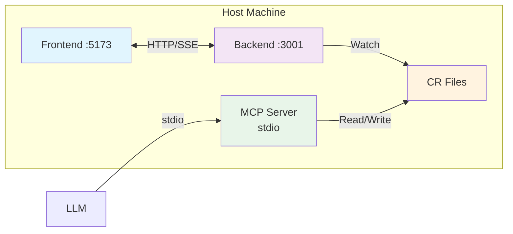
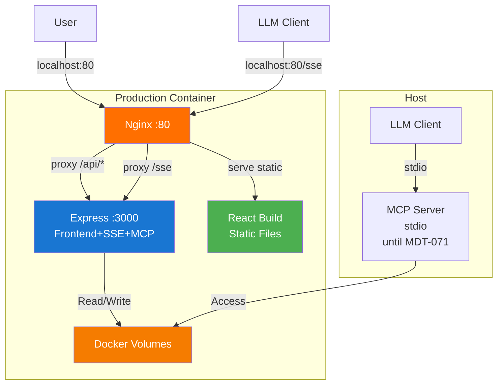

# Docker Containerization Architecture

## 1. Description

### Problem Statement

The markdown-ticket application currently runs as separate processes on the host machine requiring manual setup for each developer. This creates inconsistent environments and makes onboarding difficult.

### Current Architecture



**Key Points:**
- Frontend: React + Vite dev server
- Backend: Express.js with SSE for real-time file watching
- MCP Server: stdio transport for LLM integration
- Storage: Markdown files with Git version control

### Desired Containerized Architecture



### Endpoint Access Patterns

**Production (Single Container - Port 80):**
- **Frontend**: `http://localhost:80/` → React app (static files)
- **Backend API**: `http://localhost:80/api/*` → Express.js routes
- **Frontend SSE**: `http://localhost:80/api/events` → Real-time file updates
- **MCP HTTP**: `http://localhost:80/sse` → MCP Streamable HTTP (MDT-071)

**Development (Two Containers):**
- **Frontend**: `http://localhost:5173` → Vite dev server (hot reload)
- **Backend**: `http://localhost:3001` → Express.js with SSE
- **MCP Server**: Host machine, stdio transport (until MDT-071)

### Impact Areas

- **Developer Experience**: Simplified onboarding with `docker-compose up`
- **Deployment**: Consistent environments from dev to production
- **MCP Integration**: File access through Docker volume mounts, HTTP transport via MDT-071

## 2. Rationale

### Why Containerization?

**Developer Experience**
- One-command setup: `docker-compose up`
- Eliminates Node.js version conflicts
- Consistent environment for all developers

**Production Reliability**
- No more "works on my machine" issues
- Isolated dependencies and processes
- Simplified deployment to cloud platforms

**Multi-Project Support**
- Clean volume mounting strategies
- Support for projects in any filesystem location
- Better security through container isolation

### Key Architectural Decisions

#### Single Container vs Multi-Container

**Decision: Single container for production (with nginx reverse proxy)**

**Rationale:**
- Simpler deployment and operations
- Lower resource overhead
- Easier debugging and monitoring
- Sufficient for our use case (stateless frontend + backend)

**Exception:** Development mode may use separate containers for hot reload

#### MCP Server Integration

**Decision: MCP runs on host machine, accesses Docker volumes**

**Rationale:**
- MCP requires stdio transport which doesn't work well in containers
- Keeps existing LLM configurations unchanged
- Simple and reliable file access through volume mounts

**Note:** This will change when MDT-071 implements HTTP transport for MCP

#### SSE Communication

**Decision: SSE remains for file watching, NOT for MCP**

**Rationale:**
- SSE and MCP serve different purposes
- SSE: Real-time frontend updates
- MCP: LLM tool integration
- Separation keeps architecture clean and maintainable

## 3. Solution Analysis

### Main Challenges

1. **MCP Server Integration**: MCP uses stdio transport which doesn't work well in containers
   - **Solution**: Run MCP on host, access Docker volumes via mounts
   - **Future**: MDT-071 will implement HTTP transport for full containerization

2. **File Watching in Docker**: Native file events don't propagate reliably in containers
   - **Solution**: Use Chokidar polling mode when running in Docker

3. **Multi-Project Support**: Projects can be anywhere on the filesystem
   - **Solution**: Flexible volume mounting with docker-compose override files

### Deployment Options

| Mode | Use Case | Setup Time |
|------|----------|------------|
| **Development** | Active development, hot reload | 2 minutes |
| **Production** | Team deployments, staging/prod | 5 minutes |
| **Standalone** | Demos, simple deployments | 30 seconds |

### Practical Docker Compose Setups

**Production Setup (docker-compose.yml)**
```yaml
version: '3.8'

services:
  app:
    build: .
    ports:
      - "80:80"  # nginx serves everything on port 80
    volumes:
      # Mount project directories
      - ~/work/project-a:/projects/project-a
      - ~/personal/project-b:/projects/project-b
      # Mount global config
      - ~/.config/markdown-ticket:/config:ro
    environment:
      - NODE_ENV=production
      - CHOKIDAR_USEPOLLING=true
    restart: unless-stopped
```

**Development Setup (docker-compose.dev.yml)**
```yaml
version: '3.8'

services:
  frontend:
    build:
      context: .
      dockerfile: Dockerfile.dev
    ports:
      - "5173:5173"
    volumes:
      - .:/app
      - /app/node_modules
    environment:
      - NODE_ENV=development
    command: npm run dev

  backend:
    build:
      context: ./server
      dockerfile: Dockerfile.dev
    ports:
      - "3001:3001"
    volumes:
      - ~/work/project-a:/projects/project-a
      - ~/personal/project-b:/projects/project-b
      - ~/.config/markdown-ticket:/config:ro
    environment:
      - NODE_ENV=development
      - CHOKIDAR_USEPOLLING=true
```

**Usage:**
```bash
# Production
docker-compose up

# Development
docker-compose -f docker-compose.dev.yml up
```

### Project Mounting Strategies

**Option 1: Individual Project Mounts**
```yaml
volumes:
  - ~/work/project-a:/projects/project-a
  - ~/personal/project-b:/projects/project-b
  - /var/data/project-c:/projects/project-c
```

**Option 2: Override Files for Different Environments**
```yaml
# docker-compose.override.yml (local dev)
volumes:
  - ./project-a:/projects/project-a
  - ./project-b:/projects/project-b

# docker-compose.prod.yml (production)
volumes:
  - /data/projects:/projects
```

**Option 3: Workspace Directory**
```yaml
volumes:
  - ./workspace:/workspace
```
Then organize all projects under a workspace directory.

## 4. Implementation Specification

### Dockerfile (Simplified)

```dockerfile
FROM node:20-alpine

WORKDIR /app

# Build frontend
COPY package*.json ./
RUN npm ci
COPY . .
RUN npm run build

# Setup backend
COPY server ./server
RUN cd server && npm ci --only=production

# Runtime
EXPOSE 3000
CMD ["node", "server.js"]
```

### Docker Compose (Simplified)

```yaml
version: '3.8'

services:
  app:
    build: .
    ports:
      - "3000:3000"
    volumes:
      # Mount projects from any location
      - ~/project-a:/projects/project-a
      - ~/project-b:/projects/project-b
      - ~/.config/markdown-ticket:/config:ro
    environment:
      - NODE_ENV=production
      - CHOKIDAR_USEPOLLING=true
    restart: unless-stopped
```

### Key Implementation Steps

1. **Configuration via Environment Variables**
   - Auto-detect Docker environment
   - Enable file watching polling in containers
   - Externalize all paths and ports

2. **Health Check Endpoints**
   - `/api/health` - Basic liveness check
   - `/api/ready` - Readiness check with filesystem access

3. **Graceful Shutdown**
   - Handle SIGTERM/SIGINT for container lifecycle
   - Clean shutdown of file watchers

4. **Volume Management**
   - Mount project directories from host
   - Read-only mount for configuration
   - Proper file permissions

### MCP Server Setup

**Current Approach (stdio on host):**
```bash
# Run MCP server on host machine
cd mcp-server
npm run build
node dist/index.js

# LLM connects normally (no changes needed)
```

**Future Approach (HTTP transport - MDT-071):**
- MCP server will be fully containerizable
- HTTP/SSE transport eliminates stdio requirement
- True multi-container architecture possible

### Development vs Production

| Feature | Development | Production |
|---------|-------------|------------|
| **Containers** | 2 (frontend + backend) | 1 (nginx + app) |
| **Frontend Access** | http://localhost:5173 | http://localhost:80 |
| **Backend Access** | http://localhost:3001 | http://localhost:80/api/* |
| **SSE Endpoint** | http://localhost:3001/api/events | http://localhost:80/api/events |
| **MCP Endpoint** | Host stdio (until MDT-071) | http://localhost:80/sse (after MDT-071) |
| **File Watching** | Polling | Polling |
| **Hot Reload** | Yes | No |
| **Build Type** | Development | Production optimized |

## 5. Acceptance Criteria

### Core Requirements
- [ ] Docker Compose setup works with single command: `docker-compose up`
- [ ] Production application accessible at http://localhost:80
- [ ] Development setup works with frontend on :5173 and backend on :3001
- [ ] File watching works in containers (polling mode)
- [ ] MCP server can read/write files through volume mounts
- [ ] Multi-project mounting supported from any filesystem location

### Docker Configuration
- [ ] Environment-based configuration (no hardcoded paths)
- [ ] Health check endpoint responds correctly
- [ ] Graceful shutdown on SIGTERM/SIGINT
- [ ] Proper volume permissions for file access

### Documentation
- [ ] Quick start guide for developers
- [ ] MCP integration instructions
- [ ] Examples for different project mounting strategies

### Testing
- [ ] E2E tests pass in Docker environment
- [ ] Manual verification of CRUD operations
- [ ] SSE events propagate correctly
- [ ] MCP server integration verified

## 6. Migration Strategy

### For Developers
1. **Week 1**: Share Docker setup documentation
2. **Week 2**: Make Docker the recommended approach
3. **Week 3**: Update onboarding process
4. **Week 4**: Optimize based on feedback

### Rollback Plan
If issues occur:
1. Stop containers: `docker-compose down`
2. Continue using existing Node.js setup
3. Report issues for fixing

## 7. Security Considerations

- Run containers as non-root user
- Use minimal base images (alpine)
- Mount config directories as read-only
- Scan images for vulnerabilities
- Don't expose unnecessary ports

## 8. Future Considerations

- **Kubernetes deployment**: Helm charts for cloud deployment
- **Full MCP containerization**: After MDT-071 implements HTTP transport
- **Observability**: Logging and monitoring integration
- **CI/CD**: Automated builds and deployments
