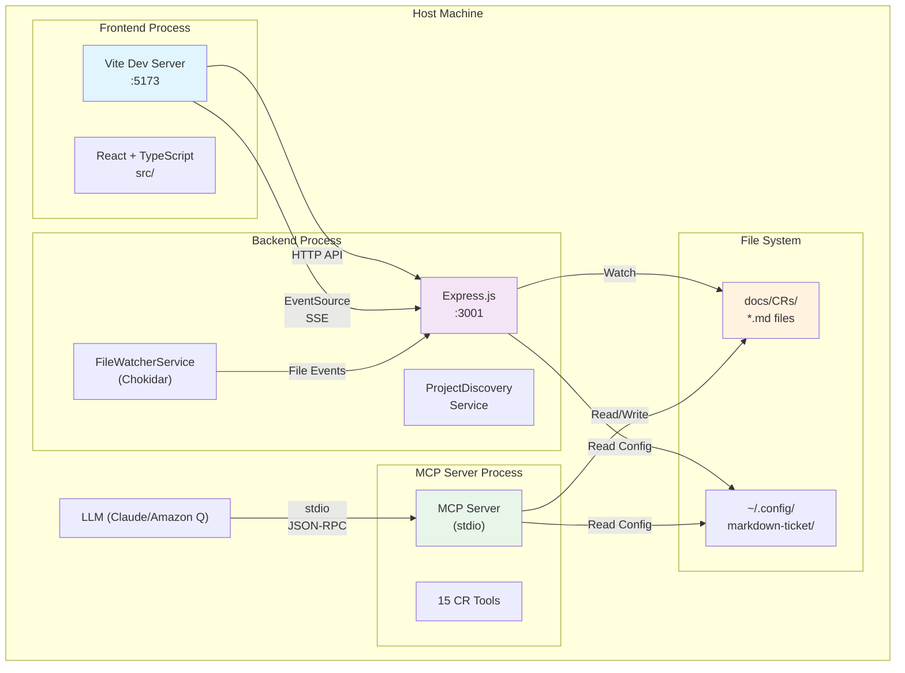
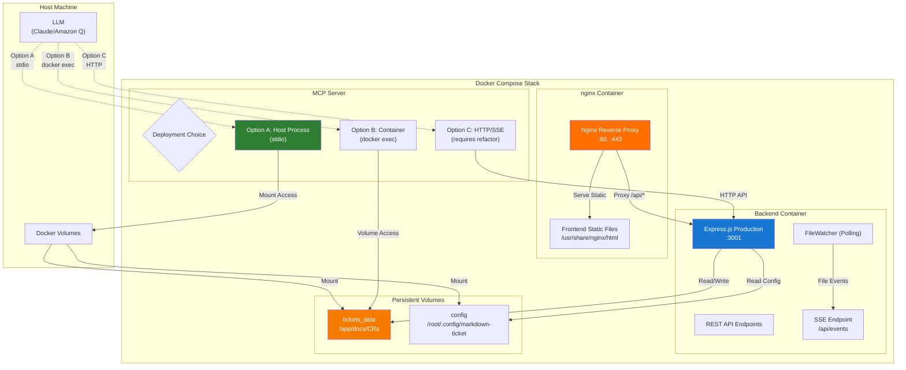
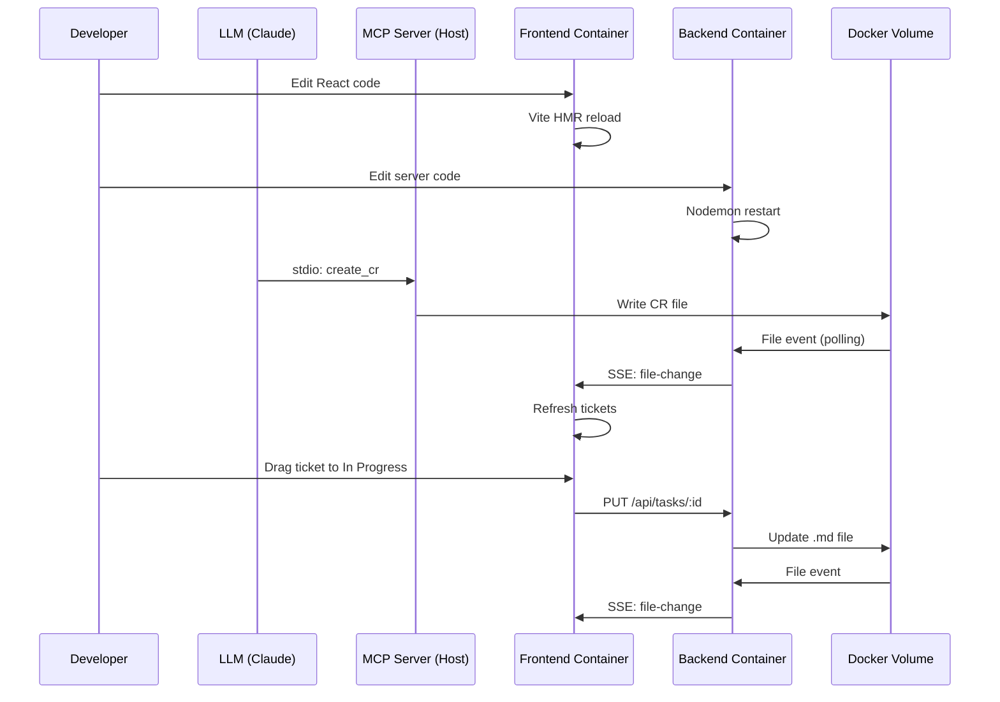
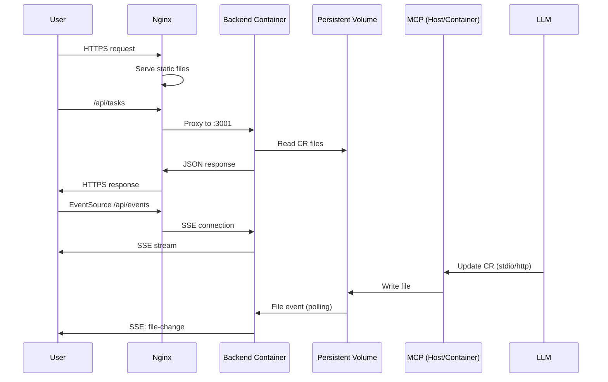

# Docker Containerization Architecture for Multi-Service Application

## 1. Description

### Problem Statement

The markdown-ticket application currently runs as separate processes on the host machine:
- **Frontend**: React + Vite dev server (port 5173)
- **Backend**: Express.js API server (port 3001)
- **MCP Server**: Model Context Protocol stdio-based server for LLM integration
- **File Storage**: Markdown files in `docs/CRs/` directory with filesystem watching

This setup lacks:
- Consistent deployment environments across development, staging, and production
- Easy onboarding for new developers (multiple manual setup steps)
- Isolation from host system dependencies and conflicts
- Portable deployment packages for different platforms
- Resource management and scaling capabilities

### Current State

**Application Architecture:**


**Communication Protocols:**
1. **Frontend ↔ Backend**: HTTP REST API + Server-Sent Events (SSE)
2. **LLMs ↔ MCP Server**: stdio-based JSON-RPC (Standard Input/Output pipes)
3. **Backend ↔ File System**: Chokidar filesystem watching
4. **SSE File Watching**: Real-time notifications of markdown file changes (NOT used by MCP)

**Key Technical Points:**
- **SSE is ONLY for file watching**, not MCP communication
- **MCP uses stdio transport**, completely separate from SSE
- **Chokidar** watches `docs/CRs/` and broadcasts via SSE to frontend
- **Multi-project support** via filesystem scanning and TOML config files

### Desired State

Containerized architecture with three deployment scenarios:

1. **Development Mode**: Hot-reload, debugging, MCP on host
2. **Production Mode**: Optimized builds, nginx reverse proxy, persistent volumes
3. **Standalone Mode**: Single container for simple deployments

**Target Architecture (Production):**


### Impact Areas

**Code Changes Required:**
- Server configuration externalization (environment variables)
- Graceful shutdown handlers for containers
- Health check endpoints for container orchestration
- Chokidar polling mode for Docker volumes
- Volume mount path detection and configuration

**Infrastructure Changes:**
- Dockerfile creation for multi-stage builds
- Docker Compose configurations for each scenario
- Nginx configuration for reverse proxy
- Volume management strategy
- Network configuration between containers

**Developer Workflow:**
- New onboarding process using Docker Compose
- Development environment setup via `docker-compose up`
- Debugging within containers vs traditional Node.js debugging
- MCP server integration patterns

## 2. Rationale

### Why Containerization Now?

1. **Developer Experience**
   - Current setup requires manual installation of Node.js, npm, configuration files
   - Different Node versions cause compatibility issues
   - `docker-compose up` provides one-command setup

2. **Production Reliability**
   - Eliminates "works on my machine" issues
   - Consistent environment from dev to production
   - Better resource isolation and monitoring

3. **Deployment Flexibility**
   - Easy deployment to cloud platforms (AWS ECS, GCP Cloud Run, Azure Container Instances)
   - Support for Kubernetes orchestration in future
   - Simpler CI/CD pipeline integration

4. **Multi-Project Support**
   - Clean volume mounting for multiple project workspaces
   - Isolated project environments
   - Better security through container isolation

### User Questions Answered

#### Q1: "Do we need SSE protocol for MCP?"

**Answer: NO**

SSE and MCP are **completely separate systems**:

| Aspect | SSE (Server-Sent Events) | MCP (Model Context Protocol) |
|--------|-------------------------|------------------------------|
| **Purpose** | Real-time file watching | LLM tool integration |
| **Protocol** | HTTP EventSource API | stdio JSON-RPC |
| **Endpoint** | `/api/events` (HTTP) | stdin/stdout pipes |
| **Transport** | Browser EventSource → Express SSE | Command-line process spawning |
| **Use Case** | Notify frontend of markdown file changes | Provide CR management tools to LLMs |
| **Clients** | Frontend React app | Claude Code, Amazon Q CLI |

**Current Implementation:**
- **SSE**: `fileWatcherService.js` broadcasts to `realtimeFileWatcher.ts`
- **MCP**: `@modelcontextprotocol/sdk` with `StdioServerTransport`
- **No interaction between them**

**Docker Implications:**
- SSE works fine in containers (simple HTTP endpoint)
- MCP stdio transport is problematic (requires process execution from host)
- These challenges are **independent** - solving one doesn't solve the other

#### Q2: "Maybe we need to provide MCP for updating docs?"

**Answer: Already Available (with recommendations)**

**Existing MCP Document Tools:**
- ✅ `create_cr` - Creates CR documents with full markdown content
- ✅ `update_cr_attrs` - Updates CR metadata (title, priority, assignee, etc.)
- ✅ `update_cr_status` - Changes CR workflow status
- ✅ `update_cr_section` - **Efficient section-based updates (84-94% token savings)**
- ✅ `get_cr_section` - Read specific document sections
- ✅ `list_cr_sections` - Discover available sections in CR

**What's Missing:**
- Generic document management (README.md, DEVELOPMENT_GUIDE.md, etc.)
- Non-CR file operations
- Document search across project

**Recommendation: DON'T ADD generic document tools to MCP because:**

1. **Section-based tools already provide efficient updates** - 84-94% token savings vs full document
2. **Duplicates REST API functionality** - Backend already provides file operations
3. **MCP optimized for structured CR workflows** - Templates and validation work best with CRs
4. **Separation of concerns** - Use specialized tools:
   - CRs → MCP CR tools (structured, validated)
   - Code docs → `aws-code-doc-gen` MCP (already integrated)
   - Ad-hoc files → REST API (flexible, no schema)

**Alternative if needed:**
Create a **separate MCP server** for general document management:
```bash
mcp-server/           # CR-specific (existing)
mcp-docs-server/      # Generic docs (new, if needed)
```

## 3. Solution Analysis

### Critical Challenges Identified

#### Challenge 1: MCP Server Stdio Access (CRITICAL)

**Problem:**
LLMs connect to MCP server via:
```bash
node /path/to/mcp-server/dist/index.js
```

This requires **direct process execution** - Docker containers isolate stdio streams.

**Evaluated Options:**

| Option | Pros | Cons | Recommendation |
|--------|------|------|----------------|
| **A. MCP on Host** | No changes needed, works immediately | Not fully containerized, defeats isolation | ✅ **MVP/Development** |
| **B. Docker Exec** | Full containerization | Complex LLM config: `docker exec mcp node ...` | 🔄 **Production (advanced)** |
| **C. HTTP/SSE Transport** | Clean architecture, standard protocols | Major refactor, breaks existing integrations | ❌ **Not recommended** |

**Chosen Approach:**
- **Development**: MCP on host, access Docker volumes via mounts
- **Production**: Document both Option A (host) and Option B (docker exec) for flexibility

#### Challenge 2: File Watching in Docker

**Problem:**
Chokidar filesystem watching has issues in Docker containers:
- macOS Docker Desktop: File events don't propagate reliably
- Linux: Native events work but vary by volume driver
- Performance vs reliability trade-off

**Solution:**
```javascript
// server/fileWatcherService.js
const isDocker = fs.existsSync('/.dockerenv');
const usePolling = process.env.CHOKIDAR_USEPOLLING === 'true' || isDocker;

const watcher = chokidar.watch(watchPath, {
  ignoreInitial: true,
  usePolling: usePolling,  // Enable in Docker
  interval: 1000,          // Poll every 1 second
  awaitWriteFinish: {
    stabilityThreshold: 100,
    pollInterval: 100
  }
});
```

**Trade-offs:**
- ✅ Reliable file detection in containers
- ❌ Slightly higher CPU usage
- ❌ 1-2 second delay vs instant native events

#### Challenge 3: Multi-Project Volume Strategy

**Problem:**
Projects can be anywhere on filesystem:
```
~/work/project-a/.mdt-config.toml
~/personal/project-b/.mdt-config.toml
/var/data/project-c/.mdt-config.toml
```

**Solutions Evaluated:**

**Option 1: Workspace Volume (Recommended)**
```yaml
volumes:
  - ./projects:/workspace:delegated  # All projects here
  - ~/.config/markdown-ticket:/config:ro
```
- ✅ Simple, predictable
- ❌ Requires project consolidation

**Option 2: Individual Mounts**
```yaml
volumes:
  - ~/work/project-a:/projects/project-a
  - ~/personal/project-b:/projects/project-b
```
- ✅ Flexible, works with existing layout
- ❌ Manual mount management per project

**Option 3: Bind Mount Parent Directory**
```yaml
volumes:
  - ~/:/host-home:ro  # Mount entire home directory
```
- ✅ Access all projects
- ❌ Security risk, performance impact

**Chosen:** Option 1 for dev/standalone, Option 2 for production with explicit project selection

#### Challenge 4: Configuration Management

**Current Configuration Locations:**
```
~/.config/markdown-ticket/           # Global config
  ├── projects/*.toml                # Project registry
  ├── mcp-server.toml                # MCP config
  └── user.toml                      # User preferences

./.mdt-config.toml                   # Project-local config
./.mcp.json                          # MCP server definition
./.env.local                         # Environment variables
```

**Containerization Strategy:**
```dockerfile
# Environment variable hierarchy
ENV CONFIG_DIR=/config
ENV PROJECTS_CONFIG_DIR=/config/projects
ENV MCP_CONFIG_DIR=/config/mcp
ENV DATA_DIR=/data

# Override detection
RUN if [ -f /.dockerenv ]; then \
      export CONFIG_DIR=/config; \
    fi
```

**Volume Mapping:**
```yaml
volumes:
  - ~/.config/markdown-ticket:/config:ro  # Read-only config
  - ./data:/data                          # Read-write data
```

### Deployment Scenarios Comparison
| Scenario | Containers | MCP Location | Use Case | Setup Time |
|----------|------------|--------------|----------|------------|
| **Development** | Frontend + Backend | Host | Active development, hot-reload | 5 min |
| **Production** | Frontend + Backend (+ optional Nginx) | Host or Docker Exec | Team deployments, staging/prod | 15 min |
| **Standalone** | All-in-one (FE+BE combined) | Host | Demos, testing, simple deployments | 30 sec |

**Note:** All scenarios include working FE/BE. MCP-only deployment is not viable since the application requires the web interface.
### Chosen Solution: Hybrid Approach

**Development (docker-compose.dev.yml):**
- Separate frontend/backend containers
- Volume mount source code for hot reload
- MCP on host (stdio access)
- Chokidar polling mode

**Production (docker-compose.prod.yml):**
- Nginx reverse proxy
- Optimized backend container
- MCP documented for both host and docker exec patterns
- Named volumes for persistence
- Health checks and auto-restart

**Standalone (Dockerfile.standalone):**
- Single container serving frontend static + backend API
- Minimal configuration
- Volume mount for tickets only
- Ideal for demos and personal use

### Data Flow Diagrams

**Development Mode Data Flow:**


**Production Mode Data Flow:**


## 4. Implementation Specification

### Phase 1: Pre-Containerization Improvements (Required)

#### 1.1 Configuration Externalization

**File: `server/config.js` (new)**
```javascript
import fs from 'fs';
import path from 'path';
import os from 'os';

export class Config {
  constructor() {
    this.isDocker = fs.existsSync('/.dockerenv');
    this.nodeEnv = process.env.NODE_ENV || 'development';
  }
  
  get configDir() {
    return process.env.CONFIG_DIR || 
      (this.isDocker 
        ? '/config' 
        : path.join(os.homedir(), '.config/markdown-ticket'));
  }
  
  get dataDir() {
    return process.env.DATA_DIR || 
      (this.isDocker ? '/data' : path.join(process.cwd(), 'docs'));
  }
  
  get port() {
    return parseInt(process.env.PORT || '3001', 10);
  }
  
  get chokidarPolling() {
    return process.env.CHOKIDAR_USEPOLLING === 'true' || this.isDocker;
  }
  
  get corsOrigin() {
    return process.env.CORS_ORIGIN || '*';
  }
}

export default new Config();
```

**File: `.env.example`**
```bash
# Server Configuration
PORT=3001
NODE_ENV=development

# Docker Configuration
CONFIG_DIR=/config
DATA_DIR=/data
CHOKIDAR_USEPOLLING=true

# CORS
CORS_ORIGIN=http://localhost:5173

# Frontend
VITE_API_URL=http://localhost:3001
```

#### 1.2 Graceful Shutdown Handlers

**File: `server/server.js` (additions)**
```javascript
import config from './config.js';

// Graceful shutdown
let isShuttingDown = false;

const gracefulShutdown = (signal) => {
  if (isShuttingDown) return;
  isShuttingDown = true;
  
  console.log(`\n${signal} received, shutting down gracefully...`);
  
  // Stop file watchers
  fileWatcher.stop();
  
  // Close server
  server.close(() => {
    console.log('HTTP server closed');
    process.exit(0);
  });
  
  // Force shutdown after 10 seconds
  setTimeout(() => {
    console.error('Forced shutdown after timeout');
    process.exit(1);
  }, 10000);
};

process.on('SIGTERM', () => gracefulShutdown('SIGTERM'));
process.on('SIGINT', () => gracefulShutdown('SIGINT'));
```

#### 1.3 Health Check Endpoints

**File: `server/server.js` (new endpoints)**
```javascript
// Health check for container orchestration
app.get('/api/health', (req, res) => {
  res.json({
    status: 'healthy',
    timestamp: new Date().toISOString(),
    uptime: process.uptime(),
    environment: config.nodeEnv,
    services: {
      fileWatcher: {
        active: fileWatcher.getClientCount() > 0,
        clients: fileWatcher.getClientCount(),
        projects: fileWatcher.watchers.size
      }
    }
  });
});

// Readiness check (more strict)
app.get('/api/ready', async (req, res) => {
  try {
    // Check file system access
    await fs.access(config.dataDir);
    
    // Check project discovery
    const projects = await projectDiscovery.getAllProjects();
    
    res.json({
      status: 'ready',
      checks: {
        filesystem: 'ok',
        projects: projects.length
      }
    });
  } catch (error) {
    res.status(503).json({
      status: 'not ready',
      error: error.message
    });
  }
});
```

#### 1.4 Chokidar Polling Configuration

**File: `server/fileWatcherService.js` (update)**
```javascript
import config from './config.js';

initMultiProjectWatcher(projectPaths) {
  for (const project of projectPaths) {
    const watcher = chokidar.watch(watchPath, {
      ignoreInitial: true,
      persistent: true,
      usePolling: config.chokidarPolling,  // Auto-enable in Docker
      interval: 1000,                      // Poll every 1 second
      awaitWriteFinish: { 
        stabilityThreshold: 100,
        pollInterval: 100 
      }
    });
    // ... rest of setup
  }
}
```

### Phase 2: Docker Implementation

#### 2.1 Development Dockerfile

**File: `Dockerfile.dev`**
```dockerfile
# Multi-stage build for development
FROM node:20-alpine AS base

WORKDIR /app

# Install dependencies for both frontend and backend
COPY package*.json ./
COPY server/package*.json ./server/

# Frontend development stage
FROM base AS frontend-dev

RUN npm ci

COPY . .

EXPOSE 5173

CMD ["npm", "run", "dev"]

# Backend development stage  
FROM base AS backend-dev

RUN cd server && npm ci

COPY . .

# Install nodemon globally for development
RUN npm install -g nodemon

EXPOSE 3001

CMD ["npm", "run", "dev:server"]
```

**File: `docker-compose.dev.yml`**
```yaml
version: '3.8'

services:
  frontend:
    build:
      context: .
      dockerfile: Dockerfile.dev
      target: frontend-dev
    ports:
      - "5173:5173"
    volumes:
      - ./:/app
      - /app/node_modules
      - /app/dist
    environment:
      - VITE_API_URL=http://localhost:3001
      - CHOKIDAR_USEPOLLING=true  # Enable for Docker file watching
    networks:
      - mdt-network
    command: npm run dev

  backend:
    build:
      context: .
      dockerfile: Dockerfile.dev
      target: backend-dev
    ports:
      - "3001:3001"
    volumes:
      - ./:/app
      - /app/node_modules
      - /app/server/node_modules
      - ~/.config/markdown-ticket:/root/.config/markdown-ticket:ro
      - ./docs:/app/docs
    environment:
      - PORT=3001
      - NODE_ENV=development
      - CHOKIDAR_USEPOLLING=true
      - CONFIG_DIR=/root/.config/markdown-ticket
      - DATA_DIR=/app/docs
    networks:
      - mdt-network
    command: npm run dev:server

networks:
  mdt-network:
    driver: bridge
```

#### 2.2 Production Dockerfile

**File: `Dockerfile`**
```dockerfile
# Multi-stage production build
FROM node:20-alpine AS base

WORKDIR /app

# Frontend build stage
FROM base AS frontend-build

COPY package*.json ./
RUN npm ci --only=production

COPY . .
RUN npm run build

# Backend build stage
FROM base AS backend-build

COPY server/package*.json ./server/
RUN cd server && npm ci --only=production

COPY server ./server

# Production backend runtime
FROM base AS backend-prod

RUN apk add --no-cache curl  # For health checks

COPY --from=backend-build /app/server ./server

EXPOSE 3001

HEALTHCHECK --interval=30s --timeout=10s --start-period=40s --retries=3 \
  CMD curl -f http://localhost:3001/api/health || exit 1

USER node

CMD ["node", "server/server.js"]

# Production frontend (static files for nginx)
FROM nginx:alpine AS frontend-prod

COPY --from=frontend-build /app/dist /usr/share/nginx/html
COPY nginx.conf /etc/nginx/nginx.conf

EXPOSE 80

CMD ["nginx", "-g", "daemon off;"]
```

**File: `nginx.conf`**
```nginx
events {
    worker_connections 1024;
}

http {
    include /etc/nginx/mime.types;
    default_type application/octet-stream;
    
    upstream backend {
        server backend:3001;
    }
    
    server {
        listen 80;
        server_name _;
        
        # Frontend static files
        location / {
            root /usr/share/nginx/html;
            try_files $uri $uri/ /index.html;
        }
        
        # API proxy
        location /api/ {
            proxy_pass http://backend;
            proxy_http_version 1.1;
            proxy_set_header Upgrade $http_upgrade;
            proxy_set_header Connection 'upgrade';
            proxy_set_header Host $host;
            proxy_cache_bypass $http_upgrade;
        }
        
        # SSE endpoint (special handling)
        location /api/events {
            proxy_pass http://backend;
            proxy_http_version 1.1;
            proxy_set_header Connection '';
            proxy_buffering off;
            proxy_cache off;
            proxy_read_timeout 24h;
            chunked_transfer_encoding on;
        }
    }
}
```

**File: `docker-compose.prod.yml`**
```yaml
version: '3.8'

services:
  nginx:
    build:
      context: .
      dockerfile: Dockerfile
      target: frontend-prod
    ports:
      - "80:80"
      - "443:443"
    depends_on:
      backend:
        condition: service_healthy
    networks:
      - mdt-network
    restart: unless-stopped

  backend:
    build:
      context: .
      dockerfile: Dockerfile
      target: backend-prod
    expose:
      - "3001"
    volumes:
      - tickets_data:/app/docs/CRs
      - config_data:/root/.config/markdown-ticket:ro
    environment:
      - NODE_ENV=production
      - PORT=3001
      - CHOKIDAR_USEPOLLING=true
      - CONFIG_DIR=/root/.config/markdown-ticket
      - DATA_DIR=/app/docs
    networks:
      - mdt-network
    healthcheck:
      test: ["CMD", "curl", "-f", "http://localhost:3001/api/health"]
      interval: 30s
      timeout: 10s
      retries: 3
      start_period: 40s
    restart: unless-stopped

volumes:
  tickets_data:
    driver: local
  config_data:
    driver: local

networks:
  mdt-network:
    driver: bridge
```

#### 2.3 Standalone Dockerfile

**File: `Dockerfile.standalone`**
```dockerfile
FROM node:20-alpine AS builder

WORKDIR /app

# Build frontend
COPY package*.json ./
RUN npm ci

COPY . .
RUN npm run build

# Build backend
COPY server ./server
RUN cd server && npm ci --only=production

# Runtime stage
FROM node:20-alpine AS runtime

WORKDIR /app

RUN apk add --no-cache curl

# Copy built frontend
COPY --from=builder /app/dist ./dist

# Copy backend
COPY --from=builder /app/server ./server

# Standalone server that serves both
COPY standalone-server.js ./

EXPOSE 3000

HEALTHCHECK --interval=30s --timeout=10s --start-period=20s --retries=3 \
  CMD curl -f http://localhost:3000/api/health || exit 1

USER node

CMD ["node", "standalone-server.js"]
```

**File: `standalone-server.js` (new)**
```javascript
import express from 'express';
import path from 'path';
import { fileURLToPath } from 'url';
import cors from 'cors';

// Import backend server logic
import './server/server.js';

const __filename = fileURLToPath(import.meta.url);
const __dirname = path.dirname(__filename);

const app = express();
const PORT = process.env.PORT || 3000;

// Serve static frontend files
app.use(express.static(path.join(__dirname, 'dist')));

// API routes are already mounted in server/server.js
// Just need to import and use that app instance

// Fallback to index.html for SPA routing
app.get('*', (req, res) => {
  res.sendFile(path.join(__dirname, 'dist', 'index.html'));
});

app.listen(PORT, () => {
  console.log(`Standalone server running on http://localhost:${PORT}`);
});
```

**File: `docker-compose.standalone.yml`**
```yaml
version: '3.8'

services:
  app:
    build:
      context: .
      dockerfile: Dockerfile.standalone
    ports:
      - "3000:3000"
    volumes:
      - ./tickets:/app/docs/CRs
      - ~/.config/markdown-ticket:/root/.config/markdown-ticket:ro
    environment:
      - NODE_ENV=production
      - PORT=3000
      - CHOKIDAR_USEPOLLING=true
    restart: unless-stopped
```

### Phase 3: MCP Server Integration

#### 3.1 MCP on Host (Development/Simple Production)

**Documentation: `docs/MCP_DOCKER.md` (new)**
```markdown
# MCP Server Docker Integration

## Option A: MCP on Host (Recommended for Development)

### Setup
1. Run Docker containers:
   ```bash
   docker-compose -f docker-compose.dev.yml up
   ```

2. MCP server runs on host, accesses volumes:
   ```bash
   # Terminal on host
   cd mcp-server
   npm run build
   node dist/index.js
   ```

3. LLM configuration (no changes needed):
   ```bash
   # Claude Code
   claude mcp add mdt-all node $HOME/markdown-ticket/mcp-server/dist/index.js
   
   # Amazon Q
   q mcp add --name mdt-all \
     --command "node" \
     --args "$HOME/markdown-ticket/mcp-server/dist/index.js" \
     --scope global
   ```

### How It Works
- Docker volumes mount to host paths
- MCP server reads/writes directly to those paths
- File changes trigger chokidar events in container
- SSE broadcasts updates to frontend

### Pros
- No changes to MCP architecture
- Works with existing LLM configurations
- Simple setup

### Cons  
- MCP not containerized
- Requires Node.js on host
```

#### 3.2 MCP via Docker Exec (Advanced Production)

**Documentation: `docs/MCP_DOCKER.md` (continued)**
```markdown
## Option B: MCP in Container (Advanced)

### Setup
1. Build MCP container:
   ```dockerfile
   # Dockerfile.mcp
   FROM node:20-alpine
   
   WORKDIR /app
   
   COPY mcp-server/package*.json ./
   RUN npm ci --only=production
   
   COPY mcp-server ./
   RUN npm run build
   
   CMD ["node", "dist/index.js"]
   ```

2. Add to docker-compose:
   ```yaml
   mcp:
     build:
       context: .
       dockerfile: Dockerfile.mcp
     volumes:
       - tickets_data:/app/docs/CRs
       - config_data:/root/.config/markdown-ticket:ro
     stdin_open: true
     tty: true
   ```

3. LLM configuration (docker exec wrapper):
   ```bash
   # Create wrapper script: mcp-docker-wrapper.sh
   #!/bin/bash
   docker exec -i mcp-mcp-1 node dist/index.js
   
   # Make executable
   chmod +x mcp-docker-wrapper.sh
   
   # Claude Code
   claude mcp add mdt-docker ./mcp-docker-wrapper.sh
   
   # Amazon Q
   q mcp add --name mdt-docker \
     --command "./mcp-docker-wrapper.sh" \
     --scope global
   ```

### How It Works
- MCP container runs with stdio support (stdin_open: true)
- Wrapper script executes `docker exec` for each MCP invocation
- Container shares volumes with backend
- File operations work within containerized environment

### Pros
- Full containerization
- Consistent environment
- Works in production (Kubernetes, ECS, etc.)

### Cons
- Complex setup
- Requires Docker socket access from LLM
- Performance overhead from docker exec
```

### Phase 4: Documentation & Developer Experience

#### 4.1 Quick Start Guide

**File: `docs/DOCKER_QUICKSTART.md` (new)**
```markdown
# Docker Quick Start

## Prerequisites
- Docker Desktop (macOS/Windows) or Docker Engine (Linux)
- Docker Compose v2.0+

## Development Setup

1. Clone repository:
   ```bash
   git clone <repo>
   cd markdown-ticket
   ```

2. Create environment file:
   ```bash
   cp .env.example .env.local
   ```

3. Start services:
   ```bash
   docker-compose -f docker-compose.dev.yml up
   ```

4. Access application:
   - Frontend: http://localhost:5173
   - Backend API: http://localhost:3001
   - API Docs: http://localhost:3001/api/status

5. MCP Server (optional):
   ```bash
   # Run on host for development
   cd mcp-server
   npm run build
   node dist/index.js
   ```

## Production Deployment

1. Build images:
   ```bash
   docker-compose -f docker-compose.prod.yml build
   ```

2. Start services:
   ```bash
   docker-compose -f docker-compose.prod.yml up -d
   ```

3. Check health:
   ```bash
   curl http://localhost/api/health
   ```

## Standalone Mode (Simplest)

```bash
docker-compose -f docker-compose.standalone.yml up
```

Access at http://localhost:3000

## Troubleshooting

### File changes not detected
- Ensure `CHOKIDAR_USEPOLLING=true` is set
- Check volume mounts: `docker-compose ps`

### MCP server can't access files
- Verify volume paths match between containers and host
- Check permissions on mounted directories

### SSE connection fails
- Check nginx proxy configuration
- Verify backend health: `docker-compose logs backend`
```

#### 4.2 CI/CD Integration

**File: `.github/workflows/docker-build.yml` (new)**
```yaml
name: Docker Build and Push

on:
  push:
    branches: [ main, develop ]
  pull_request:
    branches: [ main ]

env:
  REGISTRY: ghcr.io
  IMAGE_NAME: ${{ github.repository }}

jobs:
  build-and-push:
    runs-on: ubuntu-latest
    permissions:
      contents: read
      packages: write

    steps:
      - name: Checkout
        uses: actions/checkout@v4

      - name: Set up Docker Buildx
        uses: docker/setup-buildx-action@v3

      - name: Log in to Container Registry
        uses: docker/login-action@v3
        with:
          registry: ${{ env.REGISTRY }}
          username: ${{ github.actor }}
          password: ${{ secrets.GITHUB_TOKEN }}

      - name: Extract metadata
        id: meta
        uses: docker/metadata-action@v5
        with:
          images: ${{ env.REGISTRY }}/${{ env.IMAGE_NAME }}

      - name: Build and push Backend
        uses: docker/build-push-action@v5
        with:
          context: .
          file: ./Dockerfile
          target: backend-prod
          push: ${{ github.event_name != 'pull_request' }}
          tags: ${{ steps.meta.outputs.tags }}-backend
          cache-from: type=gha
          cache-to: type=gha,mode=max

      - name: Build and push Frontend
        uses: docker/build-push-action@v5
        with:
          context: .
          file: ./Dockerfile
          target: frontend-prod
          push: ${{ github.event_name != 'pull_request' }}
          tags: ${{ steps.meta.outputs.tags }}-frontend
          cache-from: type=gha
          cache-to: type=gha,mode=max
```

## 5. Acceptance Criteria

### Pre-Containerization (Phase 1)
- [ ] Configuration externalized to environment variables
- [ ] `.env.example` file created with all required variables
- [ ] Graceful shutdown handlers implemented (SIGTERM, SIGINT)
- [ ] Health check endpoints (`/api/health`, `/api/ready`) functional
- [ ] Chokidar auto-detects Docker environment and enables polling
- [ ] Volume mount path detection works correctly

### Development Docker (Phase 2.1)
- [ ] `docker-compose.dev.yml` starts frontend and backend
- [ ] Hot reload works for both React and Express
- [ ] File watching detects changes via polling
- [ ] SSE events propagate correctly through containers
- [ ] Volume mounts preserve source code
- [ ] Setup completes in < 2 minutes

### Production Docker (Phase 2.2)
- [ ] Multi-stage build produces optimized images
- [ ] Nginx reverse proxy serves frontend and proxies API
- [ ] SSE endpoint configured correctly in nginx
- [ ] Health checks pass for backend container
- [ ] Named volumes persist ticket data
- [ ] Auto-restart on failure works
- [ ] Total image size < 500MB (combined)

### Standalone Docker (Phase 2.3)
- [ ] Single container serves both frontend and backend
- [ ] Setup completes in < 30 seconds
- [ ] Volume mount for tickets directory works
- [ ] Access at http://localhost:3000 successful
- [ ] Image size < 300MB

### MCP Integration (Phase 3)
- [ ] MCP on host (Option A) documented and tested
- [ ] Docker exec wrapper (Option B) documented with example
- [ ] LLM configuration instructions provided for both options
- [ ] File operations work through both MCP patterns
- [ ] Volume access permissions correct

### Documentation (Phase 4)
- [ ] `DOCKER_QUICKSTART.md` covers all three scenarios
- [ ] `MCP_DOCKER.md` explains integration options
- [ ] Troubleshooting guide addresses common issues
- [ ] CI/CD pipeline builds and pushes images
- [ ] README updated with Docker instructions

### Testing
- [ ] E2E tests run successfully in Docker environment
- [ ] File watching works across container boundary
- [ ] SSE connections remain stable under load
- [ ] MCP operations complete without errors
- [ ] Multi-project setup tested with 3+ projects
- [ ] Container restart doesn't lose data
- [ ] Resource limits tested (CPU, memory)

### Performance
- [ ] Container startup time < 10 seconds (production)
- [ ] File change detection latency < 2 seconds (polling mode)
- [ ] API response time within 10% of non-Docker
- [ ] SSE reconnection works automatically
- [ ] Memory usage < 512MB per container

## 6. Migration Strategy

### For Existing Developers

**Week 1: Preparation**
- Communicate Docker migration plan
- Share `DOCKER_QUICKSTART.md` documentation
- Install Docker Desktop on development machines
- Backup existing `.mdt-config.toml` files

**Week 2: Parallel Operation**
- Docker setup available but optional
- Developers can choose host-based or Docker
- Team pairs Docker experts with newcomers
- Collect feedback on Docker experience

**Week 3: Migration**
- Make Docker the default in documentation
- Update onboarding to use `docker-compose up`
- Keep host-based instructions as alternative
- Monitor for issues and provide support

**Week 4: Optimization**
- Fine-tune container configurations
- Address performance concerns
- Update CI/CD to use Docker builds
- Mark Docker migration complete

### For Production Deployments

**Phase 1: Testing (2 weeks)**
- Deploy to staging environment
- Run full test suite
- Performance benchmarking
- Security scanning of images

**Phase 2: Canary Deployment (1 week)**
- Deploy to 10% of production traffic
- Monitor metrics (response time, error rate)
- Compare with baseline
- Roll back if issues detected

**Phase 3: Full Rollout (1 week)**
- Gradually increase to 100%
- Monitor continuously
- Keep rollback plan ready
- Document any issues

**Phase 4: Cleanup (1 week)**
- Remove old deployment artifacts
- Update runbooks
- Archive legacy configurations
- Conduct retrospective

### Rollback Plan

If critical issues occur:

1. **Immediate**: Revert to previous deployment
   ```bash
   # Stop Docker containers
   docker-compose down
   
   # Restore from backup
   ./deploy-legacy.sh
   ```

2. **Preserve Data**: Backup Docker volumes before rollback
   ```bash
   docker run --rm -v tickets_data:/data -v $(pwd):/backup \
     alpine tar czf /backup/tickets-backup.tar.gz /data
   ```

3. **Investigate**: Debug in isolated environment
4. **Fix Forward**: Apply patches to Docker setup
5. **Retry**: Attempt migration again after fixes

## 7. Security Considerations

### Container Security
- [ ] Run containers as non-root user (`USER node`)
- [ ] Scan images for vulnerabilities (Trivy, Snyk)
- [ ] Use minimal base images (alpine)
- [ ] Pin package versions in Dockerfile
- [ ] Implement secrets management (not in env vars)

### Network Security  
- [ ] Use internal Docker network for service communication
- [ ] Only expose necessary ports to host
- [ ] Configure nginx security headers
- [ ] Enable HTTPS in production with Let's Encrypt
- [ ] Implement rate limiting

### Volume Security
- [ ] Mount config volumes as read-only (`:ro`)
- [ ] Set proper file permissions on volumes
- [ ] Encrypt sensitive data at rest
- [ ] Regular backup of persistent volumes
- [ ] Implement volume access logging

## 8. Future Enhancements

### Kubernetes Support (Phase 5)
- Helm chart for Kubernetes deployment
- Horizontal Pod Autoscaling for backend
- Persistent Volume Claims for data
- Ingress configuration with TLS
- ConfigMaps and Secrets management

### Observability (Phase 6)
- Prometheus metrics export
- Grafana dashboards
- Distributed tracing (Jaeger)
- Centralized logging (ELK stack)
- Alerting rules for critical issues

### Advanced MCP (Phase 7)
- Convert MCP to HTTP/SSE transport
- Containerize MCP server fully
- Load balancing for MCP requests
- MCP request caching
- Multi-region MCP deployment
