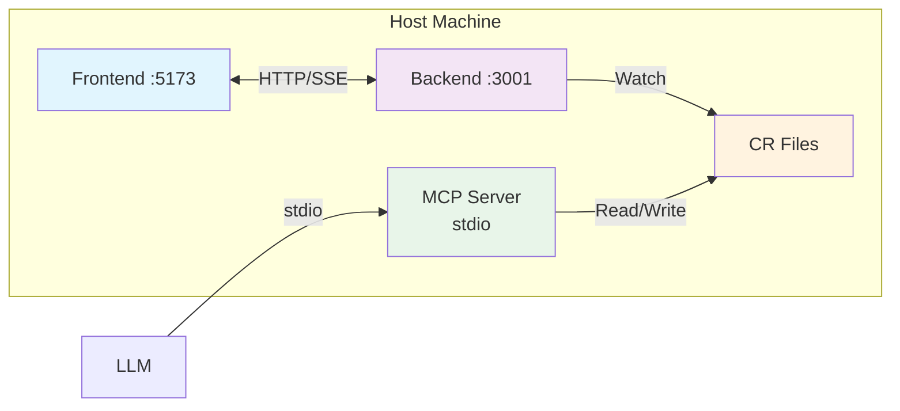
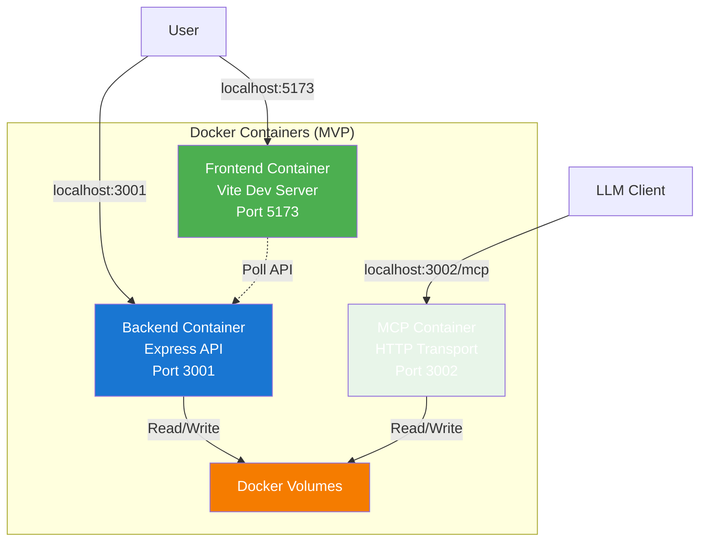

# Docker Containerization Architecture

## 1. Description

### Problem Statement

The markdown-ticket application currently runs as separate processes on the host machine requiring manual setup for each developer. This creates inconsistent environments and makes onboarding difficult.

### On-Host Architecture



**Key Points:**
- Frontend: React + Vite dev server
- Backend: Express.js with SSE for real-time file watching
- MCP Server: stdio transport for LLM integration
- Storage: Markdown files with Git version control

### Desired Containerized Architecture



### Container Access Patterns

**Development Environment:**
- **Frontend**: `http://localhost:5174` → Maps to container port 5173 (Vite dev server)
- **Backend API**: Not directly exposed → Accessible via frontend Vite proxy at `/api/*`
- **MCP HTTP**: `http://localhost:3012/mcp` → Maps to container port 3002
- **Health Checks**:
  - `http://localhost:5174/` (frontend)
  - Not exposed for backend (health check runs inside container)
  - `http://localhost:3012/health` (MCP)

**Production Environment:**
- **Frontend**: `http://localhost:80` → Nginx serving static build
- **Backend/MCP**: Same network architecture, behind reverse proxy if deployed

**Port Mapping Rationale:** Host ports (5174, 3012) differ from container ports (5173, 3002) to avoid conflicts when running both native and Docker environments simultaneously.

### Impact Areas

- **Developer Experience**: Simplified onboarding with `docker-compose up`
- **Deployment**: Consistent environments from dev to production
- **MCP Integration**: File access through Docker volume mounts, HTTP transport via MDT-074

## 2. Rationale

### Why Containerization?

**Developer Experience**
- One-command setup: `docker-compose up`
- Eliminates Node.js version conflicts
- Consistent environment for all developers

**Production Reliability**
- No more "works on my machine" issues
- Isolated dependencies and processes
- Simplified deployment to cloud platforms

**Multi-Project Support**
- Clean volume mounting strategies
- Support for projects in any filesystem location
- Better security through container isolation

### Key Architectural Decisions

#### Container Architecture

**Decision: Three separate containers for both production and development**

**Production (with Nginx reverse proxy):**
- Frontend container: React build artifacts
- Backend container: Express.js + SSE
- MCP container: HTTP transport (MDT-074)
- Nginx: Reverse proxy routing to appropriate containers

**Development (direct access):**
- Frontend container: Vite dev server (:5173)
- Backend container: Express.js + SSE (:3001)
- MCP container: HTTP transport (:3002/mcp)

**Rationale:**
- **Separation of concerns**: Each service has its own container
- **Independent scaling**: Services can be scaled based on load
- **Isolation**: Issues in one container don't affect others
- **Development parity**: Same architecture in dev and production
- **MCP requirements**: HTTP transport needs separate container for performance

#### MCP Server Integration

**Decision: MCP HTTP transport in separate container**

**Rationale:**
- MDT-074 implements official MCP Streamable HTTP transport
- HTTP transport eliminates docker-exec overhead for better performance in containers
- Separate container provides better isolation and performance
- LLM clients connect via standard HTTP endpoint
- Independent scaling and restart capability
- No stdio transport support in Docker containers (stdio clients can use docker-exec directly if needed)

**Dependency:** Requires MDT-074 implementation for MCP HTTP transport


## 3. Solution Analysis

### Main Challenges

1. **MCP Server Integration**: Need efficient container-based MCP access
   - **Solution**: Use MCP HTTP transport implemented in MDT-074
   - **Benefit**: Full containerization with standard HTTP endpoints, eliminates docker-exec overhead

2. **File Watching in Docker**: Native file events don't propagate reliably in containers
   - **Solution**: Use Chokidar polling mode when running in Docker

3. **Multi-Project Support**: Projects can be anywhere on the filesystem
   - **Solution**: Flexible volume mounting with docker-compose override files

### Deployment Options

| Mode | Use Case | Setup Time |
|------|----------|------------|
| **Development** | Active development, hot reload | 2 minutes |
| **Production** | Team deployments, staging/prod | 5 minutes |
| **Standalone** | Demos, simple deployments | 30 seconds |

### Docker Compose Architecture

The implementation uses **three separate files** for flexibility:

1. **`docker-compose.yml`** - Base configuration (3 containers, network, health checks)
2. **`docker-compose.dev.yml`** - Development overrides (volume mounts for hot reload, debug projects)
3. **`docker-compose.prod.yml`** - Production overrides (optimized builds, no source mounts)

**Development Usage:**
```bash
# Using bin/dc wrapper (recommended)
./bin/dc up

# Or directly with docker-compose
docker-compose -f docker-compose.yml -f docker-compose.dev.yml up
```

**Production Usage:**
```bash
# Using bin/dc wrapper (recommended)
MDT_DOCKER_MODE=prod ./bin/dc up

# Or directly with docker-compose
docker-compose -f docker-compose.yml -f docker-compose.prod.yml up
```

#### Convenience Wrapper: `bin/dc`

The project includes `bin/dc`, a bash script that simplifies Docker Compose command execution:

**Features:**
- **Mode selection**: Uses `MDT_DOCKER_MODE` environment variable (default: `prod`)
  - `MDT_DOCKER_MODE=dev` → Development mode with hot reload
  - `MDT_DOCKER_MODE=prod` → Production mode (default)
- **Auto-discovery**: Automatically includes `docker-compose.{mode}.*.yml` files
- **Custom project files**: Supports `MDT_DOCKER_PROJECTS_YML` for additional compose files
- **Environment loading**: Automatically loads `.env` and `.env.local` files

**Usage Examples:**
```bash
# Development mode with hot reload
MDT_DOCKER_MODE=dev ./bin/dc up

# Production mode (default)
./bin/dc up

# With custom project volumes file
MDT_DOCKER_MODE=dev MDT_DOCKER_PROJECTS_YML=docker-compose.dev.mdt.yml ./bin/dc up

# Any docker-compose command works
./bin/dc logs -f backend
./bin/dc ps
./bin/dc down
```

**Key Architecture Decisions:**
- **Frontend**: Port 5174→5173 (avoids conflict with native dev on 5173)
- **Backend**: Network-only (not exposed to host, accessed via frontend proxy)
- **MCP**: Port 3012→3002 (avoids conflict with native MCP on 3002)
- **Configuration**: Docker-only `./docker-config` (never mounts `~/.config/markdown-ticket`)
- **Hot Reload**: Development mode mounts `src/` directories for instant updates

See `README.docker.md` for complete setup instructions and `docker-compose.dev.yml` for volume mount examples.

## 4. Implementation Specification
### Docker Configuration Requirements

#### Container-Only Configuration System

**Problem**: Using host's `${HOME}/.config/markdown-ticket` creates confusion between Docker and native environments.

**Solution**: Implement Docker-only configuration that is completely independent of host system:

```
docker-config/                              # Docker-only configuration
└── config.toml                           # Main configuration
```

**Key Requirements**:
1. **No host configuration mapping** - Never mount `${HOME}/.config/markdown-ticket`
2. **Container paths only** - Use `/app/`, `/projects/` paths, not host paths
3. **Self-contained application** - Main MDT project is self-contained in `/app`
4. **Generic /projects mounting** - `/projects` is a generic mount point for any project
5. **Exclude /app from discovery** - Application code is not auto-discovered as a project
6. **Environment-based URLs** - All service URLs configurable via environment variables

#### Self-Contained Application Architecture

**Core Principle**: The MDT application is **self-contained** within `/app`:
- **Application Code**: `/app` (all source code, docs, CRs included - excluded from discovery)
- **Generic Projects**: `/projects/*` (mount point for any project including MDT itself)
- **Flexible Mounting**: No hardcoded project registry

**Docker Volume Mounts**:
```yaml
volumes:
  # Docker-only configuration (container-specific)
  - ./docker-config:/root/.config/markdown-ticket:ro

  # Source code (hot reload)
  - ./server:/app/server
  - ./shared:/app/shared
  - ./mcp-server/src:/app/mcp-server/src

  # Projects - generic mounting pattern
  # Examples:
  # - ./:/projects/markdown-ticket          # Work on MDT app itself
  # - ~/work/project-a:/projects/project-a   # Other projects
  # - ~/personal/project-b:/projects/project-b
```

#### Path Resolution

- **Application Code**: `/app` (self-contained, excluded from discovery)
- **Projects**: `/projects/*` (generic mount point for any project)
- **Configuration**: `/root/.config/markdown-ticket` (Docker-only)

**Usage Examples**:
```yaml
# Working on MDT application itself
volumes:
  - ./:/projects/markdown-ticket

# Working on other projects
volumes:
  - ~/work/project-a:/projects/project-a
  - ~/personal/project-b:/projects/project-b
```

#### Environment Variable Configuration

**Required Environment Variables**:
```yaml
environment:
  # Vite proxy configuration
  - DOCKER_BACKEND_URL=http://backend:3001
  - VITE_BACKEND_URL=                     # Empty = use frontend proxy
  
  # Frontend settings
  - NODE_ENV=development
  - VITE_HMR_HOST=localhost
  - VITE_HMR_PORT=5173
```

**Frontend URL Resolution**:
- **API calls**: Use `VITE_BACKEND_URL` or fallback to frontend proxy
- **SSE connections**: Use `VITE_BACKEND_URL` or fallback to frontend proxy  
- **Native development**: Set `VITE_BACKEND_URL=http://localhost:3001` in `.env`
- **Docker development**: Leave empty to use proxy

#### Service Communication

**Container Network Communication**: Services communicate via Docker network names (`backend:3001`, `frontend:5173`). Host access uses mapped ports (`localhost:3011`, `localhost:5174`).

**URL Resolution**:
- Frontend proxy routes `/api/*` to backend container
- SSE uses `/api/events` through frontend proxy
- Environment variable `VITE_BACKEND_URL` controls backend discovery (empty = use proxy)

### Implementation Completed (2025-10-26)

**Critical Fix: Tailwind CSS in Docker**

The Docker frontend was displaying without styles because `postcss.config.js` and `tailwind.config.js` were not being copied to the container.

**Solution**: Updated `Dockerfile.frontend` (lines 21, 45) to include:
```dockerfile
COPY postcss.config.js tailwind.config.js ./
```

This fix ensures Tailwind CSS processes correctly in Docker containers. All styling now displays properly at `http://localhost:5174`.

**Additional Changes**:
- Updated `vite.config.ts` to use config function for better environment variable handling
- Verified backend connectivity via Docker network (`backend:3001`)
- Tested with DEBUG-035 sample ticket
- All three containers (frontend, backend, MCP) working correctly

---

### TypeScript Path Mapping Implementation (2025-10-26)

**Optimization**: Implemented TypeScript path mapping to replace inconsistent relative/absolute paths with clean `@shared/*` aliases.

```typescript
// Before: import { Ticket } from '../../../shared/dist/models/Ticket.js';
// After:  import { Ticket } from '@shared/models/Ticket.js';
```

Works identically in host and Docker environments. Custom `fix-paths.js` build scripts handle production path resolution automatically.

**Documentation**: See [`docs/development/PATH_MAPPING.md`](../development/PATH_MAPPING.md) for details.

### MCP Dev Tools Configuration Refactoring (2025-10-26)

**Problem**: Hardcoded Docker port logic scattered across MCP dev tools created maintenance issues and tight coupling.

**Refactored Code**:
- `server/mcp-dev-tools/src/tools/frontend-logs.ts` (2 occurrences)
- `server/mcp-dev-tools/src/tools/frontend-session.ts` (3 occurrences)

**Solution**: Centralized configuration through `FRONTEND_URL` environment variable:

```typescript
// Before: Hardcoded Docker detection
const defaultHost = process.env.DOCKER === 'true' ? 'localhost:5174' : 'localhost:5173';
const host = args.frontend_host || process.env.FRONTEND_URL || defaultHost;

// After: Single source of truth
const FRONTEND_URL = process.env.FRONTEND_URL || 'http://localhost:5173';
const host = args.frontend_host || FRONTEND_URL;
```

**Configuration**:
- **Native development**: Uses default `http://localhost:5173`
- **Docker environment**: MCP dev tools **disabled by default** (no FRONTEND_URL set)
- **Enable if needed**: Set `FRONTEND_URL=http://frontend:5173` in docker-compose.yml

**Rationale**: MCP dev tools are for MDT project development only, not general Docker deployments. Cleaner separation of concerns with environment-based configuration.

#### Configuration File Formats

**docker-config/config.toml**:
```toml
[dashboard]
port = 3001
autoRefresh = true
refreshInterval = 5000

[discovery]
autoDiscover = true
searchPaths = "/projects"

[links]
enableAutoLinking = false
enableTicketLinks = false
enableDocumentLinks = false
```

**Note**: No hardcoded project files in `docker-config/projects/`. Projects are mounted dynamically to `/projects/*`.

#### Best Practices

1. **Never mount host configuration** - Use container-only `docker-config/`
2. **Use container paths consistently** - `/app/`, `/projects/`, not `/Users/...`
3. **Make all URLs configurable** - Environment variables for service discovery
4. **Provide fallback mechanisms** - Native localhost URLs for development
5. **Keep configuration read-only** - Mount config with `:ro` flag
6. **Document both environments** - Clear instructions for Docker vs native setup
7. **Self-contained design** - Main application requires no external project dependencies

### Implementation Details

**Multi-Stage Dockerfiles**: Each service uses multi-stage builds with `development` and `production` targets:
- **Development**: tsx hot reload, volume mounts for source code, debugging enabled
- **Production**: Compiled TypeScript, minimal images, non-root users, health checks

**Volume Strategy**:
- Docker-only configuration in `./docker-config` (never mounts host `~/.config/markdown-ticket`)
- Source code volumes for hot reload (development only)
- Main MDT project self-contained at `/app`
- Debug projects mounted at `/projects/debug-tasks`

**Key Features**:
- Chokidar polling mode for reliable file watching in containers
- Health checks on all services
- Docker network for inter-container communication
- Environment-based configuration (no hardcoded paths)

## 5. Acceptance Criteria

### Implementation (Completed ✅)
- ✅ Docker Compose with overlay files: `docker-compose.yml` + `docker-compose.dev.yml` / `docker-compose.prod.yml`
- ✅ Three-container architecture: frontend (5174→5173), backend (3001, network-only), MCP (3012→3002)
- ✅ Multi-stage Dockerfiles with development and production targets
- ✅ File watching with Chokidar polling (`CHOKIDAR_USEPOLLING=true`)
- ✅ MCP HTTP transport at `/mcp` endpoint with health checks
- ✅ Volume mounts for hot reload (development) and self-contained builds (production)
- ✅ Docker-only configuration system (`docker-config/`)
- ✅ Health checks on all services
- ✅ TypeScript path mapping (`@shared/*`) works in both host and Docker

### Documentation (Completed ✅)
- ✅ `README.docker.md` with complete setup instructions
- ✅ MCP integration examples and endpoint documentation
- ✅ Volume mounting strategies (workspace, specific projects, environment variables)
- ✅ Troubleshooting guide

### Security
- ✅ Non-root users in production containers
- ✅ Alpine base images (~100-200MB per service)
- ✅ Read-only config mounts
- ✅ Phase 2 security features (origin validation, rate limiting, auth) - optional, disabled by default

## 6. Future Enhancements

- **Kubernetes deployment**: Helm charts for cloud platforms
- **Nginx reverse proxy**: Single-port SSL termination for production
- **Observability**: Structured logging, metrics, distributed tracing
- **CI/CD**: Automated multi-arch builds and vulnerability scanning

