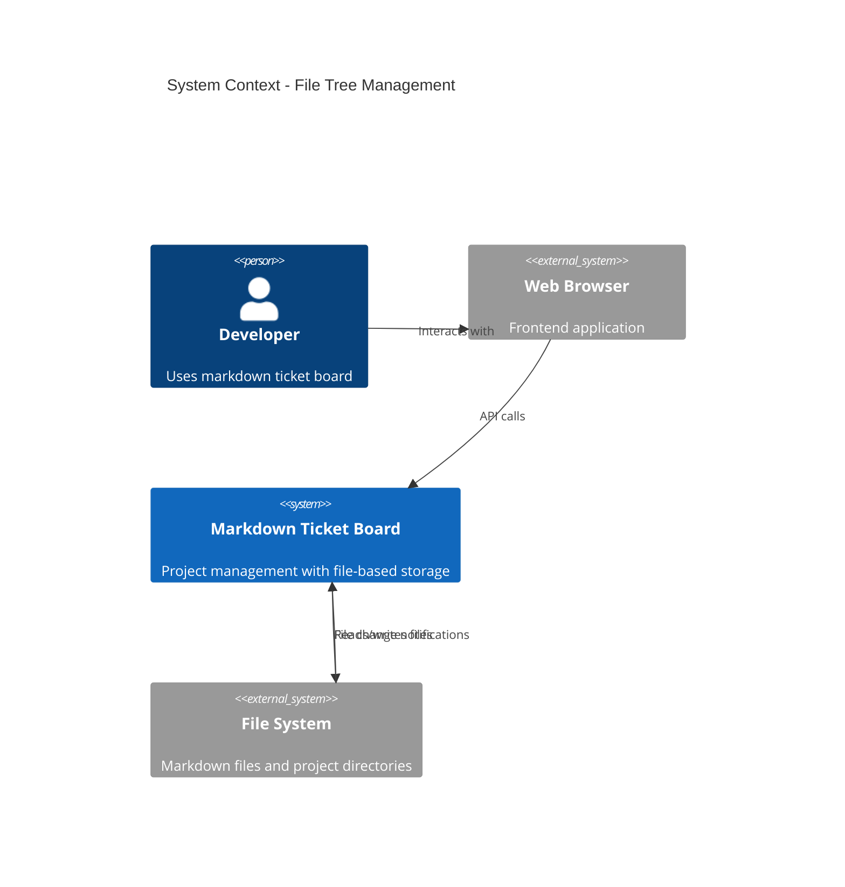
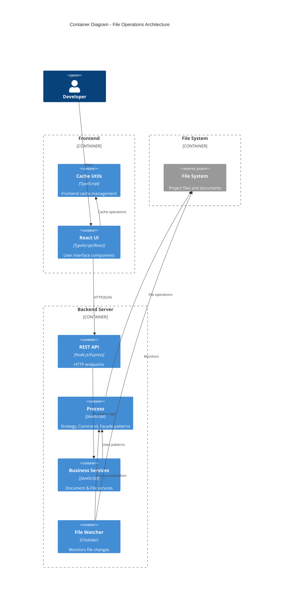
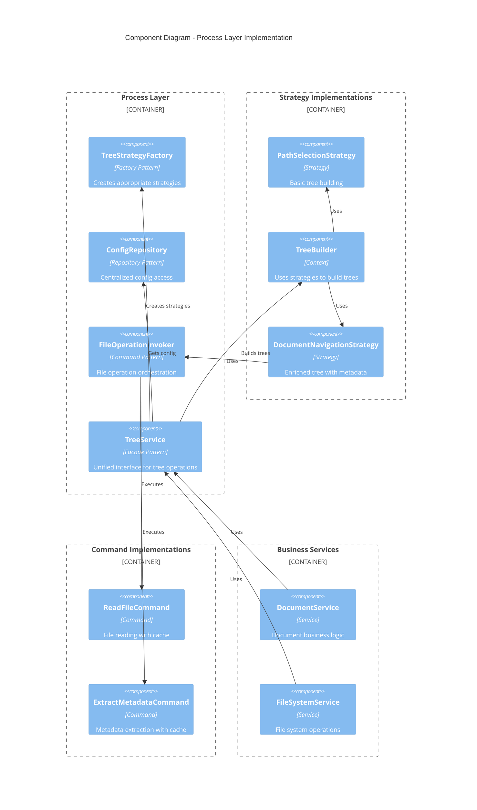
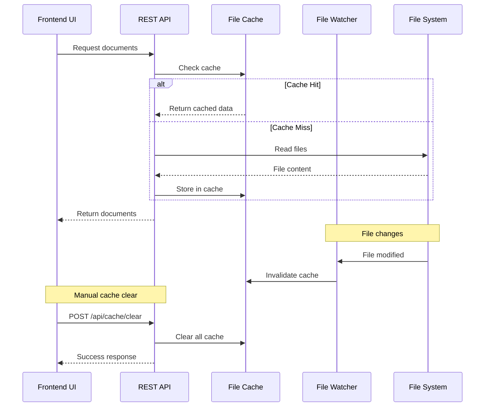

# Design Pattern Refactoring - Architecture Decision Record

# Design Pattern Refactoring - Architecture Decision Record

## Description

The file tree building functionality suffered from code duplication, inconsistent filtering, and mixed responsibilities across multiple services. The original blacklist filtering issue revealed deeper architectural problems that needed systematic resolution.

## Rationale

Implemented a comprehensive refactoring using established design patterns to create a maintainable, extensible architecture for file operations.

## Solution Analysis

### Architecture Overview

#### C4 Level 1: System Context



#### C4 Level 2: Container Diagram



#### C4 Level 3: Component Diagram



### Cache Management Architecture



## Implementation

### 1. Strategy Pattern - Tree Building
- **PathSelectionStrategy**: Basic tree for path selection UI
- **DocumentNavigationStrategy**: Enriched tree with metadata for navigation
- **TreeBuilder**: Context that uses strategies to build trees

### 2. Repository Pattern - Configuration
- **ConfigRepository**: Single source of truth for `.mdt-config.toml` parsing
- Eliminates duplicate config parsing across services
- Provides consistent defaults and error handling

### 3. Facade Pattern - Unified Interface
- **TreeService**: Simple interface hiding complexity
- `getDocumentTree(projectId)` - For document navigation
- `getPathSelectionTree(projectId)` - For path selection

### 4. Command Pattern - File Operations
- **ExtractMetadataCommand**: Cached metadata extraction (title, dates)
- **ReadFileCommand**: Cached file content reading
- **FileOperationInvoker**: Orchestrates commands with cache management

### Cache Features
- **Configurable TTL**: Cache expiration configurable via global config (default: 1 hour)
- **File watcher invalidation**: Real-time cache clearing on file changes
- **Manual clearing**: UI button and API endpoint for cache management
- **No size limits**: Noted for production consideration

**Configuration Example:**
```toml
# ~/.config/markdown-ticket/config.toml
[cache]
ttl = 7200  # 2 hours cache TTL
```
## Acceptance Criteria

### ✅ Completed
- [x] **~150 lines of duplicate code removed**
- [x] **Single source of truth** for tree building logic
- [x] **Consistent blacklist filtering** across all operations
- [x] **Clean separation of concerns**
- [x] **File operation caching** reduces disk I/O
- [x] **Intelligent cache invalidation** maintains data freshness
- [x] **Design patterns** provide clear structure
- [x] **Cache management API** with UI integration
- [x] **Configurable cache TTL** via global configuration
### ❌ Not Covered Cases

#### 1. Ticket Operations Caching
**Issue**: TicketService still uses direct `fs.readFile()` calls
**Impact**: Inconsistent performance between documents and tickets
**Solution**: Extend FileOperationInvoker to TicketService

#### 2. Global Cache Strategy
**Issue**: Each service creates its own FileOperationInvoker instance
**Impact**: Separate caches, no shared benefits
**Solution**: Singleton FileOperationInvoker or dependency injection

#### 3. Cache Size Management
**Issue**: No memory limits on cache growth
**Impact**: Potential memory issues with large projects
**Solution**: LRU eviction or size-based limits

#### 4. Cross-Project Cache Pollution
**Issue**: Cache keys don't include project context
**Impact**: Files with same relative paths across projects may conflict
**Solution**: Project-scoped cache keys

#### 5. Distributed Cache Invalidation
**Issue**: File watcher only works for local file changes
**Impact**: External file modifications (Git, editors) may not invalidate cache
**Solution**: Periodic cache validation or enhanced file monitoring

### Future Considerations

#### Production Enhancements
- **Distributed caching** (Redis) for multi-instance deployments
- **Cache warming** strategies for frequently accessed files
- **Metrics and monitoring** for cache hit rates
- **Graceful degradation** when cache is unavailable

#### Performance Optimizations
- **Batch file operations** for large directory scans
- **Streaming responses** for large file trees
- **Compression** for cached content
- **Background cache refresh** before TTL expiration

### Testing Strategy

#### Unit Tests Needed
- Strategy pattern implementations
- Command pattern with mocked file system
- Cache TTL and invalidation logic
- Configuration repository parsing

#### Integration Tests Needed
- End-to-end tree building workflows
- File watcher cache invalidation
- API cache management endpoints
- Cross-service cache consistency