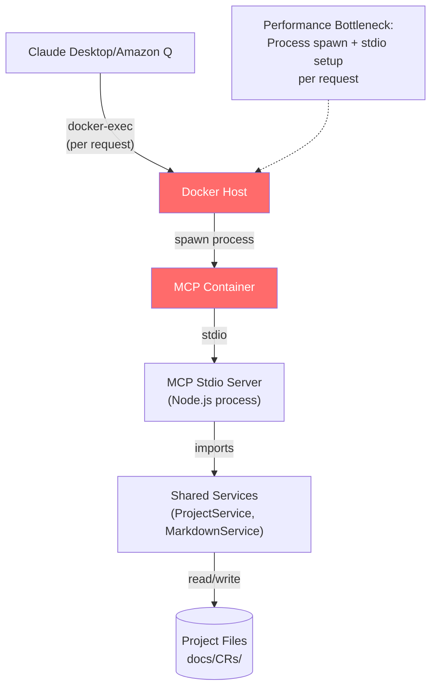
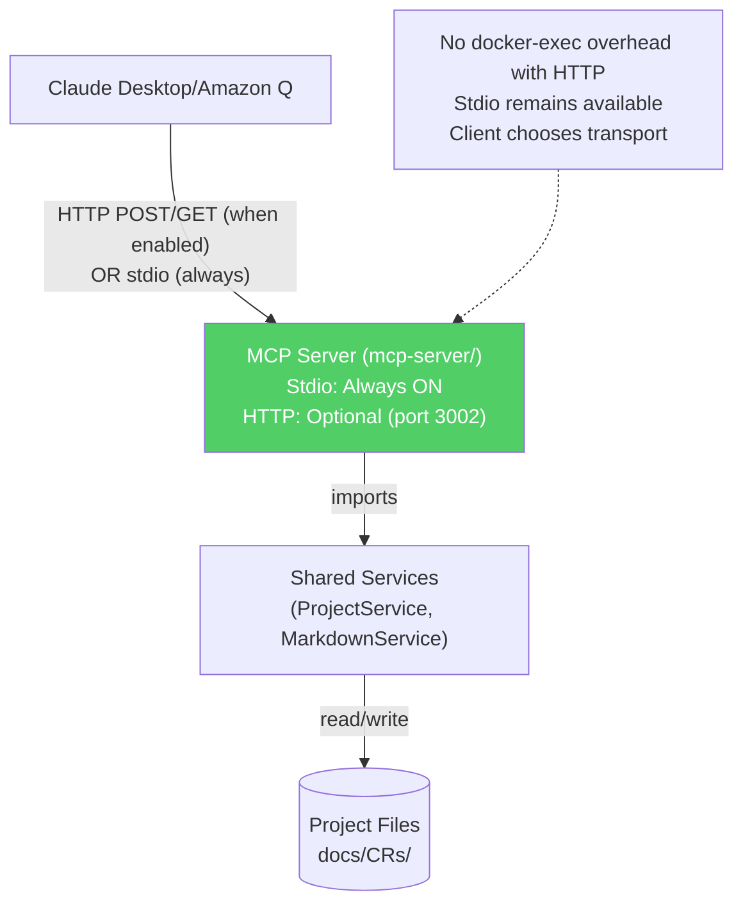
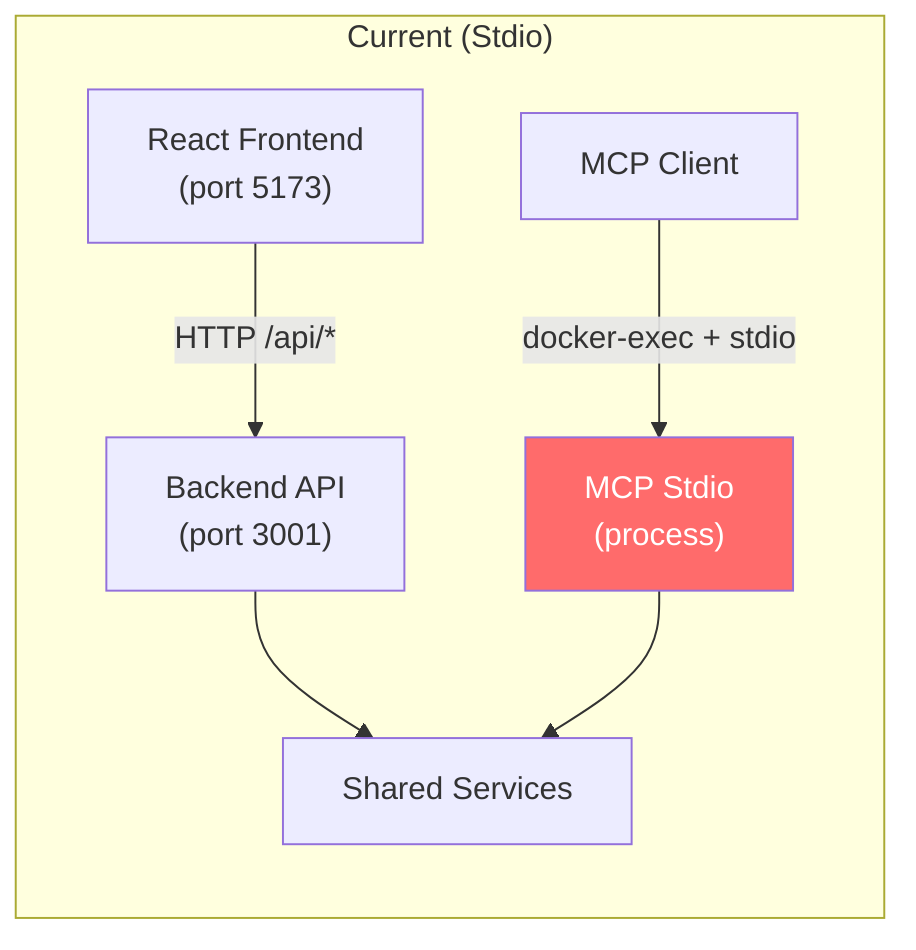
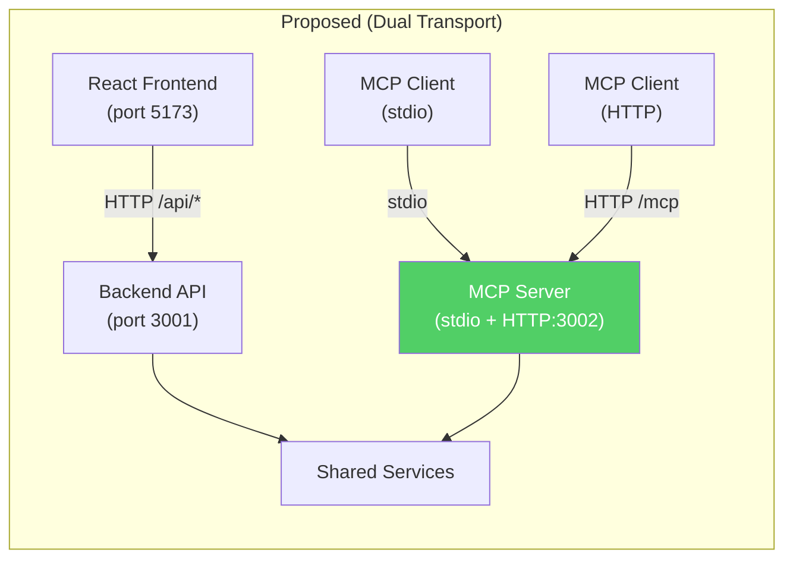
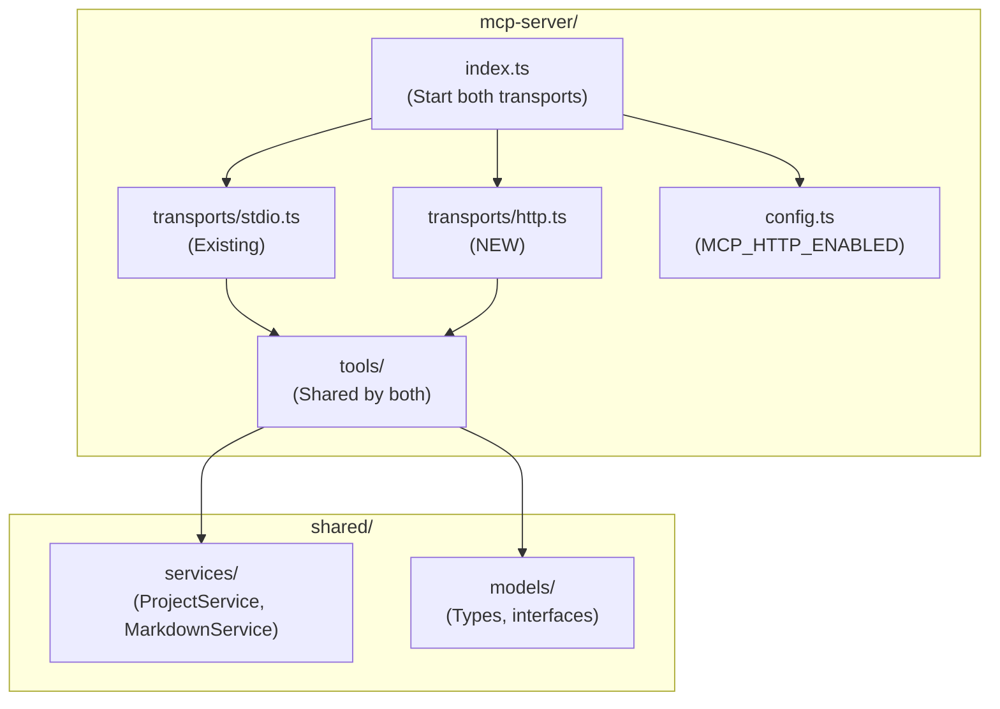
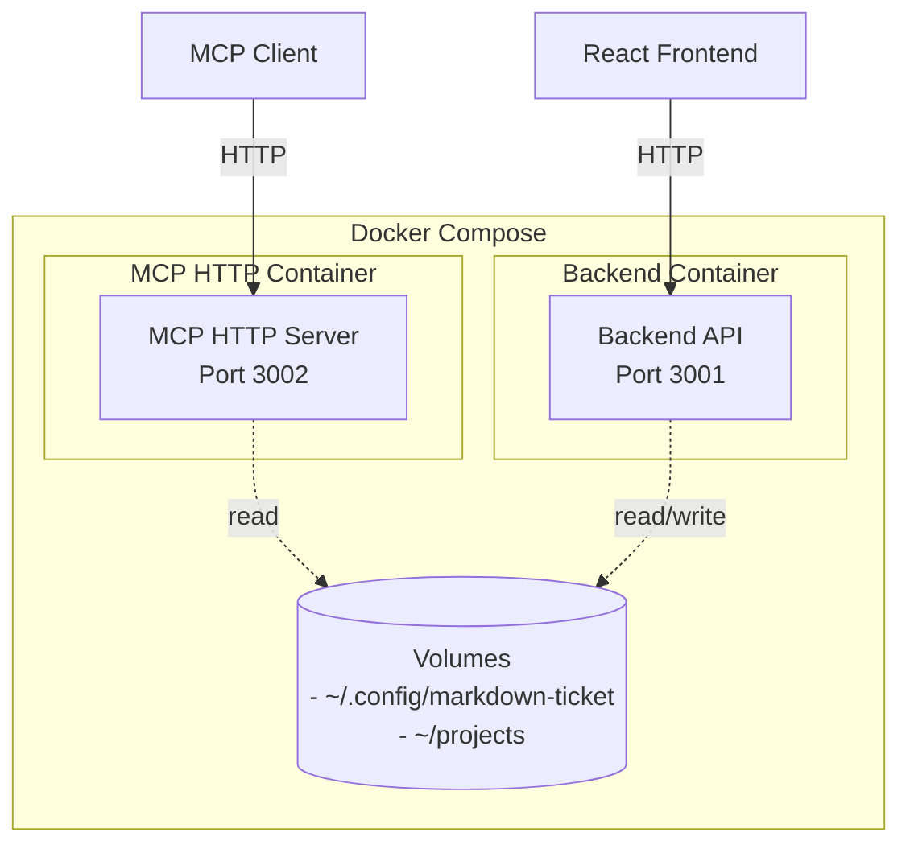

# MCP HTTP Server Implementation for Docker Performance

## 1. Description

### Problem Statement
The current MCP server uses stdio transport, which creates performance bottlenecks in Docker deployments. Each MCP request requires `docker-exec` to spawn a process and establish stdio communication, adding significant latency. This overhead makes the MCP server impractical for containerized deployments where clients need fast, reliable access to project management tools.

### Current State


**Current architecture:**
- MCP server: `mcp-server/` (stdio transport)
- Backend API: `server/` (Express, serves React frontend)
- Shared services: `shared/` (business logic)
- Docker: `docker-compose.mcp.yml` + `Dockerfile.mcp`

**Current pain points:**
- `docker-exec` overhead on every MCP request
- Process spawn latency in containerized environment
- No persistent connection to MCP server
- Slower than native localhost stdio

### Desired State


**Target architecture:**
- MCP server: `mcp-server/` (extend existing, not new directory)
- Stdio transport: Always running (backwards compatible)
- HTTP transport: Optionally enabled via `MCP_HTTP_ENABLED=true`
- Implements MCP Streamable HTTP specification (2025-03-26)
- Both transports share same tool implementations
- Client chooses which transport to use

### Rationale
- **Performance**: HTTP transport eliminates docker-exec overhead in containers
- **Backwards Compatibility**: Stdio always works, HTTP is opt-in enhancement
- **Standards Compliance**: Implement official MCP Streamable HTTP transport specification
- **Simplicity**: Both transports in same codebase, shared tool implementations
- **Flexibility**: Client chooses transport (stdio for local, HTTP for Docker)
- **No Breaking Changes**: Adding HTTP doesn't remove or modify stdio

### Impact Areas
- MCP server codebase (`mcp-server/` - add HTTP transport alongside stdio)
- Docker compose configuration (expose HTTP port when enabled)
- Client configuration (can optionally use HTTP endpoint)
- No impact on existing stdio clients

## 2. Rationale

### Why This Change is Necessary

**Primary motivation:** Docker performance
- Current stdio transport requires `docker-exec` per request
- HTTP transport allows persistent connections
- Eliminates process spawn overhead in containers

**Secondary benefits:**
- Standards compliance (official MCP specification)
- Better suited for containerized deployments
- Simpler client configuration (HTTP endpoint vs docker-exec wrapper)

### What It Accomplishes

- Adds HTTP transport option to existing MCP server (stdio remains)
- Eliminates docker-exec overhead when using HTTP in containers
- Provides persistent HTTP connections for MCP clients (when enabled)
- Implements official MCP Streamable HTTP transport (spec 2025-03-26)
- Maintains backwards compatibility with all existing stdio clients
- Both transports share same tool implementations (no duplication)
- Client flexibility: choose stdio (local) or HTTP (Docker) as needed

### Alignment with Project Goals

- **Performance**: Direct HTTP eliminates container overhead
- **Standards Compliance**: Official MCP specification implementation
- **Developer Experience**: Faster MCP operations in Docker
- **Architecture**: Clean separation between MCP and backend API

## 3. Solution Analysis

### Current Architecture Detail



### Proposed Architecture



**Key differences:**
- MCP server supports both stdio and HTTP transports
- Stdio: Always available (backwards compatible)
- HTTP: Optional on port 3002 (via MCP_HTTP_ENABLED=true)
- Same tool implementations for both transports
- Client chooses which transport to use

### Implementation Approach

**Extend existing MCP server:**
- Location: `mcp-server/` (extend existing directory, not new)
- Keep: Existing stdio transport and all tool implementations
- Add: HTTP transport support (Express + MCP SDK)
- Protocol: MCP Streamable HTTP (spec 2025-03-26)
- Tools: Shared by both stdio and HTTP transports

**File structure:**
```
mcp-server/
├── src/
│   ├── index.ts              # Start both transports
│   ├── transports/
│   │   ├── stdio.ts          # Existing stdio transport
│   │   └── http.ts           # NEW HTTP transport
│   ├── tools/                # Existing tools (unchanged)
│   │   ├── projectTools.ts
│   │   ├── crTools.ts
│   │   └── ...
│   └── config.ts             # Environment configuration
```

**Do NOT modify:**
- Backend server (`server/`) - unchanged
- Frontend (`src/`) - unchanged
- Shared services (`shared/`) - unchanged
- Existing stdio transport - unchanged
- Existing tool implementations - unchanged

**Architecture principles:**
- **Backwards compatibility**: Stdio always works
- **Opt-in enhancement**: HTTP enabled via environment variable
- **Code reuse**: Both transports use same tool implementations
- **No duplication**: Tools implemented once, work with both transports
- **Client choice**: Client picks stdio or HTTP based on needs

## 4. Implementation Specification

### Technical Requirements

#### 4.1 MCP Server Structure (Dual Transport)



**Directory structure:**
```
mcp-server/
├── src/
│   ├── index.ts                  # Start stdio (always) + HTTP (if enabled)
│   ├── transports/
│   │   ├── stdio.ts              # Existing stdio transport
│   │   └── http.ts               # NEW HTTP transport (Express)
│   ├── tools/                    # Existing tools (shared by both)
│   │   ├── projectTools.ts
│   │   ├── crTools.ts
│   │   ├── sectionTools.ts
│   │   └── templateTools.ts
│   ├── config.ts                 # Environment configuration
│   └── logger.ts                 # Pino logging
├── package.json                  # Add express dependency
├── tsconfig.json
└── Dockerfile                    # Updated to expose port 3002
```

#### 4.2 MCP Protocol Implementation

**Specification:** MCP Streamable HTTP transport (2025-03-26)
- Reference: https://modelcontextprotocol.io/specification/2025-03-26/basic/transports

**HTTP Methods:**
- **POST /mcp**: Client sends JSON-RPC messages (requests, notifications, responses)
- **GET /mcp**: (Optional, Phase 2) Server-initiated SSE streams

**Required Headers:**
- `Accept`: Must include `application/json` and `text/event-stream`
- `Origin`: Validated for DNS rebinding protection

**Response Content Types:**
- `Content-Type: application/json` - Single JSON responses
- `Content-Type: text/event-stream` - SSE streaming responses (if multiple requests)
- `202 Accepted` - For notifications/responses (no data to return)

**Session Management:**
- **Phase 1 (MVP)**: No sessions (stateless)
- **Phase 2 (Optional)**: Add `Mcp-Session-Id` if multi-client conflicts arise

**Security:**
- **Phase 1 (MVP)**: Minimal security (localhost binding only)
- **Phase 2 (Optional)**: Origin validation, rate limiting, authentication
- All security features configurable via environment variables
- Easy to disable for local development

#### 4.3 Server Implementation

**index.ts - Main entry point:**
```typescript
import { logger } from './logger.js'
import { startHttpTransport } from './transports/http.js'
import { startStdioTransport } from './transports/stdio.js'

async function main() {
  // Stdio transport: ALWAYS ON
  await startStdioTransport()
  logger.info('✓ MCP stdio transport: ready')

  // HTTP transport: OPTIONAL (enabled via env var)
  if (process.env.MCP_HTTP_ENABLED === 'true') {
    try {
      const port = Number.parseInt(process.env.MCP_HTTP_PORT || '3002')
      await startHttpTransport({ port })
      logger.info(`✓ MCP HTTP transport: http://localhost:${port}`)
    }
    catch (err) {
      logger.warn('⚠ HTTP transport failed to start:', err.message)
      logger.warn('  Stdio transport still available')
    }
  }
}

main().catch((err) => {
  logger.error('Failed to start MCP server:', err)
  process.exit(1)
})
```

**transports/stdio.ts - Existing stdio transport:**
```typescript
import { Server } from '@modelcontextprotocol/sdk/server/index.js'
import { StdioServerTransport } from '@modelcontextprotocol/sdk/server/stdio.js'
import { registerAllTools } from '../tools/index.js'

export async function startStdioTransport() {
  const server = new Server({
    name: 'markdown-ticket',
    version: '1.0.0'
  }, {
    capabilities: { tools: {} }
  })

  // Register tools (shared with HTTP transport)
  registerAllTools(server)

  const transport = new StdioServerTransport()
  await server.connect(transport)
}
```

**transports/http.ts - NEW HTTP transport:**
```typescript
import { Server } from '@modelcontextprotocol/sdk/server/index.js'
import express from 'express'
import { config } from '../config.js'
import { logger } from '../logger.js'
import { registerAllTools } from '../tools/index.js'

export async function startHttpTransport(options: { port: number }) {
  const app = express()
  const server = new Server({
    name: 'markdown-ticket',
    version: '1.0.0'
  }, {
    capabilities: { tools: {} }
  })

  // Register tools (same as stdio transport)
  registerAllTools(server)

  // Optional security features (Phase 2)
  if (config.security.originValidation) {
    app.use((req, res, next) => {
      const origin = req.headers.origin
      if (origin && !isAllowedOrigin(origin)) {
        return res.status(403).json({ error: 'Forbidden origin' })
      }
      next()
    })
  }

  if (config.security.rateLimiting) {
    const limiter = rateLimit({
      windowMs: config.security.rateLimitWindow,
      max: config.security.rateLimitMax
    })
    app.use('/mcp', limiter)
  }

  // MCP endpoint
  app.post('/mcp', async (req, res) => {
    // Handle JSON-RPC messages
    // Implementation using MCP SDK
  })

  // Bind address (localhost for dev, 0.0.0.0 for Docker)
  const host = config.bindAddress

  return new Promise<void>((resolve) => {
    app.listen(options.port, host, () => {
      logger.info(`HTTP transport bound to ${host}:${options.port}`)
      resolve()
    })
  })
}
```

#### 4.4 Tool Implementation Pattern

```typescript
// tools/cr-tools.ts
import { Server } from '@modelcontextprotocol/sdk/server/index.js'
import { z } from 'zod'
import { MarkdownService } from '../../../shared/services/MarkdownService.js'

export function registerCRTools(
  server: Server,
  markdownService: MarkdownService
) {
  server.setRequestHandler(
    ListToolsRequestSchema,
    async () => ({
      tools: [
        {
          name: 'list_crs',
          description: 'List change requests for a project. Returns concise summaries by default.',
          inputSchema: {
            type: 'object',
            properties: {
              project: {
                type: 'string',
                description: 'Project key (e.g., "MDT", "API")'
              },
              status: {
                type: 'string',
                enum: ['Proposed', 'Approved', 'In Progress', 'Implemented', 'Rejected']
              },
              limit: {
                type: 'number',
                description: 'Max results (default: 50)'
              }
            },
            required: ['project']
          },
          annotations: {
            readOnlyHint: true,
            idempotentHint: true,
            openWorldHint: true
          }
        }
      ]
    })
  )

  server.setRequestHandler(
    CallToolRequestSchema,
    async (request) => {
      if (request.params.name === 'list_crs') {
        const { project, status, limit = 50 } = request.params.arguments
        const crs = await markdownService.listCRs(project, { status, limit })

        return {
          content: [
            {
              type: 'text',
              text: JSON.stringify(crs, null, 2)
            }
          ]
        }
      }
    }
  )
}
```

#### 4.5 Logging & Observability

**Simple approach using Pino:**

```typescript
// logger.ts
import pino from 'pino'

export const logger = pino({
  level: process.env.LOG_LEVEL || 'info',
  transport: {
    target: 'pino-pretty',
    options: {
      colorize: true
    }
  }
})

// Usage in tools
logger.info({ tool: 'list_crs', project: 'MDT', duration: 45 }, 'Tool executed')
logger.error({ tool: 'get_cr', error: err.message }, 'Tool failed')
```

**Metrics to log:**
- Tool name
- Input parameters (sanitized)
- Execution duration
- Success/failure
- Error details

#### 4.6 Security Features (Optional - Phase 2)

**Phase 1 (MVP):** Minimal security only
- Bind to localhost (127.0.0.1) for local dev
- Bind to 0.0.0.0 for Docker
- No origin validation
- No rate limiting
- No authentication

**Phase 2 (Optional):** Enhanced security via environment variables
```typescript
// Origin validation (disabled by default)
if (process.env.MCP_SECURITY_ORIGIN_VALIDATION === 'true') {
  app.use(originValidationMiddleware)
}

// Rate limiting (disabled by default)
if (process.env.MCP_SECURITY_RATE_LIMITING === 'true') {
  const limiter = rateLimit({
    windowMs: Number.parseInt(process.env.MCP_RATE_LIMIT_WINDOW_MS || '1000'),
    max: Number.parseInt(process.env.MCP_RATE_LIMIT_MAX || '100')
  })
  app.use('/mcp', limiter)
}

// Authentication (disabled by default)
if (process.env.MCP_SECURITY_AUTH === 'true') {
  app.use(authMiddleware)
}
```

**Benefits:**
- Simple by default (no security overhead for localhost)
- Easy to enable for production deployments
- Opt-in rather than opt-out
- Quick to disable if causing issues

#### 4.7 Docker Configuration



**docker-compose.yml updates:**
```yaml
services:
  mcp:
    build:
      context: .
      dockerfile: mcp-server/Dockerfile # Same Dockerfile, updated
    container_name: markdown-ticket-mcp
    ports:
      - '3002:3002' # Expose HTTP port (when enabled)
    volumes:
      - ${HOME}/.config/markdown-ticket:/root/.config/markdown-ticket:ro
      - ${HOME}/projects:/projects
    environment:
      - NODE_ENV=production
      - MCP_HTTP_ENABLED=true # Enable HTTP transport
      - MCP_HTTP_PORT=3002
      - MCP_BIND_ADDRESS=0.0.0.0
      - LOG_LEVEL=info
    networks:
      - mcp-network
    restart: unless-stopped
```

**Dockerfile updates:**
```dockerfile
# mcp-server/Dockerfile (updated to expose HTTP port)
FROM node:20-alpine

WORKDIR /app

# Copy shared services
COPY shared /app/shared

# Copy MCP server
COPY mcp-server/package*.json /app/mcp-server/
WORKDIR /app/mcp-server
RUN npm ci --only=production

COPY mcp-server /app/mcp-server
RUN npm run build

EXPOSE 3002                              # NEW: Expose HTTP port
CMD ["node", "dist/index.js"]            # Start with both transports
```

**Local development (stdio only):**
```bash
# No HTTP transport
cd mcp-server
npm run dev
```

**Local development (with HTTP):**
```bash
# Enable HTTP transport
cd mcp-server
MCP_HTTP_ENABLED=true npm run dev
```

#### 4.8 Tool Annotations

**All tools must include:**

```typescript
annotations: {
  readOnlyHint: boolean,    // true for GET operations
  idempotentHint: boolean,  // true if safe to retry
  openWorldHint: true,      // always true (file system access)
  destructiveHint: boolean  // true only for DELETE operations
}
```

**Examples:**
- `list_crs`: `{ readOnlyHint: true, idempotentHint: true, destructiveHint: false }`
- `create_cr`: `{ readOnlyHint: false, idempotentHint: false, destructiveHint: false }`
- `delete_cr`: `{ readOnlyHint: false, idempotentHint: false, destructiveHint: true }`

#### 4.9 Response Format Standards

**JSON responses:**
- Default: Concise format (summaries, not full content)
- Optional: Add `format` parameter to tools (`"concise"` | `"detailed"`)
- Character limit: 25,000 chars per response
- Pagination: `limit` and `offset` parameters for list operations

**Pagination format:**
```json
{
  "items": [...],
  "pagination": {
    "total": 150,
    "limit": 50,
    "offset": 0,
    "hasMore": true
  }
}
```

**Error responses:**
- Must suggest next steps
- Actionable guidance
- Example: "CR MDT-999 not found. Use list_crs(project='MDT') to see available CRs."

### Configuration

**Environment Variables:**
```bash
# mcp-server/.env

# ===== Core Configuration =====
# HTTP Transport
MCP_HTTP_ENABLED=true          # Enable HTTP transport (default: false)
MCP_HTTP_PORT=3002             # HTTP port (default: 3002)
MCP_BIND_ADDRESS=0.0.0.0       # Bind address: 127.0.0.1 (local) or 0.0.0.0 (Docker)

# Logging
LOG_LEVEL=info                 # Log level: debug, info, warn, error (default: info)

# ===== Security Features (Phase 2 - Optional) =====
# All disabled by default for simplicity

# Origin Validation (DNS rebinding protection)
MCP_SECURITY_ORIGIN_VALIDATION=false      # Enable origin validation (default: false)

# Rate Limiting
MCP_SECURITY_RATE_LIMITING=false          # Enable rate limiting (default: false)
MCP_RATE_LIMIT_MAX=100                    # Max requests per window (default: 100)
MCP_RATE_LIMIT_WINDOW_MS=1000             # Time window in ms (default: 1000)

# Authentication
MCP_SECURITY_AUTH=false                   # Enable authentication (default: false)
MCP_AUTH_TOKEN=                           # Auth token (if enabled)
```

**Phase 1 (MVP) Recommended:**
```bash
MCP_HTTP_ENABLED=true
MCP_HTTP_PORT=3002
MCP_BIND_ADDRESS=127.0.0.1    # localhost for dev
LOG_LEVEL=info
# All security features: disabled (default)
```

**Phase 2 (Production) Example:**
```bash
MCP_HTTP_ENABLED=true
MCP_HTTP_PORT=3002
MCP_BIND_ADDRESS=0.0.0.0
LOG_LEVEL=warn
MCP_SECURITY_ORIGIN_VALIDATION=true
MCP_SECURITY_RATE_LIMITING=true
MCP_SECURITY_AUTH=true
MCP_AUTH_TOKEN=your-secret-token
```

**Client Configuration:**

```bash
# Claude Code
claude mcp add mdt-http \
  --transport http \
  --url http://localhost:3002/mcp

# Amazon Q
q mcp add \
  --name mdt-http \
  --transport http \
  --endpoint http://localhost:3002/mcp
```

## 5. Acceptance Criteria

### Functional Requirements

**MCP Protocol Compliance:**
- [ ] Implements MCP Streamable HTTP transport (spec 2025-03-26)
- [ ] POST /mcp endpoint accepts JSON-RPC messages
- [ ] Returns correct content types (application/json or text/event-stream)
- [ ] Returns 202 Accepted for notifications/responses
- [ ] Origin header validation implemented

**Tool Compatibility:**
- [ ] All current MCP tools available via HTTP transport
- [ ] Tool responses match stdio transport functionality
- [ ] JSON-RPC 2.0 protocol compliance
- [ ] All tools have proper annotations
- [ ] Error messages provide actionable guidance

**Performance:**
- [ ] Eliminates docker-exec overhead
- [ ] Persistent HTTP connections supported
- [ ] Concurrent client requests handled correctly
- [ ] No connection leaks or resource exhaustion

**Integration:**
- [ ] Works with Claude Code MCP client
- [ ] Works with Amazon Q MCP client
- [ ] Works with Claude Desktop MCP client
- [ ] Shared services integration works correctly
- [ ] Docker deployment functional

### Non-Functional Requirements

**Simplicity:**
- [ ] No session management in Phase 1
- [ ] No enterprise observability stack
- [ ] Simple Pino logging only
- [ ] Minimal dependencies
- [ ] No security features enabled by default (opt-in for Phase 2)
- [ ] Easy to disable any feature via environment variables

**Reliability:**
- [ ] Graceful handling of client disconnections
- [ ] Comprehensive error logging
- [ ] No data loss during failures

**Security (Phase 1 - Minimal):**
- [ ] Localhost binding for local deployment (127.0.0.1)
- [ ] Docker binding to 0.0.0.0 for container networking
- [ ] No origin validation (opt-in for Phase 2)
- [ ] No rate limiting (opt-in for Phase 2)
- [ ] No authentication (opt-in for Phase 2)

**Security (Phase 2 - Optional):**
- [ ] Origin validation via `MCP_SECURITY_ORIGIN_VALIDATION=true`
- [ ] Rate limiting via `MCP_SECURITY_RATE_LIMITING=true`
- [ ] Authentication via `MCP_SECURITY_AUTH=true`
- [ ] All features easily disabled if causing issues

**Standards Compliance:**
- [ ] MCP Streamable HTTP transport spec 2025-03-26
- [ ] JSON-RPC 2.0 protocol
- [ ] HTTP/1.1 standards

### Testing Requirements

**Unit Tests:**
- [ ] Tool implementations tested
- [ ] Shared services integration tested
- [ ] Error handling tested

**Integration Tests:**
- [ ] End-to-end MCP operations via HTTP
- [ ] Multiple concurrent clients
- [ ] Docker deployment tested

**Manual Testing:**
- [ ] Claude Code client connection
- [ ] Amazon Q client connection
- [ ] All tools executable via clients
- [ ] Docker container startup/restart

### Success Metrics

**Performance:**
- Faster than stdio transport in Docker (no docker-exec)
- Supports concurrent clients without degradation
- No noticeable latency for typical operations

**Standards Compliance:**
- 100% MCP Streamable HTTP spec compliance
- Works with all standard MCP clients

**Developer Experience:**
- Simple client configuration (HTTP endpoint)
- Clear logs for debugging
- Easy local development (npm run dev)
- Straightforward Docker deployment

**Architecture:**
- Stdio transport: Always functional (backwards compatible)
- HTTP transport: Optional enhancement (enabled via env var)
- Shared tool implementations (no duplication between transports)
- Same Docker container (extended mcp-server/)
- Backend server completely unchanged

---

## Summary

This CR adds HTTP transport support to the existing MCP server without breaking changes:

**Key Design Decisions:**
1. **Stdio always ON**: Existing clients continue working without any changes
2. **HTTP opt-in**: Enable with `MCP_HTTP_ENABLED=true` environment variable
3. **Single codebase**: Both transports in `mcp-server/`, not separate directories
4. **Shared tools**: Tool implementations work with both stdio and HTTP
5. **Graceful degradation**: If HTTP fails to start, stdio still works
6. **Client choice**: Client picks which transport to use based on needs
7. **Security deferred**: Phase 1 is minimal (localhost binding only), Phase 2 adds optional security via env vars

**What changes:**
- Add `mcp-server/src/transports/http.ts` (new HTTP transport)
- Update `mcp-server/src/index.ts` to start both transports
- Add Express dependency to `mcp-server/package.json`
- Update Dockerfile to expose port 3002
- Add environment variables for HTTP and optional security features

**What stays the same:**
- All existing stdio functionality
- All existing tool implementations
- Backend server (`server/`)
- Frontend (`src/`)
- Shared services (`shared/`)
- Existing clients using stdio

**Result:** Drop-in enhancement that solves Docker performance issues while maintaining 100% backwards compatibility.

**Implementation Strategy:**
- **Phase 1 (MVP)**: Core HTTP transport with minimal security (localhost binding)
- **Phase 2 (Optional)**: Add security features (origin validation, rate limiting, auth) as opt-in via env vars
- All security features disabled by default for simplicity
- Easy to enable/disable any feature without code changes
