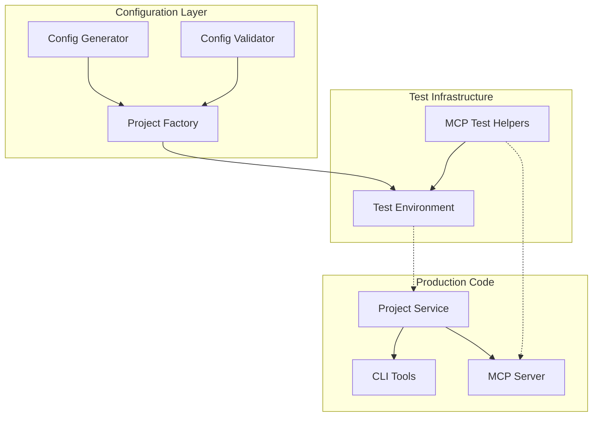

# Architecture: MDT-077

**Source**: [MDT-077](..//MDT-077-cli-project-management-tool.md)
**Generated**: 2025-12-16
**Complexity Score**: 25

## Overview

This architecture defines the CLI project management system with a clean, new configuration format specified in CONFIG_SPECIFICATION.md. The implementation uses a fresh schema without legacy field support, structured configuration, and ensures consistency across test utilities, CLI tools, and MCP server integration.

## Pattern

**Clean Configuration Pattern** — New structured configuration without backward compatibility support.

The pattern enforces:
- Single configuration format only
- Strict validation with clear error messages
- No legacy field support
- Clean, minimal implementation

## Key Dependencies

| Capability | Package | Coverage | Rationale |
|------------|---------|----------|----------|
| TOML parsing | @iarna/toml | 100% | Already in project dependencies, robust parsing |
| File system utilities | Node.js fs | 100% | Native, no additional dependencies |
| Test isolation | Jest | 100% | Existing test framework, supports child processes |

**Build Custom Decisions**:
| Capability | Reason | Estimated Size |
|------------|--------|---------------|
| Configuration migration | Project-specific format requirements | ~150 lines |
| Test project factory | Isolated test environment needs | ~200 lines |
| MCP test helpers | E2E testing requirements | ~100 lines |

## Component Boundaries



| Component | Responsibility | Owns | Depends On |
|-----------|----------------|------|------------|
| `ConfigGenerator` | Generate TOML configs in new format | Config templates | None |
| `ProjectFactory` | Create test projects with valid configs | Test project lifecycle | `ConfigGenerator`, `TestEnvironment` |
| `ConfigValidator` | Validate new config format | Validation rules | New config schema |
| `TestEnvironment` | Isolated test execution | Temporary directories | Node.js fs |
| `MCP Test Helpers` | E2E MCP server testing | Test scenarios | Config format |

## Shared Patterns

| Pattern | Occurrences | Extract To |
|---------|-------------|------------|
| Configuration generation | ProjectFactory, ConfigGenerator, MCP helpers | `ConfigGenerator` class |
| Test project creation | ProjectFactory, MCP E2E tests | `ProjectFactory` class |
| File I/O with retry | ProjectFactory, TestEnvironment | `RetryHelper` utility |

> Phase 1 extracts these patterns BEFORE components that use them.

## Structure

```
shared/test-lib/core/
  ├── project-factory.ts           → Test project creation (UPDATE)
  ├── test-environment.ts         → Isolated test management
  └── utils/
      └── retry-helper.ts         → File I/O retry logic

mcp-server/tests/e2e/helpers/
  ├── config/
  │   └── configuration-generator.ts  → Config generation (UPDATE)
  └── utils/
      └── file-helper.ts          → File I/O utilities

.mdt-config.toml                  → Main project config (UPDATE)
```

## Size Guidance

| Module | Role | Limit | Hard Max |
|--------|------|-------|----------|
| `project-factory.ts` | Test creation | 400 | 600 |
| `configuration-generator.ts` | Config generation | 150 | 225 |
| `.mdt-config.toml` | Project config | 50 | 75 |

## Error Scenarios

| Scenario | Detection | Response | Recovery |
|----------|-----------|----------|----------|
| Invalid config format | Validation failure | Fail fast with clear message | Manual config fix required |
| Invalid TOML syntax | TOML parse error | Fail fast with clear message | Manual config fix required |
| Missing required fields | Validation failure | Create with defaults | Default values applied |
| File permission errors | fs operation failure | Retry with exponential backoff | Skip operation, log error |

## Requirement Coverage

Not applicable - This is a Technical Debt CR focusing on format alignment.

## Implementation Plan

### Implementation Benefits

| Component | Implementation | Benefits |
|-----------|----------------|----------|
| `ProjectFactory` | Clean configuration generation | Simpler code structure |
| `ConfigGenerator` | New format without deprecated fields | Cleaner implementation |
| `.mdt-config.toml` | Single format | Consistent configuration |

### Interface Preservation

| Public Interface | Status | Verification |
|------------------|--------|--------------|
| `ProjectFactory.createProject()` | Preserved | Existing tests cover |
| `ProjectFactory.createTestCR()` | Preserved | Existing tests cover |
| `ConfigGenerator.generateMdtConfig()` | Modified | Update tests in MDT-092 |
| Global config format | Changed | Update MCP server validation |

### Behavioral Equivalence

- Test suite: MDT-092 isolated test environment verifies identical behavior
- Performance: Config parsing is optimized with clean structure

## Configuration Format

### Required Format
```toml
[project]
name = "Project"
code = "PROJ"
id = "project"               # Required, must match directory name

[project.document]
paths = []
excludeFolders = []
maxDepth = 3                 # Default depth limit
```

## Domain Alignment

| Domain Concept | Implementation | Notes |
|----------------|----------------|-------|
| `Project` (Aggregate Root) | `shared/services/ProjectService.ts` | Entry point for all project operations, owns invariants |
| `ProjectConfig` (Internal) | `shared/models/Project.ts` | Managed within Project aggregate, no external access |
| `ProjectValidator` (Value) | `shared/tools/ProjectValidator.ts` | Enforces code format and validation rules |
| `Three-Strategy Config` (Value) | Configuration layer components | Storage pattern determined at creation time |
| Project code invariant | `ProjectValidator.validateCode()` | Enforced in aggregate before persistence |
| ID-matching-directory invariant | `ProjectService` discovery logic | Checked at project registration boundary |
| Config location defines root | Local config file structure | Physical location determines project root path |

## Extension Rule

To add new configuration field:
1. Add field to `ProjectConfig` interface in types
2. Update `ConfigGenerator.generateMdtConfig()` (limit 150 lines)
3. Add validation in `ConfigValidator` if needed
4. Update tests to verify new field

---
*Generated by /mdt:architecture*