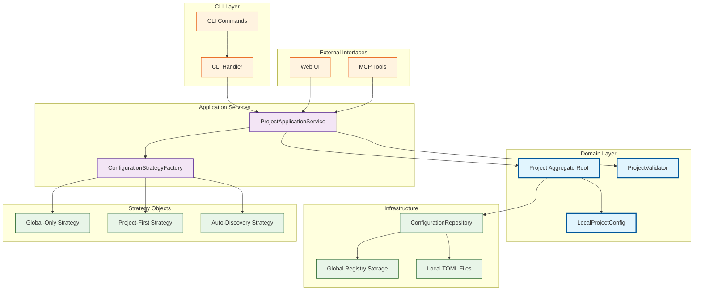

# Architecture: MDT-077

**Source**: [MDT-077](../../../docs/CRs/MDT-077-cli-project-management-tool.md)
**Generated**: 2025-12-18
**Complexity Score**: 20

## Overview

This architecture establishes a consistent project management system across CLI, Web UI, and MCP interfaces using Domain-Driven Design principles. The design eliminates code duplication by centralizing business logic in shared services, implements a three-strategy configuration pattern for flexible deployment, and provides a unified configuration interface that directly maps to the TOML structure.

## Pattern

**Domain-Driven Design (DDD) with Factory Strategy Pattern** — Aligns with project's existing domain model while providing clear boundaries between aggregates and external contexts.

The three-strategy configuration is implemented as a factory that creates appropriate strategy objects based on deployment needs, while maintaining a single Project aggregate root for all operations.

## Component Boundaries



| Component | Responsibility | Owns | Depends On |
|-----------|----------------|------|------------|
| `CLI Commands` | Command-line interface orchestration | Command parsing, error display | `CLI Handler` |
| `CLI Handler` | Command execution logic | Request/response mapping | `ProjectApplicationService` |
| `ProjectApplicationService` | Use case orchestration | Business workflows | `Project`, `ConfigurationStrategyFactory`, `ProjectValidator` |
| `Project` | Aggregate root for project operations | Project state, invariants | `LocalProjectConfig`, `ConfigurationRepository` |
| `ConfigurationStrategyFactory` | Strategy selection based on flags | Strategy creation logic | Three strategy objects |
| `ProjectValidator` | Centralized validation rules | Validation constraints | Pure functions (no deps) |
| `ConfigurationRepository` | Configuration persistence | TOML I/O operations | File system, Global registry storage |

## Shared Patterns

| Pattern | Occurrences | Extract To |
|---------|-------------|------------|
| Configuration validation | CLI create/update, Web UI, MCP interfaces | `shared/validation/ProjectValidator.ts` |
| Error handling with detailed messages | All interfaces | `shared/errors/ProjectErrorHandler.ts` |
| Configuration file I/O (TOML) | CLI commands, Web UI, MCP | `shared/io/ConfigurationRepository.ts` |
| Project code generation | CLI create, Web UI create | `shared/generation/CodeGenerator.ts` |

> Phase 1 extracts these BEFORE features that use them.

## Structure

```
cli/
├── src/
│   ├── commands/
│   │   ├── project/
│   │   │   ├── index.ts              → Command registration and routing
│   │   │   ├── create.ts             → Create project command (75 lines)
│   │   │   ├── list.ts               → List projects command (50 lines)
│   │   │   ├── update.ts             → Update project command (75 lines)
│   │   │   ├── delete.ts             → Delete project command (50 lines)
│   │   │   ├── enable-disable.ts     → Enable/disable command (50 lines)
│   │   │   └── validate.ts           → Validation command (50 lines)
│   │   └── index.ts                  → CLI entry point
│   ├── handlers/
│   │   ├── ProjectCLIHandler.ts      → CLI-specific logic (100 lines)
│   │   └── index.ts
│   └── index.ts                      → CLI main entry

shared/
├── services/
│   ├── ProjectApplicationService.ts  → Use case orchestration (200 lines)
│   └── ConfigurationStrategyFactory.ts → Strategy factory (75 lines)
├── validation/
│   ├── ProjectValidator.ts           → Centralized validation (150 lines)
│   └── index.ts
├── io/
│   ├── ConfigurationRepository.ts    → TOML I/O operations (200 lines)
│   └── index.ts
├── generation/
│   ├── CodeGenerator.ts              → Project code generation (75 lines)
│   └── index.ts
└── errors/
    ├── ProjectErrorHandler.ts        → Consistent error handling (100 lines)
    └── index.ts

domain/
├── Project.ts                        → Project aggregate (200 lines)
├── ProjectConfig.ts                  → Configuration value objects (100 lines)
├── strategies/
│   ├── GlobalOnlyStrategy.ts         → Global-only implementation (100 lines)
│   ├── ProjectFirstStrategy.ts       → Project-first implementation (100 lines)
│   ├── AutoDiscoveryStrategy.ts      → Auto-discovery implementation (100 lines)
│   └── index.ts
└── index.ts
```

## Size Guidance

| Module | Role | Limit | Hard Max |
|--------|------|-------|----------|
| `cli/src/commands/project/*.ts` | Feature command | 75 | 115 |
| `cli/src/handlers/ProjectCLIHandler.ts` | Handler | 100 | 150 |
| `shared/services/ProjectApplicationService.ts` | Application service | 200 | 300 |
| `shared/validation/ProjectValidator.ts` | Domain service | 150 | 225 |
| `shared/io/ConfigurationRepository.ts` | Infrastructure | 200 | 300 |
| `domain/Project.ts` | Aggregate root | 200 | 300 |
| `domain/strategies/*.ts` | Strategy implementation | 100 | 150 |

## Error Scenarios

| Scenario | Detection | Response | Recovery |
|----------|-----------|----------|----------|
| Invalid configuration | `ProjectValidator` | Reject with detailed field errors | User corrects input and retries |
| Concurrent project modification | File lock/version check | Abort with conflict message | User resolves conflict manually |
| Missing global registry | `ConfigurationRepository` | Create default registry | Automatic recovery |
| TOML parse error | `ConfigurationRepository` | Report parse location | User fixes TOML syntax |
| Project code collision | `CodeGenerator` | Generate new code | Automatic recovery |

## Requirement Coverage

| Requirement | Component | Notes |
|-------------|-----------|-------|
| R1.1-R1.6 (Project Lifecycle) | CLI commands + ProjectApplicationService | All CRUD operations covered |
| R2.1-R2.4 (Interface Structure) | ProjectConfig interface | Direct TOML mapping implemented |
| R3.1-R3.5 (Three-Strategy) | ConfigurationStrategyFactory + strategies | Factory pattern creates appropriate strategy |
| R4.1-R4.5 (Schema Validation) | ProjectValidator | Centralized validation ensures consistency |
| R5.1-R5.7 (Error Handling) | ProjectErrorHandler | Consistent error messages across interfaces |
| R6.1-R6.5 (Cross-Interface) | Shared services layer | All interfaces use same business logic |
| R7.1-R7.4 (Config Unification) | LocalProjectConfig only | Single configuration class used |
| R8.1-R8.4 (Performance) | Efficient design patterns | Stateless services, minimal I/O |
| R9.1-R9.4 (Concurrency) | ConfigurationRepository | File locking and version checks |
| R10.1-R10.4 (Test Coverage) | Modular design | Each module independently testable |

**Coverage**: 10/10 requirements mapped (100%)

## Domain Alignment

| Domain Concept | Implementation | Notes |
|----------------|----------------|-------|
| `Project` (Aggregate Root) | `domain/Project.ts` | Entry point for all project operations |
| `ProjectConfig` (Internal Entity) | `domain/ProjectConfig.ts` | Value object with direct TOML mapping |
| `ProjectValidator` (Value Object) | `shared/validation/ProjectValidator.ts` | Enforces all invariants at boundaries |
| `Three-Strategy Config` (Value) | `domain/strategies/*.ts` | Strategy pattern implementation |
| `Cross-context: CLI Interface` | `cli/src/commands/project/*.ts` | Commands use application service |
| `Cross-context: Config Storage` | `shared/io/ConfigurationRepository.ts` | Handles both global and local storage |

## Extension Rule

To add new CLI command:
1. Create file in `cli/src/commands/project/` (feature command, limit 75 lines)
2. Add command registration in `cli/src/commands/project/index.ts`
3. Use `ProjectApplicationService` for business logic

To add new configuration strategy:
1. Create strategy in `domain/strategies/` (strategy implementation, limit 100 lines)
2. Implement strategy interface methods
3. Register in `ConfigurationStrategyFactory`

To add new validation rule:
1. Add method to `shared/validation/ProjectValidator.ts` (domain service, limit 150 lines total)
2. Call from `ProjectApplicationService` before persistence

---
*Generated by /mdt:architecture*
