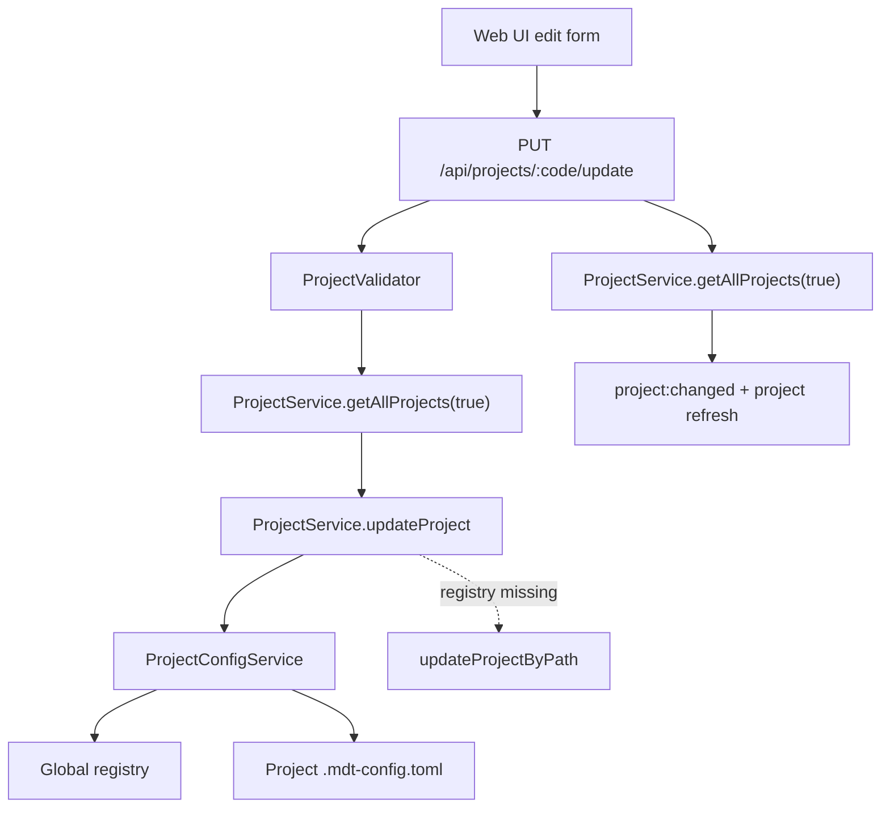

# Architecture: MDT-077

**Source**: [MDT-077](../MDT-077-project-entity-configuration-architecture.md)
**Generated**: 2026-05-15

## Overview

Project behavior is centralized in shared services. Web UI, API, CLI, and MCP are adapters over the same project contract; they must not reimplement storage-mode rules.

The core architectural rule is that a project write resolves the visible project first, then writes to the source of truth for that project's configuration mode. Reads always go back through the public project contract so callers see merged and refreshed state.

## Pattern

**Shared domain service with interface adapters.**

`ProjectService` owns project reads, update entrypoints, cache invalidation, and current-project resolution. `ProjectConfigService` owns TOML persistence and mode-specific write targets. Interface layers translate user/API/tool input into shared service calls.

## UAT Architecture Direction

The next architecture step is to make implicit project semantics explicit:

- `ProjectService` owns one mutation boundary for public project writes.
- Identity resolution becomes a named operation that returns the canonical project, configuration mode, registry path when present, and local config path when present.
- Configuration mode is represented as a first-class value: `global-only`, `project-first`, or `auto-discovery`.
- Registry metadata and local operational config are separate contracts, even if they still serialize through existing TOML files.

This keeps Web UI, API, CLI, and MCP adapters thin and prevents future fixes from reintroducing separate persistence paths.

## Runtime Flow

```mermaid
flowchart TD
  UI["Web UI edit form"] --> API["PUT /api/projects/:code/update"]
  API --> Validate["ProjectValidator"]
  Validate --> Resolve["ProjectService.getAllProjects(true)"]
  Resolve --> Write["ProjectService.updateProject"]
  Write --> Config["ProjectConfigService"]
  Config --> Registry["Global registry"]
  Config --> Local["Project .mdt-config.toml"]
  Write -. "registry missing" .-> LocalFallback["updateProjectByPath"]
  API --> Reread["ProjectService.getAllProjects(true)"]
  Reread --> UIRefresh["project:changed + project refresh"]
```

## Module Boundaries

| Module | Owns | Must Not Own |
|--------|------|--------------|
| `shared/services/ProjectService.ts` | Project read/update contract, cache invalidation, discovery aggregation | HTTP, browser state, CLI output |
| `shared/services/project/ProjectConfigService.ts` | Registry/local TOML writes, mode-specific persistence | Interface-specific validation messages |
| `shared/services/project/ProjectDiscoveryService.ts` | Registered and auto-discovered project discovery | Update semantics |
| `shared/tools/ProjectManager.ts` | Project create/init facade | Read/query contract replacement |
| `shared/tools/ProjectValidator.ts` | Project field validation | Persistence |
| `server/controllers/ProjectController.ts` | API input validation, project resolution, response shape | Direct TOML writes |
| `src/components/AddProjectModal/` | Project edit/create UI and form validation | Storage-mode decisions |
| `src/hooks/useProjectManager.ts` | Frontend project state and selected-project sync | Backend persistence |
| `cli/src/commands/project.ts` | Human/agent CLI presentation | Project merge rules |
| `mcp-server/src/tools/handlers/projectHandlers.ts` | MCP project tool presentation | Project merge rules |

## Configuration Mode Ownership

| Mode | Source of Truth | Update Rule |
|------|-----------------|-------------|
| Global-only | Global registry | Write editable fields to registry project definition |
| Project-first | Project-local config | Keep registry minimal; write operational fields to local config |
| Auto-discovery | Project-local config | Write by resolved project path when no registry file exists |

## Write Reference Contract

A resolved write target should include:

| Field | Purpose |
|-------|---------|
| `project` | Canonical project view returned to callers after reread |
| `mode` | Explicit configuration mode used for write routing |
| `registryPath` | Registry file path when the mode uses registry metadata |
| `localConfigPath` | Project-local config path when operational fields live locally |
| `writeTargets` | Ordered list of files expected to change for the mutation |

## Invariants

- A project update must resolve a canonical project instance before writing.
- Configuration mode must be explicit before selecting a write target.
- Public project mutations must enter through one shared project mutation boundary.
- Project-first updates must not promote a minimal registry entry into a complete registry definition.
- Auto-discovered projects must remain writable without a registry file.
- Description-only update is a valid mutation.
- A successful update must be followed by a fresh project read before UI state is considered current.
- Public interfaces must use the shared project contract for reads.
- Tests must assert persisted readback, not only success messages.

## Error Philosophy

Validation errors are rejected before writes and should name the invalid field. Missing project identifiers return a not-found result that includes the unresolved key. File write failures should report the failed target and preserve the previous configuration state.

## Test Scaffolding Boundary

API and browser tests cover write/readback regressions. CLI and MCP tests cover shared read consistency after project state changes. Test doubles may mock file operations, but they must preserve the three configuration-mode semantics.

## Extension Rule

Add new editable project fields only after adding them to the shared update contract, validator, persistence mode matrix, API readback tests, and at least one interface-level readback test.

---
Use `architecture.trace.md` for canonical artifact and obligation records.
