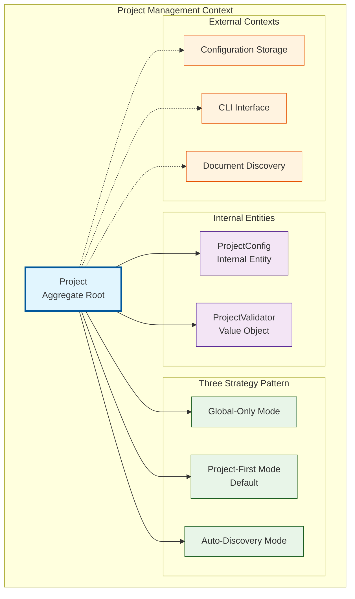

# Domain Constraints: MDT-077

**Context**: Project Management → touches: Configuration Storage, CLI Interface, Document Discovery

## Domain Visualization

## Aggregates

| Concept | Role | Contains | Grounded |
|---------|------|----------|----------|
| `Project` | Root | Config, Registry, Documents | ✅ `Project` class |
| `ProjectConfig` | Internal | — | ✅ `ProjectConfig` interface |
| `ProjectValidator` | Value | — | ✅ `ProjectValidator` class |
| `Three-Strategy Config` | Value | — | (new) |

## Invariants

| Rule | Scope | Enforce |
|------|-------|---------|
| Project code must be 2-5 uppercase letters | `Project` | In aggregate |
| Project identifier must match directory name | `Project` | At boundary |
| Global registry path must exist and be accessible | `Project` | At boundary |
| Local config location defines project root | `ProjectConfig` | In aggregate |

## Language

| CR Term | Code Term | Status |
|---------|-----------|--------|
| Three-Strategy Configuration | (new) | No implementation yet |
| Project | `Project` class | ✅ Aligned |
| Project Manager | `ProjectManager` class | ✅ Aligned |
| Global Registry | Global registry storage | ✅ Aligned |
| Local Config | `ProjectConfig` interface | ✅ Aligned |
| Document Discovery | Document discovery service | ✅ Aligned |

---
*Generated by /mdt:domain-lens — constraints for /mdt:architecture*