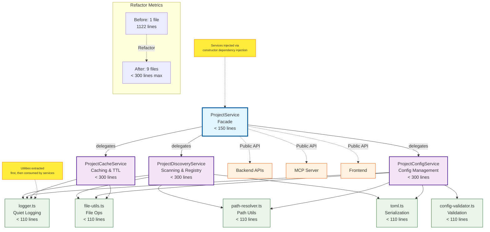

# Extract ProjectService into focused services

## 1. Description

### Problem
- ProjectService.ts file exceeds 1100 lines with multiple responsibilities
- Single class handles project discovery, configuration, validation, caching, and global config
- Difficult to maintain, test, and understand the code
- Changes to one concern risk breaking other unrelated concerns

### Affected Artifacts
- `shared/services/ProjectService.ts` (1122 lines, multiple concerns)
- `shared/models/Project.ts` (imports from ProjectService)
- `shared/tools/ProjectManager.ts` (imports from ProjectService)
- `server/services/ProjectService.ts` (backend wrapper)
- `mcp-server` (uses ProjectService for project operations)

### Scope
- **Changes**: Extract ProjectService into smaller, focused services
- **Unchanged**: Public API contract with consumers

## 2. Decision

### Chosen Approach
Extract ProjectService into three focused services based on single responsibility principle.

### Rationale
- Improves code maintainability by reducing file size to <300 lines each
- Increases testability by isolating concerns
- Reduces coupling between different aspects of project management
- Follows single responsibility principle

## Architecture Design
### Pattern
Service Extraction with Facade Pattern — Extract single responsibility services while maintaining backward compatibility through a facade

### Shared Patterns

| Pattern | Occurrences | Extract To |
|---------|-------------|------------|
| Quiet logging | 30+ occurrences throughout ProjectService | `shared/utils/logger.ts` |
| TOML serialization | Lines 98, 247, 472, 528, 591, 702, 764, 864, 872, 873 | `shared/utils/toml.ts` |
| Config validation | Lines 173-224, 331 | `shared/utils/config-validator.ts` |
| File existence checks | Lines 93, 235, 324, 389, 452, 526, 617, 684, 748, 814, 862, 902, 918, 925 | `shared/utils/file-utils.ts` |
| Path resolution | Lines 322, 515, 680, 1007, 1015, 1028, 1046, 1092 | `shared/utils/path-resolver.ts` |

> These must be extracted BEFORE features that use them.

### Structure
```
shared/services/
  ├── ProjectService.ts           → Facade/coordinator only (≤150 lines)
  └── project/                    → Project-specific services
      ├── ProjectDiscoveryService.ts  → Scanning and registry (≤300 lines)
      ├── ProjectConfigService.ts     → Config loading/validation (≤300 lines)
      └── ProjectCacheService.ts      → Caching operations (≤300 lines)

shared/utils/                      → Shared utilities (extract first)
  ├── logger.ts                   → Quiet logging (≤110 lines)
  ├── toml.ts                     → TOML serialization (≤110 lines)
  ├── config-validator.ts         → Config validation (≤110 lines)
  ├── file-utils.ts               → File operations (≤110 lines)
  └── path-resolver.ts            → Path utilities (≤110 lines)
```

### Size Guidance

**Defaults by role**:
| Role | Default | Hard Max (1.5x) |
|------|---------|-----------------|
| Orchestration (index, main) | 100 | 150 |
| Feature module | 200 | 300 |
| Complex logic (parser, state machine) | 300 | 450 |
| Utility / helper | 75 | 110 |
| Shared base/interface | 100 | 150 |

**Applied to this CR**:
| Module | Role | Limit | Hard Max |
|--------|------|-------|----------|
| `shared/services/ProjectService.ts` (facade) | Orchestration | 100 | 150 |
| `shared/services/project/ProjectDiscoveryService.ts` | Feature | 200 | 300 |
| `shared/services/project/ProjectConfigService.ts` | Feature | 200 | 300 |
| `shared/services/project/ProjectCacheService.ts` | Feature | 200 | 300 |
| `shared/utils/logger.ts` | Utility | 75 | 110 |
| `shared/utils/toml.ts` | Utility | 75 | 110 |
| `shared/utils/config-validator.ts` | Utility | 75 | 110 |
| `shared/utils/file-utils.ts` | Utility | 75 | 110 |
| `shared/utils/path-resolver.ts` | Utility | 75 | 110 |

### Extension Rule
To add a new project-related service: 
1. Create `shared/services/project/{NewService}.ts` (feature module, limit 200 lines)
2. Implement `IProjectService` interface with methods: `initialize()`, `getProject()`, `validateProject()`
3. Add service to ProjectService constructor with dependency injection
4. Add delegation method in ProjectService facade (≤5 lines)

### Architecture Diagram


**Legend:**
- **Blue (Facade)**: Coordinates and delegates to specialized services
- **Purple (Services)**: Each handles single responsibility 
- **Green (Utilities)**: Shared across all services
- **Orange (External)**: Consumers of the ProjectService API

**Key Benefits:**
- Single 1122-line monolith → 9 focused files
- Each service has single responsibility
- Size limits prevent future bloat
- Shared utilities eliminate duplication
- Facade maintains backward compatibility
## 3. Alternatives Considered

| Approach | Key Difference | Why Rejected |
----------|---------------|--------------|
| **Chosen Approach** | Extract into three focused services | **ACCEPTED** - Clear separation of concerns, manageable size |
| Keep single file | No structural change | File too large, multiple responsibilities |
| Extract into two services | Discovery+Config together | Still too large, overlapping concerns |
## 4. Artifact Specifications
### New Artifacts
| Artifact | Type | Purpose |
|----------|------|---------|
| `shared/services/project/ProjectDiscoveryService.ts` | Service | Project scanning and registry operations |
| `shared/services/project/ProjectConfigService.ts` | Service | Configuration loading and validation |
| `shared/services/project/ProjectCacheService.ts` | Service | Caching operations and TTL management |
| `shared/services/project/types.ts` | Interface | Service interfaces and type definitions |
| `shared/utils/logger.ts` | Utility | Quiet logging functionality |
| `shared/utils/toml.ts` | Utility | TOML serialization/deserialization |
| `shared/utils/config-validator.ts` | Utility | Configuration validation logic |
| `shared/utils/file-utils.ts` | Utility | File existence and operations |
| `shared/utils/path-resolver.ts` | Utility | Path resolution utilities |
| `shared/services/project/__tests__/ProjectDiscoveryService.test.ts` | Test | Unit tests for discovery service |
| `shared/services/project/__tests__/ProjectConfigService.test.ts` | Test | Unit tests for config service |
| `shared/services/project/__tests__/ProjectCacheService.test.ts` | Test | Unit tests for cache service |
| `shared/utils/__tests__/logger.test.ts` | Test | Unit tests for logger utility |
| `shared/utils/__tests__/toml.test.ts` | Test | Unit tests for TOML utility |
| `shared/utils/__tests__/config-validator.test.ts` | Test | Unit tests for config validator |
| `shared/utils/__tests__/file-utils.test.ts` | Test | Unit tests for file utils |
| `shared/utils/__tests__/path-resolver.test.ts` | Test | Unit tests for path resolver |
### Modified Artifacts
| Artifact | Change Type | Modification |
|----------|-------------|--------------|
| `shared/services/ProjectService.ts` | Complete rewrite | Becomes facade/coordinator (max 150 lines) |
| `shared/models/Project.ts` | Import changes | Update imports from new services |
| `shared/tools/ProjectManager.ts` | Import changes | Update imports from new services |
| `server/services/ProjectService.ts` | Delete | Remove wrapper, import shared facade directly in routes |
| `server/routes/projects.js` | Import changes | Import from shared/ProjectService instead of local wrapper |
### Integration Points
| From | To | Interface |
|------|----|-----------| 
| ProjectService (facade) | ProjectDiscoveryService | `scanProjects()`, `getProject()`, `isProjectRegistered()`, `registerProject()`, `autoDiscoverProjects()` |
| ProjectService (facade) | ProjectConfigService | `loadConfig()`, `validateConfig()`, `createOrUpdateLocalConfig()`, `updateProject()` |
| ProjectService (facade) | ProjectCacheService | `get()`, `set()`, `clear()`, `isValid()` |
| All services | shared/services/project/types.ts | `IProjectDiscoveryService`, `IProjectConfigService`, `IProjectCacheService` |
| All services | shared/utils/logger | `log()` |
| ConfigService | shared/utils/toml | `parse()`, `stringify()` |
| ConfigService | shared/utils/config-validator | `validateProjectConfig()` |
| All services | shared/utils/file-utils | `exists()`, `readFile()`, `writeFile()` |
| All services | shared/utils/path-resolver | `resolvePath()`, `joinPath()` |
### Key Patterns
- Facade Pattern: ProjectService as unified interface
- Service Layer Pattern: Each service handles specific domain
- Dependency Injection: Services injected into ProjectService
- Utility Extraction: Shared patterns extracted first
## 5. Acceptance Criteria
### Functional
- [ ] ProjectDiscoveryService exports `scanProjects()`, `getProject()`, `isProjectRegistered()`, `registerProject()`, `autoDiscoverProjects()`
- [ ] ProjectConfigService exports `loadConfig()`, `validateConfig()`, `createOrUpdateLocalConfig()`, `updateProject()`
- [ ] ProjectCacheService exports `get()`, `set()`, `clear()`, `isValid()`
- [ ] ProjectService acts as facade, delegates to appropriate services (≤150 lines)
- [ ] All existing tests pass without modification
- [ ] New unit tests for each extracted service
- [ ] All shared utilities extracted before consumer services

### Non-Functional
- [ ] Each service file within size limits:
  - ProjectService (facade): ≤150 lines
  - ProjectDiscoveryService: ≤300 lines
  - ProjectConfigService: ≤300 lines
  - ProjectCacheService: ≤300 lines
  - Utility files: ≤110 lines each
- [ ] No file exceeds Hard Max without justification
- [ ] Test coverage >90% for new services
- [ ] No breaking changes to public API
- [ ] All imports resolved correctly
- [ ] Shared patterns extracted before consumers

### Testing
- Unit: Test ProjectDiscoveryService with mock file system
- Unit: Test ProjectConfigService with valid/invalid configs
- Unit: Test ProjectCacheService with TTL expiry
- Unit: Test each utility function in isolation
- Integration: Test ProjectService facade coordinates all services
- Manual: Verify existing functionality works unchanged
## 6. Verification

### By CR Type
- **Refactoring**: Tests pass, file sizes reduced (ProjectService: 1122→<300, new services: <300 each)
- **Code Quality**: Single responsibility per service, improved testability
- **Maintainability**: Each service focused on single concern

### Metrics
- ProjectService.ts lines: 1122 → <300
- New service files: 3 files × <300 lines each
- Test coverage: Maintain existing coverage, add >90% for new services
- Number of responsibilities per service: 1 (down from 5)

## 7. Deployment
### Simple Changes
- Build shared code with `npm run build:shared`
- Run existing tests to verify no breaking changes
- Update any documentation referencing ProjectService internals

### Complex Changes

| Phase | Artifacts Deployed | Rollback |
-------|-------------------|----------|
| 1 | New service files | Delete new files |
| 2 | Refactored ProjectService | Revert to original version |

### Session 2025-12-04
- Q: Where should the IProjectService interface be defined? → A: shared/services/project/types.ts
- Q: Which test file structure should be used for new services? → A: shared/services/project/__tests__/ (following mcp-server pattern)
- Q: How should server/services/ProjectService.ts wrapper be handled? → A: Delete wrapper, import from shared directly