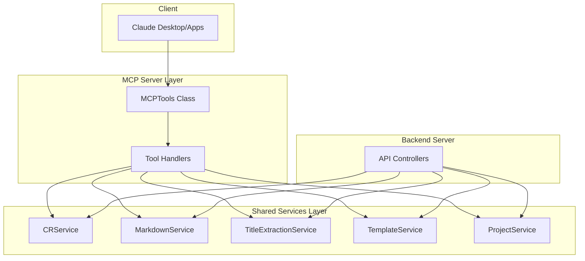

# Architecture: MDT-090

**Source**: [MDT-090](../../../docs/CRs/MDT-090-investigate-and-refactor-mcp-server-business-logic.md)
**Generated**: 2025-12-07
**Complexity Score**: 7 (Complex)

## Overview

This architecture refactors the MCP server from a monolithic 1168-line file with duplicated business logic into a thin proxy layer that delegates to shared services. The design eliminates code duplication, ensures consistent behavior across MCP and backend servers, and establishes clear separation of concerns between protocol translation and business logic.

## Pattern

**Thin Proxy Pattern** — MCP server acts as a protocol translation layer only, delegating all business logic to shared services. This pattern ensures that MCP tools don't implement business rules but instead translate JSON-RPC requests into shared service calls.

The MCP server becomes a pure adapter that:
1. Receives JSON-RPC tool requests
2. Validates input parameters
3. Delegates to appropriate shared service
4. Formats response for JSON-RPC transport

## Component Boundaries



| Component | Responsibility | Owns | Depends On |
|-----------|----------------|------|------------|
| `MCPTools` | Tool registry and request routing | Tool definitions | All shared services via constructor injection |
| `Tool Handlers` | Individual MCP tool implementations | Input validation, response formatting | Shared services for business logic |
| `CRService` | CRUD operations for CRs | CR lifecycle management | MarkdownService, TitleExtractionService |
| `MarkdownService` | YAML frontmatter parsing | Markdown parsing logic | File system |
| `TitleExtractionService` | H1 title extraction | Title cache | File system |

## Shared Patterns

| Pattern | Occurrences | Extract To |
|---------|-------------|------------|
| Service Delegation | All 12 MCP tools | Continue using shared services |
| Input Validation | create_cr, update_cr_attrs | Schema validation utilities |
| Error Formatting | All tools | Standardized error response utility |

> Phase 1 extracts these patterns BEFORE features that use them.

## Structure

```
mcp-server/src/
  ├── tools/
  │   ├── index.ts                 → MCPTools class, tool registry, orchestration only (limit: 300 lines)
  │   ├── handlers/                → Individual tool handlers (NEW)
  │   │   ├── projectHandlers.ts   → Project-related tools (limit: 200 lines)
  │   │   ├── crHandlers.ts        → CR operation tools (limit: 300 lines)
  │   │   └── sectionHandlers.ts   → Section management tools (limit: 200 lines)
  │   └── __tests__/               → Test files remain here
  └── tests/
      └── integration/              → Integration tests (NEW)
          ├── mcp-backend-consistency.test.ts
          └── service-delegation.test.ts
```

## Size Guidance

| Module | Role | Limit | Hard Max |
|--------|------|-------|----------|
| `tools/index.ts` | Orchestration | 300 | 450 |
| `tools/handlers/*.ts` | Feature handler | 200-300 | 450 |
| `tests/integration/*.test.ts` | Test | 200 | 300 |

## Error Scenarios

| Scenario | Detection | Response | Recovery |
|----------|-----------|----------|----------|
| Shared service unavailable | Constructor/service call fails | Return structured error with service name | Fail fast, log error |
| Invalid input parameters | Schema validation fails | Return validation error with details | Client retries with valid input |
| Service delegation inconsistent | Different results between MCP/backend | Integration test failure | Investigate service implementation |
| YAML parsing failure | MarkdownService throws | Return parsing error with context | Fix markdown format or handle edge case |

## Key Refactoring Steps

1. **Extract Handler Functions**
   - Group related tools into handler files
   - Each handler focused on specific domain (projects, CRs, sections)
   - Remove all business logic from handlers

2. **Service Injection**
   - Update MCPTools constructor to accept all services
   - Pass services to handlers during initialization
   - Remove direct service imports from handlers

3. **Remove Duplicated Logic**
   - Delete `parseYamlFrontmatter` method
   - Replace with MarkdownService calls
   - Add TitleExtractionService for title operations

4. **Add Integration Tests**
   - Test MCP vs backend consistency
   - Verify service delegation
   - Validate error handling

## Extension Rule

To add new MCP tools:
1. Create handler in appropriate `handlers/*.ts` file (limit 200-300 lines)
2. Implement only parameter validation and response formatting
3. Delegate all business logic to shared services
4. Add integration test verifying consistent behavior

---
*Generated by /mdt:architecture*
