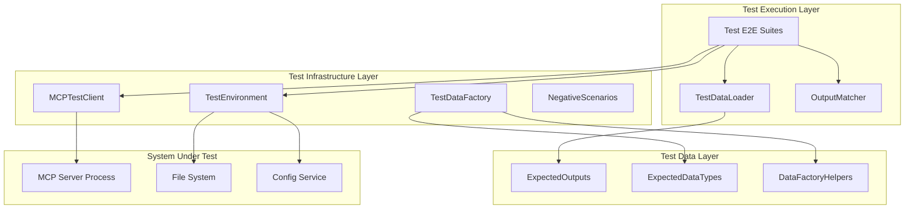
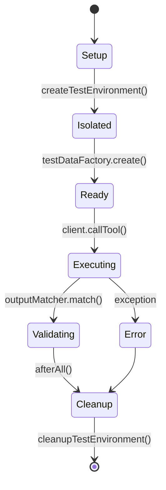

# Architecture: MDT-091

**Source**: [MDT-091](../../../docs/CRs/MDT-091-add-comprehensive-e2e-testing-framework-for-mcp-se.md)
**Generated**: 2025-12-08
**Complexity Score**: 25

## Overview

Comprehensive E2E testing framework that validates MCP server tool execution across both stdio and HTTP transports with complete project isolation. The architecture uses temporary directories with custom CONFIG_DIR for test isolation, external TypeScript test data for maintainability, and realistic project structures to ensure tests catch real-world integration issues.

## Pattern

**Test Environment Factory + External Test Data Pattern** — Factory creates isolated test environments with complete project structures while external TypeScript files maintain expected outputs for easy maintenance and type safety.

The factory pattern ensures each test runs in a clean, isolated environment that mimics real project setups, while external test data separation prevents test logic duplication and makes output changes easy to update across all test cases.

## Component Boundaries



| Component | Responsibility | Owns | Depends On |
|-----------|----------------|------|------------|
| `TestEnvironment` | Temporary directory creation, CONFIG_DIR setup, cleanup | temp dir paths, test isolation | mkdtemp, fs/promises, CONFIG_DIR env |
| `MCPTestClient` | JSON-RPC communication, transport abstraction, response parsing | process handles, message IDs | spawn, stdio/HTTP transports |
| `TestDataFactory` | Creates realistic project structures, CR files, configurations | project templates, sample data | fs/promises, .mdt-config.toml format |
| `ExpectedOutputs` | Type-safe test data repository, expected results | all expected tool outputs | TypeScript types, JSON/string formats |
| `OutputMatcher` | Compares actual vs expected outputs, format-specific validation | match results, difference reports | Deep comparison, pattern matching |
| `TestDataLoader` | Singleton access to test data, type-safe loading | cached test data | ExpectedExports |

## State Flows



| State | Entry Condition | Exit Condition | Invariants |
|-------|-----------------|----------------|------------|
| Setup | Test file loaded | Temporary directory created | No MCP server running |
| Isolated | CONFIG_DIR set | Project structure created | Test directory isolated from user data |
| Ready | MCP server started | First tool call ready | Server process healthy |
| Executing | Tool call initiated | Response received | JSON-RPC protocol followed |
| Validating | Response parsed | Comparison complete | Expected outputs available |
| Cleanup | All assertions done | Temporary dir deleted | No process leaks |

## Shared Patterns

| Pattern | Occurrences | Extract To |
|---------|-------------|------------|
| Test Isolation | All test files | `testEnvironment.ts` |
| External Test Data | All test files | `test-data/` directory |
| JSON-RPC Communication | All MCP tool tests | `mcpClient.ts` |
| Output Comparison | All assertions | `outputMatcher.ts` |
| Error Scenario Testing | Negative test files | `negativeTestScenarios.ts` |

> Phase 1 extracts these BEFORE features that use them.

## Structure

```
mcp-server/tests/e2e/
├── test-data/                     # External test data (not inline)
│   ├── expectedOutputs.ts         # All expected outputs by tool/scenario
│   ├── types.ts                   # TypeScript types for test data
│   └── factory.ts                 # Factory functions for data creation
├── helpers/                       # Shared test utilities (extract first)
│   ├── testEnvironment.ts         # Temp dir + CONFIG_DIR management
│   ├── mcpClient.ts               # JSON-RPC client with transport abstraction
│   ├── testDataLoader.ts          # Singleton test data access
│   ├── outputMatcher.ts           # Output comparison logic
│   ├── testDataFactory.ts         # Realistic project structure creation
│   └── negativeTestScenarios.ts   # Error case definitions
├── list-projects.e2e.test.ts      # Tests for list_projects tool
├── get-project-info.e2e.test.ts   # Tests for get_project_info tool
├── list-crs.e2e.test.ts           # Tests for list_crs tool
├── get-cr.e2e.test.ts             # Tests for get_cr tool
├── create-cr.e2e.test.ts          # Tests for create_cr tool
├── update-cr-status.e2e.test.ts   # Tests for update_cr_status tool
├── update-cr-attrs.e2e.test.ts    # Tests for update_cr_attrs tool
├── manage-cr-sections.e2e.test.ts # Tests for manage_cr_sections tool
├── delete-cr.e2e.test.ts          # Tests for delete_cr tool
├── suggest-cr-improvements.e2e.test.ts # Tests for suggest_cr_improvements tool
├── http-transport.e2e.test.ts     # HTTP transport specific tests
└── error-handling.e2e.test.ts     # Cross-tool error scenarios
```

## Size Guidance

| Module | Role | Limit | Hard Max |
|--------|------|-------|----------|
| `testEnvironment.ts` | Orchestration | 150 | 225 |
| `mcpClient.ts` | Transport abstraction | 200 | 300 |
| `testDataLoader.ts` | Utility | 100 | 150 |
| `outputMatcher.ts` | Validation | 200 | 300 |
| `testDataFactory.ts` | Data creation | 250 | 375 |
| `negativeTestScenarios.ts` | Test definitions | 150 | 225 |
| `expectedOutputs.ts` | Test data | 500 | 750 |
| `types.ts` | Type definitions | 100 | 150 |
| `factory.ts` | Data helpers | 150 | 225 |
| Each `.e2e.test.ts` file | Test suite | 300 | 450 |

## Error Scenarios

| Scenario | Detection | Response | Recovery |
|----------|-----------|----------|----------|
| Server fails to start | Process exit code, stderr logs | Fail test immediately | Cleanup temp dir, abort |
| CONFIG_DIR conflicts | Existing registry detection | Use unique temp path | Create new temp dir |
| JSON-RPC timeout | 30s timer expires | Fail test with timeout | Kill server process |
| File permission errors | fs/promises rejection | Skip cleanup, fail test | Manual cleanup required |
| Output format mismatch | outputMatcher validation | Log differences, fail test | Update expected outputs |

## Requirement Coverage

Based on Section 5 Acceptance Criteria:

| Requirement | Component | Notes |
|-------------|-----------|-------|
| E2E tests cover all 10 MCP tools | Individual .e2e.test.ts files | One file per tool for isolation |
| Test isolation via CONFIG_DIR | testEnvironment.ts | Creates unique temp dir per test file |
| Temporary directories created/cleaned | testEnvironment.ts setup/teardown | mkdtemp + rm -rf in afterAll |
| Realistic .mdt-config.toml and CR files | testDataFactory.ts | Complete project structures |
| Default CONFIG_DIR respected | testEnvironment.ts | Falls back to ~/.config/markdown-ticket/ |
| JSON vs string output handling | outputMatcher.ts | Format-specific validation |

**Coverage**: 6/6 requirements mapped (100%)

## Extension Rule

To add new MCP tool test:
1. Create `{tool-name}.e2e.test.ts` (test suite, limit 300 lines)
2. Add entries to `expectedOutputs.ts` for all scenarios
3. Add tool-specific negative scenarios to `negativeTestScenarios.ts`

To add new transport:
1. Extend `mcpClient.ts` with new transport class (within 200-line limit)
2. Add `{transport}-transport.e2e.test.ts` (test suite, limit 300 lines)
3. Update configuration in `jest.e2e.config.js`

---
*Generated by /mdt:architecture*