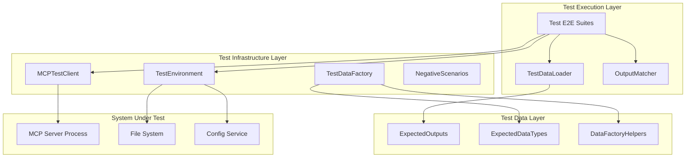
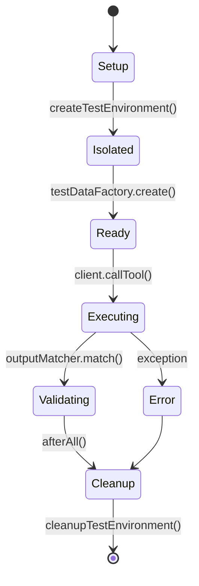
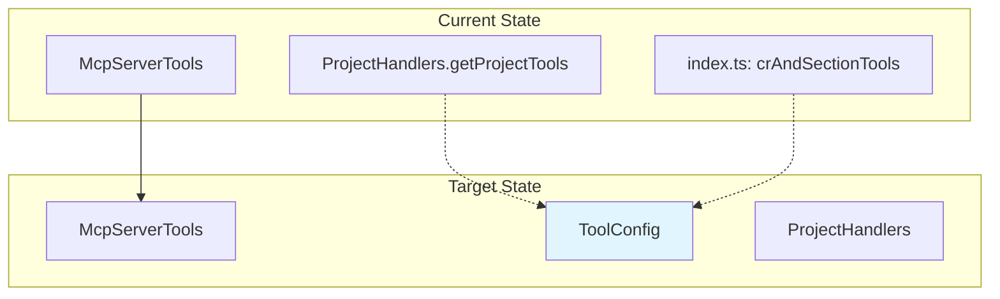

# Architecture: MDT-091

**Source**: [MDT-091](../MDT-091-add-comprehensive-e2e-testing-framework-for-mcp-se.md)
**Generated**: 2025-12-08
**Last Updated**: 2025-12-14
**Complexity Score**: 25
**Phase 1 Status**: 🟡 84% Complete (171 passing, 32 failing)

## Overview

Comprehensive E2E testing framework that validates MCP server tool execution across both stdio and HTTP transports with complete project isolation. The architecture uses temporary directories with custom CONFIG_DIR for test isolation, external TypeScript test data for maintainability, and realistic project structures to ensure tests catch real-world integration issues.

## Current Implementation Status

### Phase 1 Completion: 🟡 84% (171 passing, 32 failing)

**Implemented Components**:
- ✅ All 10 MCP tool E2E tests (15 test suites)
- ✅ Test isolation infrastructure (TestEnvironment)
- ✅ MCP client abstraction (MCPTestClient)
- ✅ Project factory for realistic test data
- ✅ Stdio transport testing

**Missing/Gaps**:
- 🔴 Error handling test file (`error-handling.spec.ts`) for MUST-09 and MUST-10
- 🔴 Rate limiting implementation (5 failing tests - MUST-05)
- 🔴 Output sanitization implementation (11 failing tests - MUST-06)
- 🔴 Protocol error format validation (JSON-RPC error codes)
- 🔴 Tool execution error format (`isError: true` responses)

## Pattern

**Test Environment Factory + External Test Data Pattern** — Factory creates isolated test environments with complete project structures while external TypeScript files maintain expected outputs for easy maintenance and type safety.

The factory pattern ensures each test runs in a clean, isolated environment that mimics real project setups, while external test data separation prevents test logic duplication and makes output changes easy to update across all test cases.

## Component Boundaries



| Component | Responsibility | Owns | Depends On |
|-----------|----------------|------|------------|
| `TestEnvironment` | Temporary directory creation, CONFIG_DIR setup, cleanup | temp dir paths, test isolation | mkdtemp, fs/promises, CONFIG_DIR env |
| `MCPTestClient` | JSON-RPC communication, transport abstraction, response parsing | process handles, message IDs | spawn, stdio/HTTP transports |
| `TestDataFactory` | Creates realistic project structures, CR files, configurations | project templates, sample data | fs/promises, .mdt-config.toml format |
| `ExpectedOutputs` | Type-safe test data repository, expected results | all expected tool outputs | TypeScript types, JSON/string formats |
| `OutputMatcher` | Compares actual vs expected outputs, format-specific validation | match results, difference reports | Deep comparison, pattern matching |
| `TestDataLoader` | Singleton access to test data, type-safe loading | cached test data | ExpectedExports |

## State Flows



| State | Entry Condition | Exit Condition | Invariants |
|-------|-----------------|----------------|------------|
| Setup | Test file loaded | Temporary directory created | No MCP server running |
| Isolated | CONFIG_DIR set | Project structure created | Test directory isolated from user data |
| Ready | MCP server started | First tool call ready | Server process healthy |
| Executing | Tool call initiated | Response received | JSON-RPC protocol followed |
| Validating | Response parsed | Comparison complete | Expected outputs available |
| Cleanup | All assertions done | Temporary dir deleted | No process leaks |

## Shared Patterns

| Pattern | Occurrences | Extract To |
|---------|-------------|------------|
| Test Isolation | All test files | `testEnvironment.ts` |
| External Test Data | All test files | `test-data/` directory |
| JSON-RPC Communication | All MCP tool tests | `mcpClient.ts` |
| Output Comparison | All assertions | `outputMatcher.ts` |
| Error Scenario Testing | Negative test files | `negativeTestScenarios.ts` |

> Phase 1 extracts these BEFORE features that use them.

## Structure

```
mcp-server/tests/e2e/
├── helpers/                       # ✅ Shared test utilities (implemented)
│   ├── test-environment.ts        # Temp dir + CONFIG_DIR management
│   ├── mcp-client.ts              # JSON-RPC client with transport abstraction
│   ├── project-factory.ts         # Realistic project structure creation
│   ├── mcp-transports.ts          # Transport adapters
│   ├── test-environment.spec.ts   # Tests for test environment
│   ├── mcp-client.spec.ts         # Tests for MCP client
│   └── project-factory.spec.ts    # Tests for project factory
├── tools/                         # ✅ Tool-specific E2E tests (implemented)
│   ├── list-projects.spec.ts      # Tests for list_projects tool (6 scenarios)
│   ├── get-project-info.spec.ts   # Tests for get_project_info tool (5 scenarios)
│   ├── list-crs.spec.ts           # Tests for list_crs tool (6 scenarios)
│   ├── get-cr.spec.ts             # Tests for get_cr tool (8 scenarios)
│   ├── create-cr.spec.ts          # Tests for create_cr tool (7 scenarios)
│   ├── update-cr-status.spec.ts   # Tests for update_cr_status tool (5 scenarios)
│   ├── update-cr-attrs.spec.ts    # Tests for update_cr_attrs tool (6 scenarios)
│   ├── manage-cr-sections.spec.ts # Tests for manage_cr_sections tool (9 scenarios)
│   ├── delete-cr.spec.ts          # Tests for delete_cr tool (4 scenarios)
│   ├── suggest-cr-improvements.spec.ts # Tests for suggest_cr_improvements (4 scenarios)
│   ├── rate-limiting.spec.ts      # 🔴 Tests for rate limiting (MUST-05)
│   └── output-sanitization.spec.ts # 🔴 Tests for output sanitization (MUST-06)
├── __tests__/                     # ✅ Unit tests for helpers
│   ├── basic.test.ts              # Basic MCP server tests
│   └── toolConfiguration.test.ts  # Tool configuration behavior preservation
├── jest.e2e.config.mjs            # ✅ Jest configuration for E2E tests
├── rate-limiting.spec.ts          # 🚫 Should be in tools/ (misplaced)
├── output-sanitization.spec.ts    # 🚫 Should be in tools/ (misplaced)
└── error-handling.spec.ts         # ❌ MISSING - needed for MUST-09/10
```

## Size Guidance

| Module | Role | Limit | Hard Max |
|--------|------|-------|----------|
| `testEnvironment.ts` | Orchestration | 150 | 225 |
| `mcpClient.ts` | Transport abstraction | 200 | 300 |
| `testDataLoader.ts` | Utility | 100 | 150 |
| `outputMatcher.ts` | Validation | 200 | 300 |
| `testDataFactory.ts` | Data creation | 250 | 375 |
| `negativeTestScenarios.ts` | Test definitions | 150 | 225 |
| `expectedOutputs.ts` | Test data | 500 | 750 |
| `types.ts` | Type definitions | 100 | 150 |
| `factory.ts` | Data helpers | 150 | 225 |
| Each `.e2e.test.ts` file | Test suite | 300 | 450 |

## Error Scenarios

| Scenario | Detection | Response | Recovery |
|----------|-----------|----------|----------|
| Server fails to start | Process exit code, stderr logs | Fail test immediately | Cleanup temp dir, abort |
| CONFIG_DIR conflicts | Existing registry detection | Use unique temp path | Create new temp dir |
| JSON-RPC timeout | 30s timer expires | Fail test with timeout | Kill server process |
| File permission errors | fs/promises rejection | Skip cleanup, fail test | Manual cleanup required |
| Output format mismatch | outputMatcher validation | Log differences, fail test | Update expected outputs |

## Requirement Coverage

Based on Section 5 Acceptance Criteria:

| Requirement | Component | Notes |
|-------------|-----------|-------|
| E2E tests cover all 10 MCP tools | Individual .e2e.test.ts files | One file per tool for isolation |
| Test isolation via CONFIG_DIR | testEnvironment.ts | Creates unique temp dir per test file |
| Temporary directories created/cleaned | testEnvironment.ts setup/teardown | mkdtemp + rm -rf in afterAll |
| Realistic .mdt-config.toml and CR files | testDataFactory.ts | Complete project structures |
| Default CONFIG_DIR respected | testEnvironment.ts | Falls back to ~/.config/markdown-ticket/ |
| JSON vs string output handling | outputMatcher.ts | Format-specific validation |

**Coverage**: 6/6 requirements mapped (100%)

### MCP Server Tools Specification MUST Requirements Alignment

| MUST # | Description | Test Status | Implementation Status | Test Location |
|--------|-------------|-------------|----------------------|---------------|
| MUST-01 | Tools capability declaration | ✅ TESTED | ✅ IMPLEMENTED | `tools/list-projects.spec.ts` |
| MUST-02 | Unique tool names | ✅ TESTED | ✅ IMPLEMENTED | `tools/list-projects.spec.ts` |
| MUST-03 | Input validation | ✅ TESTED | ✅ IMPLEMENTED | All tool test files |
| MUST-04 | Access controls | ✅ TESTED | ✅ IMPLEMENTED | `tools/get-project-info.spec.ts` |
| MUST-05 | Rate limiting | 🔴 TESTED | ❌ NOT IMPLEMENTED | `tools/rate-limiting.spec.ts` (5 failing) |
| MUST-06 | Output sanitization | 🔴 TESTED | ❌ NOT IMPLEMENTED | `tools/output-sanitization.spec.ts` (11 failing) |
| MUST-07 | Schema compliance | ✅ TESTED | ✅ IMPLEMENTED | All tool test files |
| MUST-08 | Required parameters list | ✅ TESTED | ✅ IMPLEMENTED | All tool test files |
| MUST-09 | Protocol error format | ❌ NO TESTS | ⚠️ PARTIAL | `error-handling.spec.ts` (MISSING) |
| MUST-10 | Tool execution error format | ❌ NO TESTS | ❌ NOT IMPLEMENTED | `error-handling.spec.ts` (MISSING) |

**Summary**: 6/10 MUST requirements fully compliant, 4/10 have gaps

### Phase 1 Blockers

1. **Missing Error Handling Tests**: Need to create `tools/error-handling.spec.ts` for:
   - MUST-09: JSON-RPC error codes (-32601, -32602, -32000 to -32099)
   - MUST-10: Tool execution errors with `isError: true`

2. **Unimplemented Features**:
   - Rate limiting in MCP server (causes 5 test failures)
   - Output sanitization (causes 11 test failures) - **BETA FEATURE**: Disabled by default via `MCP_SANITIZATION_ENABLED=false`

## Extension Rule

To add new MCP tool test:
1. Create `tools/{tool-name}.spec.ts` (test suite, limit 300-450 lines)
2. Follow BDD format: Given/When/Then scenarios
3. Include at least 3 scenarios: happy path, error case, edge case
4. Ensure test validates both positive and negative conditions

To add new transport:
1. Extend `helpers/mcpClient.ts` with new transport class (within 200-line limit)
2. Add `tools/{transport}-transport.spec.ts` (test suite, limit 300-450 lines)
3. Update configuration in `jest.e2e.config.mjs`

To complete Phase 1:
1. Create `tools/error-handling.spec.ts` for MUST-09 and MUST-10 (limit 300 lines)
2. Implement rate limiting in MCP server core
3. Implement output sanitization in MCP server core
4. Fix misplaced test files (move rate-limiting.spec.ts and output-sanitization.spec.ts to tools/)

---

## Tool Configuration Extraction Architecture (Added 2025-12-13)

### Overview

Extract all MCP tool configurations into a single configuration file to centralize tool definitions. This consolidates:
- 2 project tools from `ProjectHandlers.getProjectTools()` (~25 lines)
- 8 ticket/CR tools from inline `crAndSectionTools` array (~280 lines)

### Pattern

**Configuration Registry** — Centralize all tool definitions in a single typed configuration file.

### Component Boundaries



### Target Structure

```
mcp-server/src/tools/
├── config/
│   └── allTools.ts            → All 10 tool definitions (≤300 lines)
├── handlers/
│   ├── projectHandlers.ts    → Project tool logic only (25 lines removed)
│   ├── crHandlers.ts          → Ticket/CR tool logic
│   └── sectionHandlers.ts     → Section management logic
└── index.ts                  → Import ALL_TOOLS (3 lines changed)
```

### Size Guidance

| Module | Role | Limit | Hard Max |
|--------|------|-------|----------|
| `allTools.ts` | Configuration | 300 | 450 |
| `index.ts` | Orchestration | 100 | 150 |

### Extension Rule

To add new MCP tool:
1. Add tool definition to `config/allTools.ts` (≤300 lines total)
2. Add tool name to appropriate routing group
3. Implement handler method in respective handler class

---
*Generated by /mdt:architecture*