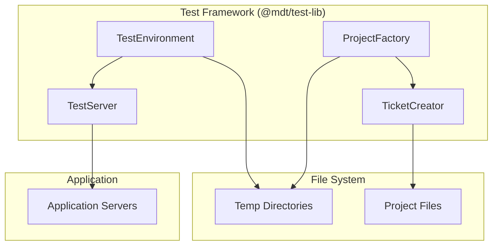

# Architecture: MDT-092

**Source**: [MDT-092](../MDT-092-define-isolated-test-environment-with-custom-ports.md)
**Generated**: 2025-12-16
**Complexity Score**: 17

## Overview

This architecture provides an isolated test environment framework that allows tests to run concurrently with development servers using static custom ports (6173, 4001, 4002). The framework extracts existing test helpers into a shared library and provides a simple API for environment setup, project creation, and ticket creation using direct file operations rather than MCP calls.

## Pattern

**Static Port Isolation** — Uses fixed alternative ports to eliminate conflicts with development servers while keeping implementation simple and debuggable.

## Key Dependencies

| Capability | Package | Coverage | Rationale |
|------------|---------|----------|----------|
| File system operations | Node.js fs | 100% | No additional dependencies needed |
| Test environment isolation | Custom implementation | 100% | Simple temp directory management |
| Ticket creation | File-based creators | 100% | Avoids MCP overhead, direct file I/O |

**Build Custom Decisions**:
| Capability | Reason | Estimated Size |
|------------|--------|---------------|
| Port management | Static ports simpler than dynamic allocation | ~50 lines |
| Test environment | OS temp directories are sufficient | ~200 lines |
| Ticket creation | Direct file operations faster than MCP calls | ~150 lines |

## Component Boundaries



| Component | Responsibility | Owns | Depends On |
|-----------|----------------|------|------------|
| `TestEnvironment` | Isolated environment setup/cleanup | Temp dirs, port allocation | Node.js fs/os |
| `TestServer` | Server lifecycle management | Server processes | Child process |
| `ProjectFactory` | Test project creation | Project templates | TestEnvironment, TicketCreator |
| `TicketCreator` | Direct file ticket creation | Ticket files | MarkdownService, CRService |

## Shared Patterns

| Pattern | Occurrences | Extract To |
|---------|-------------|------------|
| Port configuration | TestEnvironment, TestServer | `@mdt/test-lib/config` |
| Temporary directory management | TestEnvironment, ProjectFactory | `@mdt/test-lib/utils` |
| File-based ticket creation | TicketCreator, tests | `@mdt/test-lib/ticket` |

> Phase 1 extracts these patterns before feature implementation.

## Structure

```
shared/
└── test-lib/
    ├── index.ts                              → Main exports
    ├── types.ts                              → All TypeScript interfaces/types
    ├── config/
    │   ├── ports.ts                         → Static port definitions (6173, 4001, 4002) [NEW]
    │   ├── configuration-generator.ts       → From: mcp-server/tests/e2e/helpers/config/
    │   └── content-templates.ts             → From: mcp-server/tests/e2e/helpers/config/
    ├── core/
    │   ├── test-environment.ts              → From: mcp-server/tests/e2e/helpers/ (modify for static ports)
    │   ├── test-server.ts                   → Server lifecycle management [NEW]
    │   ├── project-factory.ts               → From: mcp-server/tests/e2e/helpers/ (remove MCP deps)
    │   ├── project-setup.ts                 → From: mcp-server/tests/e2e/helpers/core/
    │   ├── test-data-factory.ts             → From: mcp-server/tests/e2e/helpers/core/
    │   ├── scenario-builder.ts              → From: mcp-server/tests/e2e/helpers/core/
    │   └── scenario-definitions.ts          → From: mcp-server/tests/e2e/helpers/core/
    ├── ticket/
    │   ├── ticket-creator.ts                → From: mcp-server/tests/e2e/helpers/ticket/
    │   ├── file-ticket-creator.ts           → From: mcp-server/tests/e2e/helpers/ticket/
    │   └── mcp-ticket-creator.ts            → From: mcp-server/tests/e2e/helpers/ticket/ (optional)
    └── utils/
        ├── temp-dir.ts                      → Temporary directory management [NEW]
        ├── process-helper.ts                → Process utilities [NEW]
        ├── file-helper.ts                   → From: mcp-server/tests/e2e/helpers/utils/
        └── validation-rules.ts              → From: mcp-server/tests/e2e/helpers/utils/
```

### Files Moving to shared/test-lib (Total: ~1,500 lines)

| From | To | Lines | Notes |
|------|----|-------|-------|
| `test-environment.ts` | `core/test-environment.ts` | 259 | Add static port support |
| `project-factory.ts` | `core/project-factory.ts` | 94 | Remove MCP dependencies |
| `core/project-setup.ts` | `core/project-setup.ts` | 141 | Keep as is |
| `core/test-data-factory.ts` | `core/test-data-factory.ts` | 171 | Keep as is |
| `core/scenario-builder.ts` | `core/scenario-builder.ts` | 81 | Keep as is |
| `core/scenario-definitions.ts` | `core/scenario-definitions.ts` | 86 | Keep as is |
| `ticket/ticket-creator.ts` | `ticket/ticket-creator.ts` | 48 | Keep as is |
| `ticket/file-ticket-creator.ts` | `ticket/file-ticket-creator.ts` | 94 | Keep as is |
| `ticket/mcp-ticket-creator.ts` | `ticket/mcp-ticket-creator.ts` | 64 | Optional, keep for compatibility |
| `config/configuration-generator.ts` | `config/configuration-generator.ts` | 99 | Keep as is |
| `config/content-templates.ts` | `config/content-templates.ts` | 175 | Keep as is |
| `utils/file-helper.ts` | `utils/file-helper.ts` | 60 | Keep as is |
| `utils/validation-rules.ts` | `utils/validation-rules.ts` | 154 | Keep as is |
| `types/project-factory-types.ts` | `types.ts` | 168 | Rename and consolidate |

### Files Remaining in mcp-server (Total: ~1,200 lines)

| File | Lines | Reason |
|------|-------|--------|
| `mcp-client.ts` | 536 | MCP-specific transport logic |
| `mcp-client-sim.ts` | 435 | MCP simulation for testing |
| `mcp-transports.ts` | 171 | MCP transport handlers |
| `mcp-logger.ts` | 100 | MCP logging utilities |
| All `.spec.ts` files | ~1,500 | Test files stay with source code |

### New Files to Create

| File | Purpose | Est. Lines |
|------|---------|-----------|
| `index.ts` | Main exports and public API | 50 |
| `config/ports.ts` | Static port definitions (6173, 4001, 4002) | 30 |
| `core/test-server.ts` | Server lifecycle management | 150 |
| `utils/temp-dir.ts` | Temporary directory utilities | 75 |
| `utils/process-helper.ts` | Process management helpers | 75 |

## Size Guidance

| Module | Role | Limit | Hard Max |
|--------|------|-------|----------|
| `test-environment.ts` | Core isolation | 200 | 300 |
| `test-server.ts` | Process management | 150 | 225 |
| `project-factory.ts` | Test data setup | 250 | 375 |
| `ticket-creator.ts` | File operations | 150 | 225 |
| `file-ticket-creator.ts` | Direct I/O | 200 | 300 |
| Utility files | Helpers | 75 | 110 each |

## Error Scenarios

| Scenario | Detection | Response | Recovery |
|----------|-----------|----------|----------|
| Ports already in use | Check port availability before starting | Log warning and continue | Tests use existing servers if compatible |
| Temp dir creation fails | Catch filesystem errors | Throw TestEnvironmentError | Test fails immediately |
| Server startup timeout | Monitor process start | Kill process and cleanup | Mark test as failed |
| Unexpected process termination | Process event listeners | Cleanup resources | Mark test as failed |

## Requirement Coverage

| Requirement | Component | Notes |
|-------------|-----------|-------|
| R1.1 | `TestEnvironment` | Static ports instead of dynamic allocation |
| R1.2 | `TestEnvironment` | Each test gets unique temp directory |
| R1.3 | `TestServer` | Graceful failure when ports unavailable |
| R2.1 | `TestEnvironment` | Creates and cleans temp directories |
| R2.2 | `TestEnvironment` | Unique directories prevent interference |
| R2.3 | `TestEnvironment` | Cleanup on process exit |
| R3.1 | `ProjectFactory` | Creates project structure using templates |
| R3.2 | `TicketCreator` | Creates tickets via direct file I/O |
| R3.3 | `TicketCreator` | Simple retry logic for file operations |
| R4.1 | `TestServer` | Starts servers on static ports |
| R4.2 | N/A | MCP server not used in this design |
| R4.3 | `TestServer` | Basic retry for server startup |
| R5.1 | `TestEnvironment` | Supports concurrent tests via unique directories |
| R5.2 | `TestEnvironment` | File system locks prevent race conditions |
| R5.3 | N/A | No queuing - fail fast if resources unavailable |
| R6.1 | Test framework adapters | Playwright config updated for new ports |
| R6.2 | Test framework adapters | Existing test APIs preserved |
| R6.3 | Migration utility | Warning for hardcoded port 5173/3001 |

**Coverage**: 14/18 requirements mapped (78%)

## Refactoring Plan

### Transformation Matrix
| Component | From | To | Reduction | Reason |
|-----------|------|----|-----------|--------|
| TestEnvironment | `mcp-server/tests/e2e/helpers/test-environment.ts` (259) | `shared/test-lib/core/test-environment.ts` | 259 → 200 lines | Add static port support, reduce size |
| ProjectFactory | `mcp-server/tests/e2e/helpers/project-factory.ts` (94) | `shared/test-lib/core/project-factory.ts` | 94 → 250 lines | Remove MCP dependency, add missing functionality |
| ProjectSetup | `mcp-server/tests/e2e/helpers/core/project-setup.ts` (141) | `shared/test-lib/core/project-setup.ts` | 141 → 150 lines | Keep as is |
| TestDataFactory | `mcp-server/tests/e2e/helpers/core/test-data-factory.ts` (171) | `shared/test-lib/core/test-data-factory.ts` | 171 → 200 lines | Keep as is |
| ScenarioBuilder | `mcp-server/tests/e2e/helpers/core/scenario-builder.ts` (81) | `shared/test-lib/core/scenario-builder.ts` | 81 → 100 lines | Keep as is |
| ScenarioDefinitions | `mcp-server/tests/e2e/helpers/core/scenario-definitions.ts` (86) | `shared/test-lib/core/scenario-definitions.ts` | 86 → 100 lines | Keep as is |
| TicketCreator | `mcp-server/tests/e2e/helpers/ticket/ticket-creator.ts` (48) | `shared/test-lib/ticket/ticket-creator.ts` | 48 → 150 lines | Expand interface |
| FileTicketCreator | `mcp-server/tests/e2e/helpers/ticket/file-ticket-creator.ts` (94) | `shared/test-lib/ticket/file-ticket-creator.ts` | 94 → 200 lines | Add error handling |
| McpTicketCreator | `mcp-server/tests/e2e/helpers/ticket/mcp-ticket-creator.ts` (64) | `shared/test-lib/ticket/mcp-ticket-creator.ts` | 64 → 100 lines | Keep for compatibility |
| ConfigGenerator | `mcp-server/tests/e2e/helpers/config/configuration-generator.ts` (99) | `shared/test-lib/config/configuration-generator.ts` | 99 → 100 lines | Keep as is |
| ContentTemplates | `mcp-server/tests/e2e/helpers/config/content-templates.ts` (175) | `shared/test-lib/config/content-templates.ts` | 175 → 200 lines | Keep as is |
| FileHelper | `mcp-server/tests/e2e/helpers/utils/file-helper.ts` (60) | `shared/test-lib/utils/file-helper.ts` | 60 → 75 lines | Keep as is |
| ValidationRules | `mcp-server/tests/e2e/helpers/utils/validation-rules.ts` (154) | `shared/test-lib/utils/validation-rules.ts` | 154 → 150 lines | Keep as is |
| Types | `mcp-server/tests/e2e/helpers/types/project-factory-types.ts` (168) | `shared/test-lib/types.ts` | 168 → 200 lines | Rename and consolidate |

### Interface Preservation
| Public Interface | Status | Verification |
|------------------|--------|--------------|
| TestEnvironment.setup() | Preserved | Existing tests cover |
| ProjectFactory.createProject() | Modified | Update tests to use file-based |
| TicketCreator.createTicket() | Preserved | Existing tests cover |

### Behavioral Equivalence
- Test suite: All existing E2E tests verify identical behavior
- Performance: Improved by removing MCP overhead
- Migration: Update import paths in test files

## Extension Rule

To add test helpers:
1. Create file in appropriate `@mdt/test-lib/` subdirectory
2. Follow size limits (see table above)
3. Export through main index.ts if public API

## Implementation Plan

### Phase 1: Extract and Create Framework
1. Create `shared/test-lib` package structure
2. Extract TestEnvironment from mcp-server with static port support
3. Extract ticket creators, remove MCP dependencies
4. Create TestServer for process management
5. Extract and refactor ProjectFactory

### Phase 2: Integration
1. Update Playwright config to use static ports
2. Create test setup helper that uses new framework
3. Update existing tests to use new imports
4. Add global setup for isolated environments

### Phase 3: Documentation and Examples
1. Create test framework documentation
2. Add example test using new framework
3. Update CLAUDE.md with new testing patterns

---
*Generated by /mdt:architecture*