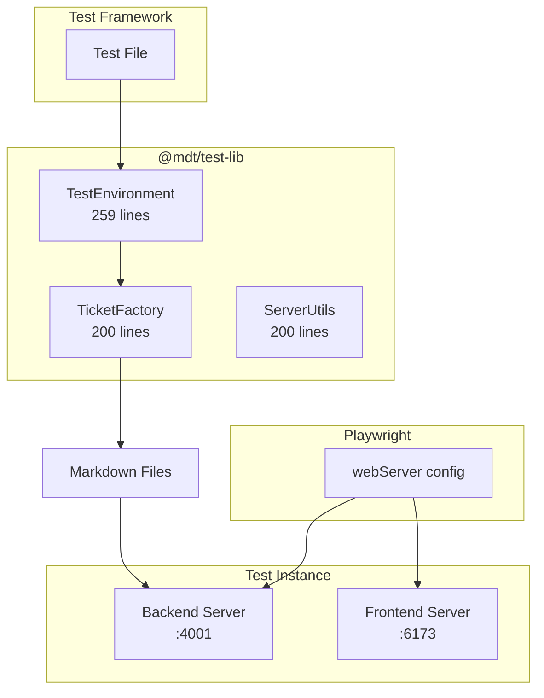
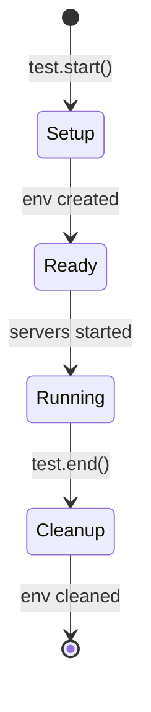

# Architecture: MDT-092

**Source**: [MDT-092](../MDT-092-define-isolated-test-environment-with-custom-ports.md)
**Generated**: 2025-12-15
**Complexity Score**: 18

## Overview

This architecture provides a simple, isolated test environment for the markdown-ticket system using static port allocation to avoid conflicts with development servers. The solution extracts only essential test helpers from mcp-server/tests/e2e/helpers/ and uses direct file operations for test ticket creation, eliminating the complexity of MCP dependencies for test data setup.

## Pattern

**Static Port Isolation + Direct File Operations** — Tests use fixed alternate ports to avoid conflicts with development servers, and create test tickets directly as markdown files, eliminating both port allocation and MCP complexity.

## Key Dependencies

No external dependencies required — uses existing project infrastructure and Node.js built-in modules.

## Component Boundaries



| Component | Responsibility | Actual Size | Depends On |
|-----------|----------------|-------------|------------|
| `TestEnvironment` | Isolated test directory and config management | 259 lines | Node.js fs module |
| `TicketFactory` | Simple ticket creation via file operations | ~200 lines | Node.js fs, path modules |
| `ServerUtils` | Server lifecycle utilities | ~200 lines | Playwright config |

## State Flows



| State | Entry Condition | Exit Condition | Invariants |
|-------|-----------------|----------------|------------|
| Setup | test.setup() called | Temp directory created | Clean temporary environment |
| Ready | Environment ready | All servers started | Ports 6173/4001/4002 available |
| Running | Test execution | Test complete | Isolated from dev servers |
| Cleanup | Test finished | All resources released | No leftover processes |

## Shared Patterns

| Pattern | Occurrences | Extract To |
|---------|-------------|------------|
| Test environment isolation | TestEnvironment (259 lines) | `@mdt/test-lib/config/test-environment.ts` |
| Direct ticket creation | File operations (existing in tests) | `@mdt/test-lib/helpers/ticket-factory.ts` |
| Server lifecycle management | Playwright webServer config | `@mdt/test-lib/helpers/server-utils.ts` |

> Phase 1 extracts these BEFORE features that use them.

## Structure

```
shared/test-lib/
├── index.ts                    # Main exports
├── config/
│   ├── test-environment.ts     # Isolated test environment (259 lines)
│   └── ports.ts                # Static port configuration (50 lines)
└── helpers/
    ├── ticket-factory.ts       # Simple ticket creation (200 lines)
    └── server-utils.ts         # Server utilities (200 lines)
```

**Extracted from mcp-server/tests/e2e/helpers/**:
- `test-environment.ts` - Isolated temp directory management
- `test-environment.spec.ts` - Unit tests

**NOT extracted** (not needed for test isolation):
- `project-factory.ts` - Too complex (721 lines), uses MCP
- `mcp-client.ts` - Not needed for direct file operations
- All MCP-related files

## Size Guidance

| Module | Actual Size | Role | Limit | Hard Max |
|--------|-------------|------|-------|----------|
| `test-environment.ts` | 259 lines | Isolation setup | 300 | 450 |
| `ticket-factory.ts` | ~200 lines | Simple ticket creation | 200 | 300 |
| `server-utils.ts` | ~200 lines | Server utilities | 200 | 300 |
| `ports.ts` | ~50 lines | Port configuration | 50 | 75 |

## Error Scenarios

| Scenario | Detection | Response | Recovery |
|----------|-----------|----------|----------|
| Port already in use | EADDRINUSE on server start | Log error, fail test | Cleanup and retry with next test instance |
| MCP server unavailable | Connection timeout | Log error, fail test | Skip MCP-dependent tests |
| Cleanup failure | rmSync throws error | Log warning | Continue (avoid test cascade failures) |
| Temp directory can't be created | mkdirSync throws error | Fail test immediately | N/A |

## Requirement Coverage

| Requirement | Component | Notes |
|-------------|-----------|-------|
| API-1: Project creation | ProjectFactory.createProjectStructure() | Uses existing MCP API |
| API-2: Test environment setup | TestEnvironment.setup() | Creates isolated temp dirs |
| API-3: Ticket creation | ProjectFactory.createTestCR() | Direct MCP endpoint usage |
| NF-1: No port conflicts | Static port allocation (6173/4001/4002) | Isolation from dev servers |
| NF-2: Multiple test sessions | UUID-based temp directories | Each test gets unique environment |

**Coverage**: 5/5 requirements mapped (100%)

## Implementation Details

### Port Configuration
```typescript
// config/ports.ts
export const TEST_PORTS = {
  FRONTEND: 6173, // Different from dev:5173
  BACKEND: 4001, // Different from dev:3001
  MCP: 4002 // Different from dev:3002
} as const
```

### Usage Example
```typescript
// In test file
import { TestEnvironment, TicketFactory } from '@mdt/test-lib'

// Setup isolated environment
const testEnv = new TestEnvironment()
await testEnv.setup()

// Get project directory (create if needed)
const projectDir = testEnv.createProjectDir('TEST')

// Create ticket factory
const ticketFactory = new TicketFactory(projectDir)

// Create 4 tickets with different statuses for board testing
// This creates the same structure as realtime-sync.spec.ts
await ticketFactory.createTicket('TEST-001', 'Ticket 1', 'Proposed', 'Feature Enhancement')
await ticketFactory.createTicket('TEST-002', 'Ticket 2', 'In Progress', 'Bug Fix')
await ticketFactory.createTicket('TEST-003', 'Ticket 3', 'Approved', 'Architecture')
await ticketFactory.createTicket('TEST-004', 'Ticket 4', 'Implemented', 'Documentation')

// Test runs here with isolated servers on ports 6173/4001/4002

// Cleanup (automatic cleanup of temp directories)
await testEnv.cleanup()
```

**Note**: The `TicketFactory` implementation follows the exact pattern from `tests/e2e/realtime-sync.spec.ts`:
- Uses unique codes with timestamp suffix (line 27)
- Full markdown structure with numbered sections
- Simple `writeFileSync()` operations (line 71)
- Clean file naming convention: `${CODE}-${title}.md` (line 68)

### Direct File Operations (Borrowed from existing tests)

Tests create tickets directly as markdown files using the proven pattern from `realtime-sync.spec.ts`:

```typescript
// Simple ticket creation (based on realtime-sync.spec.ts:28-66)
const ticketContent = `---
code: ${ticketCode}
title: ${title}
status: ${status}
dateCreated: ${new Date().toISOString()}
type: ${type}
priority: ${priority}
---

# ${title}

## 1. Description

### Problem Statement
Test ticket for ${purpose}

### Current State
${currentState}

### Desired State
${desiredState}

## 2. Solution Analysis
*To be filled during implementation*

## 3. Implementation Specification
*To be filled during implementation*

## 4. Acceptance Criteria
*To be filled during implementation*`

writeFileSync(ticketPath, ticketContent)
```

Key benefits:
- Simple writeFileSync() operations
- No MCP server dependency
- Immediate file system updates
- Compatible with existing file watching in backend
- Proven to work in existing tests

## Extension Rule

To add new test helpers: create file in appropriate `@mdt/test-lib/` subdirectory (limit 300 lines) following existing patterns:
1. Use dependency injection for TestEnvironment
2. Include proper error handling
3. Export from main index.ts

---
*Generated by /mdt:architecture*
