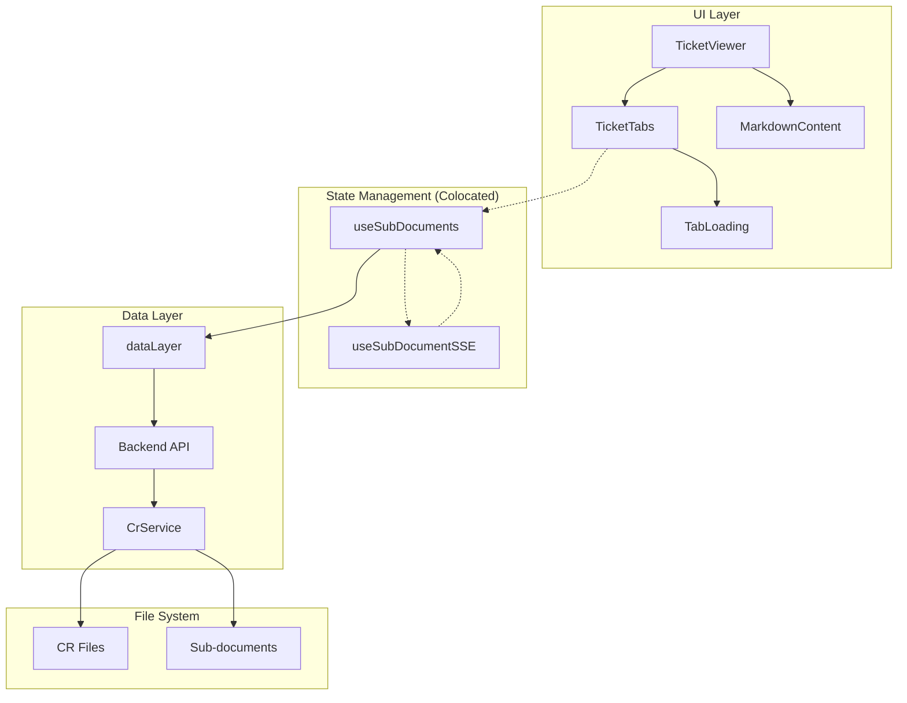

# Architecture: MDT-093

**Source**: [MDT-093](../../../docs/CRs/MDT-093-add-sub-document-support-with-sticky-tabs-in-ticke.md)
**Generated**: 2025-12-11
**Complexity Score**: 21

## Overview

This architecture adds sub-document navigation to tickets using a tabbed interface with sticky positioning. The design follows a component composition pattern with clear separation between data fetching, state management, and UI rendering. It integrates seamlessly with existing SSE patterns and maintains consistency with current file handling conventions.

**React Component Guidelines Applied:**
- **Colocation**: `useSubDocuments` and `useSubDocumentSSE` hooks are colocated in `TicketViewer/` folder as they're only used by this feature
- **Folder Promotion**: `TicketViewer` becomes a folder when it gains the `TicketTabs` sub-component
- **File-to-Folder Rule**: Move `TicketViewer.tsx` to `TicketViewer/index.tsx` (never have both)
- **Flat Structure**: Keep folder structure flat (max 2 levels deep)
- **Import Consistency**: Using `index.tsx` ensures `import { TicketViewer } from '@/components/TicketViewer'` continues to work

**SSE Architecture Decision**:
- **Problem**: Adding events to global `useSSEEvents` creates a 500+ line god file that's impossible to maintain
- **Solution**: Domain-specific SSE hooks (`useSubDocumentSSE`) that stay under 50 lines and are colocated with features that use them
- **Benefit**: Each feature owns its SSE logic, enabling isolated testing and preventing monolithic SSE handlers

## Pattern

**Component Composition with Render Props** — Each component has a single responsibility: data fetching (useSubDocuments), navigation (TicketTabs), and content rendering (MarkdownContent). This pattern ensures testability and reusability while maintaining clear data flow from hooks to components.

## Component Boundaries



| Component | Responsibility | Owns | Depends On |
|-----------|----------------|------|------------|
| `TicketViewer` | Orchestrates ticket display with tabs | Modal state, content rendering | `TicketTabs`, existing `MarkdownContent` |
| `TicketTabs` | Renders tab navigation, manages sticky positioning | UI state, active tab | Colocated `useSubDocuments` hook |
| `useSubDocuments` | Fetches/subscribes to sub-documents, syncs URL | Sub-document list, loading/error states | `dataLayer`, `useSubDocumentSSE` |
| `useSubDocumentSSE` | Handles sub-document specific SSE events | Event subscription, state updates | Backend SSE endpoint only |
| `TabLoading` | Loading indicator for tab content | Animation state | None (UI only) |
| `dataLayer` | HTTP client for ticket and sub-document CRUD | Fetch cache, error handling | Backend API endpoints |
| `CrService` | Backend discovery and sorting of sub-documents | File system scanning, config parsing | File system, `.mdt-config.toml` |

## Shared Patterns

| Pattern | Occurrences | Extract To |
|---------|-------------|------------|
| API error handling with try/catch | dataLayer, useSubDocuments | `dataLayer` (add error wrapper) |
| Markdown content parsing | TicketViewer, MarkdownContent | Existing `markdownParser.ts` |

> Phase 1 extracts these BEFORE features that use them.

**SSE Pattern Note**: Domain-specific SSE hooks (like `useSubDocumentSSE`) should NOT be extracted globally. They stay with their feature to prevent god files.

## Structure

```
src/
├── components/
│   └── TicketViewer/
│       ├── index.tsx           → MOVED from TicketViewer.tsx, modified
│       ├── TicketTabs.tsx      → NEW: tab navigation UI
│       ├── useSubDocuments.ts  → NEW: tab-specific hook (colocated)
│       ├── useSubDocumentSSE.ts→ NEW: domain-specific SSE hook (colocated)
│       └── TabLoading.tsx      → NEW: loading indicator (sub-component)
├── hooks/
│   └── useSSEEvents.ts         → UNCHANGED: keep for global events only
├── services/
│   └── dataLayer.ts             → EXTENDED: add fetchSubDocument
└── types/
    └── SubDocument.ts          → NEW: sub-document types (shared)

server/
├── controllers/
│   └── crController.js         → EXTENDED: add sub-doc route
├── services/
│   └── CrService.js            → EXTENDED: add sub-doc discovery
└── routes/
    └── crRoutes.js             → EXTENDED: add sub-doc endpoint

shared/
├── models/
│   ├── Types.ts                → EXTENDED: add subdocuments to Ticket
│   └── SubDocument.ts          → NEW: shared sub-document types
└── services/
    └── MarkdownService.ts      → EXTENDED: add sub-doc parsing
```

## Size Guidance

| Module | Role | Limit | Hard Max |
|--------|------|-------|----------|
| `TicketTabs.tsx` | Feature | 200 | 300 |
| `useSubDocuments.ts` | Hook (colocated) | 150 | 225 |
| `useSubDocumentSSE.ts` | Domain SSE Hook | 50 | 75 |
| `TabLoading.tsx` | UI Component | 50 | 75 |
| `TicketViewer/index.tsx` modifications | Feature | 100 | 150 |
| `SubDocument.ts` | Types | 50 | 75 |
| `CrService.js` additions | Service | 100 | 150 |
| `dataLayer.ts` additions | Service | 50 | 75 |

## Error Scenarios

| Scenario | Detection | Response | Recovery |
|----------|-----------|----------|----------|
| Sub-document not found | HTTP 404 from API | Show error in content area | Offer refresh or navigate to available tabs |
| Sub-document load failed | Network error/timeout | Show error message with retry button | Retry fetch up to 3 times, then show persistent error |
| Invalid URL hash | Hash doesn't match any sub-document | Default to "main" tab | Update URL to remove invalid hash |
| SSE updates remove active tab | SSE event with updated subdocuments array | Switch to "main" tab | Update active tab state, clear URL hash |
| Configuration parsing failed | Error reading `.mdt-config.toml` | Fall back to default order | Log warning, continue with default ordering |

## Requirement Coverage

| Requirement | Component | Notes |
|-------------|-----------|-------|
| R1.1-R1.4 | TicketTabs + CrService | Tab discovery, labeling, conditional display |
| R2.1-R2.3 | TicketTabs | Sticky positioning with CSS |
| R3.1-R3.3 | TicketTabs + useSubDocuments | Tab interaction, loading states |
| R4.1-R4.4 | useSubDocuments | URL hash sync, fallback behavior |
| R5.1-R5.5 | useSubDocuments + SSE | Real-time updates, error handling |

**Coverage**: 17/17 requirements mapped (100%)

## Extension Rule

To add new sub-document parsing patterns:
1. Extend `MarkdownService.ts` with new parser (limit 100 lines)
2. Update `CrService.js` discovery logic (limit 50 lines addition)
3. Add new tab type to `TicketTabs.tsx` rendering (limit 25 lines addition)
