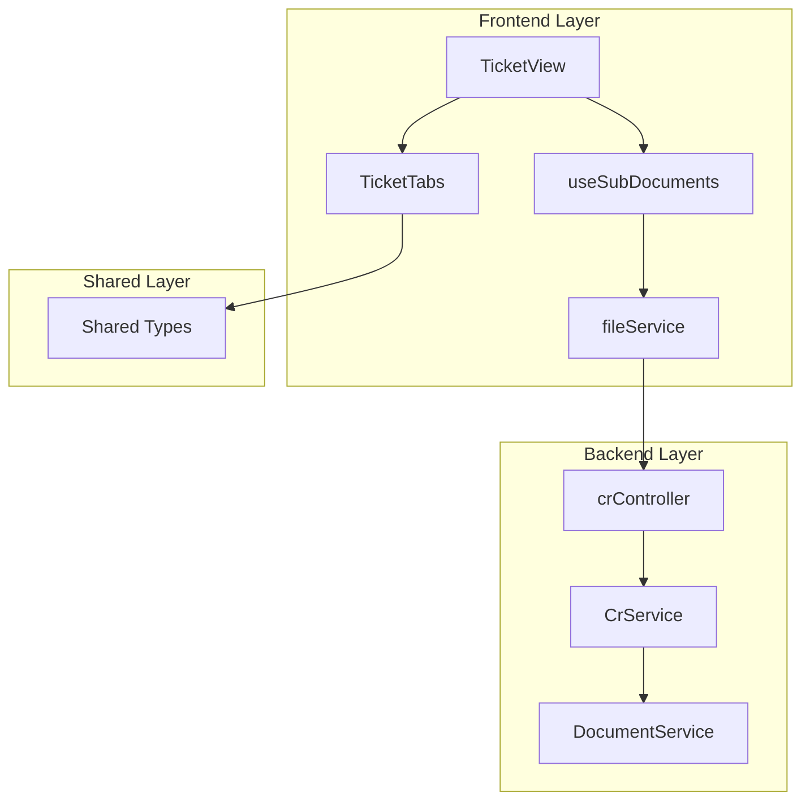
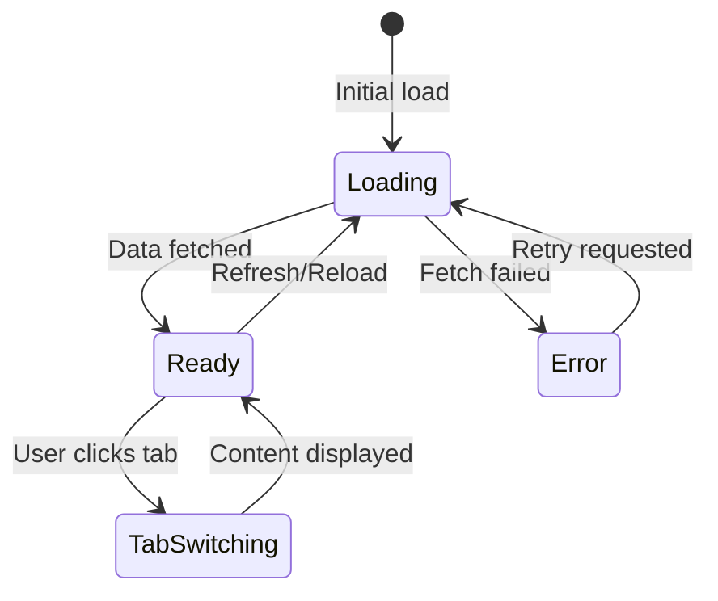

# Architecture: MDT-093

**Source**: [MDT-093](../../../docs/CRs/MDT-093-add-sub-document-support-with-sticky-tabs-in-ticke.md)
**Generated**: 2025-01-11
**Complexity Score**: 16

## Overview

This architecture adds sub-document support with sticky tabs to the existing ticket view system. It extends the current single-document markdown display to support navigation between related documents while maintaining backward compatibility. The solution introduces a new TicketTabs component, backend document discovery logic, and API endpoints to deliver a seamless document navigation experience. Sub-documents are separate files without YAML frontmatter, rendered client-side using existing patterns.

## Pattern

**Component composition with render props** — TicketView renders TicketTabs as children, maintaining clear data flow and separation of concerns. The parent controls data fetching while the child handles presentation logic.

This pattern allows TicketTabs to focus purely on UI rendering while TicketView manages data fetching and overall document state, following the existing client-side rendering approach.

## Component Boundaries



| Component | Responsibility | Owns | Depends On |
|-----------|----------------|------|------------|
| `TicketView` | Document container, data orchestration | Overall layout, tab selection state | `useSubDocuments`, `TicketTabs` |
| `TicketTabs` | Tab UI, sticky positioning, content display | Tab state, scroll position | `SubDocument[]` from props |
| `useSubDocuments` | Data fetching, caching, error handling | Fetched data, loading state | `fileService`, `SubDocument` types |
| `DocumentService` | Document discovery, file listing | Document paths and metadata | File system operations |
| `CrService` | API endpoint handling, request routing | Request/response flow | `DocumentService` |

## State Flows



| State | Entry Condition | Exit Condition | Invariants |
|-------|-----------------|----------------|------------|
| `Loading` | Component mounts or retry requested | Data received or error | Show loading spinner |
| `Ready` | Data successfully fetched | User selects tab or refresh | Tabs visible, content accessible |
| `Error` | Network or parsing error | User retries or navigates away | Error message displayed |
| `TabSwitching` | Tab clicked | Content loaded and displayed | Show loading state for content |

## Shared Patterns

| Pattern | Occurrences | Extract To |
|---------|-------------|------------|
| Document discovery | DocumentService, existing document discovery | `server/services/DocumentService.js` (extend) |
| API endpoint pattern | /crs/:id/subdocuments, existing CR endpoints | `server/controllers/crController.js` (follow pattern) |
| Error handling | useSubDocuments, existing patterns | `utils/error-handling` (existing) |
| File fetching patterns | useSubDocuments, existing fileService | `src/services/fileService.ts` (extend) |
| Client-side markdown rendering | TicketTabs, existing TicketView | Use existing markdown processing |

> Phase 1 extracts these BEFORE features that use them.

## Structure

```
src/
  ├── components/
  │   ├── TicketView.tsx         → Updated to integrate tabs
  │   └── TicketTabs.tsx         → New: Tabbed navigation component
  ├── hooks/
  │   └── useSubDocuments.ts     → New: Sub-document fetching logic
  └── services/
      └── fileService.ts         → Extended: Add fetchSubDocuments()

server/
  ├── controllers/
  │   └── crController.js        → Extended: Add /subdocuments route
  └── services/
      ├── CrService.js           → Extended: Add sub-document endpoint
      └── DocumentService.js     → Extended: Document discovery logic

shared/
  └── models/
      ├── Types.ts               → Extended: Add SubDocument type
      └── SubDocument.ts         → New: Sub-document metadata types
```

## Size Guidance

| Module | Role | Limit | Hard Max |
|--------|------|-------|----------|
| `TicketTabs.tsx` | Feature UI | 250 | 375 |
| `useSubDocuments.ts` | Hook logic | 150 | 225 |
| `DocumentService.js` additions | Document discovery | 100 | 150 |
| `shared/models/SubDocument.ts` | Type definitions | 75 | 115 |
| `crController.js` additions | Controller route | 50 | 75 |
| `CrService.js` additions | Service method | 80 | 120 |

## Error Scenarios

| Scenario | Detection | Response | Recovery |
|----------|-----------|----------|----------|
| Document discovery fails | DocumentService catches file system errors | Return empty sub-documents array | Show error message, retry button |
| Sub-document file not found | useSubDocuments catches 404 errors | Set error state | Retry mechanism, fallback to main document |
| Invalid sub-document hash | URL hash doesn't match available documents | Default to first tab | Show toast, update URL |
| Empty sub-documents list | No related documents found | Hide tabs component | Display single document as before |

## Requirement Coverage

| Requirement | Component | Notes |
|-------------|-----------|-------|
| Backend API returns sub-document list | DocumentService, crController | Discover related documents |
| Base ticket document includes sub-documents attribute | CrService | Add subDocuments array to CR response |
| TicketTabs renders shadcn tabs | TicketTabs | Use existing shadcn tabs component |
| Sticky positioning on scroll | TicketTabs | CSS position: sticky |
| Tab switching loads different document | TicketTabs, useSubDocuments | Lazy loading content |
| Tab titles from filenames | useSubDocuments | Strip .md extension from filename |
| URL hash updates for deep linking | TicketView | Update window.location.hash |
| Page reload maintains tab | TicketView | Read hash on mount |

**Coverage**: 8/8 requirements mapped (100%)

## Data Model

```typescript
// Base ticket document response (extended)
interface TicketWithSubDocuments extends Ticket {
  subDocuments?: SubDocument[] // New: List of related documents
}

// Sub-document metadata
interface SubDocument {
  id: string // Document filename without extension
  title: string // Display title (filename without .md)
  path: string // Relative path from project root
  content?: string // Optional: pre-fetched content
}
```

## Extension Rule

To add document discovery for new patterns:
1. Extend `DocumentService.js` with new discovery method (limit 100 lines)
2. Update `CrService.getSubDocuments()` to use new method
3. Add type to `SubDocument.ts` if new metadata needed

---
*Generated by /mdt:architecture*
