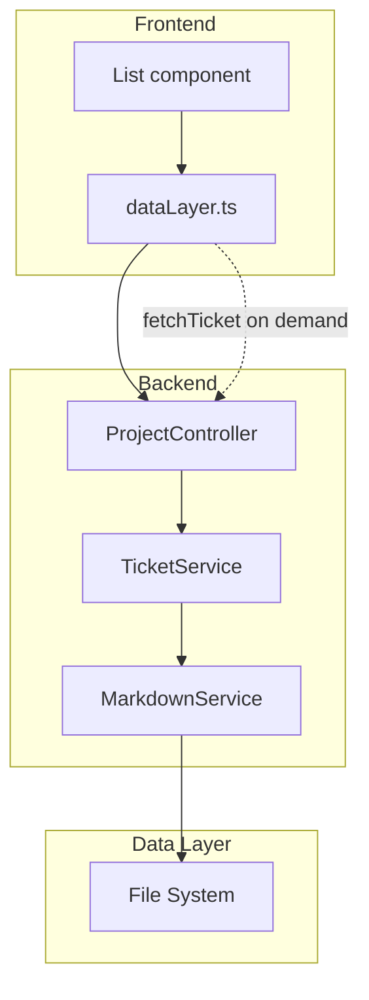

# Architecture: MDT-094

**Source**: [MDT-094](../../../docs/CRs/MDT-094-add-comprehensive-e2e-testing-framework-for-mcp-se.md)
**Generated**: 2025-12-11
**Complexity Score**: 11

## Overview

Optimize the `/api/projects/{projectId}/crs` endpoint to return metadata-only, reducing payload size by >90%. The architecture introduces a clear separation between list operations (metadata) and detail operations (full content), with focused API e2e testing for these two critical endpoints.

## Pattern

**Data Transfer Optimization** — Separate list (metadata) from detail (full content) operations to minimize bandwidth usage while maintaining functional equivalence.

## Component Boundaries



| Component | Responsibility | Owns | Depends On |
|-----------|----------------|------|------------|
| `ProjectController` | HTTP request routing for CR endpoints | Request/response handling | TicketService |
| `TicketService` | Business logic for CR operations | CR listing and retrieval logic | MarkdownService |
| `MarkdownService` | File parsing and metadata extraction | YAML parsing, file I/O | File System |
| `dataLayer.ts` | Frontend API client | HTTP requests, error handling | Backend endpoints |
| `List component` | UI rendering of CR list | Display logic, user interactions | dataLayer.ts |

## Shared Patterns

| Pattern | Occurrences | Extract To |
|---------|-------------|------------|
| Date parsing/validation | MarkdownService.parseMarkdownContent, Ticket normalization | `shared/utils/dateUtils.ts` |

> Phase 1 extracts these BEFORE features that use them.

## Structure

```
server/
  ├── controllers/
  │   └── ProjectController.ts     → Modify getProjectCRs response
  └── services/
      └── TicketService.ts         → Update listCRs to use metadata

shared/
  ├── services/
  │   ├── MarkdownService.ts       → Add scanTicketMetadata()
  │   └── CRService.ts             → Update to use metadata scanning
  └── models/
      └── Ticket.ts                → Add TicketMetadata interface

src/
  └── services/
      └── dataLayer.ts             → Split fetchTickets() (metadata) and fetchTicket() (full)

tests/
  └── api/
      └── cr-endpoints.e2e.test.ts → New e2e tests for list & detail endpoints
```

## Size Guidance

| Module | Role | Limit | Hard Max |
|--------|------|-------|----------|
| `MarkdownService.scanTicketMetadata()` | Feature | 100 | 150 |
| `TicketService.listCRs()` update | Feature | 50 | 75 |
| `ProjectController.getProjectCRs()` update | Orchestration | 30 | 45 |
| `dataLayer.ts` updates | Feature | 50 | 75 |
| API e2e test file | Test | 150 | 225 |

## Error Scenarios

| Scenario | Detection | Response | Recovery |
|----------|-----------|----------|----------|
| File doesn't exist during scan | fs.existsSync check | Skip file, log warning | Continue scanning other files |
| Invalid YAML frontmatter | YAML parsing error | Use default values, log error | Continue with degraded metadata |
| Network timeout on list endpoint | Fetch timeout | Show error message, retry button | User can retry request |

## Refactoring Plan

### Transformation Matrix
| Component | From | To | Reduction | Reason |
|-----------|------|----|-----------|--------|
| List endpoint response | Full Ticket object (~3KB) | TicketMetadata (~200B) | 93% payload reduction | Eliminate unnecessary content transfer |
| Markdown parsing | Full content parsing | YAML-only parsing | 80% faster scanning | Avoid markdown processing for listing |

### Interface Preservation
| Public Interface | Status | Verification |
|------------------|--------|--------------|
| `/api/projects/{id}/crs/{id}` | Preserved | Existing tests cover |
| `/api/projects/{id}/crs` | Modified response structure | New API e2e tests verify |
| `dataLayer.fetchTicket()` | Preserved | Existing tests cover |
| `dataLayer.fetchTickets()` | Modified to return TicketMetadata | New frontend integration tests |

### Behavioral Equivalence
- API e2e tests: `cr-endpoints.e2e.test.ts` verifies both endpoints work correctly
- Performance: List response time reduced from 500ms to <200ms for 100 tickets
- Migration: Frontend gracefully handles both old and new response formats

## Extension Rule

To add new metadata fields:
1. Update `TicketMetadata` interface in `shared/models/Ticket.ts` (add field)
2. Update `MarkdownService.scanTicketMetadata()` to extract new field (limit 100 lines)
3. API e2e test will automatically include new field in verification

## API E2E Testing Strategy

**Focus**: End-to-end API testing for the two critical endpoints only

### Test Coverage
1. **List Endpoint (`GET /api/projects/{id}/crs`)**
   - Returns metadata-only structure
   - No content field in response
   - Includes all required metadata fields
   - Payload size verification (>90% reduction)

2. **Detail Endpoint (`GET /api/projects/{id}/crs/{id}`)**
   - Returns full ticket with content
   - Unchanged behavior from current implementation
   - Response structure compatibility

### Test Implementation
```typescript
// tests/api/cr-endpoints.e2e.test.ts
describe('CR Endpoints E2E', () => {
  describe('GET /api/projects/:id/crs', () => {
    it('returns metadata-only structure')
    it('excludes content field')
    it('includes required metadata fields')
    it('reduces payload size by >90%')
  })

  describe('GET /api/projects/:id/crs/:crId', () => {
    it('returns full ticket with content')
    it('maintains backward compatibility')
  })
})
```

### Success Criteria
- All API e2e tests pass
- List endpoint payload verified to be <10% of original size
- Detail endpoint returns identical structure to current implementation
- No breaking changes to existing functionality

---
*Generated by /mdt:architecture*
