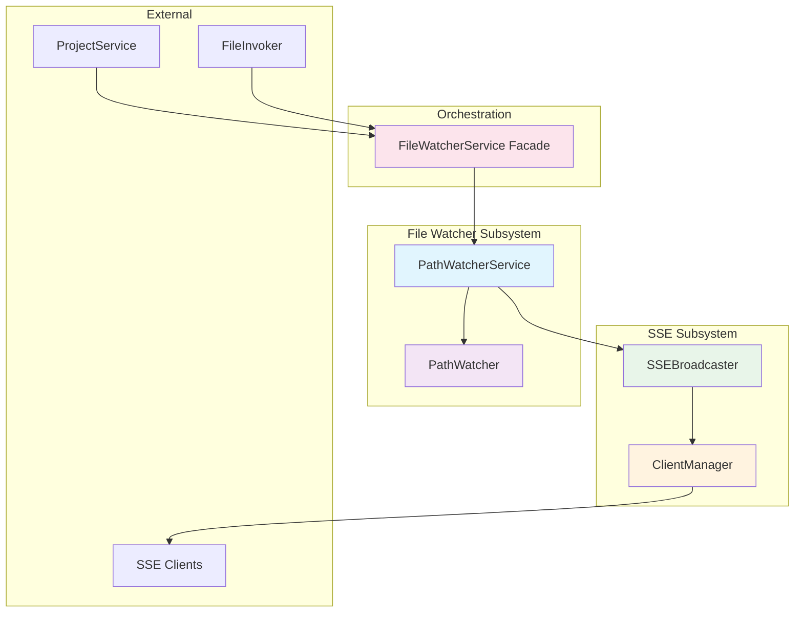
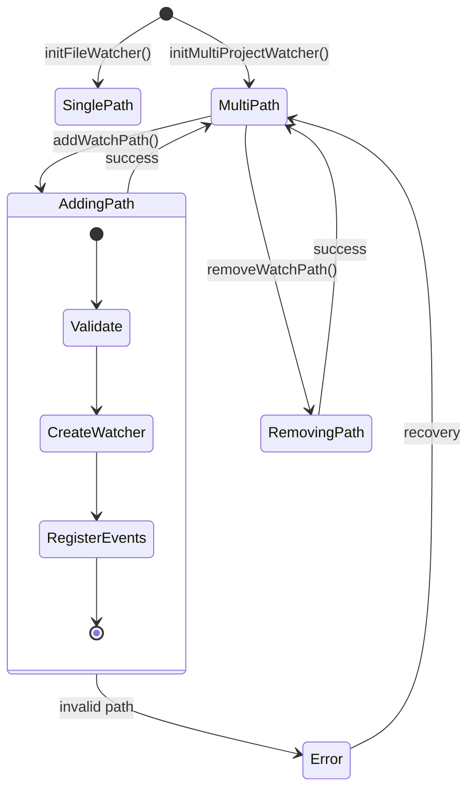

# Architecture: MDT-096

**Source**: [MDT-096](..//MDT-096-refactor-serverfilewatcherservicets-for-git-worktr.md)
**Generated**: 2025-12-15   
**Complexity Score**: 11

## Overview

This architecture refactors the 439-line FileWatcherService into focused services that support multiple path monitoring while maintaining backward compatibility. The design separates concerns between file watching and SSE broadcasting, enabling cleaner testing and easier extension for Git worktree support.

## Pattern

**Service Decomposition** — Split a monolithic service into focused, single-responsibility services that communicate through well-defined interfaces.

This pattern improves testability, reduces cognitive load, and allows each service to evolve independently.

## Key Dependencies

No external dependencies added — continues using existing chokidar and EventEmitter from Node.js ecosystem.

## Component Boundaries



| Component | Responsibility | Owns | Depends On |
|-----------|----------------|------|------------|
| `PathWatcherService` | Manages multiple path watchers, debouncing, event routing | Watcher instances, path registry | `PathWatcher`, `SSEBroadcaster` |
| `PathWatcher` | Wrapper around chokidar for single path | chokidar instance, event handlers | chokidar library |
| `SSEBroadcaster` | Formats and broadcasts SSE events | Event queue, broadcast logic | `ClientManager` |
| `ClientManager` | Manages SSE client connections | Client set, heartbeat timer | None |
| `index.ts` | Public API, exports main interface | Service exports | All internal services |

## State Flows



| State | Entry Condition | Exit Condition | Invariants |
|-------|-----------------|----------------|------------|
| SinglePath | `initFileWatcher()` called | `initMultiProjectWatcher()` or `stop()` | Exactly one default watcher exists |
| MultiPath | `initMultiProjectWatcher()` called | `stop()` | All watchers have unique IDs |
| AddingPath | `addWatchPath()` called | Path registered successfully or error | No duplicate path IDs |
| RemovingPath | `removeWatchPath()` called | Path unregistered or not found | Remaining watchers unaffected |

## Shared Patterns

| Pattern | Occurrences | Extract To |
|---------|-------------|------------|
| Event debouncing | FileWatcherService.handleFileEvent | `PathWatcher` (internal) |
| Client lifecycle management | FileWatcherService add/removeClient | `ClientManager` |
| Event queue management | FileWatcherService eventQueue | `SSEBroadcaster` |
| Error logging | Throughout FileWatcherService | Each service (via shared utils) |

> Phase 1 extracts these patterns into focused services before adding multi-path functionality.

## Structure

```
server/
├── services/
│   ├── fileWatcher/
│   │   ├── index.ts                → Main service interface
│   │   ├── PathWatcherService.ts   → Core multi-path logic (150 lines)
│   │   ├── PathWatcher.ts          → Single path wrapper (100 lines)
│   │   ├── SSEBroadcaster.ts       → Event formatting/broadcasting (125 lines)
│   │   └── ClientManager.ts        → SSE client management (100 lines)
```

## Size Guidance

| Module | Role | Limit | Hard Max |
|--------|------|-------|----------|
| `PathWatcherService.ts` | Feature | 150 | 225 |
| `PathWatcher.ts` | Feature | 100 | 150 |
| `SSEBroadcaster.ts` | Feature | 125 | 200 |
| `ClientManager.ts` | Utility | 100 | 150 |
| `index.ts` | Orchestration | 75 | 110 |
| Tests per module | - | 150 | 225 |

## Error Scenarios

| Scenario | Detection | Response | Recovery |
|----------|-----------|----------|----------|
| Invalid watch path | Path validation fails | Log error, emit 'path-error' event | Continue with existing paths |
| Watcher crash | chokidar error event | Clean up instance, emit 'watcher-failed' | Attempt restart after delay |
| SSE client disconnects | Socket error/close event | Remove from client set | Automatic on next operation |
| Duplicate path ID | Path registry check | Reject with error, log warning | Operation fails, no state change |
| Memory leak in event queue | Queue size > 1000 | Trim to last 100, log warning | Continue with reduced queue |

## Refactoring Plan

### Transformation Matrix
| Component | From | To | Reduction | Reason |
|-----------|------|----|-----------|--------|
| File watching logic | `fileWatcherService.ts` (439 lines) | `PathWatcherService.ts` + `PathWatcher.ts` (250 lines) | 43% smaller | Separation of concerns |
| SSE broadcasting | `fileWatcherService.ts` mixed | `SSEBroadcaster.ts` + `ClientManager.ts` (225 lines) | 49% smaller | Isolated broadcast logic |
| Client management | `fileWatcherService.ts` mixed | `ClientManager.ts` (100 lines) | 77% smaller | Single responsibility |

### Interface Replacement
| Old Interface | New Interface | Status | Verification |
|---------------|---------------|--------|--------------|
| `new FileWatcherService()` | `new PathWatcherService()` | Replaced | Tests in `PathWatcherService.spec.ts` |
| `initFileWatcher(watchPath)` | `initWatchPaths([{id: 'default', path: watchPath}])` | Updated | Tests in `PathWatcherService.spec.ts` |
| `initMultiProjectWatcher(projectPaths)` | `initWatchPaths(projectPaths)` | Renamed | Tests in `PathWatcherService.spec.ts` |
| `addClient(response)` | `sseBroadcaster.addClient(response)` | Moved | Tests in `SSEBroadcaster.spec.ts` |
| `removeClient(response)` | `clientManager.removeClient(response)` | Moved | Tests in `ClientManager.spec.ts` |
| Event emission | Unchanged API through index.ts exports | Preserved | Integration tests verify event flow |

### Behavioral Equivalence
- Test suite: New comprehensive tests lock all existing behaviors
- Performance: Single chokidar instance ensures minimal overhead (<5%)

## Migration Guide

### Import Changes

**Before:**
```typescript
import FileWatcherService from './fileWatcherService.js';
const fileWatcher = new FileWatcherService();
```

**After:**
```typescript
import FileWatcherService from './services/fileWatcher/index.js';
const fileWatcher = new FileWatcherService();
```

### API Changes

| Old API | New API | Notes |
|---------|---------|-------|
| `initFileWatcher(watchPath)` | `initWatchPaths([{id: 'default', path: watchPath}])` | Array of paths required |
| `initMultiProjectWatcher(projectPaths)` | `initWatchPaths(projectPaths)` | Same signature, renamed |
| `addClient(response)` | `sseBroadcaster.addClient(response)` | Access via exported `sseBroadcaster` |
| `removeClient(response)` | `clientManager.removeClient(response)` | Access via exported `clientManager` |
| `getClientCount()` | `clientManager.getClientCount()` | Access via exported `clientManager` |
| `setFileInvoker(fileInvoker)` | Direct injection in constructor | Cleaner dependency injection |

### File Updates Required

1. **server.ts** (3 changes):
   - Update import path
   - Pass fileInvoker to constructor
   - Replace method calls

2. **server/routes/sse.ts** (3 changes):
   - Update import path
   - Access `sseBroadcaster` for client management
   - Access `clientManager` for client count

3. **server/routes/system.ts** (1 change):
   - Update import path only (uses `getClientCount()`)

### Example Updated server.ts
```typescript
// Before
import FileWatcherService from './fileWatcherService.js';
const fileWatcher = new FileWatcherService();
fileWatcher.setFileInvoker(documentService.fileInvoker);
fileWatcher.initFileWatcher(watchPath);

// After
import FileWatcherService from './services/fileWatcher/index.js';
const fileWatcher = new FileWatcherService({
  fileInvoker: documentService.fileInvoker
});
fileWatcher.initWatchPaths([{id: 'main', path: watchPath}]);
```

## Extension Rule

To add new path-related feature:
1. Add method to `PathWatcherService` (limit 150 lines total)
2. Export from `index.ts` if public API needed
3. Add tests in `PathWatcherService.spec.ts` (limit 150 lines)

To add new SSE feature:
1. Add method to `SSEBroadcaster` (limit 125 lines total)
2. Update `ClientManager` if client-related (limit 100 lines)
3. Add corresponding tests

To expose new functionality:
1. Add export to `index.ts` (limit 75 lines)
2. Update import statements in consuming modules

---
*Generated by /mdt:architecture*