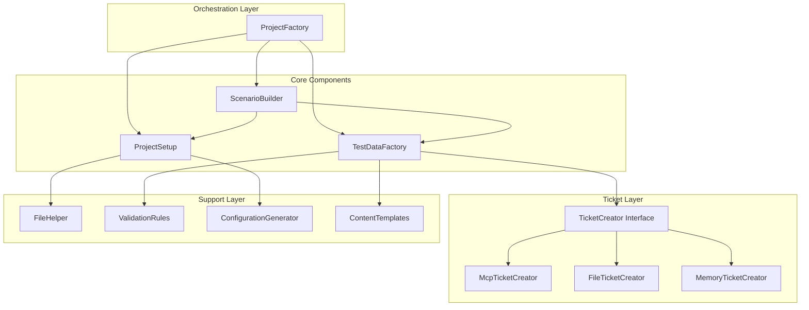

# Architecture: MDT-099

**Source**: [MDT-099](../../../docs/CRs/MDT/MDT-099.md)
**Generated**: 2025-12-16
**Complexity Score**: 12

## Overview

Refactor the monolithic ProjectFactory class (722 lines) into focused, single-responsibility components to improve maintainability, testability, and eliminate tight coupling with MCP. The architecture follows the Single Responsibility Principle with a clear separation between test data creation, project setup, and ticket management.

## Pattern

**Strategy Pattern + Dependency Injection** — Each component implements a focused interface, allowing different implementations based on test needs (file-based, in-memory, MCP-based).

## Component Boundaries



| Component | Responsibility | Owns | Depends On |
|-----------|----------------|------|------------|
| `ProjectFactory` | Orchestrates test setup | Test workflow | ProjectSetup, TestDataFactory, ScenarioBuilder |
| `ProjectSetup` | Creates project structure | Directory layout | FileHelper, ConfigurationGenerator |
| `TestDataFactory` | Creates test tickets | Ticket data | TicketCreator, ValidationRules, ContentTemplates |
| `ScenarioBuilder` | Builds complex test scenarios | Test scenarios | ProjectSetup, TestDataFactory |
| `TicketCreator` | Ticket creation abstraction | Ticket CRUD interface | None (interface) |
| `FileHelper` | File system operations | File I/O | None |
| `ValidationRules` | Input validation | Validation logic | None |
| `ConfigurationGenerator` | Generates config files | Config templates | None |
| `ContentTemplates` | Generates CR content | Content templates | None |

## Shared Patterns

| Pattern | Occurrences | Extract To |
|---------|-------------|------------|
| File operations | ProjectSetup, ConfigurationGenerator | `utils/FileHelper` |
| Input validation | ProjectFactory, TestDataFactory | `utils/ValidationRules` |
| Template generation | ProjectFactory (config), ProjectFactory (content) | `config/ConfigurationGenerator`, `config/ContentTemplates` |
| Ticket creation | TestDataFactory (MCP coupling) | `ticket/TicketCreator` (interface) + implementations |

> Phase 1 extracts these shared patterns BEFORE components that use them.

## Structure

```
mcp-server/tests/e2e/helpers/
├── core/
│   ├── project-factory.ts          # Orchestration only (100 lines)
│   ├── project-setup.ts            # Project structure creation (150 lines)
│   ├── test-data-factory.ts        # Test data orchestration (120 lines)
│   └── scenario-builder.ts         # Complex scenario orchestration (100 lines)
├── ticket/
│   ├── ticket-creator.ts           # Ticket creation interface (50 lines)
│   ├── mcp-ticket-creator.ts       # MCP implementation (80 lines)
│   ├── file-ticket-creator.ts      # Direct file creation (100 lines)
│   └── memory-ticket-creator.ts    # In-memory implementation (90 lines)
├── utils/
│   ├── file-helper.ts              # File system operations (75 lines)
│   └── validation-rules.ts         # Input validation (100 lines)
├── config/
│   ├── configuration-generator.ts  # Config file generation (100 lines)
│   └── content-templates.ts        # CR content templates (150 lines)
└── types/
    └── project-factory-types.ts    # Shared type definitions (150 lines)
```

## Size Guidance

| Module | Role | Limit | Hard Max |
|--------|------|-------|----------|
| `project-factory.ts` | Orchestration | 100 | 150 |
| `project-setup.ts` | Project creation | 150 | 225 |
| `test-data-factory.ts` | Test data | 120 | 180 |
| `scenario-builder.ts` | Scenario building | 100 | 150 |
| `ticket-creator.ts` | Interface | 50 | 75 |
| `mcp-ticket-creator.ts` | MCP tickets | 80 | 120 |
| `file-ticket-creator.ts` | File tickets | 100 | 150 |
| `memory-ticket-creator.ts` | Memory tickets | 90 | 135 |
| `file-helper.ts` | File utilities | 75 | 110 |
| `validation-rules.ts` | Validation | 100 | 150 |
| `configuration-generator.ts` | Config generation | 100 | 150 |
| `content-templates.ts` | Content templates | 150 | 225 |
| `project-factory-types.ts` | Type definitions | 150 | 225 |

**Total**: 1,365 lines (47% reduction from 2,582 including original file and potential duplication)

## Refactoring Plan

### Transformation Matrix
| Component | From | To | Reduction | Reason |
|-----------|------|----|-----------|--------|
| Project orchestration | `project-factory.ts` (722 lines) | `core/project-factory.ts` (100 lines) | 622→100 | Extract responsibilities |
| Project structure | `project-factory.ts` (embedded) | `core/project-setup.ts` (150 lines) | New | Extract single responsibility |
| Test data | `project-factory.ts` (embedded) | `core/test-data-factory.ts` (120 lines) | New | Decouple from MCP |
| File operations | Scattered throughout | `utils/file-helper.ts` (75 lines) | Consolidated | Remove duplication |
| Validation logic | Mixed in classes | `utils/validation-rules.ts` (100 lines) | Consolidated | Centralize rules |

### Interface Preservation
| Public Interface | Status | Verification |
|------------------|--------|--------------|
| `ProjectFactory.createProject()` | Preserved | Existing tests cover |
| `ProjectFactory.createTestCR()` | Preserved | Existing tests cover |
| `ProjectFactory.createTestScenario()` | Preserved | Existing tests cover |
| `ProjectFactory.createMultipleCRs()` | Preserved | Existing tests cover |

### Behavioral Equivalence
- Test suite: All existing E2E tests must pass without modification
- Performance: Improved due to smaller, focused classes
- Migration: Zero-breaking changes for existing test code

## Extension Rule

To add new ticket creation method:
1. Create `ticket/{name}-ticket-creator.ts` (implements `TicketCreator`, limit 150 lines)
2. Implement `createTicket()` and `createMultipleTickets()` methods
3. Inject via dependency injection: `new ProjectFactory(testEnv, new {Name}TicketCreator(...))`

To add new project type:
1. Add template in `config/content-templates.ts` (limit 225 lines total)
2. Update `getScenarioDefinition()` if needed
3. No changes to core components required

---
*Generated by /mdt:architecture*
