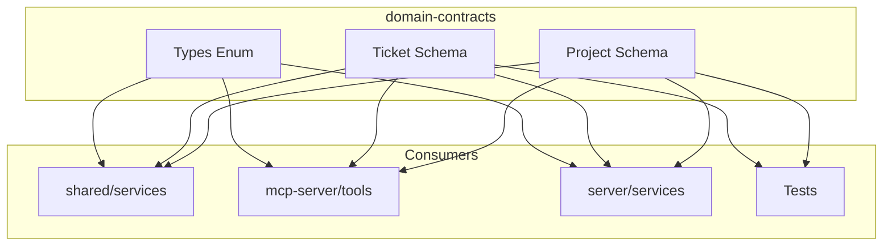

# Architecture: MDT-101

**Source**: [MDT-101](../../../docs/CRs/MDT/MDT-101.md)
**Generated**: 2025-12-19
**Complexity Score**: 13

## Overview

This architecture extracts domain entities (Project and Ticket) into a standalone domain-contracts package with Zod schemas as the single source of truth. The migration separates type definitions from implementation logic, enabling runtime validation across all interfaces (CLI, MCP, UI) while maintaining zero internal dependencies.

## Pattern

**Schema-First Domain Contracts** — Zod schemas define both runtime validation and TypeScript types, ensuring consistency across all interfaces.

Pattern application: Each domain entity lives in its own module with a Zod schema, derived TypeScript type, and test fixtures. The production API exports only schemas and types, while a separate testing subpath provides builders.

## Key Dependencies

| Capability | Package | Coverage | Rationale |
|------------|---------|----------|----------|
| Schema validation | zod | 100% | Mature, 5M weekly downloads, MIT license, TypeScript-first |

**Build Custom Decisions**:
| Capability | Reason | Estimated Size |
|------------|--------|---------------|
| Test fixtures | Domain-specific builders needed for testing | ~50 lines per entity |

## Component Boundaries



| Component | Responsibility | Owns | Depends On |
|-----------|----------------|------|------------|
| `domain-contracts/src/project/schema.ts` | Project entity definition | ProjectSchema, ProjectType | zod |
| `domain-contracts/src/ticket/schema.ts` | Ticket/CR entity definition | TicketSchema, TicketType | zod |
| `domain-contracts/src/types/schema.ts` | Shared enums | CRStatus, CRType | zod |
| `domain-contracts/src/index.ts` | Public API aggregation | All public exports | Internal modules |
| `domain-contracts/src/testing/index.ts` | Test utilities | Fixtures, builders | Production schemas |

## Shared Patterns

| Pattern | Occurrences | Extract To |
|---------|-------------|------------|
| Schema definition | project, ticket, types | `domain-contracts/src/{entity}/schema.ts` |
| Type derivation | project, ticket, types | Each schema file exports inferred type |
| Test fixture builder | project, ticket | `domain-contracts/src/testing/{entity}.fixtures.ts` |

> Phase 1 extracts schema patterns BEFORE creating dependent modules.

## Structure

```
domain-contracts/
├── package.json                 → Zero internal deps, zod only
├── src/
│   ├── index.ts                → Production API aggregate
│   ├── project/
│   │   ├── schema.ts          → ProjectSchema + Project type
│   │   └── index.ts           → Project exports
│   ├── ticket/
│   │   ├── schema.ts          → TicketSchema + CR type
│   │   └── index.ts           → Ticket exports
│   ├── types/
│   │   ├── schema.ts          → Enum schemas (CRStatus, CRType)
│   │   └── index.ts           → Enum exports
│   └── testing/
│       ├── index.ts           → Testing utilities aggregate
│       ├── project.fixtures.ts → Project test builders
│       └── ticket.fixtures.ts  → Ticket test builders
└── dist/                      → Compiled output
```

## Size Guidance

| Module | Role | Limit | Hard Max |
|--------|------|-------|----------|
| `domain-contracts/src/project/schema.ts` | Entity definition | 150 | 225 |
| `domain-contracts/src/ticket/schema.ts` | Entity definition | 200 | 300 |
| `domain-contracts/src/types/schema.ts` | Enum definitions | 50 | 75 |
| `domain-contracts/src/{entity}/index.ts` | Export module | 20 | 30 |
| `domain-contracts/src/testing/{entity}.fixtures.ts` | Test builders | 100 | 150 |
| `domain-contracts/src/index.ts` | Public API | 30 | 45 |

## Error Scenarios

| Scenario | Detection | Response | Recovery |
|----------|-----------|----------|----------|
| Invalid Project data | Zod parse error at API boundary | Reject with 400 + validation details | Client fixes data and resubmits |
| Invalid Ticket data | Zod parse error in MCP tool | Tool returns error with validation failures | MCP client corrects request |
| Schema mismatch | TypeScript compilation error | Build fails | Update consumer to match schema |

## Refactoring Plan

### Transformation Matrix
| Component | From | To | Reduction | Reason |
|-----------|------|----|-----------|--------|
| Project type | `shared/models/Project.ts` (206 lines) | `domain-contracts/src/project/schema.ts` (150 lines) | 27% | Pure definition, remove unused parts |
| Ticket type | `shared/models/Ticket.ts` (172 lines) | `domain-contracts/src/ticket/schema.ts` (200 lines) | -16% | Add validation rules |
| Shared enums | `shared/models/Types.ts` (80 lines) | `domain-contracts/src/types/schema.ts` (50 lines) | 38% | Extract only enums |

### Interface Preservation
| Public Interface | Status | Verification |
|------------------|--------|--------------|
| `Project` type | Preserved | Zod infer maintains same shape |
| `CR` type | Preserved | Zod infer maintains same shape |
| `CRStatus` enum | Preserved | Same values, now with runtime validation |
| `CRType` enum | Preserved | Same values, now with runtime validation |

### Behavioral Equivalence
- Test suite: New schema validation tests ensure identical shape validation
- Performance: Zod parsing adds ~1-2ms per validation at boundaries
- Migration: Consumers update imports, functionality unchanged

## Phase 1.1: Enhanced Project Validation

### Overview

Phase 1.1 extends the Project schema with comprehensive validation rules, business logic validation, and legacy format migration support. This enhancement ensures data integrity at API boundaries while maintaining backward compatibility with existing project configurations.

### Pattern

**Layered Validation with Zod** - Combine base schema validation with custom business rules using Zod's refine and superRefine methods for complex cross-field validation and migration support.

### Validation Architecture

The Project validation is organized into three layers:

1. **Schema Validation** (`schema.ts`)
   - Base field validation with type checking
   - Required field validation
   - String pattern matching

2. **Business Rule Validation** (`validation.ts`)
   - Cross-field validation logic
   - Domain-specific constraints
   - Custom error messages

3. **Migration Validation** (`migration.ts`)
   - Legacy format detection
   - Migration rule validation
   - Data integrity preservation

### Enhanced Structure

```
domain-contracts/src/project/
├── schema.ts              → Base Zod schemas + type exports (150 lines)
├── validation.ts          → Custom validation rules (100 lines) [NEW]
├── migration.ts           → Legacy format migration (80 lines) [NEW]
└── index.ts              → Consolidated exports (30 lines)
```

### Validation Rules Specification

**Required Fields:**
- `name`: Non-empty string, trimmed length > 0
- `code`: Non-empty string, trimmed length > 0
- `active`: Boolean (required for Project, optional for LocalProjectConfig)

**Pattern Validation:**
- `code`: Must match `^[A-Z][A-Z0-9]{1,4}$` (2-5 chars, starts with letter, e.g., "MDT", "WEB", "API1")
- `path`: Relative path (no leading slash) or absolute path format
- `ticketsPath`: Relative path format, no leading slash

**Cross-Field Validation:**
- Legacy format detection: `project.path` contains tickets and `project.ticketsPath` undefined
- Path consistency: If `ticketsPath` exists, `path` should be "." or undefined
- Document paths validation: All paths must be valid relative paths

**Business Rules:**
- `startNumber` must be positive integer (> 0)
- `counterFile` must have valid filename with extension
- `maxDepth` must be positive integer if provided

### Updated Size Guidance

| Module | Role | Limit | Hard Max |
|--------|------|-------|----------|
| `domain-contracts/src/project/schema.ts` | Base schemas | 150 | 225 |
| `domain-contracts/src/project/validation.ts` | Custom rules | 100 | 150 |
| `domain-contracts/src/project/migration.ts` | Migration logic | 80 | 120 |
| `domain-contracts/src/project/index.ts` | Exports | 30 | 45 |

### Implementation Strategy

1. **Extend existing schema.ts** with enhanced validation patterns
2. **Create validation.ts** with refine/superRefine custom rules
3. **Create migration.ts** with legacy format detection and migration
4. **Update index.ts** to export validation functions

### Extension Rule

To add Project validation:
1. Add field validation to `schema.ts` (within 150-line limit)
2. Add custom rule to `validation.ts` (within 100-line limit)
3. Export validation function from `index.ts`

## Phase 2: Additional Contracts Migration

### Overview

Phase 2 extends the domain-contracts package with 5 additional contract groups to achieve complete domain coverage: Template, Configuration, Counter, Validation, and Project Service contracts. This phase eliminates remaining interface drift between shared models and runtime validation.

### Pattern

**Incremental Domain Coverage** - Apply the same schema-first pattern from Phase 1 to migrate remaining contracts, prioritizing by dependency chain and impact.

Pattern application: Migrate contracts in dependency order (Validation → Template → Counter → Config → Project Service) to ensure each new contract can leverage existing validated schemas.

### Decision Points Resolved

#### 1. Config Contract Organization
**Decision**: Consolidate StatusConfig, AttributeConfig, and ServerConfig into a single `src/config/schema.ts` file
**Rationale**: These configurations are tightly coupled and often used together. Consolidation reduces import overhead and maintains related validation rules in one location.

#### 2. Template Section Validation
**Decision**: Embed validation rules directly in Template schema using Zod's refine and superRefine
**Rationale**: Template validation is domain-specific and changes with template requirements. Direct embedding avoids indirection and keeps validation close to the schema definition.

#### 3. Project Service Contracts Split
**Decision**: Split Project Service contracts across function-focused modules:
- GlobalConfig → `src/config/schema.ts` (system-wide configuration)
- ProjectCache, ProjectScanOptions, ProjectValidationResult → `src/project/schema.ts` (project operations)
- ProjectExport, RegistryData → `src/project/export.ts` (data transfer)

**Rationale**: Maintains module cohesion by keeping related functionality together while respecting size limits.

### Updated Structure

```
domain-contracts/
├── src/
│   ├── index.ts
│   ├── project/
│   │   ├── schema.ts          → Project + cache/validation/scan types
│   │   ├── export.ts          → ProjectExport, RegistryData (NEW)
│   │   └── index.ts
│   ├── ticket/
│   │   ├── schema.ts
│   │   └── index.ts
│   ├── types/
│   │   ├── schema.ts
│   │   └── index.ts
│   ├── template/              → NEW
│   │   ├── schema.ts          → Template, TemplateSection
│   │   └── index.ts
│   ├── config/                → NEW
│   │   ├── schema.ts          → StatusConfig, AttributeConfig, ServerConfig, GlobalConfig
│   │   └── index.ts
│   ├── counter/               → NEW
│   │   ├── schema.ts          → CounterConfig, CounterResponse, CounterError
│   │   └── index.ts
│   ├── validation/            → NEW
│   │   ├── schema.ts          → ValidationResult, ValidationError, ValidationWarning, Suggestion
│   │   └── index.ts
│   └── testing/
│       ├── index.ts
│       ├── project.fixtures.ts
│       ├── ticket.fixtures.ts
│       ├── template.fixtures.ts → NEW
│       └── validation.fixtures.ts → NEW
```

### Updated Size Guidance

| Module | Role | Limit | Hard Max |
|--------|------|-------|----------|
| `domain-contracts/src/template/schema.ts` | Template entity | 150 | 225 |
| `domain-contracts/src/config/schema.ts` | Configuration | 200 | 300 |
| `domain-contracts/src/counter/schema.ts` | Counter entity | 100 | 150 |
| `domain-contracts/src/validation/schema.ts` | Validation types | 100 | 150 |
| `domain-contracts/src/project/export.ts` | Project data transfer | 125 | 188 |
| `domain-contracts/src/project/schema.ts` | Project entity (updated) | 200 | 300 |
| `domain-contracts/src/testing/template.fixtures.ts` | Template builders | 125 | 188 |
| `domain-contracts/src/testing/validation.fixtures.ts` | Validation builders | 100 | 150 |

### Migration Dependencies

```
Phase 2 Dependency Graph:

validation (independent)
    ↓
template (uses validation)
    ↓
counter (uses validation)
    ↓
config (uses validation, types)
    ↓
project/export (uses project, config)
```

### Refactoring Plan for Phase 2

### Transformation Matrix
| Component | From | To | Reduction | Reason |
|-----------|------|----|-----------|--------|
| Template types | `shared/models/Types.ts` (13 lines) | `domain-contracts/src/template/schema.ts` (150 lines) | -1054% | Add comprehensive validation |
| Config types | `shared/models/Config.ts` (87 lines) | `domain-contracts/src/config/schema.ts` (200 lines) | -130% | Add runtime validation, consolidate |
| Counter types | `shared/models/Counter.ts` (34 lines) | `domain-contracts/src/counter/schema.ts` (100 lines) | -194% | Add API response validation |
| Validation types | `shared/models/Types.ts` (16 lines) | `domain-contracts/src/validation/schema.ts` (100 lines) | -525% | Add error handling patterns |
| Project Service types | `shared/services/project/types.ts` (67 lines) | Split across project/export, config, project | Consolidate with related schemas |

### Interface Preservation
| Public Interface | Status | Verification |
|------------------|--------|--------------|
| `Template` types | Preserved | Zod infer maintains same shape |
| `StatusConfig` | Preserved | Enhanced with validation rules |
| `CounterConfig` | Preserved | Added API response validation |
| `ValidationResult` | Preserved | Standardized error format |
| `GlobalConfig` | Preserved | Merged into config schema |

### Behavioral Equivalence
- Test suite: Schema validation tests for all new contracts
- Performance: Additional validation adds minimal overhead (~1ms per parse)
- Migration: Consumers update imports, existing functionality unchanged

## Extension Rule (Updated)

To add {X} entity:
1. Create `domain-contracts/src/{entity}/schema.ts` (limit per module role) with Zod schema
2. Create `domain-contracts/src/{entity}/index.ts` (limit 20 lines) exporting schema and type
3. Add exports to `domain-contracts/src/index.ts`
4. Create `domain-contracts/src/testing/{entity}.fixtures.ts` (limit per module role) for tests

To add configuration option:
1. Add field to `domain-contracts/src/config/schema.ts` (within 200-line limit)
2. Update test fixtures in `domain-contracts/src/testing/` accordingly

## Phase 1.2: Enhanced Ticket Validation

### Overview

Phase 1.2 extends the Ticket schema with comprehensive validation rules, business logic validation, and content structure validation. This enhancement ensures ticket data integrity at API boundaries while maintaining compatibility with existing ticket formats and providing rich validation feedback.

### Pattern

**Multi-Layered Ticket Validation** - Combine base schema validation with custom business rules, content validation, and relationship integrity checks using Zod's refine and superRefine methods for complex ticket-specific validation.

### Validation Architecture

The Ticket validation is organized into four layers:

1. **Schema Validation** (`schema.ts`)
   - Base field validation with type checking
   - Required field validation
   - String pattern matching for ticket codes
   - Enum validation for status, type, and priority

2. **Business Rule Validation** (`validation.ts`)
   - Ticket code format validation (e.g., "MDT-001")
   - Relationship field validation (no self-dependencies)
   - Status transition validation
   - Cross-field consistency checks

3. **Content Validation** (`content.ts`)
   - Required markdown sections validation
   - Content structure integrity
   - Section header format validation
   - Minimum content requirements

4. **Relationship Validation** (`relationships.ts`)
   - Circular dependency detection
   - Referenced ticket existence validation
   - Dependency consistency checks

### Enhanced Structure

```
domain-contracts/src/ticket/
├── schema.ts              → Base Zod schemas + type exports (200 lines)
├── validation.ts          → Custom validation rules (150 lines) [NEW]
├── content.ts             → Content structure validation (120 lines) [NEW]
├── relationships.ts       → Relationship integrity validation (100 lines) [NEW]
└── index.ts              → Consolidated exports (30 lines)
```

### Validation Rules Specification

**Required Fields:**
- `code`: Must match pattern `^[A-Z][A-Z0-9]{2,4}-\d{3,4}$` (e.g., "MDT-101", "API1-123")
- `title`: Non-empty string, trimmed length > 0, max 200 characters
- `status`: Must be valid CRStatus enum value
- `type`: Must be valid CRType enum value
- `priority`: Must be valid CRPriority enum value
- `content`: Non-empty markdown string with required sections

**Pattern Validation:**
- `code`: Project code (2-5 chars) + hyphen + ticket number (3-4 digits)
- `filePath`: Must be valid relative path from project root
- Dates: ISO 8601 format or null

**Business Rules:**
- `dateCreated` cannot be after `lastModified`
- `implementationDate` cannot be before `lastModified`
- `assignee` must be valid email format if provided
- `phaseEpic` must reference valid phase if provided

**Content Structure Rules:**
- Must contain YAML frontmatter with required fields
- Required markdown sections:
  - `## 1. Description`
  - `## 2. Rationale`
  - `## 3. Solution Analysis`
  - `## 4. Implementation Specification`
  - `## 5. Acceptance Criteria`
- Section numbers must be sequential (1, 2, 3, 4, 5)

**Relationship Integrity:**
- Ticket cannot depend on itself
- Cannot create circular dependencies
- Referenced tickets must follow valid code format
- `blocks` list cannot contain tickets that `dependsOn` contains

**Status Transition Rules:**
- Proposed → Approved → In Progress → Implemented (normal flow)
- Any status → Rejected (termination)
- Any status → On Hold (pause)
- On Hold → previous status (resume)
- Superseded, Deprecated, Duplicate (special states)

### Updated Size Guidance

| Module | Role | Limit | Hard Max |
|--------|------|-------|----------|
| `domain-contracts/src/ticket/schema.ts` | Base schemas | 200 | 300 |
| `domain-contracts/src/ticket/validation.ts` | Custom rules | 150 | 225 |
| `domain-contracts/src/ticket/content.ts` | Content validation | 120 | 180 |
| `domain-contracts/src/ticket/relationships.ts` | Relationship checks | 100 | 150 |
| `domain-contracts/src/ticket/index.ts` | Exports | 30 | 45 |
| `domain-contracts/src/testing/ticket.fixtures.ts` | Test builders | 150 | 225 |

### Implementation Strategy

1. **Extend existing schema.ts** with enhanced validation patterns and ticket code regex
2. **Create validation.ts** with refine/superRefine for business rules
3. **Create content.ts** with markdown parsing and section validation
4. **Create relationships.ts** with dependency graph validation
5. **Update index.ts** to export validation functions and schemas
6. **Update test fixtures** with comprehensive validation test cases

### Error Handling Strategy

| Error Type | Detection Method | Error Format | Recovery Action |
|------------|------------------|--------------|-----------------|
| Invalid ticket code | Regex validation | `{field: "code", message: "Must match PROJECT-123 format"}` | User corrects format |
| Missing sections | Content parsing | `{field: "content", section: "## 1. Description", message: "Required section missing"}` | User adds section |
| Circular dependency | Graph traversal | `{field: "dependsOn", message: "Circular dependency detected: MDT-001 → MDT-002 → MDT-001"}` | User resolves cycle |
| Invalid status transition | Enum/transition check | `{field: "status", message: "Cannot transition from Rejected to In Progress"}` | User chooses valid status |
| Date inconsistency | Date comparison | `{field: "implementationDate", message: "Cannot be before lastModified"}` | User corrects dates |

### Extension Rule

To add Ticket validation:
1. Add field validation to `schema.ts` (within 200-line limit)
2. Add custom business rule to `validation.ts` (within 150-line limit)
3. Add content validation to `content.ts` (within 120-line limit)
4. Add relationship check to `relationships.ts` (within 100-line limit)
5. Export validation functions from `index.ts`

---
*Generated by /mdt:architecture*