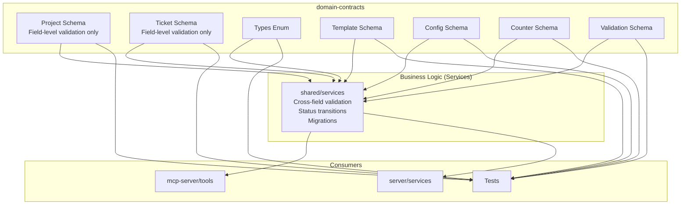

# Architecture: MDT-101

**Source**: [MDT-101](../../../docs/CRs/MDT/MDT-101.md)
**Generated**: 2025-12-20
**Complexity Score**: 11

## Overview

This architecture extracts domain entities (Project and Ticket) into a standalone domain-contracts package with Zod schemas as the single source of truth. The migration separates type definitions from implementation logic, enabling runtime validation across all interfaces (CLI, MCP, UI) while maintaining zero internal dependencies.

**Key Principles**:
- Contracts contain field-level validation only (type, format, required, length constraints, regex patterns)
- Contracts provide validation wrapper functions (parse, safeParse) for schema validation
- All business logic belongs in services (cross-field validation, state transitions, migrations)

**Detailed Requirements**: See [domain-contracts-requirements.md](./domain-contracts-requirements.md) for the comprehensive requirements specification including package structure, schema definitions, validation patterns, test utilities, and dependency constraints.

## Pattern

**Schema-First Domain Contracts with Validation** — Zod schemas define both runtime validation and TypeScript types, with simple validation wrapper functions for field-level validation.

Pattern application: Each domain entity lives in its own module with:
- Zod schema with field-level validation (regex patterns, type checks)
- Validation wrapper functions (parse, safeParse)
- Derived TypeScript type
- Test fixtures

Business logic (cross-field validation, status transitions, migrations) is implemented in services that consume these contracts.

## Key Dependencies

| Capability | Package | Coverage | Rationale |
|------------|---------|----------|----------|
| Schema validation | zod | 100% | Mature, 5M weekly downloads, MIT license, TypeScript-first |

**Build Custom Decisions**:
| Capability | Reason | Estimated Size |
|------------|--------|---------------|
| Test fixtures | Domain-specific builders needed for testing | ~50 lines per entity |

## Component Boundaries



| Component | Responsibility | Owns | Depends On |
|-----------|----------------|------|------------|
| `domain-contracts/src/{entity}/schema.ts` | Entity definition with field-level validation (regex, type checks) | EntitySchema, EntityType | zod |
| `domain-contracts/src/{entity}/validation.ts` | Validation wrapper functions (parse, safeParse) | validateProject, safeValidateProject | schema.ts |
| `domain-contracts/src/index.ts` | Public API aggregation | All public exports | Internal modules |
| `domain-contracts/src/testing/index.ts` | Test utilities | Fixtures, builders | Production schemas |
| `shared/services/validation.ts` | Business rule validation | Cross-field logic, state transitions | domain-contracts |

## Shared Patterns

| Pattern | Occurrences | Extract To |
|---------|-------------|------------|
| Schema definition | All entities | `domain-contracts/src/{entity}/schema.ts` |
| Type derivation | All entities | Each schema file exports inferred type |
| Validation wrapper functions | All entities | `domain-contracts/src/{entity}/validation.ts` |
| Test fixture builder | All entities | `domain-contracts/src/testing/{entity}.fixtures.ts` |
| Field-level validation | All entities | Each schema file (regex patterns, type checks) |

> Schema patterns extracted BEFORE creating dependent modules. Business logic extracted to services.

## Structure

*Note: Structure requirements are detailed in [domain-contracts-requirements.md](./domain-contracts-requirements.md)*

```
domain-contracts/
├── package.json                 → Zero internal deps, zod only
├── src/
│   ├── index.ts                → Production API aggregate
│   ├── project/
│   │   ├── schema.ts          → ProjectSchema + Project type (field validation only)
│   │   ├── validation.ts      → validateProject, safeValidateProject
│   │   └── index.ts           → Project exports
│   ├── ticket/
│   │   ├── schema.ts          → TicketSchema + CR type (field validation only)
│   │   ├── validation.ts      → validateTicket, safeValidateTicket
│   │   └── index.ts           → Ticket exports
│   ├── types/
│   │   ├── schema.ts          → Enum schemas (CRStatus, CRType)
│   │   ├── index.ts           → Enum exports
│   ├── template/              → NEW
│   │   ├── schema.ts          → Template, TemplateSection
│   │   ├── validation.ts      → Template validation wrappers
│   │   └── index.ts
│   ├── config/                → NEW
│   │   ├── schema.ts          → StatusConfig, AttributeConfig, ServerConfig
│   │   ├── validation.ts      → Config validation wrappers
│   │   └── index.ts
│   ├── counter/               → NEW
│   │   ├── schema.ts          → CounterConfig, CounterResponse, CounterError
│   │   ├── validation.ts      → Counter validation wrappers
│   │   └── index.ts
│   ├── validation/            → NEW
│   │   ├── schema.ts          → ValidationResult, ValidationError, ValidationWarning, Suggestion
│   │   ├── validation.ts      → Validation result wrappers
│   │   └── index.ts
│   └── testing/
│       ├── index.ts           → Testing utilities aggregate
│       ├── project.fixtures.ts → Project test builders
│       ├── ticket.fixtures.ts  → Ticket test builders
│       ├── template.fixtures.ts → Template builders
│       └── validation.fixtures.ts → Validation builders
└── dist/                      → Compiled output
```

## Size Guidance

| Module | Role | Limit | Hard Max |
|--------|------|-------|----------|
| `domain-contracts/src/project/schema.ts` | Entity definition | 150 | 225 |
| `domain-contracts/src/project/validation.ts` | Validation wrappers | 75 | 112 |
| `domain-contracts/src/ticket/schema.ts` | Entity definition | 200 | 300 |
| `domain-contracts/src/ticket/validation.ts` | Validation wrappers | 75 | 112 |
| `domain-contracts/src/types/schema.ts` | Enum definitions | 50 | 75 |
| `domain-contracts/src/template/schema.ts` | Template entity | 150 | 225 |
| `domain-contracts/src/template/validation.ts` | Validation wrappers | 75 | 112 |
| `domain-contracts/src/config/schema.ts` | Configuration | 200 | 300 |
| `domain-contracts/src/config/validation.ts` | Validation wrappers | 75 | 112 |
| `domain-contracts/src/counter/schema.ts` | Counter entity | 100 | 150 |
| `domain-contracts/src/counter/validation.ts` | Validation wrappers | 75 | 112 |
| `domain-contracts/src/validation/schema.ts` | Validation types | 100 | 150 |
| `domain-contracts/src/validation/validation.ts` | Validation result wrappers | 75 | 112 |
| `domain-contracts/src/{entity}/index.ts` | Export module | 20 | 30 |
| `domain-contracts/src/testing/{entity}.fixtures.ts` | Test builders | 100 | 150 |
| `domain-contracts/src/index.ts` | Public API | 30 | 45 |

## Error Scenarios

*Note: Validation requirements and patterns are detailed in [domain-contracts-requirements.md](./domain-contracts-requirements.md)*

| Scenario | Detection | Response | Recovery |
|----------|-----------|----------|----------|
| Invalid Project data | Zod parse error at API boundary | Reject with 400 + validation details | Client fixes data and resubmits |
| Invalid Ticket data | Zod parse error in MCP tool | Tool returns error with validation failures | MCP client corrects request |
| Schema mismatch | TypeScript compilation error | Build fails | Update consumer to match schema |

## Refactoring Plan

### Transformation Matrix
| Component | From | To | Reduction | Reason |
|-----------|------|----|-----------|--------|
| Project type | `shared/models/Project.ts` (206 lines) | `domain-contracts/src/project/schema.ts` (150 lines) | 27% | Pure definition, remove unused parts |
| Ticket type | `shared/models/Ticket.ts` (172 lines) | `domain-contracts/src/ticket/schema.ts` (200 lines) | -16% | Add field validation only |
| Shared enums | `shared/models/Types.ts` (80 lines) | `domain-contracts/src/types/schema.ts` (50 lines) | 38% | Extract only enums |
| Business validation | Was in contracts (Phase 1.1, 1.2) | Move to services | N/A | Contracts must remain pure |

### Interface Preservation
| Public Interface | Status | Verification |
|------------------|--------|--------------|
| `Project` type | Preserved | Zod infer maintains same shape |
| `CR` type | Preserved | Zod infer maintains same shape |
| `CRStatus` enum | Preserved | Same values, now with runtime validation |
| `CRType` enum | Preserved | Same values, now with runtime validation |

### Behavioral Equivalence
- Test suite: New schema validation tests ensure identical shape validation
- Performance: Zod parsing adds ~1-2ms per validation at boundaries
- Migration: Consumers update imports, functionality unchanged
- Business logic: Moved to services, maintaining separation of concerns

## Phase 2: Additional Contracts Migration

### Overview

Phase 2 extends the domain-contracts package with 5 additional contract groups to achieve complete domain coverage: Template, Configuration, Counter, Validation, and Project Service contracts. This phase eliminates remaining interface drift between shared models and runtime validation while maintaining the principle that contracts contain only field-level validation.

### Pattern

**Pure Schema-First Contracts** - Apply the same schema-first pattern from Phase 1 to migrate remaining contracts, ensuring contracts define shapes only while business logic remains in services.

Pattern application: Migrate contracts in dependency order (Validation → Template → Counter → Config) to ensure each new contract can leverage existing validated schemas. All business logic (cross-field validation, migrations, relationships) is implemented in services.

### Decision Points Resolved

#### 1. Config Contract Organization
**Decision**: Consolidate StatusConfig, AttributeConfig, and ServerConfig into a single `src/config/schema.ts` file
**Rationale**: These configurations are tightly coupled and often used together. Consolidation reduces import overhead while maintaining pure field-level validation.

#### 2. Template Section Validation
**Decision**: Embed only field-level validation rules directly in Template schema
**Rationale**: Template business logic (section validation, content rules) belongs in services. Contracts only enforce type, format, required fields.

#### 3. Validation Schema Scope
**Decision**: Include only validation result types (ValidationResult, ValidationError) in contracts
**Rationale**: Actual validation logic and business rules are implemented in services that consume these contracts.

### Updated Structure (Phase 2)

```
domain-contracts/
├── src/
│   ├── index.ts
│   ├── project/
│   │   ├── schema.ts          → Project entity (field validation only)
│   │   ├── validation.ts      → Validation wrapper functions
│   │   └── index.ts
│   ├── ticket/
│   │   ├── schema.ts          → Ticket entity (field validation only)
│   │   ├── validation.ts      → Validation wrapper functions
│   │   └── index.ts
│   ├── types/
│   │   ├── schema.ts          → Enum schemas (CRStatus, CRType)
│   │   └── index.ts
│   ├── template/              → NEW
│   │   ├── schema.ts          → Template, TemplateSection (field validation only)
│   │   ├── validation.ts      → Validation wrapper functions
│   │   └── index.ts
│   ├── config/                → NEW
│   │   ├── schema.ts          → StatusConfig, AttributeConfig, ServerConfig (field validation only)
│   │   ├── validation.ts      → Validation wrapper functions
│   │   └── index.ts
│   ├── counter/               → NEW
│   │   ├── schema.ts          → CounterConfig, CounterResponse, CounterError
│   │   ├── validation.ts      → Validation wrapper functions
│   │   └── index.ts
│   ├── validation/            → NEW
│   │   ├── schema.ts          → ValidationResult, ValidationError, ValidationWarning, Suggestion
│   │   ├── validation.ts      → Validation result wrappers
│   │   └── index.ts
│   └── testing/
│       ├── index.ts
│       ├── project.fixtures.ts
│       ├── ticket.fixtures.ts
│       ├── template.fixtures.ts → NEW
│       └── validation.fixtures.ts → NEW
```

### Migration Dependencies

```
Phase 2 Dependency Graph:

All contracts are independent (schemas only)
    ↓
Services orchestrate business logic between them
```

### Refactoring Plan for Phase 2

### Transformation Matrix
| Component | From | To | Reduction | Reason |
|-----------|------|----|-----------|--------|
| Template types | `shared/models/Types.ts` (13 lines) | `domain-contracts/src/template/schema.ts` (150 lines) | -1054% | Add field validation only |
| Config types | `shared/models/Config.ts` (87 lines) | `domain-contracts/src/config/schema.ts` (200 lines) | -130% | Add field validation, consolidate |
| Counter types | `shared/models/Counter.ts` (34 lines) | `domain-contracts/src/counter/schema.ts` (100 lines) | -194% | Add field validation only |
| Validation types | `shared/models/Types.ts` (16 lines) | `domain-contracts/src/validation/schema.ts` (100 lines) | -525% | Standardize error format types |

### Interface Preservation
| Public Interface | Status | Verification |
|------------------|--------|--------------|
| `Template` types | Preserved | Zod infer maintains same shape |
| `StatusConfig` | Preserved | Enhanced with field validation rules |
| `CounterConfig` | Preserved | Added field validation only |
| `ValidationResult` | Preserved | Standardized error format types |

### Behavioral Equivalence
- Test suite: Schema validation tests for all new contracts (field-level only)
- Performance: Additional validation adds minimal overhead (~1ms per parse)
- Migration: Consumers update imports, existing functionality unchanged
- Business logic: Services handle complex validation rules

## Extension Rule

To add {X} entity:
1. Create `domain-contracts/src/{entity}/schema.ts` (limit per module role) with Zod schema containing field-level validation only
2. Create `domain-contracts/src/{entity}/validation.ts` (limit 75 lines) with parse/safeParse wrapper functions
3. Create `domain-contracts/src/{entity}/index.ts` (limit 20 lines) exporting schema, type, and validation
4. Add exports to `domain-contracts/src/index.ts`
5. Create `domain-contracts/src/testing/{entity}.fixtures.ts` (limit per module role) for tests
6. **DO NOT** add business logic, cross-field validation, migrations, or state transitions to contracts

To add configuration option:
1. Add field to `domain-contracts/src/config/schema.ts` (within 200-line limit) with field-level validation only
2. Update validation wrappers in `domain-contracts/src/config/validation.ts`
3. Update test fixtures in `domain-contracts/src/testing/` accordingly

---
*Generated by /mdt:architecture*