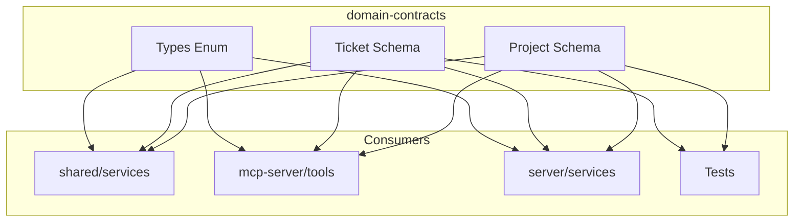

# Architecture: MDT-101

**Source**: [MDT-101](../../../docs/CRs/MDT/MDT-101.md)
**Generated**: 2025-12-19
**Complexity Score**: 13

## Overview

This architecture extracts domain entities (Project and Ticket) into a standalone domain-contracts package with Zod schemas as the single source of truth. The migration separates type definitions from implementation logic, enabling runtime validation across all interfaces (CLI, MCP, UI) while maintaining zero internal dependencies.

## Pattern

**Schema-First Domain Contracts** — Zod schemas define both runtime validation and TypeScript types, ensuring consistency across all interfaces.

Pattern application: Each domain entity lives in its own module with a Zod schema, derived TypeScript type, and test fixtures. The production API exports only schemas and types, while a separate testing subpath provides builders.

## Key Dependencies

| Capability | Package | Coverage | Rationale |
|------------|---------|----------|----------|
| Schema validation | zod | 100% | Mature, 5M weekly downloads, MIT license, TypeScript-first |

**Build Custom Decisions**:
| Capability | Reason | Estimated Size |
|------------|--------|---------------|
| Test fixtures | Domain-specific builders needed for testing | ~50 lines per entity |

## Component Boundaries



| Component | Responsibility | Owns | Depends On |
|-----------|----------------|------|------------|
| `domain-contracts/src/project/schema.ts` | Project entity definition | ProjectSchema, ProjectType | zod |
| `domain-contracts/src/ticket/schema.ts` | Ticket/CR entity definition | TicketSchema, TicketType | zod |
| `domain-contracts/src/types/schema.ts` | Shared enums | CRStatus, CRType | zod |
| `domain-contracts/src/index.ts` | Public API aggregation | All public exports | Internal modules |
| `domain-contracts/src/testing/index.ts` | Test utilities | Fixtures, builders | Production schemas |

## Shared Patterns

| Pattern | Occurrences | Extract To |
|---------|-------------|------------|
| Schema definition | project, ticket, types | `domain-contracts/src/{entity}/schema.ts` |
| Type derivation | project, ticket, types | Each schema file exports inferred type |
| Test fixture builder | project, ticket | `domain-contracts/src/testing/{entity}.fixtures.ts` |

> Phase 1 extracts schema patterns BEFORE creating dependent modules.

## Structure

```
domain-contracts/
├── package.json                 → Zero internal deps, zod only
├── src/
│   ├── index.ts                → Production API aggregate
│   ├── project/
│   │   ├── schema.ts          → ProjectSchema + Project type
│   │   └── index.ts           → Project exports
│   ├── ticket/
│   │   ├── schema.ts          → TicketSchema + CR type
│   │   └── index.ts           → Ticket exports
│   ├── types/
│   │   ├── schema.ts          → Enum schemas (CRStatus, CRType)
│   │   └── index.ts           → Enum exports
│   └── testing/
│       ├── index.ts           → Testing utilities aggregate
│       ├── project.fixtures.ts → Project test builders
│       └── ticket.fixtures.ts  → Ticket test builders
└── dist/                      → Compiled output
```

## Size Guidance

| Module | Role | Limit | Hard Max |
|--------|------|-------|----------|
| `domain-contracts/src/project/schema.ts` | Entity definition | 150 | 225 |
| `domain-contracts/src/ticket/schema.ts` | Entity definition | 200 | 300 |
| `domain-contracts/src/types/schema.ts` | Enum definitions | 50 | 75 |
| `domain-contracts/src/{entity}/index.ts` | Export module | 20 | 30 |
| `domain-contracts/src/testing/{entity}.fixtures.ts` | Test builders | 100 | 150 |
| `domain-contracts/src/index.ts` | Public API | 30 | 45 |

## Error Scenarios

| Scenario | Detection | Response | Recovery |
|----------|-----------|----------|----------|
| Invalid Project data | Zod parse error at API boundary | Reject with 400 + validation details | Client fixes data and resubmits |
| Invalid Ticket data | Zod parse error in MCP tool | Tool returns error with validation failures | MCP client corrects request |
| Schema mismatch | TypeScript compilation error | Build fails | Update consumer to match schema |

## Refactoring Plan

### Transformation Matrix
| Component | From | To | Reduction | Reason |
|-----------|------|----|-----------|--------|
| Project type | `shared/models/Project.ts` (206 lines) | `domain-contracts/src/project/schema.ts` (150 lines) | 27% | Pure definition, remove unused parts |
| Ticket type | `shared/models/Ticket.ts` (172 lines) | `domain-contracts/src/ticket/schema.ts` (200 lines) | -16% | Add validation rules |
| Shared enums | `shared/models/Types.ts` (80 lines) | `domain-contracts/src/types/schema.ts` (50 lines) | 38% | Extract only enums |

### Interface Preservation
| Public Interface | Status | Verification |
|------------------|--------|--------------|
| `Project` type | Preserved | Zod infer maintains same shape |
| `CR` type | Preserved | Zod infer maintains same shape |
| `CRStatus` enum | Preserved | Same values, now with runtime validation |
| `CRType` enum | Preserved | Same values, now with runtime validation |

### Behavioral Equivalence
- Test suite: New schema validation tests ensure identical shape validation
- Performance: Zod parsing adds ~1-2ms per validation at boundaries
- Migration: Consumers update imports, functionality unchanged

## Extension Rule

To add {X} entity:
1. Create `domain-contracts/src/{entity}/schema.ts` (limit 150 lines) with Zod schema
2. Create `domain-contracts/src/{entity}/index.ts` (limit 20 lines) exporting schema and type
3. Add exports to `domain-contracts/src/index.ts`
4. Create `domain-contracts/src/testing/{entity}.fixtures.ts` (limit 100 lines) for tests

---
*Generated by /mdt:architecture*