# Architecture: MDT-101

**Source**: [MDT-101](../../../docs/CRs/MDT/MDT-101.md)
**Generated**: 2025-12-20
**Complexity Score**: 11

## 1. Executive Summary

Domain-contracts package extracts entity definitions into standalone contracts with Zod schemas as the single source of truth. Contracts provide field-level validation only, while all business logic lives in services. This separation ensures zero internal dependencies and enables consistent validation across all interfaces (CLI, MCP, UI).

**Implementation Status**:
- **Phase 1** ✅: Core entities (Project, Ticket) with basic field validation
- **Phase 1.1** 📋: Enhanced Project field validation patterns
- **Phase 1.2** 📋: Enhanced Ticket field validation patterns
- **Phase 2** 📋: Additional contracts (Template, Config, Counter)

**Key Achievement**: Centralized type definitions with runtime validation while maintaining clean separation between contracts (shapes) and services (rules).

## 2. Design Principles

| Principle | Contract Layer | Service Layer |
|-----------|----------------|---------------|
| **Purpose** | Define data shapes | Enforce business rules |
| **Validation** | Field-level only (type, format, regex, required) | Cross-field, state transitions, migrations |
| **Dependencies** | Zero internal deps (only zod) | Can depend on contracts and other services |
| **Examples** | `email.regex(/@/)` | `if (user.email && user.isEmailVerified)` |
| **Forbidden** | Business logic, cross-field checks | None (handles all logic) |

### 2.1 Validation Boundary

```mermaid
graph LR
    subgraph "API Boundary"
        A[Raw Input: unknown]
    end
    subgraph "Contract Layer"
        B[Schema.parse<br/>→ Shape validation only]
        C[Type: inferred from schema]
    end
    subgraph "Service Layer"
        D[Business Rules<br/>Cross-field validation<br/>State transitions]
    end

    A --> B
    B --> C
    C --> D
```



## 3. Domain Contracts Specification

### 3.1 Package Structure

```
domain-contracts/
├── package.json                 → { "dependencies": { "zod": "^3.x" } }
├── src/
│   ├── index.ts                → Production exports (no testing)
│   ├── {entity}/               → One per domain entity
│   │   ├── schema.ts          → Zod schemas with field validation
│   │   ├── validation.ts      → parse/safeParse wrappers only
│   │   └── index.ts           → Public exports for entity
│   └── testing/               → Separate subpath
│       ├── index.ts           → Entry point for @mdt/domain-contracts/testing
│       └── {entity}.fixtures.ts → Test builders
```

### 3.2 Required File Patterns

**schema.ts (Entity definition)**
```typescript
import { z } from 'zod';

// Entity schema with field validation ONLY
export const ProjectSchema = z.object({
  key: z.string().regex(/^[A-Z]{2,5}$/, '2-5 uppercase letters'),
  name: z.string().min(1, 'Required'),
  active: z.boolean(),
  // NO cross-field validation
});

// Input schemas (derived from entity)
export const CreateProjectInputSchema = ProjectSchema.pick({
  key: true,
  name: true,
  active: true,
});

// TypeScript types (inferred)
export type Project = z.infer<typeof ProjectSchema>;
export type CreateProjectInput = z.infer<typeof CreateProjectInputSchema>;
```

**validation.ts (Wrapper functions only)**
```typescript
import { ProjectSchema, CreateProjectInputSchema } from './schema';

// Simple validation wrappers - NO business logic
export function validateProject(input: unknown): Project {
  return ProjectSchema.parse(input);
}

export function safeValidateProject(input: unknown) {
  return ProjectSchema.safeParse(input);
}

export function validateCreateProjectInput(input: unknown): CreateProjectInput {
  return CreateProjectInputSchema.parse(input);
}
```

### 3.3 Validation Rules (What's Allowed)

| Validation Type | Location | Example |
|-----------------|----------|---------|
| Type checking | Contract schema | `z.string()` |
| Format validation | Contract schema | `email: z.string().email()` |
| Regex patterns | Contract schema | `code: z.string().regex(/^[A-Z]{2,5}$/)` |
| Required fields | Contract schema | `name: z.string().min(1)` |
| Length constraints | Contract schema | `title: z.string().max(200)` |
| Enum values | Contract schema | `status: z.enum(['active', 'inactive'])` |
| **Cross-field checks** | **Service layer** | `if (user.email && !user.emailVerified)` |
| **State transitions** | **Service layer** | `canTransition(status, newStatus)` |
| **Business rules** | **Service layer** | `validateBusinessRules(data)` |

## 4. Implementation Phases

### 4.1 Phase 1: Core Entities ✅ **IMPLEMENTED**

**Scope**: Project and Ticket/CR entities with basic field validation

**Deliverables**:
- `domain-contracts/src/project/schema.ts` - Project entity with field validation
- `domain-contracts/src/project/validation.ts` - Validation wrapper functions
- `domain-contracts/src/ticket/schema.ts` - Ticket/CR entity with field validation
- `domain-contracts/src/ticket/validation.ts` - Validation wrapper functions
- `domain-contracts/src/types/schema.ts` - Shared enums (CRStatus, CRType)
- Test fixtures for all entities

**Size Limits**:
- Schema files: 150-200 lines
- Validation files: 75 lines (wrapper functions only)
- Test fixtures: 100-150 lines

### 4.2 Phase 1.1: Enhanced Project Validation **PLANNED**

**Scope**: Add field-level validation patterns to Project schema

**Deliverables**:
- Enhanced `domain-contracts/src/project/schema.ts` with additional field validation
- Extended `domain-contracts/src/project/validation.ts` with new input schemas
- Updated test fixtures covering edge cases

**Validation Rules to Add**:
- Project code format validation: `^[A-Z][A-Z0-9]{1,4}$` (2-5 chars)
- Path format validation (relative vs absolute)
- Basic email format for assignee (if provided)
- Date format validation (ISO 8601)
- String length constraints

**Business Logic in Services** (separate from contracts):
- Cross-field validation (e.g., path consistency rules)
- Legacy format migration logic
- Complex business rules

**Size Limits**:
- Schema file: 225 lines (expanded)
- Validation file: 112 lines (expanded)
- Test fixtures: 225 lines (expanded)

### 4.3 Phase 1.2: Enhanced Ticket Validation **PLANNED**

**Scope**: Add field-level validation patterns to Ticket schema

**Deliverables**:
- Enhanced `domain-contracts/src/ticket/schema.ts` with ticket-specific field validation
- Extended `domain-contracts/src/ticket/validation.ts` with input schemas
- Updated test fixtures covering ticket validation

**Validation Rules to Add**:
- Ticket code format validation: `^[A-Z][A-Z0-9]{2,4}-\d{3,4}$` (e.g., "MDT-101")
- Title length constraints (max 200 characters)
- Date format validation and ordering
- URL format validation for links
- Basic markdown structure validation (frontmatter presence)

**Business Logic in Services** (separate from contracts):
- Status transition validation
- Circular dependency detection
- Content section validation
- Relationship integrity checks

**Size Limits**:
- Schema file: 300 lines (expanded)
- Validation file: 112 lines (expanded)
- Test fixtures: 225 lines (expanded)

### 4.4 Phase 2: Additional Contracts **CONSIDERING**

**Scope**: Template, Configuration, Counter, and Validation contracts

**New Entities**:
- **Template**: Template entity, TemplateSection (field validation only)
- **Config**: StatusConfig, AttributeConfig, ServerConfig (field validation only)
- **Counter**: CounterConfig, CounterResponse, CounterError
- **Validation**: ValidationResult, ValidationError types (no logic)

**Implementation Pattern**: Same as Phase 1 - schema + validation wrappers + fixtures

### 4.3 What Will NOT Be Implemented

**Business logic that belongs in services**:
- ❌ Cross-field validation (e.g., "path must match ticketsPath")
- ❌ Status transition rules (e.g., "Rejected → In Progress not allowed")
- ❌ Migration logic (e.g., "convert legacy format")
- ❌ Relationship validation (e.g., "circular dependency detection")
- ❌ Content parsing (e.g., "markdown section validation")

These are implemented in `shared/services` using the contracts.

## 5. Decision Guide

### 5.1 Where Does Logic Go?

| Question | Answer | Location |
|----------|--------|----------|
| Is it a field format check? | Yes | Contract schema |
| Does it check one field only? | Yes | Contract schema |
| Does it compare multiple fields? | Yes | Service layer |
| Is it a state transition rule? | Yes | Service layer |
| Does it involve data migration? | Yes | Service layer |
| Is it a business rule? | Yes | Service layer |

### 5.2 Adding New Entity Checklist

**For Contracts**:
- [ ] Create `src/{entity}/schema.ts` with field validation only
- [ ] Create `src/{entity}/validation.ts` with parse/safeParse wrappers
- [ ] Create `src/{entity}/index.ts` exporting schema, type, validation
- [ ] Add to `src/index.ts`
- [ ] Create `src/testing/{entity}.fixtures.ts`
- [ ] Add to `src/testing/index.ts`

**For Services** (Separate repository):
- [ ] Implement business rules in `shared/services/{entity}.ts`
- [ ] Add cross-field validation
- [ ] Add state transition logic
- [ ] Add migration support if needed

## 6. Testing Strategy

### 6.1 Contract Tests (domain-contracts package)
```typescript
// Test field validation only
describe('ProjectSchema', () => {
  it('should reject invalid key format', () => {
    expect(() => ProjectSchema.parse({ key: 'invalid' }))
      .toThrow('2-5 uppercase letters');
  });

  it('should accept valid project', () => {
    expect(() => ProjectSchema.parse(validProject))
      .not.toThrow();
  });
});
```

### 6.2 Service Tests (shared package)
```typescript
// Test business rules
describe('projectService', () => {
  it('should validate cross-field rules', () => {
    expect(() => projectService.create({ active: false, path: undefined }))
      .toThrow('Inactive project must have path');
  });
});
```

### 6.3 Integration Tests
```typescript
// Test contract + service interaction
describe('Project Creation Flow', () => {
  it('should validate shape then business rules', async () => {
    // 1. Contract validates shape
    const validated = validateProject(input);

    // 2. Service validates business rules
    const result = await projectService.create(validated);

    expect(result).toBeDefined();
  });
});
```

## 7. Error Handling Pattern

### 7.1 Contract Errors (ZodError)
```typescript
{
  "issues": [
    {
      "code": "invalid_string",
      "path": ["key"],
      "message": "2-5 uppercase letters"
    }
  ],
  "name": "ZodError"
}
```

### 7.2 Service Errors (Custom)
```typescript
{
  "type": "BusinessRuleViolation",
  "field": "path",
  "message": "Inactive project must specify path",
  "code": "MISSING_PATH_FOR_INACTIVE"
}
```

## 8. Migration Strategy

### 8.1 From Current Implementation
| Component | From | To | Validation |
|-----------|------|----|------------|
| Project type | `shared/models/Project.ts` | `domain-contracts/src/project/schema.ts` | Shape preserved |
| Business rules | Mixed in models | `shared/services/project.ts` | Rules preserved |
| Type imports | Direct from shared | From domain-contracts | TypeScript enforced |

### 8.2 Consumer Migration
```typescript
// Before
import type { Project } from '../shared/models';
import { validate } from '../shared/validation';

// After
import type { Project, validateProject } from '@mdt/domain-contracts';
import { projectService } from '@mdt/shared/services';

// Usage
const validated = validateProject(input);  // Shape validation
const result = projectService.create(validated);  // Business logic
```

## 9. Size Limits

| Module Type | Role | Limit | Hard Max |
|-------------|------|-------|----------|
| Entity Schema | Field validation only | 150-200 | 300 |
| Validation File | parse/safeParse wrappers | 75 | 112 |
| Index File | Exports only | 20 | 30 |
| Test Fixtures | Builders for testing | 100-150 | 225 |
| Public API | Aggregated exports | 30 | 45 |

## 10. References

- **Requirements**: [domain-contracts-requirements.md](./domain-contracts-requirements.md)
- **Specification**: [domain-contracts.md](./domain-contracts.md)
- **Implementation**: See `domain-contracts/` package for Phase 1 completion

---

*Generated by /mdt:architecture*