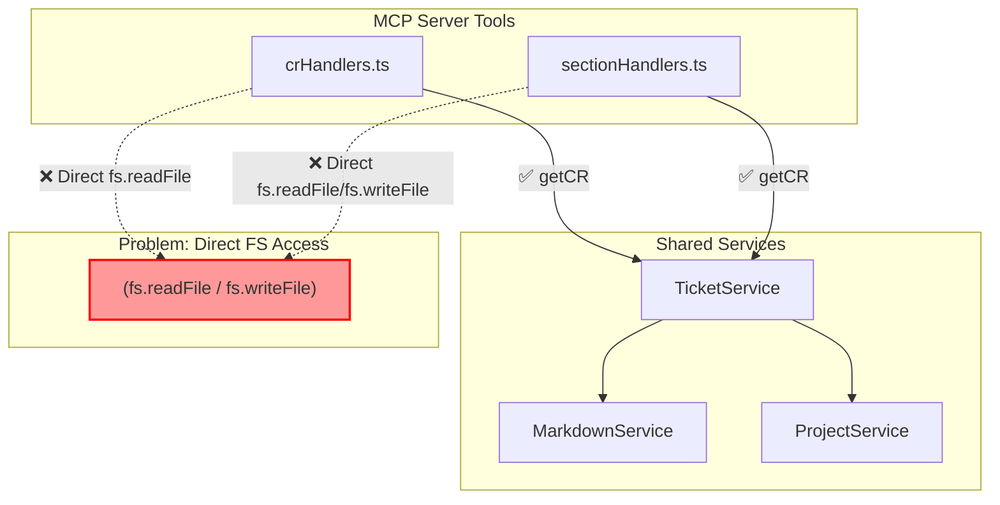
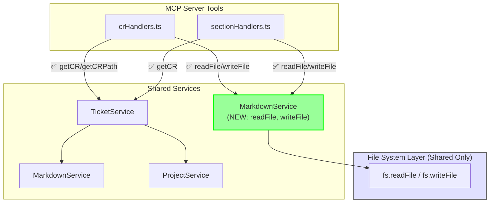

# Consolidate file I/O operations to shared services

## 1. Description

### Problem

- MCP server handlers (`crHandlers.ts`, `sectionHandlers.ts`) perform direct file I/O operations using `fs.readFile()` and `fs.writeFile()`
- Server properly uses shared services via adapter pattern, but MCP server handlers bypass shared layer for file operations
- File I/O logic scattered across handlers increases maintenance burden and risks inconsistent behavior
- Shared services should be the **single source of truth** for all file system operations

### Current State (Problematic)

| Handler | Line | Operation | Issue |
|---------|------|-----------|-------|
| `crHandlers.ts` | 104 | `fs.readFile(ticket.filePath)` | Direct FS, not using shared |
| `sectionHandlers.ts` | 103 | `fs.readFile(ticket.filePath)` | Direct FS, not using shared |
| `sectionHandlers.ts` | 170 | `fs.readFile(ticket.filePath)` | Direct FS, not using shared |
| `sectionHandlers.ts` | 232 | `fs.readFile(ticket.filePath)` | Direct FS, not using shared |
| `sectionHandlers.ts` | 376 | `fs.writeFile(ticket.filePath, ...)` | Direct FS, not using shared |

### Affected Areas

- MCP server tool handlers: Direct file I/O operations should delegate to shared services
- Shared services: Need new public methods for file operations (read/write file content)
- Integration pattern: MCP server should follow same delegation pattern as web server

### Scope

- **In scope**:
  - Add file I/O methods to `shared/services/MarkdownService.ts` (`readFile`, `writeFile`)
  - Make `TicketService.getCRPath()` public for path resolution access
  - Refactor MCP handlers to use shared service methods instead of direct `fs` calls
  - Add behavioral preservation tests before refactoring
- **Out of scope**:
  - Changes to web server code (already uses shared services correctly)
  - Modifying MCP tool interfaces or behavior
  - Changes to how Ticket objects are created or returned

### Architecture Visualization





## 2. Desired Outcome

### Success Conditions

- MCP server handlers perform all file I/O through shared services (`MarkdownService.readFile`, `MarkdownService.writeFile`)
- No direct `fs` imports or calls exist in MCP handler files
- Both server and MCP server use the same underlying shared services for file operations
- Change is transparent to MCP tool users (no behavior changes)
- Behavioral preservation tests exist for all affected handlers

### Constraints

- Must maintain existing MCP tool behavior and interfaces
- Must add behavioral preservation tests before refactoring (safety net)
- Must not break existing 213 MCP e2e tests
- Refactoring should reduce or maintain same lines of code (no net increase)

### Non-Goals

- Not changing web server code (already correct)
- Not modifying MCP tool interfaces or response formats
- Not changing business logic in handlers (only delegation layer)

## Architecture Design

> **Extracted**: Complex architecture — see [architecture.md](./architecture.md)

**Summary**:
- Pattern: Service Layer Consolidation — File I/O operations belong in shared services, not in request handlers
- Components: 5 (crHandlers, sectionHandlers, MarkdownService, TicketService, test files)
- Key constraint: Behavioral preservation refactoring — no interface changes

**Extension Rule**: To add file I/O operations, add methods to `MarkdownService.ts` (limit 30 lines per new method). Do NOT add direct fs calls to handlers.

## 3. Implementation Plan

### Part 1: Add Behavioral Preservation Tests (Critical First Step)

| Handler | Tests to Add | Behaviors to Lock |
|---------|--------------|-------------------|
| `crHandlers.ts` | Unit/integration tests | 15+ handler methods |
| `sectionHandlers.ts` | Unit/integration tests | 12+ handler methods |
| `shared/services/TicketService.ts` | Unit tests | 20+ methods (if not existing) |

**Test files to create:**
- `mcp-server/src/tools/handlers/__tests__/crHandlers.test.ts`
- `mcp-server/src/tools/handlers/__tests__/sectionHandlers.test.ts`

### Part 2: Extend Shared Services

| Service | New Methods | Purpose |
|---------|-------------|---------|
| `MarkdownService` | `static readFile(path: string): Promise<string>` | Encapsulate fs.readFile |
| `MarkdownService` | `static writeFile(path: string, content: string): Promise<void>` | Encapsulate fs.writeFile |
| `TicketService` | `public getCRPath(project: Project): Promise<string>` | Expose path resolution |

### Part 3: Refactor MCP Handlers

| File | Lines | Change |
|------|-------|--------|
| `crHandlers.ts` | 102-104 | Replace `fs.readFile` with `MarkdownService.readFile` |
| `sectionHandlers.ts` | 103, 170, 232, 376 | Replace `fs.readFile/fs.writeFile` with shared methods |
| Both handlers | - | Remove `import('fs/promises')` statements |

### Part 4: Verification

- Run all 213 MCP e2e tests
- Run new unit tests
- Verify no `fs.readFile` or `fs.writeFile` in handlers (grep check)

## 4. Acceptance Criteria

### Functional

- [ ] `MarkdownService.readFile()` and `writeFile()` methods added to shared services
- [ ] `TicketService.getCRPath()` exposed as public method
- [ ] MCP handlers (`crHandlers.ts`, `sectionHandlers.ts`) use shared service methods for file I/O
- [ ] No direct `fs.readFile()` or `fs.writeFile()` calls in MCP handlers
- [ ] All 213 MCP e2e tests pass without modification
- [ ] New unit tests for handlers pass (behavioral preservation)

### Non-Functional

- [ ] No net increase in lines of code (ideally reduction)
- [ ] Shared services remain the single source of truth for file operations
- [ ] Error handling for missing ticket files is preserved
- [ ] MCP tool interfaces and responses unchanged

## 5. Verification

### How to Verify Success

**Automated Checks:**
```bash
# Verify no direct fs operations in handlers
grep -r "fs\.readFile\|fs\.writeFile" mcp-server/src/tools/handlers/
# Expected: No results

# Verify new shared service methods exist
grep -q "readFile\|writeFile" shared/services/MarkdownService.ts
# Expected: Found

# Run MCP server tests (213 Jest E2E tests - NOT Playwright frontend tests)
npm test --workspace=mcp-server              # Unit tests
npm run test:e2e --workspace=mcp-server      # MCP server e2e tests
# Expected: All pass
```

**Note**: `npm run test:e2e` from root runs Playwright frontend tests. For MDT-102, use `npm run test:e2e --workspace=mcp-server` for the 213 MCP server Jest tests.

**Code Review Checks:**
- [ ] Handlers delegate to `MarkdownService` for file operations
- [ ] No `import('fs/promises')` or `import * as fs` in handler files
- [ ] Error handling preserved (file not found, permission errors, etc.)

**Behavioral Verification:**
- [ ] MCP tool responses identical before/after refactoring
- [ ] Section operations (list/get/replace/append/prepend) work correctly
- [ ] CR operations (get/create/update/delete) work correctly
