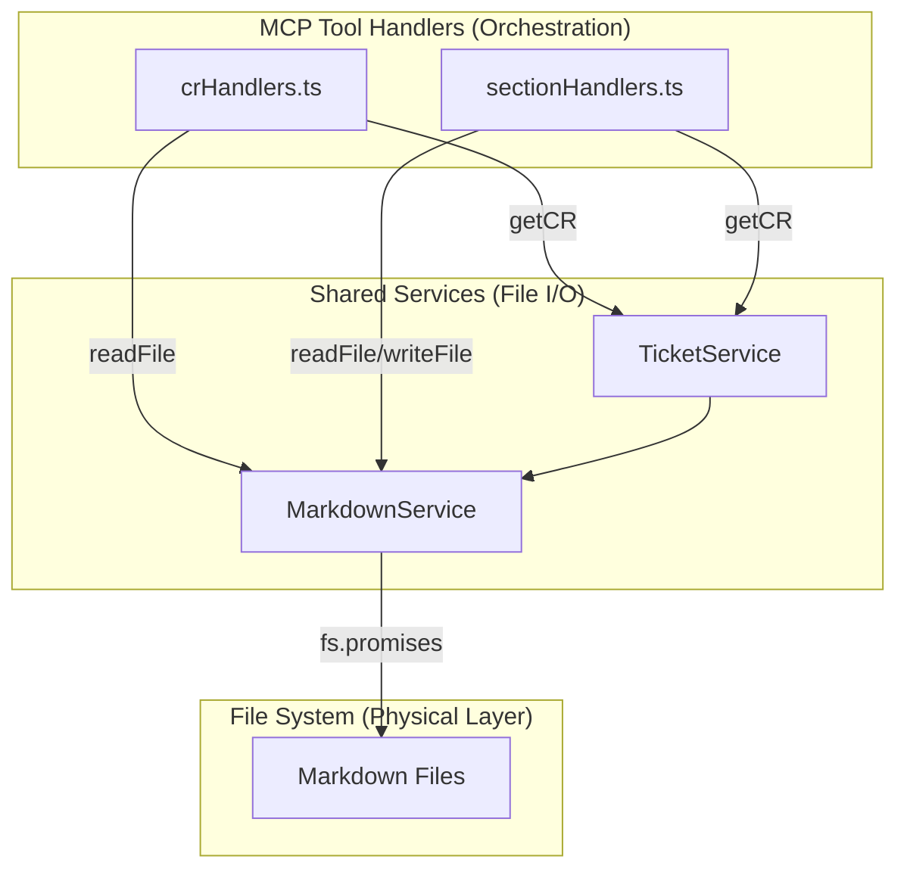

# Architecture: MDT-102

**Source**: [MDT-102](../MDT-102-consolidate-file-io-operations.md)
**Generated**: 2024-12-24
**Complexity Score**: 13

## Overview

Refactor MCP server handlers to eliminate direct file system operations by delegating to shared services. The transformation consolidates file I/O logic into `MarkdownService` as the single source of truth, ensuring consistent behavior across web server and MCP server.

**Key constraint**: This is a behavioral preservation refactoring — no changes to MCP tool interfaces or responses.

## Pattern

**Service Layer Consolidation** — File I/O operations belong in shared services, not in request handlers. Handlers orchestrate workflow; services perform file operations.

This pattern isolates system interaction (filesystem) from business logic (handler orchestration), enabling:
- Consistent error handling across all servers
- Single point of change for file operations
- Easier testing (mock services instead of fs)

## Key Dependencies

No external dependencies required. Using Node.js built-in `fs/promises` module.

| Capability | Build Custom | Reason |
|------------|--------------|--------|
| File I/O | Yes | Node.js built-in fs/promises, ~10 lines wrapper needed |

## Component Boundaries



| Component | Responsibility | Owns | Depends On |
|-----------|----------------|------|------------|
| `crHandlers.ts` | MCP tool orchestration, validation, response formatting | Handler logic | `CRService`, `MarkdownService` |
| `sectionHandlers.ts` | Section operation orchestration, content processing | Handler logic | `CRService`, `MarkdownSectionService`, `MarkdownService` |
| `MarkdownService` | File I/O operations, YAML parsing, markdown generation | fs operations | `fs/promises` |
| `TicketService` | Ticket CRUD, path resolution | Ticket lifecycle | `ProjectService`, `MarkdownService` |

## Shared Patterns

| Pattern | Occurrences | Extract To |
|---------|-------------|------------|
| File content reading | crHandlers:104, sectionHandlers:103,170,232 | `MarkdownService.readFile()` (static method) |
| File content writing | sectionHandlers:376 | `MarkdownService.writeFile()` (static method) |
| Error handling for file ops | All handlers | Handled by `MarkdownService` (propagates errors) |

> **Step 1 extracts these BEFORE refactoring handlers that use them.**

## Structure

```
shared/services/
  └── MarkdownService.ts           → Add readFile(), writeFile() methods
      ├── readFile(path)           → NEW: fs.readFile wrapper
      ├── writeFile(path, content) → NEW: fs.writeFile wrapper
      ├── parseMarkdownFile()      → EXISTING (uses fs.readFileSync)
      ├── writeMarkdownFile()      → EXISTING (uses fs.writeFileSync)
      └── ... (other methods)

mcp-server/src/tools/handlers/
  ├── crHandlers.ts                → REFACTOR: Remove fs.readFile calls
  └── sectionHandlers.ts           → REFACTOR: Remove fs.readFile/writeFile calls

mcp-server/src/tools/handlers/__tests__/
  ├── crHandlers.test.ts           → NEW: Behavioral preservation tests
  └── sectionHandlers.test.ts      → NEW: Behavioral preservation tests
```

## Size Guidance

| Module | Role | Limit | Hard Max |
|--------|------|-------|----------|
| `MarkdownService.ts` (new methods) | File I/O wrappers | 30 | 45 |
| `crHandlers.ts` (refactored) | Tool orchestration | 423 | 635 |
| `sectionHandlers.ts` (refactored) | Tool orchestration | 412 | 620 |
| `crHandlers.test.ts` | Behavioral tests | 300 | 450 |
| `sectionHandlers.test.ts` | Behavioral tests | 250 | 375 |

**Note**: Handler limits are current size × 1.5 (safety buffer for refactoring). Target is reduction through delegation.

## Error Scenarios

| Scenario | Detection | Response | Recovery |
|----------|-----------|----------|----------|
| File not found | fs throws ENOENT | Propagate as `ToolError.toolExecution` | Handler catches and returns error message |
| Permission denied | fs throws EACCES/EPERM | Propagate as `ToolError.toolExecution` | Handler catches and returns error message |
| Invalid YAML | Parse returns null | Throw parsing error | Handler returns validation error |
| File locked/busy | fs throws EBUSY/EMFILE | Propagate with retry hint | Handler returns error with guidance |

**Error propagation**: `MarkdownService` methods wrap fs errors with context (path, operation) and rethrow. Handlers catch and convert to `ToolError` for MCP protocol compliance.

## Refactoring Plan

### Transformation Matrix

| Component | From | To | Reduction | Reason |
|-----------|------|----|-----------|--------|
| File reading | Handlers: `import('fs/promises'); fs.readFile()` | `MarkdownService.readFile()` | ~5 lines → 1 line | Consolidate fs access |
| File writing | Handlers: `import('fs/promises'); fs.writeFile()` | `MarkdownService.writeFile()` | ~5 lines → 1 line | Consolidate fs access |
| Path resolution | `TicketService.getCRPath()` (private) | `TicketService.getCRPath()` (public) | No change (visibility only) | Expose for consistency |

### Interface Preservation

| Public Interface | Status | Verification |
|------------------|--------|--------------|
| MCP tool responses | Preserved | Existing 213 e2e tests |
| Handler method signatures | Preserved | No changes to parameter types |
| Error messages | Preserved | Behavioral tests verify output |
| `ticket.filePath` usage | Preserved | Still populated by shared services |

### Behavioral Equivalence

**Test suite**:
- 213 existing MCP e2e tests (verify end-to-end behavior)
- New behavioral preservation tests (verify handler-level behavior)

**Performance**: No impact expected — same underlying fs operations, just delegated through shared service.

**Migration**: No migration steps — internal refactoring only, transparent to MCP clients.

## Implementation Sequence

### Step 1: Add Tests (Critical - Do Not Skip)

Create behavioral preservation tests **before** any refactoring:

```bash
# Create test files
mcp-server/src/tools/handlers/__tests__/crHandlers.test.ts
mcp-server/src/tools/handlers/__tests__/sectionHandlers.test.ts
```

**Each test**:
1. Calls handler method with test input
2. Captures output (response string or error)
3. Verifies against expected value
4. Run tests and ensure they PASS (locks current behavior)

### Step 2: Extend Shared Services

Add to `shared/services/MarkdownService.ts`:

```typescript
/**
 * Read file content asynchronously
 * @throws Error with context (path, operation) if fs fails
 */
static async readFile(filePath: string): Promise<string> {
  try {
    const fs = await import('fs/promises');
    return await fs.readFile(filePath, 'utf-8');
  } catch (error) {
    throw new Error(`Failed to read file ${filePath}: ${(error as Error).message}`);
  }
}

/**
 * Write file content asynchronously
 * @throws Error with context (path, operation) if fs fails
 */
static async writeFile(filePath: string, content: string): Promise<void> {
  try {
    const fs = await import('fs/promises');
    await fs.writeFile(filePath, content, 'utf-8');
  } catch (error) {
    throw new Error(`Failed to write file ${filePath}: ${(error as Error).message}`);
  }
}
```

Make `TicketService.getCRPath()` public in `shared/services/TicketService.ts`.

### Step 3: Refactor Handlers

Replace each occurrence:

| Location | From | To |
|----------|------|----|
| `crHandlers.ts:102` | `const fs = await import('fs/promises'); const fileContent = await fs.readFile(...)` | `const fileContent = await this.markdownService.readFile(...)` |
| `sectionHandlers.ts:103,170,232` | Same pattern | Same replacement |
| `sectionHandlers.ts:376` | `await fs.writeFile(...)` | `await this.markdownService.writeFile(...)` |

Remove `import('fs/promises')` statements from handler files.

### Step 4: Verify

```bash
# 1. Run behavioral tests (must still pass)
npm test --workspace=mcp-server -- src/tools/handlers/__tests__/

# 2. Run MCP server e2e tests (213 tests - Jest, NOT Playwright)
npm run test:e2e --workspace=mcp-server

# 3. Verify no direct fs operations remain
grep -r "fs\.readFile\|fs\.writeFile" mcp-server/src/tools/handlers/
# Expected: No results

# 4. Verify new methods exist
grep -q "readFile\|writeFile" shared/services/MarkdownService.ts
# Expected: Found
```

**Note**: There are two `test:e2e` scripts:
- `npm run test:e2e` from root → Playwright tests for React frontend (NOT relevant for MDT-102)
- `npm run test:e2e --workspace=mcp-server` → Jest tests for MCP server (THESE are the 213 tests)

## Extension Rule

To add file I/O operations: Add methods to `MarkdownService.ts` (limit 30 lines for new methods) following the pattern:
1. Wrap fs operation in try/catch
2. Throw errors with context (path, operation)
3. Return typed values (Promise<string> for read, Promise<void> for write)

Do NOT add direct fs calls to handlers or controllers.

---
*Generated by /mdt:architecture*
