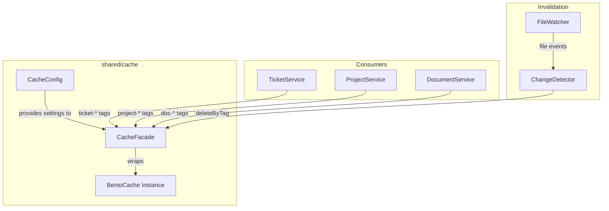

# Architecture: MDT-105

**Source**: [MDT-105](../MDT-105-unify-and-make-cache-configurable-across-backend-s.md)
**Generated**: 2025-12-27
**Complexity Score**: 12

## Overview

Unify 5 scattered cache implementations into a single shared cache module using `bentocache` as the foundation. The module provides namespaced caches with **tag-based invalidation**, enabling efficient group operations like "invalidate all files for project X". Configuration flows from global config file with environment variable overrides.

## Pattern

**Facade over Bentocache** — `bentocache` provides core caching with tags and namespaces; our facade adds global configuration and consistent API across all services.

bentocache was chosen because:
- **Native tagging** — invalidate groups of entries without scanning (client-side tagging via invalidation timestamps)
- **Namespaces** — logical grouping of cache keys (e.g., `projects`, `files`)
- **TypeScript-first** with ESM support
- **Memory driver** with built-in LRU (`maxSize`) and TTL
- Active maintenance, inspired by FusionCache

## Key Dependencies

| Capability | Package | Rationale |
|------------|---------|-----------|
| Cache storage with TTL + Tags | `bentocache` | Native tagging, namespaces, TypeScript, active community |
| In-memory store | `bentocache/drivers/memory` | Built-in LRU + TTL via `maxSize` option |

**Build Custom**:
| Capability | Reason | Estimated Size |
|------------|--------|----------------|
| Config integration | Project-specific config loading (global config file + env vars) | ~50 lines |
| Facade wrapper | Thin wrapper for consistent API + pass-through mode | ~40 lines |

## Component Boundaries



| Component | Responsibility | Owns | Depends On |
|-----------|----------------|------|------------|
| `CacheFacade` | Wrap bentocache, add pass-through mode | API surface | `CacheConfig`, `bentocache` |
| `CacheConfig` | Load and validate config | Config values | Global config file, env vars |
| `BentoCache` (bentocache) | Store/retrieve entries with tags | Entry storage, tag tracking | `memoryDriver` |
| `ChangeDetector` | Compare old/new content, determine what changed | Change classification | `CacheFacade` |

## Structure

```
shared/
├── cache/
│   ├── index.ts              → Public API exports
│   ├── facade.ts             → BentoCache wrapper + pass-through mode
│   ├── config.ts             → Configuration loading
│   ├── change-detector.ts    → Compare content, classify changes
│   └── types.ts              → TypeScript interfaces
└── services/
    ├── project/
    │   └── ProjectService.ts       → (migrate to use cache facade)
    ├── TicketService.ts            → (migrate to use cache facade)
    └── DocumentService.ts          → (migrate to use cache facade)
```

## Size Guidance

| Module | Role | Limit | Hard Max |
|--------|------|-------|----------|
| `shared/cache/facade.ts` | Wrapper + pass-through mode | 60 | 90 |
| `shared/cache/config.ts` | Config loading + validation | 50 | 75 |
| `shared/cache/change-detector.ts` | Compare content, classify changes | 80 | 120 |
| `shared/cache/types.ts` | TypeScript interfaces | 30 | 45 |
| `shared/cache/index.ts` | Public API re-exports | 15 | 20 |

**Total new code**: ~235 lines (includes change detection logic for smart invalidation)

## Configuration Flow

```
Priority (highest to lowest):
1. MDT_CACHE_DISABLE=true     → Pass-through mode
2. [system.cache].enable=false → Pass-through mode
3. MDT_CACHE_TIMEOUT           → Override TTL
4. [system.cache].ttl          → Config file TTL
5. Default (enabled, 30000ms, 10mb maxSize)
```

## API Design

```typescript
// Facade API
import { getCache } from '@mdt/shared/cache'

const cache = getCache()

// Cache ticket metadata with entity-centric tags
await cache.getOrSet({
  key: 'ticket:MDT-001:meta',
  factory: () => extractFrontmatter(filePath),
  tags: ['ticket-MDT-001', 'ticket-MDT-001-meta', 'tickets-list']
})

// Cache ticket content (no list tag — doesn't affect list view)
await cache.getOrSet({
  key: 'ticket:MDT-001:content',
  factory: () => extractBody(filePath),
  tags: ['ticket-MDT-001', 'ticket-MDT-001-content']
})

// Cache tickets list
await cache.getOrSet({
  key: 'tickets:all',
  factory: () => loadAllTickets(),
  tags: ['tickets-list']
})

// Get cached value
const meta = await cache.get({ key: 'ticket:MDT-001:meta' })

// Invalidate single ticket (all aspects)
await cache.deleteByTag({ tags: ['ticket-MDT-001'] })

// Invalidate tickets list (e.g., on create/delete)
await cache.deleteByTag({ tags: ['tickets-list'] })

// Invalidate ticket + list (e.g., on frontmatter change)
await cache.deleteByTag({ tags: ['ticket-MDT-001', 'tickets-list'] })
```

## Tagging Strategy

> **Extracted**: See [tagging-strategy.md](./tagging-strategy.md) for full entity-centric tagging design.

**Summary**: Tags are organized around **domain entities** (tickets, projects, documents), not file system concepts.

| Tag Type | Pattern | Example |
|----------|---------|---------|
| Entity instance | `{entity}-{id}` | `ticket-MDT-001` |
| Entity aspect | `{entity}-{id}-{aspect}` | `ticket-MDT-001-meta` |
| Collection list | `{entities}-list` | `tickets-list` |

### Key Insight: Aspect-Based Invalidation

Different aspects have different list impact:

| Aspect Changed | Invalidate List? | Reason |
|----------------|------------------|--------|
| Frontmatter (status, priority, title) | **Yes** | Affects board/list view |
| Body content | **No** | Only affects detail view |

### Change Detection

File watcher only knows "file changed". To invalidate correctly:
1. Read new file content
2. Compare frontmatter with cached version
3. If frontmatter changed → invalidate `{entity}-{id}-meta` + `{entities}-list`
4. If only body changed → invalidate `{entity}-{id}-content` only

See [tagging-strategy.md](./tagging-strategy.md) for implementation details.

## Cache Key Format

**Pattern**: `{entity}:{id}:{aspect}`

| Entity | Key Format | Tags | Example |
|--------|------------|------|---------|
| Ticket meta | `ticket:{code}:meta` | `ticket-{code}`, `ticket-{code}-meta`, `tickets-list` | `ticket:MDT-001:meta` |
| Ticket content | `ticket:{code}:content` | `ticket-{code}`, `ticket-{code}-content` | `ticket:MDT-001:content` |
| Tickets list | `tickets:all` | `tickets-list` | — |
| Project | `project:{code}:config` | `project-{code}`, `projects-list` | `project:MDT:config` |
| Projects list | `projects:all` | `projects-list` | — |

## Migration Strategy

| Service | Current File | After | Changes |
|---------|--------------|-------|---------|
| `ProjectCacheService` | `shared/services/project/ProjectCacheService.ts` | Use `cache.namespace('projects')` | Replace internal cache, add `list:projects` tag |
| `TitleExtractionService` | `shared/services/TitleExtractionService.ts` | Use `cache.namespace('files')` | Replace Map, add project tags |
| `ExtractMetadataCommand` | `server/commands/ExtractMetadataCommand.ts` | Use `cache.namespace('files')` | Replace Map, add `type:metadata` tag |
| `ReadFileCommand` | `server/commands/ReadFileCommand.ts` | Use `cache.namespace('files')` | Replace Map, add `type:content` tag |
| MCP Server | `mcp-server/src/config/index.ts` | `MDT_CACHE_TIMEOUT` | Hard break, remove `MCP_CACHE_TIMEOUT` |

**Breaking Change Migration**:
1. `MCP_CACHE_TIMEOUT` → `MDT_CACHE_TIMEOUT`
2. Update `docker-compose.yml` and `docker-compose.prod.yml`
3. Update `.env.example` files
4. Add migration note to release notes

## Error Scenarios

| Scenario | Detection | Response | Recovery |
|----------|-----------|----------|----------|
| Invalid TTL value | parseInt returns NaN | Log warning, use default | System continues with default |
| Cache disabled | `MDT_CACHE_DISABLE=true` | Pass-through mode | All `get()` returns undefined, `set()` is no-op |
| Bentocache failure | try/catch on operations | Log error, return undefined | Graceful degradation |
| High tag cardinality | Monitor tag count per entry | Warn if >5 tags | Keep tags minimal (1-3 per entry) |

## Domain Alignment

| Domain Concept | Implementation | Notes |
|----------------|----------------|-------|
| `Cache` (aggregate root) | `BentoCache` instance | Entry storage + TTL + tag tracking |
| Cache namespace | `cache.namespace('name')` | Logical grouping (projects, files) |
| Cache entry expires after TTL | bentocache internal | Lazy expiration on access |
| Cache size limit | `maxSize` in memory driver | Enforced by bentocache LRU |
| Tag-based invalidation | `deleteByTag()` | O(1) invalidation via timestamps |
| Disabled cache returns undefined | Pass-through mode in facade | Checked on every operation |
| `MDT_CACHE_DISABLE=true` overrides all | `CacheConfig` boundary | Checked at cache creation |

## Requirement Coverage

| Requirement | Component | Notes |
|-------------|-----------|-------|
| R1 (Cache Module API) | `shared/cache/facade.ts` | Facade wraps bentocache with consistent API |
| R2 (Cache Registry) | bentocache namespaces | Built-in via `cache.namespace()` |
| R3 (Global Configuration) | `shared/cache/config.ts` | Reads `[system.cache]` from global config |
| R4 (Env Var Overrides) | `shared/cache/config.ts` | `MDT_CACHE_DISABLE`, `MDT_CACHE_TIMEOUT` |
| R5 (TTL-Based Expiration) | bentocache internal | Lazy expiration |
| R6 (Size-Limited Caching) | bentocache memory driver | `maxSize` option |
| R7 (Service Migration) | Migration of 4 services | See Migration Strategy |
| R8 (Edge Case Handling) | Error handling in facade | See Error Scenarios |
| R9 (Tag-Based Invalidation) | `deleteByTag()` | Group invalidation without scanning |

**Coverage**: 9/9 requirements mapped (100%)

## Extension Rule

To add a new cached entity type (e.g., `comments`):
1. Define tag patterns in [tagging-strategy.md](./tagging-strategy.md):
   - Instance: `comment-{id}`
   - Aspect: `comment-{id}-{aspect}` (if needed)
   - Collection: `comments-list`
2. Add invalidation rules to change detector
3. Use `cache.getOrSet({ key, factory, tags })` (limit 5 lines of integration code)

---

## Implementation Phases

### Phase 1: Build the cache module
- [ ] Install `bentocache` dependency
- [ ] Create `shared/cache/config.ts` — load config + env vars
- [ ] Create `shared/cache/facade.ts` — wrap bentocache + pass-through mode
- [ ] Create `shared/cache/types.ts` — TypeScript interfaces
- [ ] Create `shared/cache/index.ts` — public exports
- [ ] Write unit tests for facade (pass-through, TTL, tags, deleteByTag)

### Phase 2: Integrate with consumers
- [ ] Migrate `ProjectService` → `project-{code}`, `projects-list` tags
- [ ] Migrate `TicketService` → `ticket-{key}`, `ticket-{key}-meta`, `tickets-list` tags
- [ ] Migrate `DocumentService` → `doc-{id}`, `docs-list` tags
- [ ] Update MCP server config (`MCP_CACHE_TIMEOUT` → `MDT_CACHE_TIMEOUT`)
- [ ] Ensure all existing tests pass

### Phase 3: Smart invalidation
- [ ] Create `shared/cache/change-detector.ts` — compare frontmatter vs body
- [ ] Wire file watcher `add` → invalidate `{entities}-list`
- [ ] Wire file watcher `unlink` → invalidate `{entity}-{id}`, `{entities}-list`
- [ ] Wire file watcher `change` → run change detector:
  - Frontmatter changed → invalidate `{entity}-{id}`, `{entities}-list`
  - Body only changed → invalidate `{entity}-{id}-content`
- [ ] Add logging for cache invalidation (debugging)

---
*Generated by /mdt:architecture*
