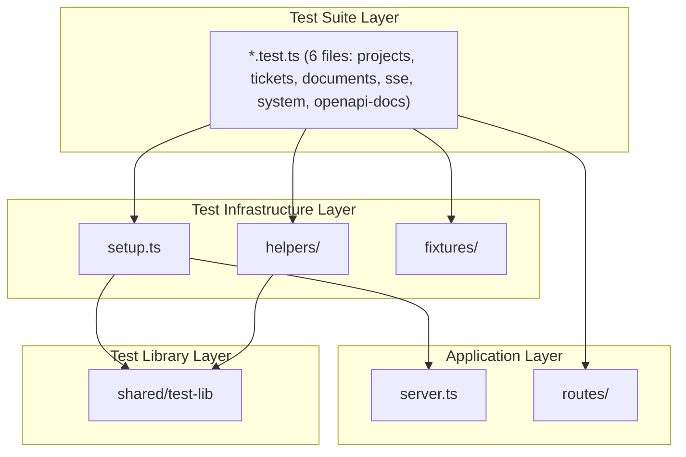
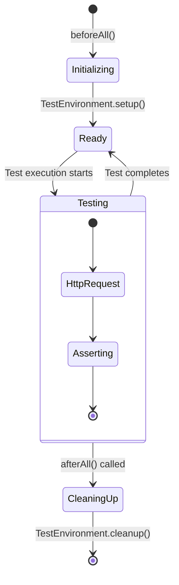

# Architecture: MDT-106

**Source**: [MDT-106](../MDT-106.md)
**Generated**: 2025-12-27
**Complexity Score**: 23 (Complex)

## Overview

MDT-106 establishes comprehensive E2E test coverage for all server API endpoints using the existing `shared/test-lib` infrastructure for isolated test environments. Tests run in temporary directories with custom port allocation, ensuring no interference with development servers and supporting concurrent execution via Jest's parallel test runner.

**Key Constraints**:
- Must use existing `shared/test-lib` (TestEnvironment, TestServer, ProjectFactory)
- Must use Supertest for HTTP requests without starting actual servers
- Tests must complete within 60 seconds total
- Must support concurrent execution without port conflicts
- Coverage target: >80% for API endpoints

## Pattern

**Test-Factory Pattern** — Centralized test setup and teardown with shared helpers ensures consistent environment isolation and reduces duplication across endpoint tests.

The pattern leverages Jest's lifecycle hooks (`beforeAll`, `afterAll`) combined with `shared/test-lib`'s `TestEnvironment` to create isolated test sessions. Helper functions extract common assertion logic, making tests more readable and maintainable.

## Key Dependencies

| Capability | Package | Coverage | Rationale |
|------------|---------|----------|-----------|
| Test runner | Jest | 100% | Already configured in server workspace, supports parallel execution out of the box |
| HTTP testing | Supertest | 100% | Specified in CR, industry standard for Express app testing |
| Contract validation | jest-openapi | 100% | Validates responses against server/openapi.yaml, catches API drift |
| Coverage | Istanbul/nyc | 100% | Specified in CR, integrates with Jest's `test:coverage` script |
| Test environment | @mdt/shared/test-lib | 100% | Existing infrastructure provides TestEnvironment, TestServer, ProjectFactory |

**Build Custom Decisions**:
| Capability | Reason | Estimated Size |
|------------|--------|---------------|
| SSE EventSource helper | Custom mock using Node's built-in `Event`/`EventTarget` — no additional dependency needed | ~50 lines |
| Test fixtures | Custom JSON/TS files, test-lib's ProjectFactory provides CR creation | ~30 lines per fixture |
| Assertion helpers | Custom functions for status/body/error checks align with test-lib patterns | ~75 lines |

## Component Boundaries



**Note**: SSE tests additionally use `helpers/sse.ts` for EventSource mocking. All tests share the same Setup → TestLib → App initialization pattern.

| Component | Responsibility | Owns | Depends On |
|-----------|----------------|------|------------|
| `server/tests/api/setup.ts` | Test environment lifecycle, OpenAPI initialization, Express app export | TestEnvironment instances, jest-openapi setup, Express app | `@mdt/shared/test-lib`, jest-openapi |
| `server/tests/api/helpers/request.ts` | Supertest request builders, HTTP method helpers | Request factory functions | Supertest, Express app |
| `server/tests/api/helpers/assertions.ts` | Assertion utilities for status, body, errors, OpenAPI contract validation | Assertion functions, toSatisfyApiSpec wrapper | Jest, jest-openapi |
| `server/tests/api/helpers/sse.ts` | EventSource wrapper for SSE testing | SSE client mock, event collection | Node built-in Event/EventTarget |
| `server/tests/api/fixtures/` | Test data fixtures (projects, CRs, documents) | JSON/TS fixture files | `@mdt/shared/test-lib` ProjectFactory |
| `server/tests/api/*.test.ts` | Endpoint-specific test suites | Test cases for each route | Helpers, fixtures, setup |

## State Flows



| State | Entry Condition | Exit Condition | Invariants |
|-------|-----------------|----------------|------------|
| Initializing | Test file loaded | TestEnvironment.setup() completes successfully | CONFIG_DIR environment variable set |
| Ready | Setup complete | First test begins | Temporary directory exists and is writable |
| Testing | Ready state | All tests pass/fail | No cross-test data leakage |
| CleaningUp | Testing complete | TestEnvironment.cleanup() completes | Temporary directory deleted |

## Shared Patterns

| Pattern | Occurrences | Extract To |
|---------|-------------|------------|
| OpenAPI spec initialization (jest-openapi) | All endpoint test files | `server/tests/api/setup.ts` |
| Test environment setup (TestEnvironment, ProjectFactory) | All endpoint test files | `server/tests/api/setup.ts` |
| HTTP request creation (Supertest + Express app) | All endpoint test files | `server/tests/api/helpers/request.ts` |
| Contract validation assertions (toSatisfyApiSpec) | All endpoint test files | `server/tests/api/helpers/assertions.ts` |
| Status code assertions (200, 400, 404, 500) | All endpoint test files | `server/tests/api/helpers/assertions.ts` |
| Response body structure validation | Projects, tickets, documents tests | `server/tests/api/helpers/assertions.ts` |
| Fixture data loading (projects, CRs) | Projects, tickets tests | `server/tests/api/fixtures/` |
| SSE EventSource connection and event verification | SSE endpoint tests | `server/tests/api/helpers/sse.ts` |

> **Phase 1 Extraction**: Implement `setup.ts`, `helpers/request.ts`, `helpers/assertions.ts`, and `helpers/sse.ts` BEFORE creating endpoint test files. This prevents duplication from the start.

## Structure

```
server/tests/api/
  ├── setup.ts                    → Test environment lifecycle, Express app export
  ├── helpers/
  │   ├── request.ts              → Supertest request builders (limit 75 lines)
  │   ├── assertions.ts           → Status/body/error assertions (limit 100 lines)
  │   └── sse.ts                  → EventSource wrapper for SSE testing (limit 75 lines)
  ├── fixtures/
  │   ├── projects.ts             → Test project fixtures (limit 50 lines)
  │   ├── tickets.ts              → Test CR/ticket fixtures (limit 75 lines)
  │   └── documents.ts            → Test document fixtures (limit 50 lines)
  ├── projects.test.ts            → /api/projects endpoint tests (limit 300 lines)
  ├── tickets.test.ts             → /api/tasks endpoint tests (limit 350 lines)
  ├── documents.test.ts           → /api/documents endpoint tests (limit 300 lines)
  ├── sse.test.ts                 → /api/events SSE endpoint tests (limit 250 lines)
  ├── system.test.ts              → System endpoint tests (limit 200 lines)
  └── openapi-docs.test.ts        → OpenAPI docs UI endpoint tests (limit 100 lines)
```

**server/server.ts changes**:
```diff
+ // Export Express app for Supertest testing (does not call listen())
+ export { app };
+
  // Start server only when run directly
  if (import.meta.url === `file://${process.argv[1]}`) {
    app.listen(PORT, async () => {
      // ... existing server startup code
    });
  }
```

## Size Guidance

| Module | Role | Limit | Hard Max |
|--------|------|-------|----------|
| `server/tests/api/setup.ts` | Environment orchestration | 100 | 150 |
| `server/tests/api/helpers/request.ts` | Request utilities | 75 | 110 |
| `server/tests/api/helpers/assertions.ts` | Assertion utilities | 125 | 185 |
| `server/tests/api/helpers/sse.ts` | SSE testing utilities | 75 | 110 |

### Application Integration

**Server Export Pattern**: To enable Supertest testing without starting a server, `server/server.ts` must export the Express app:

```typescript
// Export Express app for Supertest testing (does not call listen())
export { app };

// Start server only when run directly
if (import.meta.url === `file://${process.argv[1]}`) {
  app.listen(PORT, async () => { /* ... */ });
}
```

**Rationale**: This change allows tests to import the app directly without binding to a port. The existing `npm run dev:server` behavior is unchanged.
| `server/tests/api/fixtures/projects.ts` | Project fixtures | 50 | 75 |
| `server/tests/api/fixtures/tickets.ts` | Ticket/CR fixtures | 75 | 110 |
| `server/tests/api/fixtures/documents.ts` | Document fixtures | 50 | 75 |
| `server/tests/api/projects.test.ts` | Projects endpoint tests | 300 | 450 |
| `server/tests/api/tickets.test.ts` | Tickets endpoint tests | 350 | 525 |
| `server/tests/api/documents.test.ts` | Documents endpoint tests | 300 | 450 |
| `server/tests/api/sse.test.ts` | SSE endpoint tests | 250 | 375 |
| `server/tests/api/system.test.ts` | System endpoint tests | 200 | 300 |
| `server/tests/api/openapi-docs.test.ts` | OpenAPI docs UI endpoint tests | 100 | 150 |

**Size Rationale**:
- Helper files kept small (75-100 lines) to maintain simplicity and reusability
- Endpoint test files sized by complexity (tickets has most CRUD operations → largest, docs has only GET → smallest)

## Error Scenarios

| Scenario | Detection | Response | Recovery |
|----------|-----------|----------|----------|
| Port conflict during test setup | TestServer.start() throws | Retry with different port (TestServer handles internally) | Fail test after 3 retries |
| Temporary directory creation failure | TestEnvironment.setup() throws | Fail test immediately with clear error | Manual cleanup required |
| Express app import fails | Jest import error | Fail test with import error message | Fix server.ts export |
| Cleanup fails (temp dir locked) | afterAll() throws error | Log warning, continue (don't fail test) | Manual temp dir cleanup |
| Test timeout (>5s) | Jest testTimeout exceeded | Fail test with timeout message | Investigate slow assertion or fixture |
| SSE connection drops | EventSource error event | Fail test with connection error | Verify SSE endpoint health |
| Fixture file invalid (malformed YAML) | ProjectFactory.createTestCR() throws | Fail test with fixture validation error | Fix fixture file |

## Requirement Coverage

| Requirement | Component | Notes |
|-------------|-----------|-------|
| R1.1 | All `*.test.ts` files | 7 endpoint test files cover all routes |
| R1.2 | All `*.test.ts` files + `helpers/assertions.ts` | Success response verification via assertion helpers |
| R1.3 | All `*.test.ts` files + `helpers/assertions.ts` | Error case testing (400, 404, 500) |
| R2.1 | `setup.ts` | Uses TestEnvironment from shared/test-lib |
| R2.2 | `setup.ts` | TestServer port allocation prevents conflicts |
| R2.3 | `setup.ts` | Jest afterAll hooks call TestEnvironment.cleanup() |
| R3.1 | `fixtures/` + `setup.ts` | Fixtures stored in temp dirs via ProjectFactory |
| R3.2 | `setup.ts` | afterEach hooks delete test-specific data |
| R3.3 | All `*.test.ts` files | Test independence enforced by isolation pattern |
| R4.1 | `server/server.ts` | Named export of `app` (no listen()) |
| R4.2 | `helpers/request.ts` | Supertest integration in request helpers |
| R4.3 | `helpers/assertions.ts` | Response assertions extract status/body/headers |
| R5.1 | All `*.test.ts` files | Jest parallel execution + targeted assertions |
| R5.2 | `setup.ts` | TestServer port isolation prevents contention |
| R5.3 | Jest config | `testTimeout: 5000` in jest.config.js |
| R6.1 | All `*.test.ts` files + `helpers/assertions.ts` | 400 error tests in each endpoint suite |
| R6.2 | All `*.test.ts` files + `helpers/assertions.ts` | 404 error tests for missing resources |
| R6.3 | `tickets.test.ts` | Malformed YAML fixture + assertion |
| R6.4 | All `*.test.ts` files | File system error injection tests |
| R7.1 | `sse.test.ts` + `helpers/sse.ts` | EventSource wrapper verifies event delivery |
| R7.2 | `sse.test.ts` + `helpers/sse.ts` | Event sequence tracking |
| R7.3 | `sse.test.ts` + `helpers/sse.ts` | Connection failure handling tests |
| R8.1 | `setup.ts` + Jest config | No manual server setup required |
| R8.2 | Jest config | Istanbul/nyc coverage via `test:coverage` script |
| R8.3 | CI configuration | Jest exit code fails build on test failures |
| R9.1 | All `*.test.ts` files | Each test is independent via TestEnvironment isolation |
| R9.2 | `setup.ts` | TestEnvironment provides unique temp dirs per test |
| R9.3 | `setup.ts` | TestServer handles port conflicts with retry logic |

**Coverage**: 27/27 requirements mapped (100%).

## Extension Rule

To add E2E tests for a new endpoint:
1. Create `server/tests/api/{endpoint}.test.ts` (limit 300 lines for standard CRUD, 350 for complex endpoints)
2. Import test helpers: `import { createTestRequest, assertSuccess, assertError } from './helpers/index.js';`
3. Use `setup.ts` helpers in `beforeAll()` to initialize TestEnvironment
4. Add fixture data to appropriate `fixtures/*.ts` file if needed
5. Run `npm test -- {endpoint}.test.ts` to verify

Example pattern:
```typescript
import { createTestRequest, assertSuccess, assertNotFound, assertSatisfiesApiSpec } from './helpers/index.js';
import { setupTestEnvironment, cleanupTestEnvironment } from './setup.js';

describe('/api/new-endpoint', () => {
  let testEnv: TestEnvironment;
  let app: Express;

  beforeAll(async () => {
    ({ testEnv, app } = await setupTestEnvironment());
  });

  afterAll(async () => {
    await cleanupTestEnvironment(testEnv);
  });

  it('should return data on GET', async () => {
    const response = await createTestRequest(app).get('/api/new-endpoint');
    assertSuccess(response);
    assertSatisfiesApiSpec(response);  // Validates against server/openapi.yaml
    expect(response.body).toHaveProperty('data');
  });
});
```

To add a new test helper:
1. Add function to appropriate helper file in `server/tests/api/helpers/`
2. Export from `server/tests/api/helpers/index.ts`
3. Update helper file's size limit if approaching hard max

To add new fixture data:
1. Add fixture function to appropriate `fixtures/*.ts` file
2. Use ProjectFactory from `@mdt/shared/test-lib` for CR creation
3. Keep fixture files under their size limits (50-75 lines)

---
*Generated by /mdt:architecture*
