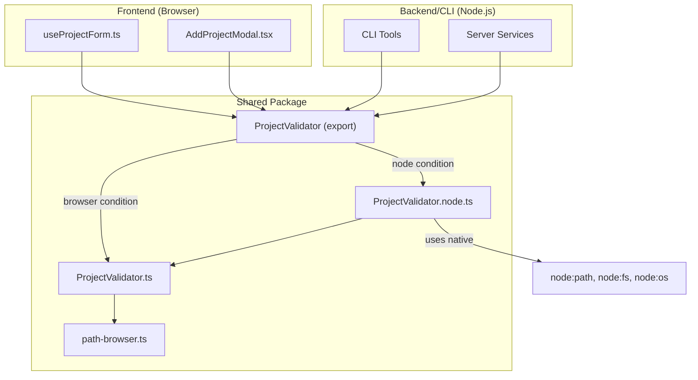

# Architecture: MDT-110

**Source**: [MDT-110](../MDT-110-fix-frontend-build-remove-nodejs-modules-from-brow.md)
**Generated**: 2025-12-28
**Complexity Score**: 7

## Overview

Fix frontend build failure caused by Node.js modules (`fs`, `os`, `path`) being bundled into browser code. Use package.json conditional exports to provide environment-specific implementations while keeping a single import path. No frontend import changes required.

## Pattern

**Conditional Exports** — Package.json `exports` field with `browser` and `node` conditions allows the bundler to select the correct implementation at build time, eliminating Node.js modules from browser bundles without code duplication.

This is the standard approach recommended by Node.js documentation and supported by Vite, webpack, and other modern bundlers.

## Key Dependencies

No external dependencies — uses native package.json `exports` field feature.

## Component Boundaries



| Component | Responsibility | Owns | Depends On |
|-----------|----------------|------|------------|
| `ProjectValidator.ts` | Browser-safe base validation | Form validation logic | `path-browser.ts` |
| `ProjectValidator.node.ts` | Node.js extension (filesystem) | Full path validation | `ProjectValidator.ts`, `node:fs/os/path` |
| `path-browser.ts` | Browser-safe path utilities | Path manipulation | None (pure functions) |

## Structure

```
shared/
  ├── package.json              → Add conditional exports
  ├── tools/
  │   ├── ProjectValidator.ts       → Browser-safe base (no fs/os/path imports)
  │   └── ProjectValidator.node.ts  → Node.js extension (adds filesystem support)
  └── utils/
      └── path-browser.ts       → Existing, no changes
```

### Naming Convention

**Rule**: `*.node.ts` files contain Node.js-specific code. Browser can import anything EXCEPT `*.node.ts`.

### Conditional Exports Configuration

**package.json** additions:

```json
{
  "exports": {
    "./tools/ProjectValidator": {
      "browser": "./dist/tools/ProjectValidator.js",
      "node": "./dist/tools/ProjectValidator.node.js",
      "default": "./dist/tools/ProjectValidator.node.js"
    }
  }
}
```

## Size Guidance

| Module | Role | Limit | Hard Max |
|--------|------|-------|----------|
| `ProjectValidator.ts` | Browser-safe base | 150 | 225 |
| `ProjectValidator.node.ts` | Node.js extension | 100 | 150 |
| `path-browser.ts` | Path utilities | 150 | 225 |

## Implementation Strategy

### Phase 1: Refactor Base Validator (Browser-Safe)

1. Modify existing `ProjectValidator.ts`:
   - Remove `import * as fs/os/path` at top
   - Keep imports from `path-browser.ts` only
   - Simplify `validatePath()` to format check only (no `mustExist`)
   - Simplify `expandTildePath()` to return path as-is

2. All methods remain (browser-safe):
   - `validateName()` — unchanged
   - `validateCode()` — unchanged
   - `validateDescription()` — unchanged
   - `validateRepository()` — unchanged
   - `validateTicketsPath()` — unchanged (already uses path-browser)
   - `isValidUrl()` — unchanged
   - `generateCodeFromName()` — unchanged
   - `validatePath()` — format check only
   - `expandTildePath()` — returns input unchanged

### Phase 2: Create Node.js Extension

1. Create `ProjectValidator.node.ts`:
   - Import base class from `./ProjectValidator`
   - Import `node:fs`, `node:os`, `node:path`
   - Override `validatePath()` with full `mustExist` support
   - Override `expandTildePath()` with `os.homedir()` expansion
   - Re-export everything else from base

### Phase 3: Update Package Exports

1. Modify `shared/package.json`:
   - Add conditional exports for `./tools/ProjectValidator`
   - Browser condition → `.js` (base)
   - Node condition → `.node.js` (extension)

### Phase 4: Verify Build

1. Run `npm run build:shared` — verify TypeScript compiles
2. Run `npm run build` — verify Vite builds without Node.js module errors
3. Test frontend validation works
4. Test CLI/server validation works

## Shared Interface

Both implementations must export identical interface:

```typescript
export interface ValidationResult {
  valid: boolean
  error?: string
  normalized?: string
}

export class ProjectValidator {
  static validateName(name: string): ValidationResult
  static validateCode(code: string): ValidationResult
  static validatePath(inputPath: string, options?: { mustExist?: boolean }): ValidationResult
  static validateDescription(description: string): ValidationResult
  static validateRepository(repository: string): ValidationResult
  static expandTildePath(inputPath: string): string
  static isValidUrl(urlString: string): boolean
  static generateCodeFromName(name: string): string
  static validateTicketsPath(ticketsPath: string): ValidationResult
}
```

## Behavioral Differences

| Method | Browser Behavior | Node.js Behavior |
|--------|-----------------|------------------|
| `validatePath()` | Format check only, always returns valid if format ok | Full filesystem check with `mustExist` support |
| `expandTildePath()` | Returns input unchanged (`~` not expanded) | Expands `~` to `os.homedir()` |
| All others | Identical | Identical |

## Error Scenarios

| Scenario | Detection | Response | Recovery |
|----------|-----------|----------|----------|
| Wrong export selected | Build still fails with fs error | Check Vite resolve config | Verify browser condition in package.json |
| Missing browser file | TypeScript compilation error | Create missing file | Follow Phase 1 |
| Interface mismatch | Runtime error in consumer | Ensure both files export same interface | Use shared interface definition |

## Extension Rule

To add a new validation method:
1. Add browser-safe logic to `ProjectValidator.ts`
2. If method needs filesystem access, override in `ProjectValidator.node.ts`
3. `*.node.ts` files can import Node.js modules; base files cannot

---
*Generated by /mdt:architecture*
