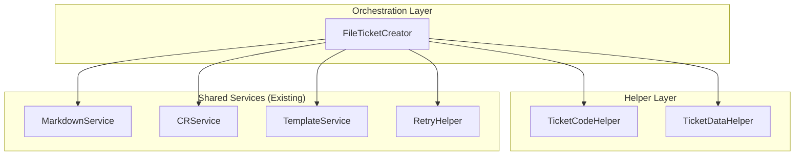
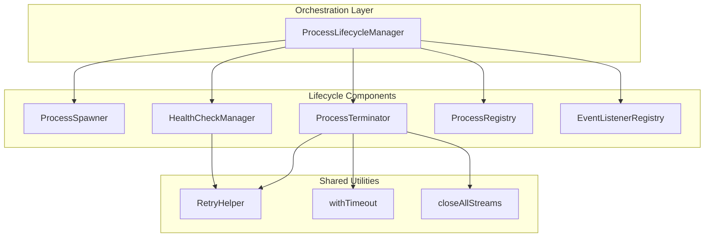
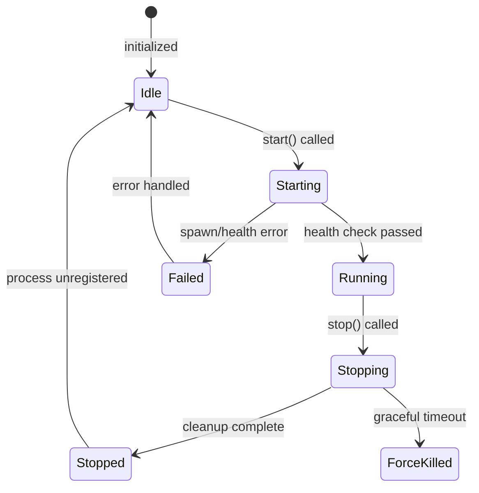

# Architecture: MDT-113 Sub-ticket 1

**Source**: [MDT-113](../../MDT-113.md)
**Generated**: 2026-01-02
**Complexity Score**: 22 (Complex)
**Phases**: 2

## Overview

Two-phase refactoring of test-lib components to reduce cyclomatic and cognitive complexity from RED to YELLOW/GREEN zones. Phase 1 focuses on `FileTicketCreator` (ticket creation workflow), Phase 2 focuses on `ProcessLifecycleManager` (process lifecycle orchestration). Both phases reuse existing shared services (`MarkdownService`, `CRService`, `RetryHelper`) rather than duplicating functionality.

**Key Constraints**:
- All public APIs must be preserved (behavior lock)
- No breaking changes to existing tests
- Target metrics: CC < 25, CoC < 35 (YELLOW zone minimum)
- Reuse existing services instead of creating duplicates

---

## Phase 1: FileTicketCreator Refactoring

### Pattern

**Service Delegation + Static Helpers** — FileTicketCreator delegates to focused static helpers while orchestrating existing shared services (`MarkdownService`, `CRService`, `TemplateService`).

### Rationale

The original `FileTicketCreator` (280 LOC, CoC 46) violated Single Responsibility Principle by handling:
- Ticket code generation logic
- Ticket data transformation and merging
- File I/O operations
- Retry logic (scattered across 10+ locations)

By extracting focused helpers and reusing existing shared services, we reduce complexity while maintaining the public API.

---

### Component Boundaries (Phase 1)



| Component | Responsibility | Owns | Depends On |
|-----------|----------------|------|------------|
| `FileTicketCreator` | Orchestrate ticket creation flow | Process lifecycle, template lookup | `TicketCodeHelper`, `TicketDataHelper`, `MarkdownService`, `CRService`, `TemplateService`, `RetryHelper` |
| `TicketCodeHelper` | Ticket code generation | Number scanning, code formatting, slug creation | `fs/promises` (readdir only) |
| `TicketDataHelper` | Ticket data transformation | Data merging, CR building, array↔string conversion | `CRService` |
| `MarkdownService` (existing) | File I/O | Markdown parsing/writing | - |
| `CRService` (existing) | Ticket creation | CR object instantiation | - |
| `RetryHelper` (existing) | Retry logic | Exponential backoff, timeout handling | - |

---

### Shared Patterns (Phase 1)

| Pattern | Occurrences | Extract To |
|---------|-------------|------------|
| Retry with exponential backoff | 10+ locations in FileTicketCreator | `RetryHelper` (existing) |
| Ticket data merge logic | 3 methods (create, update, read) | `TicketDataHelper.mergeTicketData()` |
| Array ↔ string conversion | `relatedTickets`, `dependsOn`, `blocks` | `TicketDataHelper.crToTicketData()` |
| Next number scanning | Duplicated in TicketService | `TicketCodeHelper.findNextNumber()` (new, shares pattern) |

> Phase 1 extracts `TicketCodeHelper` and `TicketDataHelper` BEFORE updating FileTicketCreator.

---

### Structure (Phase 1)

```
shared/test-lib/
  ├── ticket/
  │   ├── helpers/                    # NEW - Helper classes
  │   │   ├── TicketCodeHelper.ts     # Code generation (40 LOC)
  │   │   └── TicketDataHelper.ts     # Data transformation (50 LOC)
  │   └── file-ticket-creator.ts      # Refactored orchestrator (150 LOC)
  ├── services/
  │   ├── MarkdownService.ts          # EXISTING - Reuse directly
  │   ├── CRService.ts                # EXISTING - Reuse directly
  │   └── TemplateService.ts          # EXISTING - Reuse directly
  └── utils/
      └── retry-helper.ts             # EXISTING - Reuse directly
```

---

### Size Guidance (Phase 1)

| Module | Role | Limit | Hard Max |
|--------|------|-------|----------|
| `ticket/helpers/TicketCodeHelper.ts` | Code generation utilities | 40 | 60 |
| `ticket/helpers/TicketDataHelper.ts` | Data transformation utilities | 50 | 75 |
| `ticket/file-ticket-creator.ts` | Ticket creation orchestrator | 150 | 225 |

**Expected Improvement**:
- `FileTicketCreator`: CoC 46 → 12 (-74%), MI 24.41 → 48 (+97%)
- `TicketCodeHelper`: CoC ~5, MI ~75 (GREEN)
- `TicketDataHelper`: CoC ~5, MI ~72 (GREEN)

---

### Refactoring Plan (Phase 1)

#### Transformation Matrix

| Component | From | To | Reduction | Reason |
|-----------|------|----|-----------|--------|
| `FileTicketCreator` | `file-ticket-creator.ts` (280 LOC, CoC 46) | `file-ticket-creator.ts` (150 LOC, CoC 12) | 130 LOC, -34 CoC | Extract helpers, reuse services |
| `TicketCodeHelper` | (scattered in FileTicketCreator) | `helpers/TicketCodeHelper.ts` (40 LOC, CoC 5) | New file | Centralize code generation |
| `TicketDataHelper` | (scattered in FileTicketCreator) | `helpers/TicketDataHelper.ts` (50 LOC, CoC 5) | New file | Centralize data transformation |

#### Interface Preservation

| Public Interface | Status | Verification |
|------------------|--------|--------------|
| `FileTicketCreator.createTicket()` | Preserved | Existing tests in `__tests__/ticket-creator.test.ts` |
| `FileTicketCreator.readTicket()` | Preserved | Existing tests |
| `FileTicketCreator.updateTicket()` | Preserved | Existing tests |
| `FileTicketCreator.ticketExists()` | Preserved | Existing tests |
| `BaseTicketCreator` methods | Preserved | Base class unchanged |

#### Behavioral Equivalence

- **Test suite**: `shared/test-lib/__tests__/ticket-creator.test.ts` covers all public methods
- **Performance**: No expected impact (same operations, better organized)
- **Migration**: No migration needed (internal refactoring only)

---

## Phase 2: ProcessLifecycleManager Refactoring

### Pattern

**Component Decomposition + Orchestrator Pattern** — ProcessLifecycleManager becomes a thin orchestrator that coordinates focused, single-responsibility components for each lifecycle stage.

### Rationale

The original `ProcessLifecycleManager` (324 LOC, CoC 30, CC 57) exhibited the God Class anti-pattern by handling:
- Process spawning with environment configuration
- Health check implementation with retry logic
- Graceful shutdown with SIGKILL fallback
- Event listener management
- State tracking across multiple Maps

By extracting focused components (`HealthCheckManager`, `ProcessSpawner`, `ProcessTerminator`, `ProcessRegistry`), we achieve:
- Each component has a single, clear responsibility
- Components can be unit tested in isolation
- Main orchestrator simplifies to ~80 LOC
- Complexity reduces from RED to GREEN zone

---

### Component Boundaries (Phase 2)



| Component | Responsibility | Owns | Depends On |
|-----------|----------------|------|------------|
| `ProcessLifecycleManager` | Orchestrate process lifecycle | Workflow coordination, state transitions | All lifecycle components |
| `ProcessSpawner` | Process creation and setup | Child process spawning, stdio configuration | `child_process` module |
| `ProcessTerminator` | Process shutdown | SIGTERM/SIGKILL handling, stream cleanup | `tree-kill`, `withTimeout`, `closeAllStreams` |
| `HealthCheckManager` | Health verification | HTTP health checks, retry logic | `RetryHelper`, `http` module |
| `ProcessRegistry` | State tracking | Process entries, config storage, state validation | `EventListenerRegistry` pattern |
| `EventListenerRegistry` (existing) | Event management | Listener cleanup, emission | - |

---

### State Flows (Phase 2)



| State | Entry Condition | Exit Condition | Invariants |
|-------|-----------------|----------------|------------|
| `Idle` | Manager initialized, no processes | `start()` called | Registry empty |
| `Starting` | Process spawned, health check pending | Health check passes OR spawn fails | Process in registry, state='starting' |
| `Running` | Health check passed | `stop()` called | Process in registry, state='running' |
| `Stopping` | `stop()` called | Process exits OR timeout | Process in registry, state='stopping' |
| `Stopped` | Process cleanup complete | Process unregistered | Process removed from registry |
| `Failed` | Spawn or health check failed | Error handled | Error recorded, cleanup triggered |

---

### Shared Patterns (Phase 2)

| Pattern | Occurrences | Extract To |
|---------|-------------|------------|
| Retry with exponential backoff | `waitForHealthCheck()` (duplicate) | `RetryHelper` (existing) - use instead of duplicate |
| Timeout wrapping | `waitForProcessExit()` | `utils/timeout.ts` (new - `withTimeout`) |
| Stream cleanup | `stop()` method lines 112-126 | `utils/process-streams.ts` (new - `closeAllStreams`) |
| Map-based registry | Processes, configs, state Maps | `ProcessRegistry` (new - unified state) |

> Phase 2 extracts utilities (`withTimeout`, `closeAllStreams`) BEFORE extracting components that use them.

---

### Structure (Phase 2)

```
shared/test-lib/
  ├── core/
  │   ├── process-lifecycle-manager.ts  # Refactored orchestrator (~80 LOC)
  │   ├── health-check-manager.ts       # NEW - Health verification (60 LOC)
  │   ├── process-spawner.ts            # NEW - Process creation (40 LOC)
  │   ├── process-terminator.ts         # NEW - Process shutdown (70 LOC)
  │   ├── process-registry.ts           # NEW - State tracking (50 LOC)
  │   └── event-listener-registry.ts    # EXISTING - Event management
  ├── utils/
  │   ├── retry-helper.ts               # EXISTING - Reuse in HealthCheckManager
  │   ├── timeout.ts                    # NEW - withTimeout utility (10 LOC)
  │   └── process-streams.ts            # NEW - closeAllStreams utility (15 LOC)
  └── process-helper.ts                 # EXISTING - Reference for patterns
```

---

### Size Guidance (Phase 2)

| Module | Role | Limit | Hard Max |
|--------|------|-------|----------|
| `core/process-lifecycle-manager.ts` | Process lifecycle orchestrator | 80 | 120 |
| `core/health-check-manager.ts` | Health verification with retry | 60 | 90 |
| `core/process-spawner.ts` | Process creation and setup | 40 | 60 |
| `core/process-terminator.ts` | Process shutdown and cleanup | 70 | 105 |
| `core/process-registry.ts` | State tracking and queries | 50 | 75 |
| `utils/timeout.ts` | Timeout wrapping utility | 10 | 15 |
| `utils/process-streams.ts` | Stream cleanup utility | 15 | 22 |

**Expected Improvement**:
- `ProcessLifecycleManager`: CoC 30 → 10 (-67%), MI 23.46 → 48 (+105%), 324 LOC → 80 LOC
- All new components: GREEN zone (CoC < 15, MI > 40)

---

### Refactoring Plan (Phase 2)

#### Transformation Matrix

| Component | From | To | Reduction | Reason |
|-----------|------|----|-----------|--------|
| `ProcessLifecycleManager` | `process-lifecycle-manager.ts` (324 LOC, CoC 30, CC 57) | `process-lifecycle-manager.ts` (80 LOC, CoC 10, CC 12) | 244 LOC, -20 CoC, -45 CC | Extract focused components |
| `HealthCheckManager` | (lines 219-280 + 222-245 retry) | `core/health-check-manager.ts` (60 LOC, CoC ~8) | New file | Centralize health checks |
| `ProcessSpawner` | (lines 39-70) | `core/process-spawner.ts` (40 LOC, CoC ~5) | New file | Isolate spawn logic |
| `ProcessTerminator` | (lines 89-176 + 286-311) | `core/process-terminator.ts` (70 LOC, CoC ~10) | New file | Isolate shutdown logic |
| `ProcessRegistry` | (scattered state Maps) | `core/process-registry.ts` (50 LOC, CoC ~5) | New file | Unified state management |
| `withTimeout` | (inline in multiple places) | `utils/timeout.ts` (10 LOC) | Extract utility | Eliminate duplication |
| `closeAllStreams` | (lines 112-126) | `utils/process-streams.ts` (15 LOC) | Extract utility | Reusable cleanup |

#### Interface Preservation

| Public Interface | Status | Verification |
|------------------|--------|--------------|
| `ProcessLifecycleManager.start()` | Preserved | Existing integration tests |
| `ProcessLifecycleManager.stop()` | Preserved | Existing integration tests |
| `ProcessLifecycleManager.stopAll()` | Preserved | Existing integration tests |
| `ProcessLifecycleManager.isReady()` | Preserved | Existing integration tests |
| `ProcessLifecycleManager.getConfig()` | Preserved | Existing integration tests |
| `ProcessLifecycleManager.getProcess()` | Preserved | Existing integration tests |
| `ProcessLifecycleManager.dispose()` | Preserved | Existing integration tests |

#### Behavioral Equivalence

- **Test suite**: `shared/test-lib/__tests__/test-server.integration.test.ts` covers full lifecycle
- **Performance**: No expected impact (same operations, better organized)
- **Migration**: No migration needed (internal refactoring only)

---

## Key Dependencies (Both Phases)

### Reuse Existing Services

| Capability | Package | Coverage | Rationale |
|------------|---------|----------|----------|
| Markdown file I/O | `MarkdownService` | 100% | Already implements parse/write operations |
| Ticket object creation | `CRService` | 100% | Already implements `createTicket()` |
| Template lookup | `TemplateService` | 100% | Already implements template loading |
| Retry with backoff | `RetryHelper` | 100% | Already implements exponential backoff |
| Event management | `EventListenerRegistry` | 100% | Already used by ProcessLifecycleManager |

### Build Custom Decisions

| Capability | Reason | Estimated Size |
|------------|--------|---------------|
| Ticket code generation | Needs test-lib specific patterns (number scanning, padding) | 40 LOC |
| Ticket data transformation | Needs test-lib specific merge logic | 50 LOC |
| Health check manager | Needs server-specific health check logic | 60 LOC |
| Process spawner | Needs test-lib specific stdio configuration | 40 LOC |
| Process terminator | Needs test-lib specific graceful shutdown | 70 LOC |
| Process registry | Needs test-lib specific state tracking | 50 LOC |
| Timeout utility | Small utility, not worth dependency | 10 LOC |
| Stream cleanup utility | Small utility, specific to process management | 15 LOC |

---

## Error Scenarios (Phase 2)

| Scenario | Detection | Response | Recovery |
|----------|-----------|----------|----------|
| Spawn failure | `child_process.spawn()` throws | Reject promise, emit error event | Return to Idle state |
| Health check timeout | `withTimeout` rejects after max attempts | Reject promise, terminate process | Return to Idle state |
| Graceful shutdown timeout | `waitForExit` times out | Send SIGKILL via tree-kill | Return to Stopped state |
| Process already running | Registry check on `start()` | Throw error, prevent duplicate | Return to Idle state |
| Process not found | Registry check on `stop()` | Log warning, return early | Return to Idle state |

---

## Extension Rules

### Phase 1 (Ticket Creation)
To add a new ticket data field:
1. Update `TicketData` interface in `models/Ticket.ts`
2. Add merge logic to `TicketDataHelper.mergeTicketData()` (limit 50 LOC → 75 LOC max)
3. Update `TicketDataHelper.crToTicketData()` if array ↔ string conversion needed
4. Update `CRService.createTicket()` if default value needed

### Phase 2 (Process Lifecycle)
To add a new server type:
1. Add server config to `ServerConfig` type union
2. Add health check endpoint to `HealthCheckManager.waitForReady()` (limit 60 LOC → 90 LOC max)
3. Add spawn configuration to `ProcessSpawner.spawn()` (limit 40 LOC → 60 LOC max)
4. Add entry to `ProcessRegistry` state machine if new state needed (limit 50 LOC → 75 LOC max)

---

## Implementation Roadmap

### Phase 1: FileTicketCreator (Day 1)

1. **Create helpers** (2 hours)
   - Create `shared/test-lib/ticket/helpers/` directory
   - Create `TicketCodeHelper.ts` (40 LOC, CoC ~5)
   - Create `TicketDataHelper.ts` (50 LOC, CoC ~5)
   - Add unit tests for helpers

2. **Update FileTicketCreator** (2 hours)
   - Replace `generateTicketCode()` to use `TicketCodeHelper`
   - Replace ticket data logic with `TicketDataHelper`
   - Replace custom file I/O with `MarkdownService` calls
   - Remove now-unused private methods

3. **Testing** (1 hour)
   - Run existing tests: `cd shared/test-lib && npm test`
   - Run metrics: `scripts/metrics/run.sh shared/test-lib/ticket/file-ticket-creator.ts`
   - Verify CoC < 20, MI improvement

### Phase 2: ProcessLifecycleManager (Day 2)

1. **Quick wins** (1-2 hours)
   - Extract `withTimeout` to `shared/test-lib/utils/timeout.ts`
   - Extract `closeAllStreams` to `shared/test-lib/utils/process-streams.ts`
   - Replace inline retry logic with `RetryHelper` in `waitForHealthCheck()`

2. **Extract HealthCheckManager** (1.5 hours)
   - Create `shared/test-lib/core/health-check-manager.ts`
   - Extract health check logic (lines 219-280)
   - Update ProcessLifecycleManager to use HealthCheckManager
   - Write unit tests

3. **Extract ProcessSpawner** (1 hour)
   - Create `shared/test-lib/core/process-spawner.ts`
   - Extract spawn logic (lines 39-70)
   - Update ProcessLifecycleManager to use ProcessSpawner
   - Write unit tests

4. **Extract ProcessTerminator** (2 hours)
   - Create `shared/test-lib/core/process-terminator.ts`
   - Extract termination logic (lines 89-176 + 286-311)
   - Use new `withTimeout` and `closeAllStreams` utilities
   - Update ProcessLifecycleManager to use ProcessTerminator
   - Write unit tests

5. **Extract ProcessRegistry** (1 hour)
   - Create `shared/test-lib/core/process-registry.ts`
   - Extract state management (processes, configs Maps)
   - Update all state access in ProcessLifecycleManager
   - Write unit tests

6. **Final simplification** (1 hour)
   - Simplify ProcessLifecycleManager to thin orchestrator
   - Update integration tests
   - Run full test suite

7. **Verification** (0.5 hours)
   - Run `scripts/metrics/run.sh` to verify GREEN zone
   - Verify all e2e tests pass

**Total Estimated Time**: 12-14 hours (2 days)

---

## Success Criteria

- [ ] All existing tests pass without modification
- [ ] Phase 1 metrics: `FileTicketCreator` CoC < 20 (target: 12), MI > 40
- [ ] Phase 2 metrics: `ProcessLifecycleManager` CoC < 15, CC < 20, MI > 40
- [ ] All new components in GREEN zone (CoC < 15, MI > 40)
- [ ] No new TypeScript errors
- [ ] Integration tests pass
- [ ] Code review approved

---
*Generated by /mdt:architecture*
