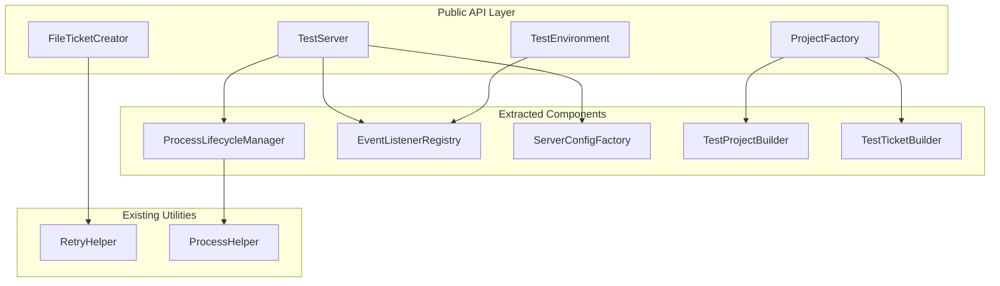
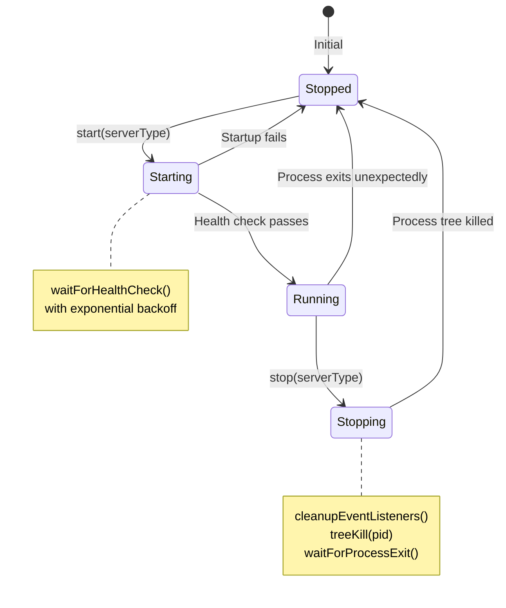
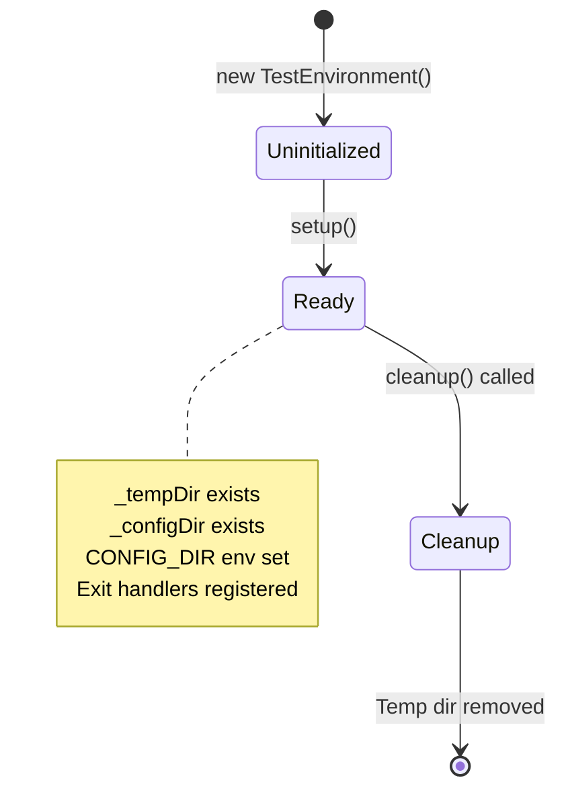

# Architecture: MDT-113

**Source**: [MDT-113](../../../docs/CRs/MDT-113-refactor-sharedtest-lib-to-improve-code-maintainab.md)
**Generated**: 2025-12-31
**Complexity Score**: 15

## Overview

Refactor shared/test-lib/ to reduce cyclomatic and cognitive complexity while preserving all public APIs and test behavior. The refactoring extracts process lifecycle management, event listener cleanup, and configuration generation into focused, single-responsibility components.

Key constraints:
- Public interfaces must remain unchanged (TestEnvironment, TestServer, ProjectFactory, FileTicketCreator)
- All existing tests pass without modification
- Target: CC < 25, CoC < 35 (YELLOW zone) for all files

## Pattern

**Extraction Decomposition** — Break down large, complex classes into focused components with single responsibilities, using composition to orchestrate behavior.

This pattern applies here because:
- Current classes mix multiple concerns (process mgmt + health checks + config + cleanup)
- High complexity stems from intertwined responsibilities
- Extraction allows each component to be tested and understood independently
- Public API preserved through facade/orchestrator pattern

## Key Dependencies

| Capability | Package | Coverage | Rationale |
|------------|---------|----------|----------|
| Process tree termination | tree-kill (existing) | 100% | Already in use, cross-platform, handles npm→tsx→node chains |
| Retry logic | Custom (retry-helper.ts) | 100% | Already centralized, meets all needs, no external dep required |

**Build Custom Decisions**:
| Capability | Reason | Estimated Size |
|------------|--------|---------------|
| Event listener registry | Need tight coupling with test lifecycle, no off-the-shelf solution for Node.js test cleanup | ~100 lines |
| Server configuration factory | Domain-specific config generation, requires deep knowledge of server types | ~120 lines |

## Component Boundaries



| Component | Responsibility | Owns | Depends On |
|-----------|----------------|------|------------|
| `ProcessLifecycleManager` | Server process start/stop/health-check orchestration | Process state, health check state | tree-kill, RetryHelper |
| `EventListenerRegistry` | Track and cleanup event listeners to prevent memory leaks | Listener references (stdout, stderr, exit) | Node.js EventEmitter |
| `ServerConfigFactory` | Generate ServerConfig for frontend/backend/mcp | Configuration templates | PortConfig |
| `TestProjectBuilder` | Project directory structure and config creation | Project path, project state | ProjectRegistry, ProjectConfigService |
| `TestTicketBuilder` | Test ticket creation with counter management | Ticket numbering, counter file | RetryHelper, MarkdownService |
| `TestEnvironment` (refactored) | Test directory setup/exit handling orchestration | Temp dir, config dir | EventListenerRegistry |
| `TestServer` (refactored) | Multi-server lifecycle orchestration (public API) | Server instances | ProcessLifecycleManager, ServerConfigFactory |
| `ProjectFactory` (refactored) | Test project/ticket creation orchestration (public API) | Project configs | TestProjectBuilder, TestTicketBuilder |
| `FileTicketCreator` (refactored) | Generic ticket file I/O with retry (public API) | TemplateService, RetryHelper | RetryHelper (existing) |

## State Flows

### Process Lifecycle (TestServer)



| State | Entry Condition | Exit Condition | Invariants |
|-------|-----------------|----------------|------------|
| Stopped | No process running | start() called | No event listeners registered |
| Starting | start() called | Health check passes OR timeout | Process spawned, listeners attached |
| Running | Health check passes | stop() called OR process exits | Health check URL reachable |
| Stopping | stop() called | Process tree killed | Event listeners removed |

### Test Environment Lifecycle



| State | Entry Condition | Exit Condition | Invariants |
|-------|-----------------|----------------|------------|
| Uninitialized | Constructor called | setup() called | No directories created |
| Ready | setup() completes | cleanup() called | Temp directory exists, accessible |
| Cleanup | cleanup() called | Directories removed | All exit handlers removed |

## Shared Patterns

| Pattern | Occurrences | Extract To |
|---------|-------------|------------|
| Retry wrapper for file I/O | project-factory.ts (10x), file-ticket-creator.ts (8x) | `utils/retry-helper.ts` (✅ already exists) |
| Event listener tracking for cleanup | test-server.ts (3 Maps), test-environment.ts (1 Array) | `core/event-listener-registry.ts` (NEW) |
| Server config generation | test-server.ts (switch), project-factory.ts (inline) | `core/server-config-factory.ts` (NEW) |
| Process tree cleanup | test-server.ts (inline with tree-kill), process-helper.ts (platform logic) | `core/process-lifecycle-manager.ts` (NEW) |
| Ticket counter management | project-factory.ts (read/write `.mdt-next`) | `ticket/test-ticket-builder.ts` (NEW) |

> Phase 1: Extract these shared patterns BEFORE refactoring consumers.

## Structure

```
shared/test-lib/
  ├── core/
  │   ├── test-environment.ts          → Orchestration only (limit: 100 lines)
  │   ├── test-server.ts               → Orchestration only (limit: 150 lines)
  │   ├── project-factory.ts           → Orchestration only (limit: 200 lines)
  │   ├── process-lifecycle-manager.ts → NEW: Process mgmt (limit: 150 lines)
  │   ├── event-listener-registry.ts   → NEW: Listener cleanup (limit: 100 lines)
  │   └── server-config-factory.ts     → NEW: Config generation (limit: 120 lines)
  ├── ticket/
  │   ├── ticket-creator.ts            → Base class (unchanged)
  │   ├── file-ticket-creator.ts       → Refactored: Use retry helper (limit: 200 lines)
  │   ├── test-project-builder.ts      → NEW: Project structure (limit: 150 lines)
  │   └── test-ticket-builder.ts       → NEW: Test ticket + counter (limit: 150 lines)
  └── utils/
      ├── retry-helper.ts              → ✅ Already centralized
      └── process-helper.ts            → ✅ Already exists
```

## Size Guidance

| Module | Role | Limit | Hard Max |
|--------|------|-------|----------|
| `core/test-environment.ts` | Orchestration | 100 | 150 |
| `core/test-server.ts` | Orchestration | 150 | 225 |
| `core/project-factory.ts` | Orchestration | 200 | 300 |
| `core/process-lifecycle-manager.ts` | Process lifecycle | 150 | 225 |
| `core/event-listener-registry.ts` | Listener cleanup | 100 | 150 |
| `core/server-config-factory.ts` | Config generation | 120 | 180 |
| `ticket/test-project-builder.ts` | Project structure creation | 150 | 225 |
| `ticket/test-ticket-builder.ts` | Test ticket + counter management | 150 | 225 |
| `ticket/file-ticket-creator.ts` | Generic ticket I/O | 200 | 300 |

## Error Scenarios

| Scenario | Detection | Response | Recovery |
|----------|-----------|----------|----------|
| Process spawn fails | ChildProcess error event | Throw ServerStartupError | Cleanup partial state, remove from processes Map |
| Health check timeout | 30 attempts with exponential backoff | Mark server as error, cleanup | Remove from processes Map, restore state to stopped |
| Process exit during stop | waitForProcessExit timeout | Force SIGKILL after SIGTERM | Cleanup listeners, mark as stopped |
| Event listener cleanup fails | Error during removeListener | Log warning, continue | Best-effort cleanup to prevent blocking |
| File I/O retry exhausted | RetryError thrown | Return failure result | Caller handles (ProjectFactory returns TestCRResult with error) |

## Refactoring Plan

### Transformation Matrix

| Component | From | To | Reduction | Reason |
|-----------|------|----|-----------|--------|
| ProcessLifecycleManager | test-server.ts (382 lines) | core/process-lifecycle-manager.ts (~150 lines) | Extract ~150 lines | Isolate process state management |
| EventListenerRegistry | test-server.ts + test-environment.ts (~100 lines combined) | core/event-listener-registry.ts (~100 lines) | Deduplicate ~50 lines | Single cleanup mechanism |
| ServerConfigFactory | test-server.ts inline (~80 lines) | core/server-config-factory.ts (~120 lines) | Extract ~80 lines | Centralize config logic |
| TestServer (refactored) | 382 lines → ~150 lines | Orchestration only | -232 lines (-61%) | Delegate to extracted components |
| TestEnvironment (refactored) | 178 lines → ~100 lines | Orchestration only | -78 lines (-44%) | Delegate to EventListenerRegistry |
| ProjectFactory (refactored) | 607 lines → ~200 lines | Orchestration only | -407 lines (-67%) | Split into TestProjectBuilder + TestTicketBuilder |
| TestProjectBuilder | project-factory.ts (part of 607) | ticket/test-project-builder.ts (~150 lines) | New component | Isolate project structure logic |
| TestTicketBuilder | project-factory.ts (part of 607) | ticket/test-ticket-builder.ts (~150 lines) | New component | Isolate test ticket + counter logic |
| FileTicketCreator (refactored) | 326 lines → ~200 lines | Simplify with retry helper | -126 lines (-39%) | Remove duplicate retry wrappers |

**Total Reduction**: ~1493 lines → ~1170 lines (-323 lines, -22%)

### Interface Preservation

| Public Interface | Status | Verification |
|------------------|--------|--------------|
| `TestEnvironment.setup()` | Preserved | Existing tests in file-creation.test.ts cover |
| `TestEnvironment.cleanup()` | Preserved | Existing tests in file-creation.test.ts cover |
| `TestEnvironment.getTempDirectory()` | Preserved | Existing tests in file-creation.test.ts cover |
| `TestEnvironment.getConfigDirectory()` | Preserved | Existing tests in file-creation.test.ts cover |
| `TestServer.start()` | Preserved | Existing tests in integration.test.ts cover |
| `TestServer.stop()` | Preserved | Existing tests in integration.test.ts cover |
| `TestServer.stopAll()` | Preserved | Existing tests in integration.test.ts cover |
| `TestServer.isReady()` | Preserved | Existing tests in integration.test.ts cover |
| `TestServer.getUrl()` | Preserved | Existing tests in integration.test.ts cover |
| `ProjectFactory.createProject()` | Preserved | Existing tests in file-creation.test.ts cover |
| `ProjectFactory.createTestCR()` | Preserved | Existing tests in file-creation.test.ts cover |
| `ProjectFactory.createMultipleCRs()` | Preserved | Existing tests in file-creation.test.ts cover |
| `ProjectFactory.createTestScenario()` | Preserved | Existing tests in file-creation.test.ts cover |
| `FileTicketCreator.createTicket()` | Preserved | Integration tests cover indirectly |
| `FileTicketCreator.readTicket()` | Preserved | Integration tests cover indirectly |
| `FileTicketCreator.updateTicket()` | Preserved | Integration tests cover indirectly |

### Behavioral Equivalence

**Test Suite Coverage**:
- `__tests__/file-creation.test.ts`: 117 test assertions covering TestEnvironment, ProjectFactory
- `__tests__/integration.test.ts`: 13 test assertions covering TestServer, backend discovery

**Performance**: No performance impact expected. Extraction adds minimal overhead (one additional function call per operation).

**Migration**: No migration steps needed. Public API unchanged, tests pass without modification.

**Verification Strategy**:
1. Run existing test suite before refactoring (baseline: all pass)
2. Extract components one at a time
3. Run test suite after each extraction (all must pass)
4. Complexity metrics checked with `scripts/metrics/run.sh shared/test-lib/`
5. Final verification: all tests pass, all metrics in YELLOW zone

## Extension Rule

To add a new server type (e.g., 'worker'):
1. Add case to `ServerConfigFactory.createServerConfig()` (limit 120 lines total)
2. Update `TestServer.start()` type union (limit 150 lines total)
3. Add health endpoint path to ServerConfig type if needed

To add new project configuration fields:
1. Update `TestProjectBuilder.createProjectStructure()` (limit 150 lines total)
2. Update `ProjectConfigService.createOrUpdateLocalConfig()` call (shared service)

To add new ticket template type:
1. Add template to `TemplateService` (shared service, not in scope)
2. `TestTicketBuilder` automatically supports new type via TemplateService

---
*Generated by /mdt:architecture*
