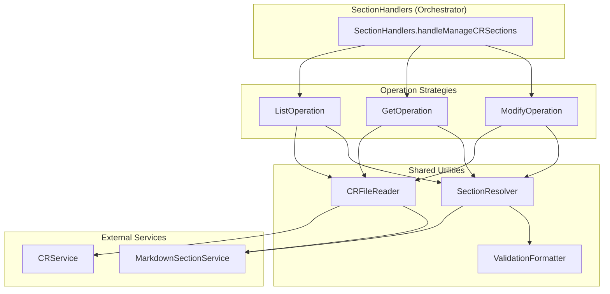

# Prep Architecture: MDT-114

**CR**: [MDT-114](../../MDT-114-fix-managecrsections-tool-section-path-resolution-.md)
**Mode**: Preparatory Refactoring
**Generated**: 2026-01-02
**Target**: Reduce `sectionHandlers.ts` complexity from critical (MI: 19.97%, CC: 40) to maintainable

---

## Overview

**Refactoring Goal**: Restructure `SectionHandlers` from a monolithic 410-line class (CC: 40, MI: 19.97%) into focused, composable components while preserving all public interfaces and behaviors. This refactoring is a prerequisite for implementing hierarchical section path parsing (MDT-114 feature work).

**Why Refactor First?** The current monolithic structure makes hierarchical path parsing error-prone:
- Complex switch-case logic (lines 56-90) mixed with validation
- Duplicate error handling patterns in `handleGetSection` and `handleModifySection`
- Section path resolution scattered across 3 methods
- Adding hierarchical parsing would increase CC from 40 → 50+, pushing further into "unmaintainable" territory

**Refactoring Strategy**: Extract shared concerns into focused utilities, then apply strategy pattern to operations. This reduces complexity, isolates section path logic (making MDT-114 easier), and improves long-term maintainability.

---

## Current Architecture Analysis

### Component Context

```
mcp-server/src/tools/
  ├── index.ts                 → MCPTools (router, 175 lines)
  ├── config/
  │   └── allTools.ts          → Tool schema registry (381 lines)
  └── handlers/
      ├── projectHandlers.ts   → Project operations (155 lines, 2 methods)
      ├── crHandlers.ts        → CR operations (est. 300-400 lines, 7 methods)
      └── sectionHandlers.ts   → Section operations (410 lines, 4 methods) 🔴
```

### Dependencies

```
SectionHandlers depends on:
  ├─ CRService (project injection)
  ├─ MarkdownSectionService (static class, mocked in tests)
  ├─ SimpleContentProcessor (utility)
  ├─ SimpleSectionValidator (utility)
  ├─ Sanitizer (utility)
  ├─ ToolError (utility)
  └─ Validation utilities (functions)
```

### Complexity Hotspots

| Location | Lines | Issue | Impact |
|----------|-------|-------|--------|
| `handleManageCRSections` | 31-90 | Switch-case + validation | CC contributor, hard to extend |
| `handleListSections` | 96-157 | Manual tree building | Missing hierarchical output |
| `handleGetSection` | 162-212 | Duplicate error logic | Repeated patterns |
| `handleModifySection` | 217-410 | 193-line method | CC hotspot, header rename logic |

### Shared Patterns Identified

| Pattern | Occurrences | Extract To |
|---------|-------------|------------|
| CR file reading (YAML extraction) | `handleListSections`, `handleGetSection`, `handleModifySection` | `CRFileReader` utility |
| Section validation with errors | `handleGetSection`, `handleModifySection` | Consolidate in one place |
| Operation-specific error formatting | All handlers | `SectionOperationError` utility |
| `findSection` + match handling | 3 locations | `SectionResolver` utility |

**Key Insight**: 4 handlers share 80% of their setup logic (file read, YAML parse, section find). Only the operation differs.

---

## Proposed Architecture

### Pattern: **Strategy + Utilities Extraction**

**Why Strategy?**
- Each operation (list/get/replace/append/prepend) is a distinct algorithm
- Current switch-case mixes dispatch with execution
- Strategy isolates operation logic, making each easier to test and modify
- New operations require adding a strategy, not modifying switch-case

**Why Utilities Extraction?**
- 80% of handler code is setup/teardown shared across operations
- Extracting setup reduces each handler to pure operation logic
- Section path resolution becomes a focused utility (MDT-114 requirement)

---

## Component Boundaries



### Component Responsibilities

| Component | Responsibility | Owns | Depends On |
|-----------|----------------|------|------------|
| `SectionHandlers` | Operation dispatch only | Routing logic | `CRService`, strategies |
| `ListOperation` | List all sections with hierarchy | Tree building | `CRFileReader`, `SectionResolver` |
| `GetOperation` | Retrieve single section content | Section lookup | `CRFileReader`, `SectionResolver` |
| `ModifyOperation` | Execute replace/append/prepend | Section updates | `CRFileReader`, `SectionResolver`, `MarkdownSectionService` |
| `CRFileReader` | CR file I/O abstraction | YAML parsing, caching | `CRService`, `MarkdownService` |
| `SectionResolver` | Section path resolution | Hierarchical parsing, fallback | `MarkdownSectionService`, `ValidationFormatter` |
| `ValidationFormatter` | Error message formatting | User-friendly suggestions | None |

---

## Refactoring Transformation

### Phase 1: Extract Shared Utilities

| Utility | Extracted From | Lines | Purpose |
|---------|----------------|-------|---------|
| `CRFileReader` | `handleListSections` (103-111), `handleGetSection` (168-177), `handleModifySection` (229-239) | ~60 | Centralize CR file reading + YAML extraction |
| `SectionResolver` | All handlers' `findSection` calls + duplicate handling | ~80 | Hierarchical path resolution (MDT-114 enabler) |
| `ValidationFormatter` | Scattered error messages | ~40 | Consistent error formatting with suggestions |

**Size Limits**:
- `CRFileReader`: ≤75 lines (utility)
- `SectionResolver`: ≤150 lines (complex logic, MDT-114 target)
- `ValidationFormatter`: ≤75 lines (utility)

### Phase 2: Apply Strategy Pattern

| Strategy | From | To | Lines | Role |
|----------|------|----|----|------|
| `ListOperation` | `handleListSections` (62 lines) | strategy method | ≤100 | Build hierarchical tree |
| `GetOperation` | `handleGetSection` (51 lines) | strategy method | ≤75 | Return section content |
| `ModifyOperation` | `handleModifySection` (193 lines) | strategy class | ≤150 | Execute replace/append/prepend |

**Size Limit**: `SectionHandlers` (orchestrator) ≤100 lines

---

## Structure

```
mcp-server/src/tools/handlers/
  ├── sectionHandlers.ts          → Orchestrator only (≤100 lines)
  ├── operations/                 → Strategy pattern
  │   ├── index.ts                → Operation registry
  │   ├── ListOperation.ts        → List handler (≤100 lines)
  │   ├── GetOperation.ts         → Get handler (≤75 lines)
  │   └── ModifyOperation.ts      → Modify handler (≤150 lines)
  └── __tests__/
      └── sectionHandlers.test.ts → Existing 23 tests (keep passing)

mcp-server/src/utils/section/    → New namespace for section utilities
  ├── CRFileReader.ts             → CR file I/O (≤75 lines)
  ├── SectionResolver.ts          → Path resolution (≤150 lines)
  └── ValidationFormatter.ts     → Error formatting (≤75 lines)
```

---

## Size Guidance

| Module | Current | Target | Hard Max | Role |
|--------|---------|--------|----------|------|
| `sectionHandlers.ts` | 410 | ≤100 | 150 | Orchestrator |
| `operations/ListOperation.ts` | - | ≤100 | 150 | Feature |
| `operations/GetOperation.ts` | - | ≤75 | 110 | Feature |
| `operations/ModifyOperation.ts` | - | ≤150 | 225 | Complex logic |
| `CRFileReader.ts` | - | ≤75 | 110 | Utility |
| `SectionResolver.ts` | - | ≤150 | 225 | Complex logic |
| `ValidationFormatter.ts` | - | ≤75 | 110 | Utility |

**Total**: 410 lines → ≤725 lines (refactor overhead) BUT with clear boundaries and testable components

---

## Interface Preservation

### Public Interfaces (Stable)

| Interface | Current | After | Verification |
|-----------|---------|-------|--------------|
| `SectionHandlers` class | Public | Public | Existing tests cover |
| `handleManageCRSections()` | Public | Public | Existing tests cover |
| `SectionOperationResult` | Public | Public | Existing tests cover |

### Internal Interfaces (New)

| Interface | Purpose | Location |
|-----------|---------|----------|
| `SectionOperation` | Strategy interface | `operations/index.ts` |
| `CRFileReader.readCRFile()` | File I/O abstraction | `utils/section/CRFileReader.ts` |
| `SectionResolver.resolve()` | Path resolution | `utils/section/SectionResolver.ts` |
| `ValidationFormatter.formatError()` | Error formatting | `utils/section/ValidationFormatter.ts` |

---

## Behavioral Equivalence

### Test Coverage (Excellent)

- **23 behavioral preservation tests** in `sectionHandlers.test.ts`
- All 5 operations tested (list, get, replace, append, prepend)
- Error handling validated
- File I/O behavior locked
- Section renaming tested
- **Key**: These tests must all pass after refactoring

### Refactoring Safety

1. **Extract utilities first** (Phase 1) — tests pass after each extraction
2. **Extract strategies second** (Phase 2) — tests pass after each strategy
3. **Verify hierarchical output** (new behavior) — add tests for improved `list` output

### Performance

- Expected: Neutral or slight improvement (less repeated YAML parsing)
- Section path resolution: Target < 50ms per operation (MDT-114 AC)

---

## Refactoring Plan

### Phase 1: Utility Extraction (2-3 hours)

**Step 1.1**: Extract `CRFileReader`
- Move file read + YAML extraction logic
- Add caching (same file read multiple times in one operation)
- Tests: Verify existing tests still pass

**Step 1.2**: Extract `SectionResolver` (MDT-114 enabler)
- Consolidate `findSection` + match handling
- Add hierarchical path parsing infrastructure (stub for now)
- Add fallback resolution (parent section targeting)
- Tests: Verify ambiguous section errors improve

**Step 1.3**: Extract `ValidationFormatter`
- Consolidate error message generation
- Add suggestion logic (did you mean...?)
- Tests: Verify error messages remain helpful

### Phase 2: Strategy Pattern (2-3 hours)

**Step 2.1**: Define `SectionOperation` interface
- Create `operations/index.ts`
- Define `execute()` contract

**Step 2.2**: Extract `ListOperation`
- Move `handleListSections` logic
- Improve hierarchical tree building (MDT-114 feature)
- Tests: Verify list output shows all subsections

**Step 2.3**: Extract `GetOperation`
- Move `handleGetSection` logic
- Use `SectionResolver` for path resolution
- Tests: Verify get operation works with hierarchical paths

**Step 2.4**: Extract `ModifyOperation`
- Move `handleModifySection` logic
- Split into replace/append/prepend helpers
- Use `SectionResolver` for path resolution
- Tests: Verify all modify operations work

**Step 2.5**: Refactor `SectionHandlers` to orchestrator
- Replace switch-case with strategy dispatch
- Reduce to ≤100 lines
- Tests: Verify all existing tests pass

### Phase 3: MDT-114 Feature Implementation (2-4 hours)

**Step 3.1**: Implement hierarchical path parsing in `SectionResolver`
- Parse `# H1 / ## H2 / ### H3` format
- Handle edge cases (spaces, case sensitivity)
- Tests: Unit tests for path parsing

**Step 3.2**: Improve `list` output in `ListOperation`
- Show full hierarchy tree
- Include all subsections
- Tests: Verify no missing subsections

**Step 3.3**: Enhance error messages with working suggestions
- When hierarchical path fails, suggest parent targeting
- Show working examples in errors
- Tests: Verify error messages are actionable

---

## Domain Alignment

**Not applicable** — This is a technical refactoring CR without domain modeling (no `domain.md`).

---

## Extension Rule

### After Prep Refactoring

To add a new section operation:
1. Create `operations/{Name}Operation.ts` (limit per role, e.g., ≤150 for complex)
2. Implement `SectionOperation` interface
3. Register in `operations/index.ts`
4. Add case in `SectionHandlers.handleManageCRSections` dispatch

### For MDT-114 Feature Work

To add hierarchical path support:
1. Implement in `SectionResolver.resolve()` (≤150 lines)
2. Update `ListOperation` to show full hierarchy
3. Update error messages to suggest hierarchical paths
4. Add unit tests for path parsing edge cases

---

## Risk Mitigation

### Risks

| Risk | Probability | Impact | Mitigation |
|------|-------------|--------|------------|
| Test failures during refactoring | Medium | High | Extract incrementally, run tests after each step |
| Performance regression | Low | Low | Benchmark before/after, add caching to `CRFileReader` |
| Interface breakage | Low | High | Keep `SectionHandlers` public API stable, add deprecation warnings if needed |
| Over-engineering | Medium | Medium | Size limits prevent bloat, review each utility against "is this simpler?" |

### Rollback Plan

- Git commits after each phase (1.1, 1.2, 1.3, 2.1, 2.2, 2.3, 2.4, 2.5)
- If phase fails, revert to previous phase commit
- Tests failing = revert immediately, fix issue, retry

---

## Success Criteria

### Quantitative

| Metric | Before | After | Target |
|--------|--------|-------|--------|
| Maintainability Index | 19.97% | ≥35% | +15 percentage points |
| Cyclomatic Complexity | 40 | ≤20 | -50% |
| Largest method | 193 lines | ≤150 | -22% |
| Test coverage | 23 tests | 23+ tests | No regression |

### Qualitative

- All 23 existing tests pass
- Section operations work identically from user perspective
- Code is easier to understand (clear component boundaries)
- MDT-114 feature work is straightforward (hierarchical path parsing in one place)

---

## Next Steps (Prep Workflow)

1. **`/mdt:tests MDT-114 --prep`** — Lock current behavior with preservation tests
2. **`/mdt:tasks MDT-114 --prep`** — Generate refactoring task breakdown (inherits limits from this doc)
3. **`/mdt:implement MDT-114 --prep`** — Execute refactoring (tests stay green)
4. **`/mdt:architecture MDT-114`** — Design MDT-114 feature work (after prep complete)

---

*Generated by /mdt:architecture --prep*
