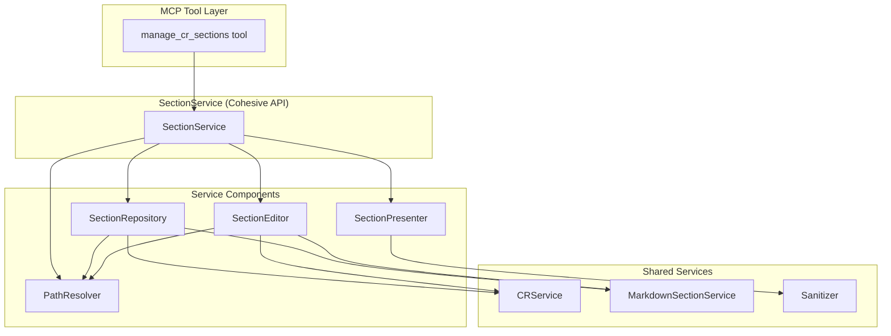

# Prep Architecture: MDT-114

**CR**: [MDT-114](../../MDT-114-fix-managecrsections-tool-section-path-resolution-.md)
**Mode**: Preparatory Refactoring
**Generated**: 2026-01-03
**Approach**: Fresh service design for cohesive section management

---

## Overview

**Refactoring Goal**: Reorganize scattered section manipulation code (8 files, 3 directories) into a single cohesive **Section Management Service** with clear boundaries and minimal complexity.

**Current Problem**: Section management is scattered across utilities and handlers, making it hard to:
- Add hierarchical path resolution (MDT-114 feature)
- Understand the complete section management workflow
- Test and modify in isolation

**Solution**: Design a clean service architecture where **Section Management** is a first-class domain with clear responsibilities.

---

## Domain Analysis

### What This Functionality Does

**Section Management Service** — CRUD operations for markdown document sections:

| Operation | Purpose | Input | Output |
|-----------|---------|-------|--------|
| **List** | Enumerate all sections | CR key | Hierarchical tree |
| **Get** | Read section content | CR key + path | Section content |
| **Modify** | Replace/append/prepend | CR key + path + content | Updated section |
| **Resolve** | Find section by path | Document + path | Section match |
| **Validate** | Check section path | Path + available | Valid/invalid + suggestions |

### Natural Service Boundaries

```
Section Management
├── Find sections (by simple or hierarchical path)
├── Read section content
├── Modify section content
├── List all sections with hierarchy
└── Present results to users
```

---

## Architecture Pattern

**Pattern: Service Layer with Cohesive Components**

```
SectionService (Public API)
  ├── SectionRepository (Read operations)
  ├── SectionEditor (Write operations)
  ├── PathResolver (Path resolution logic)
  └── SectionPresenter (Output formatting)
```

**Why this pattern?**
- **Service Layer**: Clean API for MCP tools to call
- **Repository Pattern**: Separates read concerns from write concerns
- **Single Responsibility**: Each component has one clear job
- **Testability**: Each component can be tested in isolation
- **Extensibility**: New path resolution strategies add to `PathResolver`, not scattered

---

## Component Boundaries



### Component Responsibilities

| Component | Responsibility | Owns | Depends On |
|-----------|----------------|------|------------|
| `SectionService` | Public API for section operations | Orchestration, routing | All components |
| `SectionRepository` | Read operations (find, get, list) | Section lookup, tree building | `PathResolver`, `CRService`, `MarkdownSectionService` |
| `SectionEditor` | Write operations (replace, append, prepend) | Section modification, file updates | `PathResolver`, `CRService`, `MarkdownSectionService` |
| `PathResolver` | Path resolution (simple + hierarchical) | Path parsing, section matching, fallback | `MarkdownSectionService` |
| `SectionPresenter` | Output formatting | Result presentation, error messages | `Sanitizer` |

---

## Refactoring Transformation

### From Scattered → Cohesive

| Concept | From (Scattered) | To (Cohesive) | Lines | Reduction |
|---------|------------------|---------------|-------|-----------|
| **Service API** | `sectionHandlers.ts` (110 lines) | `SectionService.ts` | ≤80 | -27% |
| **Repository** | `CRFileReader.ts`, `GetOperation.ts`, `ListOperation.ts` (201 lines) | `SectionRepository.ts` | ≤150 | -25% |
| **Editor** | `ModifyOperation.ts` (219 lines) | `SectionEditor.ts` | ≤175 | -20% |
| **Resolver** | `SectionResolver.ts`, `SimpleSectionValidator.ts` (190 lines) | `PathResolver.ts` | ≤200 | -5% |
| **Presenter** | `ValidationFormatter.ts` (71 lines) | `SectionPresenter.ts` | ≤100 | +41% |
| **Content** | `SimpleContentProcessor.ts` (124 lines) | `ContentProcessor.ts` | ≤125 | -1% |
| **Total** | 8 files, 915 lines | 6 files, 830 lines | - | -9% |

**Key Improvements**:
- **Cohesion**: All section logic in one place (`services/SectionManagement/`)
- **Clarity**: Each component has a single, clear responsibility
- **Testability**: Components can be tested independently
- **Extensibility**: Hierarchical path resolution adds to `PathResolver`, not scattered across 3 files

---

## Structure

```
mcp-server/src/services/SectionManagement/
  ├── SectionService.ts           → Public API, orchestration (≤80 lines)
  ├── SectionRepository.ts        → Read operations: list, get, find (≤150 lines)
  ├── SectionEditor.ts            → Write operations: replace, append, prepend (≤175 lines)
  ├── PathResolver.ts             → Path resolution: simple, hierarchical, fallback (≤200 lines)
  ├── ContentProcessor.ts         → Content sanitization and validation (≤125 lines)
  ├── SectionPresenter.ts         → Output formatting and error messages (≤100 lines)
  └── types.ts                    → Shared types and interfaces

mcp-server/src/tools/handlers/
  └── sectionHandlers.ts          → Thin wrapper (≤50 lines, just routes to SectionService)

mcp-server/src/utils/
  └── (delete) section/, simple*  → Remove scattered utilities
```

**Removed files**:
- `utils/section/CRFileReader.ts` → merged into `SectionRepository`
- `utils/section/SectionResolver.ts` → merged into `PathResolver`
- `utils/section/ValidationFormatter.ts` → merged into `SectionPresenter`
- `utils/simpleSectionValidator.ts` → merged into `PathResolver`
- `utils/simpleContentProcessor.ts` → merged into `ContentProcessor`
- `handlers/operations/*.ts` → merged into `SectionRepository` and `SectionEditor`

---

## Size Guidance

| Module | Role | Limit | Hard Max |
|--------|------|-------|----------|
| `SectionService.ts` | Orchestration | 80 | 120 |
| `SectionRepository.ts` | Read operations | 150 | 225 |
| `SectionEditor.ts` | Write operations | 175 | 260 |
| `PathResolver.ts` | Complex logic (hierarchical parsing) | 200 | 300 |
| `ContentProcessor.ts` | Utility | 125 | 190 |
| `SectionPresenter.ts` | Presentation | 100 | 150 |
| `types.ts` | Shared types | 50 | 75 |

**Total**: 830 lines (down from 915) with better cohesion and clearer boundaries.

---

## Public Interfaces

### SectionService (Public API)

```typescript
class SectionService {
  // List all sections with hierarchy
  async listSections(project: Project, key: string): Promise<string>

  // Get section content
  async getSection(project: Project, key: string, path: string): Promise<string>

  // Modify section
  async modifySection(
    project: Project,
    key: string,
    path: string,
    content: string,
    operation: 'replace' | 'append' | 'prepend'
  ): Promise<string>
}
```

### SectionRepository (Internal)

```typescript
class SectionRepository {
  // Find section by path
  find(document: string, path: string): SectionMatch

  // List all sections
  listAll(document: string): SectionMatch[]

  // Read CR file
  readCR(project: Project, key: string): CRFileContent
}
```

### SectionEditor (Internal)

```typescript
class SectionEditor {
  // Replace section content
  replace(document: string, section: SectionMatch, content: string): string

  // Append to section
  append(document: string, section: SectionMatch, content: string): string

  // Prepend to section
  prepend(document: string, section: SectionMatch, content: string): string

  // Write updated document
  write(project: Project, key: string, content: string): Promise<void>
}
```

### PathResolver (Internal)

```typescript
class PathResolver {
  // Resolve path to section
  resolve(document: string, path: string): SectionMatch

  // Parse hierarchical path
  parseHierarchical(path: string): HierarchicalPath

  // Validate path
  validate(path: string, available: string[]): ValidationResult
}
```

### SectionPresenter (Internal)

```typescript
class SectionPresenter {
  // Format list output
  formatList(key: string, title: string, sections: SectionMatch[]): string

  // Format get output
  formatGet(key: string, section: SectionMatch, content: string): string

  // Format modify output
  formatModify(...): string

  // Format error
  formatError(...): string
}
```

---

## Interface Preservation

### Stable Public Interfaces

| Interface | Current | After | Verification |
|-----------|---------|-------|--------------|
| `SectionHandlers.handleManageCRSections()` | Public | Public (routes to `SectionService`) | Existing 23 tests cover |
| MCP tool schema | Stable | Stable | No changes to tool interface |

### Internal Interfaces (New)

| Interface | Purpose | Location |
|-----------|---------|----------|
| `SectionService` | Public API for section operations | `services/SectionManagement/` |
| `SectionRepository` | Read operations | `services/SectionManagement/` |
| `SectionEditor` | Write operations | `services/SectionManagement/` |
| `PathResolver` | Path resolution | `services/SectionManagement/` |
| `SectionPresenter` | Output formatting | `services/SectionManagement/` |

---

## Behavioral Equivalence

### Test Coverage (Excellent)

- **23 behavioral tests** in `sectionHandlers.test.ts`
- All operations tested (list, get, replace, append, prepend)
- Error handling validated
- File I/O behavior locked
- Section renaming tested
- **These tests must all pass after refactoring**

### Refactoring Safety

1. **Create `SectionService` first** — implement using existing scattered code
2. **Route `SectionHandlers` to `SectionService`** — tests should pass
3. **Extract into components incrementally** — one component at a time
4. **Delete old files** — after all tests pass

### Performance

- Expected: Neutral to better (less file reading, centralized caching)
- Section path resolution: Target < 50ms per operation (MDT-114 AC)

---

## Refactoring Plan

### Phase 1: Create SectionService (1-2 hours)

**Step 1.1**: Create `SectionService` shell
- Create `services/SectionManagement/` directory
- Implement `listSections`, `getSection`, `modifySection` using existing code
- Keep everything in one file initially (just routing)

**Step 1.2**: Route `SectionHandlers` to `SectionService`
- `SectionHandlers.handleManageCRSections` calls `SectionService`
- Tests should pass (behavior unchanged)

### Phase 2: Extract Repository (1-2 hours)

**Step 2.1**: Create `SectionRepository`
- Extract `readCR` from `CRFileReader`
- Extract `listAll`, `find` from operations
- Implement tree building for hierarchical list output
- Tests: Verify list operation works

**Step 2.2**: Extract `ContentProcessor`
- Move `SimpleContentProcessor` to new location
- Clean up interface

### Phase 3: Extract Editor (1-2 hours)

**Step 3.1**: Create `SectionEditor`
- Extract modify logic from `ModifyOperation`
- Split into `replace`, `append`, `prepend` methods
- Extract header renaming logic
- Tests: Verify all modify operations work

### Phase 4: Extract PathResolver (1-2 hours)

**Step 4.1**: Create `PathResolver`
- Merge `SectionResolver` + `SimpleSectionValidator`
- Add hierarchical path parsing infrastructure
- Add fallback resolution (parent section targeting)
- Tests: Verify path resolution works

### Phase 5: Extract Presenter (1 hour)

**Step 5.1**: Create `SectionPresenter`
- Move `ValidationFormatter` to new location
- Consolidate all output formatting
- Tests: Verify error messages remain helpful

### Phase 6: Cleanup (1 hour)

**Step 6.1**: Delete old files
- Remove `utils/section/` directory
- Remove `utils/simple*.ts` files
- Remove `handlers/operations/` directory
- Verify tests still pass

**Step 6.2**: Size verification
- Run code metrics
- Verify all modules within limits
- Adjust if any module exceeds hard max

---

## Success Criteria

### Quantitative

| Metric | Before | After | Target |
|--------|--------|-------|--------|
| File count (section-related) | 8 files | 6 files | -25% |
| Total lines | 915 | ≤830 | -9% |
| Directory scatter | 3 directories | 1 directory | -67% |
| Largest file | 219 lines | ≤200 | -9% |
| Test coverage | 23 tests | 23+ tests | No regression |

### Qualitative

- All 23 existing tests pass
- Section operations work identically from user perspective
- Code is organized by **domain** (Section Management), not **layer** (utils/handlers)
- Hierarchical path resolution is straightforward (adds to `PathResolver`)
- Easy to understand: "Section management is in `services/SectionManagement/`"

---

## Extension Rule

### After Refactoring

To add a new section operation:
1. Add method to `SectionService` (if new public operation)
2. Implement in `SectionRepository` or `SectionEditor` (depending on read/write)
3. Update `SectionPresenter` if new output format needed

To add hierarchical path support (MDT-114):
1. Implement in `PathResolver.resolve()` (≤200 lines)
2. Update `SectionRepository.listAll()` to show full hierarchy
3. Update `SectionPresenter` to format hierarchical output
4. Add unit tests for path parsing edge cases

---

## Risk Mitigation

### Risks

| Risk | Probability | Impact | Mitigation |
|------|-------------|--------|------------|
| Test failures during refactoring | Medium | High | Create `SectionService` first, route incrementally |
| Interface breakage | Low | High | Keep MCP tool schema stable, route internally |
| Component size exceeds limits | Low | Medium | Size limits guide design, adjust if needed |
| Over-engineering | Low | Medium | Focus on cohesion, not perfection |

### Rollback Plan

- Git commits after each phase
- If phase fails, revert to previous phase commit
- Tests failing = revert immediately, fix issue, retry

---

## Next Steps (Prep Workflow)

1. **`/mdt:tests MDT-114 --prep`** — Lock current behavior with preservation tests
2. **`/mdt:tasks MDT-114 --prep`** — Generate refactoring task breakdown (inherits limits from this doc)
3. **`/mdt:implement MDT-114 --prep`** — Execute refactoring (tests stay green)
4. **`/mdt:architecture MDT-114`** — Design MDT-114 feature work (after prep complete)

---

*Generated by /mdt:architecture --prep*
