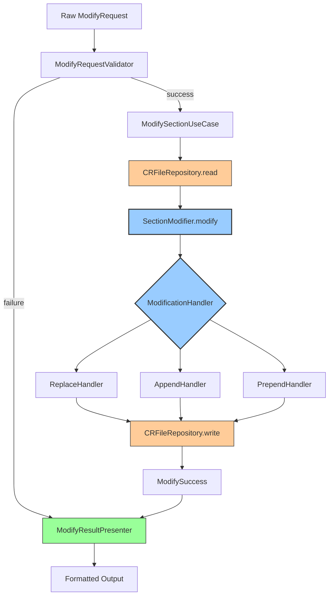

# Comprehensive Refactoring Plan: ModifyOperation.ts

**File**: `mcp-server/src/tools/handlers/operations/ModifyOperation.ts`
**Current Size**: 219 lines
**Assessment Date**: 2026-01-03
**Severity**: 🔴 High

---

## Executive Summary

The original refactoring plan addressed SRP violations and coupling through polymorphism and extraction. This comprehensive plan adds **layered architecture, type safety, validation chains, and proper result objects** to achieve production-grade design.

---

## Part 1: Original Plan (Still Valid)

| Refactoring | Pattern | Impact |
|-------------|---------|--------|
| Extract HeaderRenamer | Utility Extraction | High |
| Polymorphic handlers | Strategy Pattern | Very High |
| Group parameters | Parameter Object | Medium |
| Remove static props | Cleanup | Low |

*See `post-refactoring.md` for details on these items.*

---

## Part 2: Additional Critical Patterns

### 🔴 Priority 1: Layered Architecture (I/O Separation)

**Problem**: File I/O is mixed with business logic, preventing unit testing without filesystem mocks.

**Current**:
```typescript
async execute(...) {
  const fileData = await this.crFileReader.readCRFile(project, key);
  // ... business logic ...
  await this.markdownService.writeFile(fileData.filePath, updatedContent);
}
```

**Solution**: Split into Use Case (orchestration) and Domain (business logic) layers.

```
mcp-server/src/tools/handlers/
  ├── use-cases/
  │   └── ModifySectionUseCase.ts      (orchestrates I/O + domain)
  ├── domain/
  │   ├── SectionModifier.ts            (pure business logic)
  │   ├── models/
  │   │   ├── ModifyRequest.ts
  │   │   ├── ModifyResult.ts
  │   │   └── OperationType.ts
  │   └── services/
  │       ├── ModificationHandler.ts    (interface)
  │       ├── ReplaceHandler.ts
  │       ├── AppendHandler.ts
  │       └── PrependHandler.ts
  └── operations/
      └── ModifyOperation.ts            (deprecated, thin wrapper)
```

**Benefits**:
- ✅ Domain logic testable without I/O
- ✅ Clear separation of concerns
- ✅ Can swap persistence layer
- ✅ Easier to reason about

---

### 🔴 Priority 2: Discriminated Union (Type-Safe Operations)

**Problem**: String-typed operations with runtime cast.

**Current**:
```typescript
const operation = options?.operation as 'replace' | 'append' | 'prepend'
```

**Solution**: Use discriminated union for compile-time safety.

```typescript
// domain/models/OperationType.ts
export type SectionModificationCommand
  = | { type: 'replace', section: string, content: string, newSectionName?: string }
    | { type: 'append', section: string, content: string }
    | { type: 'prepend', section: string, content: string }

// Type guard to validate at runtime
function isValidCommand(cmd: unknown): cmd is SectionModificationCommand {
  if (typeof cmd !== 'object' || cmd === null)
    return false
  const c = cmd as Record<string, unknown>
  const validTypes = ['replace', 'append', 'prepend']
  return (
    typeof c.type === 'string'
    && validTypes.includes(c.type)
    && typeof c.section === 'string'
    && typeof c.content === 'string'
  )
}

// Domain logic with exhaustive handling
export class SectionModifier {
  modify(markdownBody: string, command: SectionModificationCommand): ModifyResult {
    switch (command.type) {
      case 'replace':
        return this.replaceHandler.handle(markdownBody, command.section, command.content)
      case 'append':
        return this.appendHandler.handle(markdownBody, command.section, command.content)
      case 'prepend':
        return this.prependHandler.handle(markdownBody, command.section, command.content)
      default:
        const _exhaustive: never = command
        throw new Error(`Unknown operation type`)
    }
  }
}
```

**Benefits**:
- ✅ Compile-time type checking
- ✅ Exhaustive switch handling
- ✅ IntelliSense support
- ✅ Impossible to pass invalid operation type

---

### 🟡 Priority 3: Validation Chain Pattern

**Problem**: Validation scattered across multiple locations.

**Current**:
```typescript
// Validation happens in multiple places:
if (!section) throw ...;
if (!content) throw ...;
this.simpleSectionValidator.validateSection(...);
this.simpleContentProcessor.processContent(...);
```

**Solution**: Centralized validation chain with early return.

```typescript
// domain/services/ModifyRequestValidator.ts
import { pipe } from 'fp-ts/lib/function.js'

export interface ValidationContext {
  availableSections: string[]
  maxContentSize: number
}

export type ValidationResult<T>
  = | { success: true, value: T }
    | { success: false, errors: ValidationError[] }

export class ModifyRequestValidator {
  constructor(private context: ValidationContext) {}

  validate(rawRequest: RawModifyRequest): ValidationResult<ValidModifyRequest> {
    return pipe(
      this.validateRequiredFields(rawRequest),
      this.chain(this.validateSectionExists),
      this.chain(this.validateContentSize),
      this.chain(this.validatePermissions),
      this.chain(this.validateContentFormat)
    )
  }

  private validateRequiredFields(req: RawModifyRequest): ValidationResult<ValidModifyRequest> {
    const errors: ValidationError[] = []

    if (!req.section?.trim()) {
      errors.push({ field: 'section', message: 'Section identifier is required' })
    }
    if (!req.content) {
      errors.push({ field: 'content', message: 'Content is required' })
    }
    if (!req.operation || !['replace', 'append', 'prepend'].includes(req.operation)) {
      errors.push({ field: 'operation', message: 'Must be: replace, append, or prepend' })
    }

    return errors.length > 0
      ? { success: false, errors }
      : { success: true, value: req as ValidModifyRequest }
  }

  private chain<T, U>(
    next: (value: T) => ValidationResult<U>
  ): (prev: ValidationResult<T>) => ValidationResult<U> {
    return prev =>
      prev.success ? next(prev.value) : prev as ValidationResult<U>
  }
}
```

**Benefits**:
- ✅ Single validation entry point
- ✅ Composable validation rules
- ✅ All errors collected at once
- ✅ Easy to add new validators

---

### 🟡 Priority 4: Result Objects (Not Formatted Strings)

**Problem**: Returns formatted string, mixing concerns.

**Current**:
```typescript
return this.validationFormatter.formatModifyOutput(
  key, matchedSection.hierarchicalPath, operation, ...
);
```

**Solution**: Return domain object, format at boundary.

```typescript
// domain/models/ModifyResult.ts
export interface ModifyResult {
  readonly crKey: string
  readonly section: string
  readonly operation: OperationType
  readonly bytesModified: number
  readonly filePath: string
  readonly timestamp: string
  readonly warnings: number
  readonly previousContent?: string
  readonly newContent?: string
}

export interface ModifySuccess extends ModifyResult {
  readonly status: 'success'
}

export interface ModifyFailure {
  readonly status: 'error'
  readonly error: Error
  readonly context: { crKey: string, section: string }
}

export type ModifyOutcome = ModifySuccess | ModifyFailure

// Use Case returns domain object
export class ModifySectionUseCase {
  async execute(request: ValidModifyRequest): Promise<ModifyOutcome> {
    try {
      const result = await this.modifyInternal(request)
      return { status: 'success', ...result }
    }
    catch (error) {
      return {
        status: 'error',
        error: error as Error,
        context: { crKey: request.crKey, section: request.section }
      }
    }
  }
}

// Presenter/Formatter at boundary
export class ModifyResultPresenter {
  present(outcome: ModifyOutcome): string {
    if (outcome.status === 'error') {
      return this.formatError(outcome)
    }
    return this.formatSuccess(outcome)
  }

  private formatSuccess(result: ModifySuccess): string {
    return `✅ Modified ${result.crKey}:${result.section} (${result.operation})\n`
      + `   Bytes: ${result.bytesModified}\n`
      + `   File: ${result.filePath}\n`
      + `   Time: ${result.timestamp}`
  }
}
```

**Benefits**:
- ✅ Separation of concerns (domain vs presentation)
- ✅ Caller can access result metadata
- ✅ Can format differently (JSON, markdown, plain text)
- ✅ Type-safe error handling

---

### 🟡 Priority 5: Logger Dependency Injection

**Problem**: `console.warn()` calls during business logic.

**Current**:
```typescript
if (contentProcessingResult.warnings.length > 0) {
  console.warn(`Content processing warnings for ${key}:`, contentProcessingResult.warnings)
}
```

**Solution**: Inject logger interface.

```typescript
// shared/interfaces/Logger.ts
export interface Logger {
  debug: (message: string, context?: unknown) => void
  info: (message: string, context?: unknown) => void
  warn: (message: string, context?: unknown) => void
  error: (message: string, error?: Error) => void
}

// Null logger for testing
export class NullLogger implements Logger {
  debug() {}
  info() {}
  warn() {}
  error() {}
}

// Console logger for production
export class ConsoleLogger implements Logger {
  warn(message: string, context?: unknown): void {
    console.warn(message, context)
  }
  // ... other methods
}

// Inject into domain
export class SectionModifier {
  constructor(
    private replaceHandler: ReplaceHandler,
    private appendHandler: AppendHandler,
    private prependHandler: PrependHandler,
    private logger: Logger
  ) {}

  modify(markdownBody: string, command: SectionModificationCommand): ModifyResult {
    // Business logic...

    if (warnings.length > 0) {
      this.logger.warn(`Content processing warnings`, { crKey, warnings })
    }

    return result
  }
}
```

**Benefits**:
- ✅ No side effects during testing
- ✅ Can swap logging implementation
- ✅ Testable without console output

---

### 🟢 Priority 6: Explicit Section Renaming

**Problem**: Header renaming inferred from content is implicit and error-prone.

**Current**:
```typescript
// Auto-detects first header at same level as "new section header"
const firstHeaderMatch = contentProcessingResult.content.match(firstHeaderPattern)
```

**Solution**: Make intent explicit with option flag.

```typescript
// domain/models/ModifyRequest.ts
export interface ModifyOptions {
  readonly operation: 'replace' | 'append' | 'prepend'
  readonly renameSection?: boolean // NEW: Explicit flag
  readonly newSectionName?: string // NEW: Or provide new name directly
  readonly preserveOriginalHeader?: boolean // NEW: Explicitly keep old header
}

// Use in command
type ReplaceCommand = {
  type: 'replace'
  section: string
  content: string
} & ModifyOptions

// Validation
if (command.renameSection && !command.newSectionName) {
  // Only auto-detect from content if flag is set
  const detected = this.headerRenamer.extract(command.content, sectionLevel)
  if (detected.newHeader) {
    command.newSectionName = detected.newHeader
  }
}
```

**Benefits**:
- ✅ Explicit intent
- ✅ No accidental renames
- ✅ Clearer API surface

---

### 🟢 Priority 7: Transaction Pattern (Optional)

**Problem**: No rollback if write fails.

**Solution**: Backup/restore on failure.

```typescript
// domain/services/TransactionalModifyOperation.ts
export class TransactionalModifyOperation {
  async execute(request: ValidModifyRequest): Promise<ModifyOutcome> {
    const backup = await this.createBackup(request.filePath)

    try {
      const result = await this.modifier.modify(request)
      await this.writeResult(request.filePath, result)
      await this.cleanupBackup(backup)
      return { status: 'success', ...result }
    }
    catch (error) {
      await this.restoreBackup(backup)
      return {
        status: 'error',
        error: error as Error,
        context: { crKey: request.crKey, section: request.section }
      }
    }
  }

  private async createBackup(filePath: string): Promise<string> {
    const backupPath = `${filePath}.backup.${Date.now()}`
    await fs.copyFile(filePath, backupPath)
    return backupPath
  }

  private async restoreBackup(backupPath: string): Promise<void> {
    const originalPath = backupPath.replace(/\.backup\.\d+$/, '')
    await fs.copyFile(backupPath, originalPath)
    await fs.unlink(backupPath)
  }
}
```

**Benefits**:
- ✅ Atomic-like operations
- ✅ No data loss on failure
- ✅ Recovery capability

---

## Complete Target Architecture

```
mcp-server/src/tools/handlers/
│
├── domain/                          # Business logic (no I/O)
│   ├── SectionModifier.ts           # Core domain service
│   ├── models/
│   │   ├── OperationType.ts         # Discriminated unions
│   │   ├── ModifyRequest.ts         # Request models
│   │   ├── ModifyResult.ts          # Result models
│   │   └── ValidationError.ts
│   └── services/
│       ├── ModifyRequestValidator.ts # Validation chain
│       ├── ModificationHandler.ts   # Handler interface
│       ├── ReplaceHandler.ts
│       ├── AppendHandler.ts
│       ├── PrependHandler.ts
│       └── HeaderRenamer.ts         # Extracted utility
│
├── use-cases/                       # Orchestration layer
│   ├── ModifySectionUseCase.ts      # Coordinates I/O + domain
│   └── TransactionalModifyUseCase.ts # Optional: with rollback
│
├── infrastructure/                  # External dependencies
│   ├── repositories/
│   │   └── CRFileRepository.ts      # File I/O abstraction
│   └── logging/
│       ├── Logger.ts                # Interface
│       ├── ConsoleLogger.ts
│       └── NullLogger.ts
│
├── presenters/                      # Output formatting
│   └── ModifyResultPresenter.ts     # Formats domain results
│
└── operations/                      # Legacy (deprecated)
    └── ModifyOperation.ts           # Thin wrapper to use-case
```

---

## Data Flow Diagram



---

## Implementation Order

### Phase 1: Foundation (Low Risk)
1. **Extract HeaderRenamer** (utility class)
2. **Create domain models** (OperationType, ModifyRequest, ModifyResult)
3. **Add Logger interface** (dependency injection)

### Phase 2: Core Refactoring (Medium Risk)
4. **Create ModificationHandler interface** + implementations
5. **Implement SectionModifier** (pure domain logic)
6. **Create ModifyRequestValidator** (validation chain)

### Phase 3: Layer Separation (High Risk)
7. **Create CRFileRepository** (I/O abstraction)
8. **Implement ModifySectionUseCase** (orchestration)
9. **Create ModifyResultPresenter** (formatting)

### Phase 4: Migration & Cleanup
10. **Deprecate ModifyOperation** (thin wrapper)
11. **Update all call sites**
12. **Remove old code**

### Phase 5: Enhancements (Optional)
13. **Add transaction support** (rollback)
14. **Metrics/observability**

---

## Risk Matrix

| Refactoring | Risk | Value | Dependencies |
|-------------|------|-------|--------------|
| Extract HeaderRenamer | Low | High | None |
| Create domain models | Low | High | None |
| Logger interface | Low | Medium | None |
| ModificationHandler | Medium | Very High | Domain models |
| SectionModifier | Medium | Very High | Handlers, Logger |
| Validation chain | Medium | High | Domain models |
| CRFileRepository | Medium | High | None |
| Use case layer | High | Very High | Repository, SectionModifier |
| Result presenter | Low | Medium | Result models |
| Transaction support | Medium | Low | Use case |

---

## Expected Improvements

| Metric | Before | After | Improvement |
|--------|--------|-------|-------------|
| Constructor params | 9 | 1-2 | -89% |
| Method length | 140 lines | ~20 lines | -86% |
| Cyclomatic complexity | ~15 | ~3 | -80% |
| Testability (I/O) | No | Yes | ✓ |
| Type safety (operations) | Runtime | Compile-time | ✓ |
| Validation | Scattered | Centralized | ✓ |
| Result type | String | Domain object | ✓ |
| Error handling | Throw | Result type | ✓ |

---

## Migration Strategy

### Step 1: Parallel Implementation
```typescript
// Old: ModifyOperation.ts (keep working)
export class ModifyOperation implements SectionOperation {
  async execute(...): Promise<string> {
    // Current implementation
  }
}

// New: ModifySectionUseCase.ts (new)
export class ModifySectionUseCase {
  async execute(request: ValidModifyRequest): Promise<ModifyOutcome> {
    // New implementation
  }
}
```

### Step 2: Adapter Pattern
```typescript
// Adapter to bridge old and new
export class ModifyOperationAdapter implements SectionOperation {
  constructor(
    private useCase: ModifySectionUseCase,
    private presenter: ModifyResultPresenter
  ) {}

  async execute(
    project: Project,
    key: string,
    section?: string,
    content?: string,
    options?: Record<string, unknown>
  ): Promise<string> {
    const request: RawModifyRequest = { project, crKey: key, section, content, operation: options?.operation }
    const outcome = await this.useCase.execute(request)
    return this.presenter.present(outcome)
  }
}
```

### Step 3: Gradual Migration
1. Replace call sites one by one
2. Run tests to verify behavior
3. Remove old code after full migration

---

## Summary

This comprehensive refactoring delivers:

1. **Layered Architecture** - Clear separation between I/O and business logic
2. **Type Safety** - Discriminated unions for compile-time guarantees
3. **Validation Chain** - Centralized, composable validation
4. **Result Objects** - Domain types instead of formatted strings
5. **Dependency Injection** - Testable, swappable components
6. **Explicit APIs** - Clear intent, no magic behavior

**The result**: Production-grade code that is testable, maintainable, and extensible.

---

*Generated using code-quality-assessor skill*
