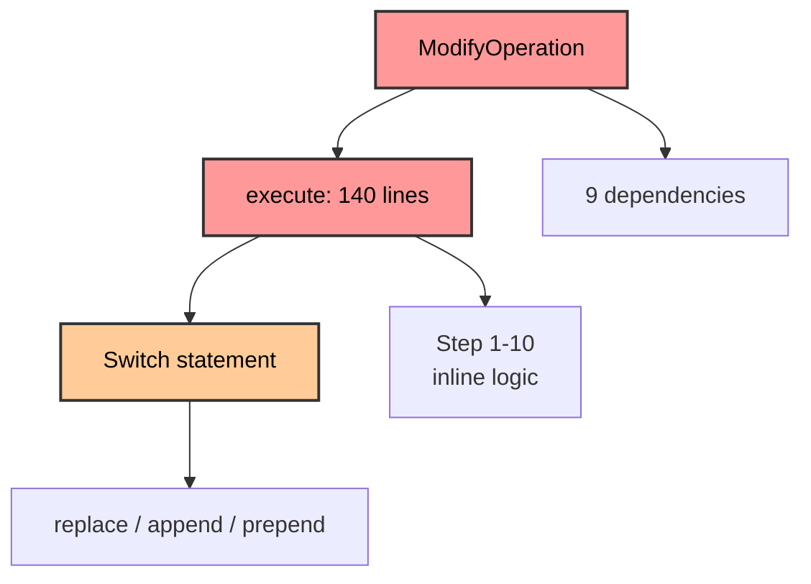
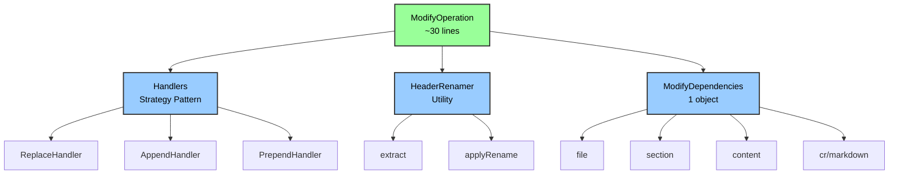
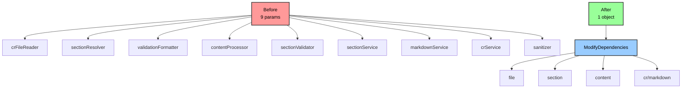

# ModifyOperation Refactoring Analysis

**File**: `mcp-server/src/tools/handlers/operations/ModifyOperation.ts`
**Current Size**: 219 lines (⚠️ FLAG, 46% over default 150, under hard max 225)
**Assessment Date**: 2026-01-03
**Severity**: 🔴 High

---

## Summary

`ModifyOperation.ts` violates SRP, has excessive coupling (9 constructor parameters), and buries complex logic in a 140-line `execute` method.

**Target architecture**:
1. **Polymorphic operation handlers** (ReplaceHandler, AppendHandler, PrependHandler)
2. **HeaderRenamer utility** (extracts complex regex logic)
3. **Parameter objects** (group related dependencies)
4. **Remove static class properties** (anti-pattern)

---

## Issues Identified

| Issue | Severity | Impact |
|-------|----------|--------|
| 9 constructor parameters | 🔴 High | Excessive coupling, hard to test |
| 140-line execute method | 🔴 High | Multiple responsibilities |
| Switch statement for operations | 🟡 Medium | Adding operations = modify switch |
| Header renaming in middle of execute | 🟡 Medium | Complex logic not testable in isolation |
| Static class refs as instance props | 🟡 Medium | Unnecessary indirection |

---

## Architecture Diagrams

### Current Structure (Before)



**Problems**:
- 🔴 Monolithic 140-line execute method
- 🔴 9 constructor parameters (tight coupling)
- 🟡 Switch statement (hard to extend)
- 🟡 Header renaming logic buried

---

### Target Structure (After)



**Benefits**:
- ✅ Lean 30-line orchestrator
- ✅ 1 parameter object (grouped concerns)
- ✅ Polymorphic handlers (extensible)
- ✅ HeaderRenamer isolated and testable

---

### Data Flow Comparison

```mermaid
graph TD
    subgraph Before
        A1[Input] --> B1[execute 140 lines]
        B1 --> C1[10 inline steps]
        C1 --> D1[Output]
    end

    subgraph After
        A2[Input] --> B2[orchestrator]
        B2 --> C2[Step 1-4]
        C2 --> C3[HeaderRename]
        C3 --> C4[Handler]
        C4 --> C5[Step 7-9]
        C5 --> D2[Output]
    end

    style B1 fill:#f99,stroke:#333,stroke-width:2px,color:#000
    style C1 fill:#f99,stroke:#333,stroke-width:2px,color:#000
    style B2 fill:#9f9,stroke:#333,stroke-width:2px,color:#000
    style C3 fill:#9cf,stroke:#333,stroke-width:2px,color:#000
    style C4 fill:#9cf,stroke:#333,stroke-width:2px,color:#000
```



---

### Dependency Injection Comparison



---

## Target Architecture

### 1. Replace Switch with Polymorphism

**Before**: Switch statement in execute method
**After**: Strategy pattern with handler lookup

```
operations/
  ├── ModifyOperation.ts         (orchestrator, ~30 lines)
  ├── handlers/
  │   ├── ModificationHandler.ts (interface)
  │   ├── ReplaceHandler.ts      (~20 lines)
  │   ├── AppendHandler.ts       (~15 lines)
  │   └── PrependHandler.ts      (~15 lines)
```

**Benefits**:
- Adding new operation = create one class
- Each handler independently testable
- Eliminates switch statement

---

### 2. Extract HeaderRenamer Utility

**Before**: 25 lines of regex logic in execute()
**After**: Dedicated utility class

```
utils/section/
  └── HeaderRenamer.ts           (~40 lines)
      ├── extract(content, level) -> { newHeader, body }
      └── applyRename(body, old, new) -> body
```

**Benefits**:
- Complex regex logic isolated
- Independently testable
- Reduces execute() by ~30 lines

---

### 3. Group Parameters into Objects

**Before**: 9 constructor parameters
**After**: 1 parameter object with grouped concerns

```typescript
interface ModifyDependencies {
  file: { reader, writer }
  section: { resolver, validator, formatter }
  content: { processor, sanitizer }
  cr: CRService
  markdown: MarkdownSectionService
}
```

**Benefits**:
- Reduces coupling
- Groups related dependencies
- Easier to mock for testing

---

### 4. Remove Static Class Properties

**Before**: Store `typeof MarkdownSectionService` as instance property
**After**: Use static classes directly

**Benefits**:
- Removes unnecessary indirection
- Reduces constructor parameters
- Clearer code flow

---

## Expected Improvements

| Metric | Before | After | Improvement |
|--------|--------|-------|-------------|
| Constructor params | 9 | 1 (object) | -89% |
| Method length | 140 lines | ~30 lines | -79% |
| Cyclomatic complexity | ~15 | ~3 | -80% |
| Testability | Hard (8 deps) | Easy (mock groups) | ✓ |

---

## Refactoring Order

1. **Extract HeaderRenamer** (low risk, immediate value)
2. **Polymorphic handlers** (medium risk, highest value)
3. **Group parameters** (low risk, reduces coupling)
4. **Remove static props** (low risk, cleanup)

---

## Risk Assessment

| Refactoring | Risk | Value | Priority |
|-------------|------|-------|----------|
| Extract HeaderRenamer | Low | High | 🔴 First |
| Polymorphic handlers | Medium | Very High | 🔴 Second |
| Group parameters | Low | Medium | 🟡 Third |
| Remove static props | Low | Low | 🟡 Anytime |

---

*Generated using code-quality-assessor skill*
