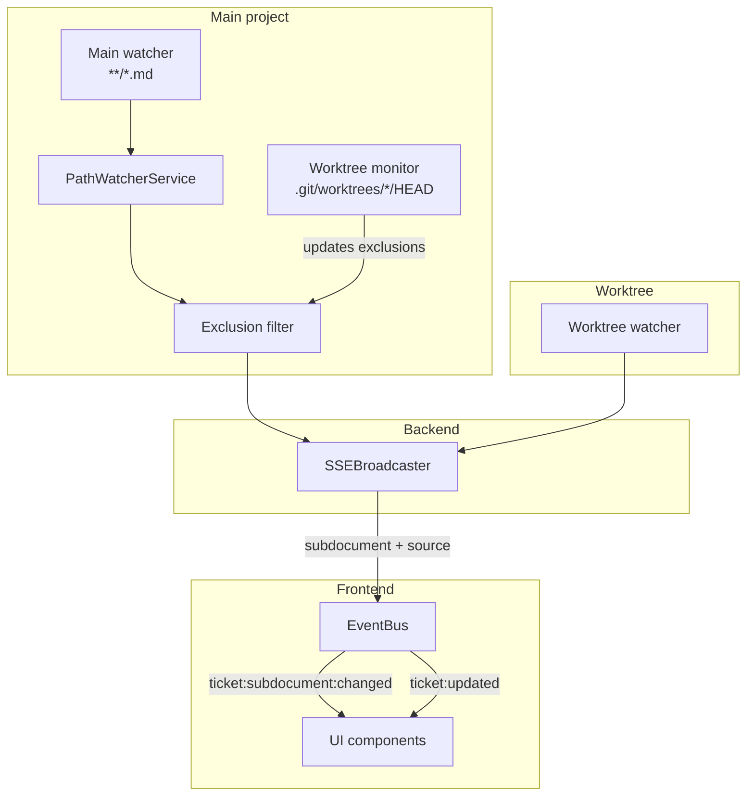
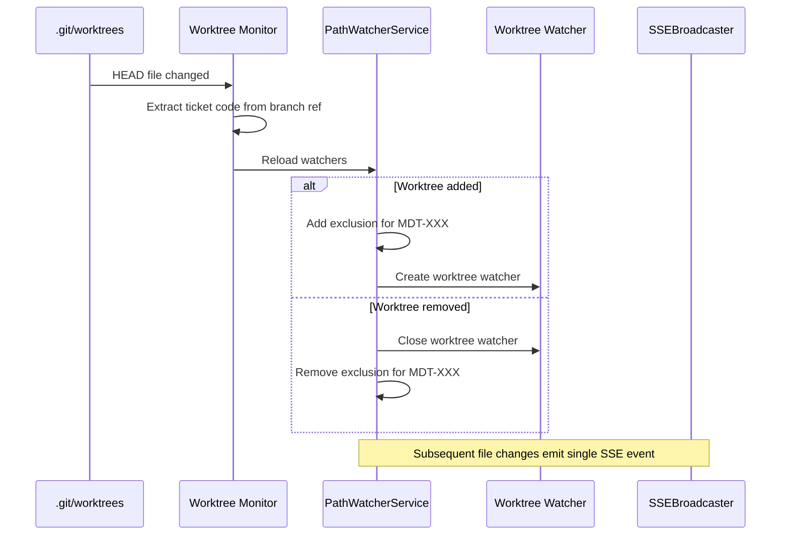
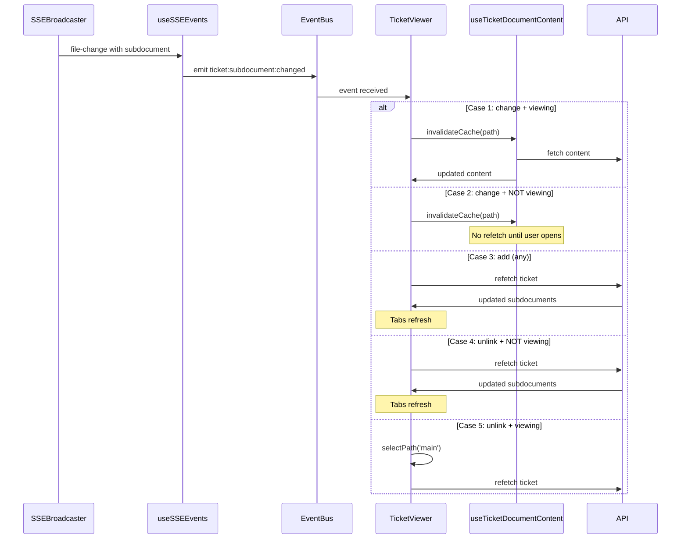

# Architecture: MDT-142

**Source**: [MDT-142](../MDT-142-fix-filewatcher-recursive-watching-worktree-exclus.md)
**Generated**: 2026-03-17

## Overview

This architecture extends the filewatcher to support subdocument SSE events in both main project and worktree contexts. The key changes are:
1. **Recursive watch pattern** (`**/*.md`) to capture nested subdocuments
2. **Worktree exclusion** from main watcher to prevent duplicate events
3. **Worktree auto-discovery** via `.git/worktrees/*/HEAD` monitoring
4. **Subdocument-aware SSE events** with source attribution

## Design Pattern

**Pattern**: Observer with filtered routing

The PathWatcherService observes file changes and routes events through an exclusion filter before broadcasting. Worktree changes are detected automatically and update the exclusion patterns dynamically.

## Module Boundaries

| Module | Responsibility |
|--------|----------------|
| `PathWatcherService` | File watching, worktree detection, exclusion filtering |
| `ProjectService` | Ticket list aggregation across main project and branch-matched worktrees |
| `SSEBroadcaster` | Event broadcasting with subdocument metadata |
| `EventBus` | Frontend event routing (ticket:updated, ticket:subdocument:changed) |
| `useSSEEvents` | SSE-to-EventBus mapping |

## Data Flow



## Invariants

1. **Single source of truth**: Each file change emits exactly one SSE event
2. **Source attribution**: Events always include `source: 'main' | 'worktree'`
3. **Backward compatibility**: Main ticket file changes emit `ticket:updated` as before
4. **Exclusion consistency**: Active worktree paths are always excluded from main watcher
5. **List completeness**: Ticket lists include branch-matched worktree-only tickets, not only tickets first discovered in the main project.

## Ticket List Aggregation

`ProjectService` must treat detected active worktrees as secondary ticket discovery roots for list operations. The aggregation flow is:

1. Scan main project tickets.
2. Detect branch-matched active worktrees through the existing worktree service.
3. Scan matching ticket files in each worktree.
4. Union results by ticket code, preferring the worktree copy for active worktree tickets.
5. Set `inWorktree: true` and `worktreePath` on worktree-sourced rows.

This closes the UAT case where `MDT-161` exists only in a worktree branch named `MDT-161`.

## Extension Rule

When adding new file types or watch patterns:
1. Update `PathWatcherService` watch pattern
2. Ensure exclusion logic handles new patterns
3. Add corresponding EventBus event type if user-visible

## Tradeoffs

| Decision | Tradeoff |
|----------|----------|
| Watch `.git/worktrees/*/HEAD` | Git-specific, but simpler than polling |
| Exclude worktree paths | Requires worktree detection, but prevents duplicates |
| Subdocument in SSE payload | Slightly larger events, but enables targeted UI updates |

## Error Handling

- Worktree watcher failures: Log warning, continue with main watcher
- Invalid worktree HEAD: Skip exclusion, may cause duplicate events
- Subdocument parse failure: Emit event without subdocument metadata

## Sequence: Worktree Auto-Discovery



## Frontend Event Handling

When SSE events arrive, the frontend maps them to EventBus events:

| SSE Event | EventBus Event | UI Action |
|-----------|----------------|-----------|
| Main ticket file changed | `ticket:updated` | Refetch full ticket |
| Subdocument changed | `ticket:subdocument:changed` | See cases below |

**EventBus payload for `ticket:subdocument:changed`:**

```typescript
{
  ticketCode: "MDT-142",
  eventType: "add" | "change" | "unlink",
  subdocument: {
    code: "architecture",
    filePath: "MDT-142/architecture.md"
  },
  source: "main" | "worktree"
}
```

**Precise UI behavior:**

| Case | eventType | Viewing subdoc? | Action |
|------|-----------|-----------------|--------|
| 1 | `change` | YES | `invalidateCache(path)` → refetch content |
| 2 | `change` | NO | `invalidateCache(path)` only (no refetch) |
| 3 | `add` | ANY | Refetch ticket to refresh tabs |
| 4 | `unlink` | NO | Refetch ticket to refresh tabs |
| 5 | `unlink` | YES | `selectPath('main')` → refetch ticket |

**Architecture note for cases 3-4:**

When `add` or `unlink` events arrive, the frontend refetches the full ticket. However, React's component model ensures only the tabs visually refresh:

```text
TicketViewer
├── currentTicket (state)
│   └── subdocuments (derived via useMemo)
│       └── TicketDocumentTabs ← receives subdocuments as prop
├── useTicketDocumentContent
│   └── content cache (separate from ticket state)
│   └── only refetches when selectedPath changes or cache invalidated
```

**Why only tabs refresh:**

| Component | Updates? | Why |
|-----------|----------|-----|
| TicketDocumentTabs | ✅ Yes | Receives new `subdocuments` prop from refetched ticket |
| Content area | ❌ No | `selectedPath` unchanged, cache still valid |
| Ticket attributes | ❌ No | Data unchanged, React skips DOM update |

This is the benefit of React's memoization model. Full data fetch, minimal visual change.

## Sequence: Subdocument Content Refresh



---
*Rendered by /mdt:architecture via spec-trace*
