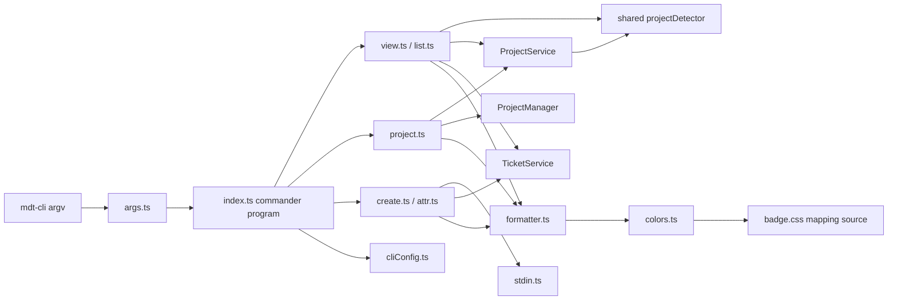

# Architecture: MDT-143

**Source**: [MDT-143](../MDT-143-cli-entrypoint-alternative-to-mcp.md)
**Generated**: 2026-03-23

## Overview

This architecture adds a standalone `cli/` workspace package that presents a terminal-first interface over the shared service framework. The CLI layer stays intentionally thin: it owns command grammar, output formatting, stdin capture, and terminal-specific policy, while shared services remain the single owner of project lookup, ticket reads and attr updates, project detection, and bootstrap backends.

## Design Pattern

**Pattern**: Thin CLI shell over shared domain services

The entrypoint bootstraps a `commander` command tree, applies a small shortcut-normalization pass where the product requires it, and routes project/ticket operations through the reshaped shared service boundary. That keeps the new CLI package focused on terminal behavior instead of re-implementing business rules that already exist in shared, MCP, and web-backed paths.

## Build vs Use Decisions

| Capability | Decision | Why |
|------------|----------|-----|
| Project current/get/list | **Use** `shared/services/ProjectService.ts` | `MDT-145` establishes `ProjectService` as the consumer-facing project contract for current-project resolution, explicit lookup, and project listing |
| Project init/bootstrap | **Use** `shared/tools/ProjectManager.ts` as backend collaborator | Project bootstrap stays write-oriented; `ProjectManager` is no longer the CLI-facing read/query API |
| Ticket read/attr update | **Use** `shared/services/TicketService.ts` | `MDT-145` establishes `TicketService` as the consumer-facing contract for ticket get/list and attribute mutation |
| Ticket create | **Use** existing create path behind `shared/services/TicketService.ts` | CLI create should stay behind shared ticket ownership even while create remains on a legacy helper method |
| Key normalization | **Use** `shared/utils/keyNormalizer.ts` | Preserves the repo's single normalization rule for numeric and prefixed CR keys |
| Project detection | **Use** `shared/utils/projectDetector.ts` through shared service entrypoints | The shared detector already exists; CLI should consume the entity-service boundary rather than a private copy |
| CLI framework | **Use** `commander` from `cli/src/index.ts` | The PoC validated real nested command ownership, autogenerated help, and natural handling of `project list` versus `project LIST` |
| Shortcut normalization | **Build** `cli/src/utils/args.ts` | Only bare ticket-key and alias shortcuts such as `mdt-cli 12` and `mdt-cli t 12` need pre-parse rewriting before the commander tree runs |
| ANSI colors | **Use** a lightweight terminal color helper behind `cli/src/output/colors.ts` | Keeps output rendering small while leaving category mapping decisions under repo control |
| Executable CLI acceptance | **Build** CLI E2E tests in `cli/tests/e2e/` using `@mdt/shared/test-lib` | Reuses the repo's isolated temp-project and process helpers instead of introducing `bats` or shell-only harnesses |

## Shared API Contract

These shared APIs are the intended integration surface for `cli/`. Command modules may compose them, but they should not re-implement their business rules locally.

| Shared API | Functions / Methods | CLI Use |
|------------|---------------------|---------|
| `shared/utils/keyNormalizer.ts` | `normalizeKey`, `KeyNormalizationError` | Default ticket command, explicit ticket key normalization, invalid-key error shaping |
| `shared/services/ProjectService.ts` | `resolveCurrentProject`, `getProject`, `listProjects` | `project`, `project current`, `project get|info <code>`, bare `project <code>`, and ticket/project shortcut context resolution |
| `shared/tools/ProjectManager.ts` | `createProject` | `project init` bootstrap only |
| `shared/services/TicketService.ts` | `getTicket`, `listTickets`, `updateTicketAttributes`, legacy create helper path | Ticket view, ticket list (with filters, sort, pagination), ticket attr, and ticket create without duplicating markdown persistence |
| `domain-contracts/src/ticket/input.ts` | `TicketFilters`, `AttrOperation` | CLI parses positional `key=value` args into `TicketFilters`; shared owns filtering, fuzzy matching, sorting, and pagination |
| `shared/services/project/types.ts` | `ReadResult`, `WriteResult`, project request/result contracts | Keep CLI adapters aligned with the shared consumer contract surface |
| `shared/services/ticket/types.ts` | `ListTicketsRequest`, `AttrOperation`, ticket request/result contracts | Parse CLI attr tokens into the shared operation contract rather than inventing a second mutation model |
| `shared/utils/toml.ts` | `parseToml`, `stringify` | Read CLI TOML config and avoid introducing a second TOML parser |

### Shared Gaps

| Gap | Status | Why It Exists |
|-----|--------|---------------|
| Consumer-facing ticket create contract | **Still transitional** | `MDT-145` formalized ticket read/attr/document capability boundaries, but ticket create still rides a legacy shared helper path |
| Ticket document collaborator | **Future-facing for CLI** | `TicketDocumentService` is part of the shared target shape, but `MDT-143` does not expose document-edit commands in v1 |
| TicketFilters expansion | **UAT required** | `TicketFilters` needs `assignee` and `phaseEpic` fields, fuzzy matching semantics, and `listTickets` needs sort/limit/offset pagination support |

### Not Missing in Shared

- Ticket persistence is already present in `TicketService`; CLI should call it instead of writing YAML directly.
- Project reads belong to `ProjectService`, while project bootstrap remains in `ProjectManager`; CLI should not treat `ProjectManager` as the project query API.
- TOML parsing already exists in `shared/utils/toml.ts`; the CLI should reuse it for both `.mdt-config.toml` and `~/.config/mdt/cli.toml`.

## Module Boundaries

| Module | Owner | Responsibility |
|--------|-------|----------------|
| `cli/src/index.ts` | CLI entrypoint | Bootstrap commander, register canonical verbs, own help/exit behavior, and route normalized argv into command handlers |
| `cli/src/utils/args.ts` | Shortcut normalization | Rewrite approved shortcut forms before commander parse without becoming a second command parser |
| `cli/src/commands/view.ts` + `cli/src/commands/list.ts` | Ticket read/list path | Resolve project context through `ProjectService`, normalize keys, read ticket data through `TicketService`, apply positional filters with AND cross-field and comma+fuzzy within-field matching, truncate to 10 newest by default, hand off to formatter |
| `cli/src/commands/project.ts` | Project namespace | Register `current`, `get|info`, `ls|list`, and `init`, route project reads through `ProjectService`, and route init through `ProjectManager` |
| `cli/src/commands/create.ts` + `cli/src/commands/attr.ts` | Ticket mutation | Register `ticket create` and `ticket attr` in the commander ticket subtree, retain top-level `create` and `attr` aliases, parse `=`, `+=`, and `-=` attr tokens, capture stdin when present, and call shared ticket write APIs |
| `cli/src/output/formatter.ts` + `cli/src/output/colors.ts` | Presentation layer | Labeled terminal output with per-element colors (title white, key light-blue, code dark cyan, id gray, path gray), relative vs absolute path rendering, TTY color policy, pipe-separated attr confirmation format |
| `cli/src/output/guide.ts` | Command guide | Generate --guide output from the registered commander tree at global and per-namespace scope |
| `cli/src/utils/cliConfig.ts` | CLI config | Read `~/.config/mdt/cli.toml`, apply defaults when absent |
| `cli/src/utils/stdin.ts` | Input adapter | Detect piped stdin and return literal body text without interpolation |
| `cli/tests/e2e/*.test.ts` | CLI E2E | Run the built CLI as a real child process against isolated projects created through `@mdt/shared/test-lib` |
| `shared/services/ProjectService.ts` | Project entity service | Current-project resolution, explicit project lookup, and project listing for consumer entrypoints |
| `shared/tools/ProjectManager.ts` | Project bootstrap backend | Project initialization and config materialization |
| `shared/services/TicketService.ts` | Ticket entity service | Ticket read/list/attr-update capabilities plus the current shared create path |
| `shared/services/ticket/types.ts` | Shared ticket contracts | Attr operation model and typed request/result shapes consumed by CLI adapters |
| `shared/test-lib/` | Shared test infrastructure | Provide temp directories, isolated config, project factories, and process helpers for CLI E2E |

## Runtime Flow



## Structure

```text
package.json                    # add cli workspace + shared scripts if needed
cli/
  package.json                  # bin entry, dependencies, package scripts
  tsconfig.json
  src/
    index.ts
    commands/
      view.ts
      list.ts
      project.ts
      create.ts
      attr.ts
    output/
      formatter.ts
      colors.ts
      guide.ts                   # --guide generation from commander tree
    utils/
      args.ts                     # shortcut normalization before commander parse
      cliConfig.ts
      stdin.ts
  tests/
    e2e/
      mdt-cli.e2e.test.ts
shared/
  utils/
    projectDetector.ts
  services/
    ProjectService.ts
    TicketService.ts
    project/
      types.ts
    ticket/
      types.ts
  tools/
    ProjectManager.ts
  test-lib/
    index.ts
```

## Runtime and Test Separation

- Runtime code in `cli/src/` owns terminal behavior only.
- Shared domain rules stay in `shared/`; the CLI must call them rather than fork them.
- CLI acceptance tests live in `cli/tests/e2e/`, use `@mdt/shared/test-lib` for isolated temp projects and process helpers, and execute the built CLI as a child process against real fixtures while covering both canonical commander commands and retained shortcuts.
- Browser Playwright remains for web UI behavior only and is not the primary acceptance harness for MDT-143.

## Invariants

1. **Single write owner**: Ticket creation and attribute persistence go through `TicketService`, not handwritten YAML mutation inside command modules.
2. **Single project read owner**: Project lookup, current-project resolution, and project listing go through `ProjectService`, not `ProjectManager`.
3. **Single project bootstrap owner**: `project init` delegates to `ProjectManager` so generated config matches the existing project creation workflow.
4. **Single detection rule**: CLI and MCP consume the same shared upward project detector through the shared service boundary.
5. **Single command tree owner**: `commander` owns canonical command registration and help output; `args.ts` may normalize only approved shortcut forms.
6. **Single formatting owner**: All human-readable terminal output passes through `formatter.ts`.
7. **Color policy is gated**: ANSI output is allowed only when config allows it and the target stream is interactive.
8. **Mockups are narrative**: Output sketches live in `architecture.md` for operator guidance and are not canonical trace records.
9. **No business logic in CLI**: Filtering, sorting, pagination, fuzzy matching, and query logic belong in `shared/`. CLI only parses argv into shared request types and renders results.

## E2E Decision

CLI acceptance will use repo-native CLI E2E tests in the CLI package rather than `bats` or the repository's browser Playwright suite. Tests should follow the `mcp-server/tests/e2e` style: use `@mdt/shared/test-lib` for temp directories, isolated config, project factories, and process helpers; invoke the built `mdt-cli` binary as a real child process; and assert on stdout, stderr, exit code, and resulting CR files.

## Interaction Mockups

These mockups are architecture guidance only. They illustrate the intended operator surface but do not replace the canonical `BR-*` and scenario records.
The canonical command tree is `ticket get|list|create|attr` and `project current|get|info|ls|list|init`, but the sketches below intentionally use retained shortcuts where they are the preferred operator experience.

### Ticket View

```text
$ mdt-cli 12

MDT-012 Add CLI access to tickets and projects
─────────────────────────────────────────────
  status:    [In Progress]
  type:      [Feature Enhancement]
  priority:  [High]
  phase:     Phase B (Enhancement)
  assignee:  kirby
  created:   2026-03-15
  modified:  2026-03-20
─────────────────────────────────────────────
  path: docs/CRs/MDT-012-add-cli-access.md
```

Colors: ticket key (MDT-012) light-blue, title white, path gray.

### Ticket List

```text
$ mdt-cli list

MDT-012 Add CLI access to tickets and projects
Implemented | Feature Enhancement | High | Phase B (Enhancement)
docs/CRs/MDT-012-add-cli-access.md

MDT-011 MCP HTTP transport
In Progress | Feature Enhancement | Medium
docs/CRs/MDT-011-mcp-http.md

10 tickets in MDT project
```

Default: 10 tickets, newest-first. `--all` for all, `--limit N` to override.

Filters (positional, AND across fields, comma+fuzzy within):
```text
$ mdt-cli list status=impl priority=high type=architecture
```

Output modes: `--files` (paths only), `--info` (no path line).

### Current Project

```text
$ mdt-cli project

MDT (markdown-ticket)  Markdown Ticket Board
  Kanban board with markdown-based tickets and MCP integration
  ~/Projects/markdown-ticket
```

Colors: project code dark cyan, id gray, title white, description normal, path gray.

### Project List

```text
$ mdt-cli project ls

MDT (markdown-ticket)  Markdown Ticket Board
  Kanban board with markdown-based tickets and MCP integration
  ~/Projects/markdown-ticket

API (api-gateway)  API Gateway Service
  Central API gateway for microservices
  ~/Projects/api-gateway
```

### Attr Update

```text
$ mdt-cli ticket attr MDT-012 status=implemented

Updated MDT-012 | status: In Progress → Implemented
```

No-op:
```text
$ mdt-cli ticket attr MDT-012 status=implemented

MDT-012 | status: unchanged (Implemented)
```

### Project Init

```text
$ mdt-cli project init MDT "Markdown Ticket Board"

Initialized project MDT in /current/folder
  config:    .mdt-config.toml
  counter:   .mdt-next
  tickets:   docs/CRs
```

## Extension Rule

When adding another CLI capability:
1. Add canonical verbs to the commander tree first; touch `args.ts` only when a new shortcut cannot be expressed directly in commander.
2. Create one command owner under `cli/src/commands/`.
3. Reuse shared services before adding new file-write logic to the CLI package.
4. Add CLI E2E coverage in `cli/tests/e2e/` for the new operator journey, reusing `@mdt/shared/test-lib` helpers where possible.
5. If the command changes user-visible behavior, update requirements before BDD.

## Review Notes

- The shared detector is now part of the shared framework. CLI should consume `ProjectService.resolveCurrentProject()` for project-context reads rather than importing the detector directly in command modules.
- The color mapping should remain category-aligned with `src/components/Badge/badge.css`, but runtime CSS parsing is not required; alignment can be enforced through tests around the CLI color adapter.
- The PoC changed the parser decision: do not build a bespoke top-level parser when `commander` already provides the canonical tree and the `project list` versus `project LIST` behavior we need.
- Ticket mutation grammar stays under the ticket entity in the canonical tree: `ticket create` and `ticket attr` are the canonical forms, while `create` and `attr` remain top-level aliases.
- Relation operator semantics are now part of the shared attr operation model; CLI should translate argv tokens into shared `AttrOperation` requests rather than implementing a separate mutation policy.
- `MDT-143` does not add document-edit commands. If future CLI work updates ticket title or body content, it should route through the shared document-capability path rather than the attr command.
- CLI verification should mirror the repository's existing real-process E2E style by standing on `@mdt/shared/test-lib`, not by introducing `bats` or a second shell-centric test stack.
- The `project` namespace is the only place for project inspection, listing, explicit project lookup, and init in this ticket. A parallel top-level `projects` command would violate the current requirement set.

---
*Canonical architecture projection: [architecture.trace.md](./architecture.trace.md)*
*Rendered by /mdt:architecture via spec-trace*
