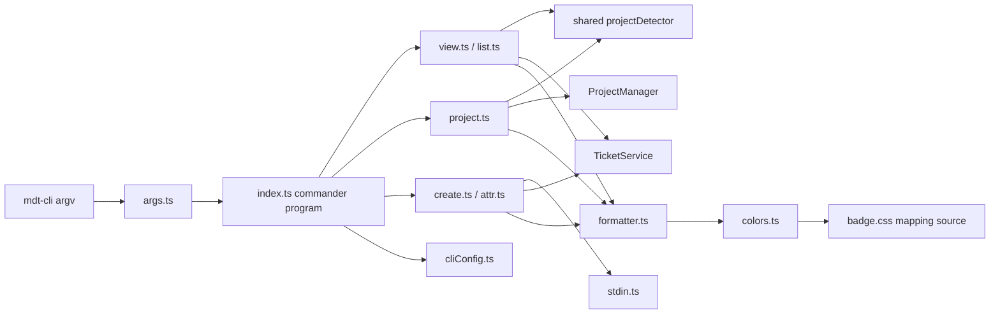

# Architecture: MDT-143

**Source**: [MDT-143](../MDT-143-cli-entrypoint-alternative-to-mcp.md)
**Generated**: 2026-03-23

## Overview

This architecture adds a standalone `cli/` workspace package that presents a terminal-first interface over existing shared project and ticket services. The CLI layer stays intentionally thin: it owns command grammar, output formatting, stdin capture, and terminal-specific policy, while shared services remain the single owner of CR persistence, project registry access, and key normalization.

## Design Pattern

**Pattern**: Thin CLI shell over shared domain services

The entrypoint bootstraps a `commander` command tree, applies a small shortcut-normalization pass where the product requires it, and routes all file-system mutation or project-registry operations through shared code. That keeps the new CLI package focused on terminal behavior instead of re-implementing business rules that already exist in the MCP and web-backed paths.

## Build vs Use Decisions

| Capability | Decision | Why |
|------------|----------|-----|
| Project create/list/get | **Use** `shared/tools/ProjectManager.ts` | `project init`, project listing, and explicit project lookup already align with existing project bootstrap and registry validation rules |
| Ticket read/create/update | **Use** `shared/services/TicketService.ts` | Reuses the existing CR creation and attribute update logic rather than duplicating markdown write paths |
| Key normalization | **Use** `shared/utils/keyNormalizer.ts` | Preserves the repo's single normalization rule for numeric and prefixed CR keys |
| Project detection | **Extract and use** `shared/utils/projectDetector.ts` | Both CLI and MCP need the same upward config search behavior; the private MCP copy should disappear |
| CLI framework | **Use** `commander` from `cli/src/index.ts` | The PoC validated real nested command ownership, autogenerated help, and natural handling of `project list` versus `project LIST` |
| Shortcut normalization | **Build** `cli/src/utils/args.ts` | Only bare ticket-key and alias shortcuts such as `mdt-cli 12` and `mdt-cli t 12` need pre-parse rewriting before the commander tree runs |
| ANSI colors | **Use** a lightweight terminal color helper behind `cli/src/output/colors.ts` | Keeps output rendering small while leaving category mapping decisions under repo control |
| Executable CLI acceptance | **Build** process-spawn integration tests in `cli/tests/integration/` | Browser Playwright is the wrong harness for a terminal-first product surface |

## Shared API Contract

These shared APIs are the intended integration surface for `cli/`. Command modules may compose them, but they should not re-implement their business rules locally.

| Shared API | Functions / Methods | CLI Use |
|------------|---------------------|---------|
| `shared/utils/keyNormalizer.ts` | `normalizeKey`, `KeyNormalizationError` | Default ticket command, explicit ticket key normalization, invalid-key error shaping |
| `shared/services/TicketService.ts` | `getCR`, `listCRs`, `createCR`, `updateCRStatus`, `updateCRAttrs` | Ticket view, ticket list, create, attr update |
| `shared/tools/ProjectManager.ts` | `createProject`, `listProjects`, `getProject` | `project init`, `project ls|list`, `project get|info <code>`, `project <code>` |
| `shared/services/ProjectService.ts` | `getProjectConfig`, `getProjectByCodeOrId` | Hydrate current-project details after cwd detection; resolve local config-backed metadata when needed |
| `shared/utils/toml.ts` | `parseToml`, `stringify` | Read CLI TOML config and avoid introducing a second TOML parser |
| `shared/utils/projectDetector.ts` | `find` | Resolve current project from cwd for ticket shortcuts and `mdt-cli project` / `mdt-cli project current` |

### Shared Gaps

| Gap | Status | Why It Exists |
|-----|--------|---------------|
| `shared/utils/projectDetector.ts` | **Must implement** | The detector exists only in `mcp-server/src/tools/utils/projectDetector.ts`; CLI and MCP need one shared cwd-to-project rule |
| MCP consumption of shared detector | **Must migrate consumer** | After the shared detector exists, `mcp-server/src/index.ts` must stop importing its private detector copy |

### Not Missing in Shared

- Ticket persistence is already present in `TicketService`; CLI should call it instead of writing YAML directly.
- Project bootstrap and lookup are already present in `ProjectManager`; CLI should wrap them instead of cloning `shared/tools/project-cli.ts`.
- TOML parsing already exists in `shared/utils/toml.ts`; the CLI should reuse it for both `.mdt-config.toml` and `~/.config/mdt/cli.toml`.

## Module Boundaries

| Module | Owner | Responsibility |
|--------|-------|----------------|
| `cli/src/index.ts` | CLI entrypoint | Bootstrap commander, register canonical verbs, own help/exit behavior, and route normalized argv into command handlers |
| `cli/src/utils/args.ts` | Shortcut normalization | Rewrite approved shortcut forms before commander parse without becoming a second command parser |
| `cli/src/commands/view.ts` + `cli/src/commands/list.ts` | Ticket read path | Resolve project context, normalize keys, read CR data, hand off to formatter |
| `cli/src/commands/project.ts` | Project namespace | Register `current`, `get|info`, `ls|list`, and `init`, plus bare project-code shortcut behavior |
| `cli/src/commands/create.ts` + `cli/src/commands/attr.ts` | Ticket mutation | Register `ticket create` plus the top-level `create` alias, keep `attr` as a top-level command, parse `=`, `+=`, and `-=` attr tokens, capture stdin when present, and call shared write APIs |
| `cli/src/output/formatter.ts` + `cli/src/output/colors.ts` | Presentation layer | Labeled terminal output, relative vs absolute path rendering, TTY color policy |
| `cli/src/utils/cliConfig.ts` | CLI config | Read `~/.config/mdt/cli.toml`, apply defaults when absent |
| `cli/src/utils/stdin.ts` | Input adapter | Detect piped stdin and return literal body text without interpolation |
| `shared/utils/projectDetector.ts` | Shared detection | Upward `.mdt-config.toml` discovery for CLI and MCP consumers |
| `shared/tools/ProjectManager.ts` | Project operations | Project bootstrap, registry validation, code generation, explicit project lookup |
| `shared/services/TicketService.ts` | Ticket persistence | CR read, create, status update, and attribute update paths |

## Runtime Flow



## Structure

```text
package.json                    # add cli workspace + shared scripts if needed
cli/
  package.json                  # bin entry, dependencies, package scripts
  tsconfig.json
  src/
    index.ts
    commands/
      view.ts
      list.ts
      project.ts
      create.ts
      attr.ts
    output/
      formatter.ts
      colors.ts
    utils/
      args.ts                     # shortcut normalization before commander parse
      cliConfig.ts
      stdin.ts
  tests/
    integration/
      mdt-cli.integration.test.ts
shared/
  utils/
    projectDetector.ts
  tools/
    ProjectManager.ts
  services/
    TicketService.ts
mcp-server/
  src/
    index.ts                    # switches to shared projectDetector
```

## Runtime and Test Separation

- Runtime code in `cli/src/` owns terminal behavior only.
- Shared domain rules stay in `shared/`; the CLI must call them rather than fork them.
- CLI acceptance tests live in `cli/tests/integration/`, execute the built CLI as a child process against temp project fixtures, and cover both canonical commander commands and retained shortcuts.
- Browser Playwright remains for web UI behavior only and is not the primary acceptance harness for MDT-143.

## Invariants

1. **Single write owner**: Ticket creation and attribute persistence go through `TicketService`, not handwritten YAML mutation inside command modules.
2. **Single project bootstrap owner**: `project init` delegates to `ProjectManager` so generated config matches the existing project creation workflow.
3. **Single detection rule**: CLI and MCP consume the same shared upward project detector.
4. **Single command tree owner**: `commander` owns canonical command registration and help output; `args.ts` may normalize only approved shortcut forms.
5. **Single formatting owner**: All human-readable terminal output passes through `formatter.ts`.
6. **Color policy is gated**: ANSI output is allowed only when config allows it and the target stream is interactive.
7. **Mockups are narrative**: Output sketches live in `architecture.md` for operator guidance and are not canonical trace records.

## E2E Decision

CLI acceptance will use a spawned-process integration harness in the CLI package rather than the repository's browser Playwright suite. Tests should create isolated projects, invoke the built `mdt-cli` binary with explicit cwd and stdin fixtures, and assert on stdout, stderr, exit code, and resulting CR files.

## Interaction Mockups

These mockups are architecture guidance only. They illustrate the intended operator surface but do not replace the canonical `BR-*` and scenario records.
The canonical command tree is `ticket get|list|create`, `project current|get|info|ls|list|init`, and top-level `attr`, but the sketches below intentionally use retained shortcuts where they are the preferred operator experience.

### Ticket View

```text
$ mdt-cli 12

MDT-012 Add CLI access to tickets and projects
─────────────────────────────────────────────
  status:    [In Progress]
  type:      [Feature Enhancement]
  priority:  [High]
  phase:     Phase B (Enhancement)
  assignee:  kirby
  created:   2026-03-15
  modified:  2026-03-20
─────────────────────────────────────────────
  path: docs/CRs/MDT-012-add-cli-access.md
```

### Current Project

```text
$ mdt-cli project

MDT (markdown-ticket)
  name:         Markdown Ticket Board
  description:  Kanban board with markdown-based tickets and MCP integration
  path:         ~/Projects/markdown-ticket
  ticketsPath:  docs/CRs
  config:       .mdt-config.toml
```

### Project Init

```text
$ mdt-cli project init MDT "Markdown Ticket Board"

Initialized project MDT in /current/folder
  config:    .mdt-config.toml
  counter:   .mdt-next
  tickets:   docs/CRs
```

## Extension Rule

When adding another CLI capability:
1. Add canonical verbs to the commander tree first; touch `args.ts` only when a new shortcut cannot be expressed directly in commander.
2. Create one command owner under `cli/src/commands/`.
3. Reuse shared services before adding new file-write logic to the CLI package.
4. Add integration coverage in `cli/tests/integration/` for the new operator journey.
5. If the command changes user-visible behavior, update requirements before BDD.

## Review Notes

- The detector extraction is part of the architecture, not an implementation cleanup. `mcp-server/src/index.ts` should consume the shared detector once `shared/utils/projectDetector.ts` exists.
- The color mapping should remain category-aligned with `src/components/Badge/badge.css`, but runtime CSS parsing is not required; alignment can be enforced through tests around the CLI color adapter.
- The PoC changed the parser decision: do not build a bespoke top-level parser when `commander` already provides the canonical tree and the `project list` versus `project LIST` behavior we need.
- Ticket mutation grammar is intentionally split: `ticket create` owns creation with `create` as alias, while attribute writes stay on the explicit top-level `attr` command only.
- Relation operator semantics are a CLI-level product decision that must be implemented above the current shared overwrite-only attribute API or by extending shared update semantics consistently.
- The `project` namespace is the only place for project inspection, listing, explicit project lookup, and init in this ticket. A parallel top-level `projects` command would violate the current requirement set.

---
*Canonical architecture projection: [architecture.trace.md](./architecture.trace.md)*
*Rendered by /mdt:architecture via spec-trace*
