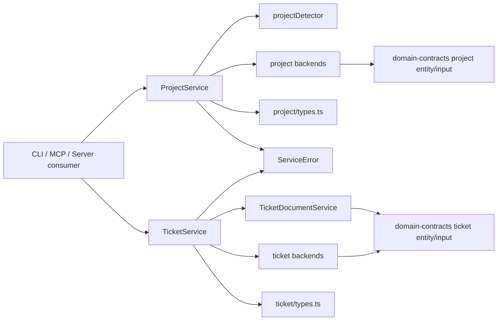

# Architecture: MDT-145

**Source**: [MDT-145](../MDT-145-refine-shared-layer-into-a-stable-service-framewor.md)
**Generated**: 2026-03-24

## Overview

This architecture turns `shared/` into a consumer-neutral service framework instead of a loose collection of reusable utilities. The target design keeps canonical entity schemas in `domain-contracts`, keeps low-level project and ticket persistence in shared backends, and makes the shared service surface explicit by capability: project context, project list, project updates, ticket list, ticket attr updates, ticket document updates, and ticket subdocument listing. CLI behavior and command wiring stay under `MDT-143`; this ticket defines the shared framework those commands are expected to consume.

## Design Pattern

**Pattern**: Consumer-neutral entity services with explicit query/write/document capability boundaries

The new boundary has four layers:
1. `domain-contracts/` owns canonical persisted entity and input schemas.
2. shared backends own discovery, caching, filesystem policy, and markdown persistence.
3. shared entity-facing services (`ProjectService`, `TicketService`) expose consumer-facing capabilities with explicit query/write/document boundaries.
4. specialized collaborators such as `TicketDocumentService` may sit under the entity-facing service surface when document-specific rules need their own owner.
5. CLI, MCP, and server entrypoints consume the shared framework without re-implementing those rules.

## Build vs Use Decisions

| Capability | Decision | Why |
|------------|----------|-----|
| Project discovery/cache backend | **Use** current shared project discovery/config backends | Existing registry and config logic should remain the underlying source of truth |
| Ticket persistence backend | **Use** current shared ticket persistence and markdown backends | Existing read/write markdown persistence should remain the storage backend |
| Current-project detection | **Build** `shared/utils/projectDetector.ts` | The current detector is MCP-private and depth-limited; `shared/` needs one reusable root-up detector |
| Consumer-facing project service | **Reshape** `shared` project service surface | Project lookup, list, and project updates must be explicit capabilities even if the final wording stays `ProjectService` |
| Consumer-facing ticket service | **Reshape** `shared` ticket service surface | Ticket list, attr update, document update, and subdocument listing must be explicit capabilities even if the final wording stays `TicketService` |
| Ticket document collaborator | **Build or extract** `shared/services/ticket/TicketDocumentService.ts` | Title/H1 and markdown content rules should not be hidden inside attr update code paths |
| Service contract types | **Extend** `shared/services/project/types.ts` and `shared/services/ticket/types.ts` | Service-layer request/result contracts and service interfaces belong in `shared`, not in `domain-contracts` |
| Error model | **Build** `shared/services/ServiceError.ts` | Shared code must stop depending on CLI-specific errors while still giving consumers typed failures |
| Domain contract cleanup | **Reshape** `domain-contracts/src/project/` into clearer role modules such as `entity.ts` and `input.ts` | Project contracts should mirror the role clarity already present in the ticket domain without moving service interfaces into `domain-contracts` |
| In-scope consumer migration | **Migrate** MCP-private shared logic now; leave CLI command adoption to `MDT-143` | MDT-145 owns the shared framework and the removal of duplicated shared logic, not CLI command-module behavior |

## Target Service Framework

### Core vs Consumer Services

| Layer | Owner | Responsibility |
|-------|-------|----------------|
| `domain-contracts` | Canonical data shapes | Persisted entity and input schemas, validation helpers, stable field naming |
| `shared/services/ProjectService.ts` | Consumer-facing project contract | Resolve current project, resolve explicit project identifiers/codes, list projects, update project attributes, and return typed results |
| shared project backends | Project backend layer | Discovery, config loading, caching, registry access, persistence support |
| `shared/services/TicketService.ts` | Consumer-facing ticket contract | List tickets, get tickets, update attributes, coordinate document updates, list subdocuments, and return typed results |
| `shared/services/ticket/TicketDocumentService.ts` | Ticket document collaborator | Own markdown-aware document updates, including H1/title rules and content updates |
| shared ticket backends | Ticket backend layer | Ticket reads, markdown persistence, worktree-aware file resolution |
| `shared/services/ServiceError.ts` | Shared-neutral error model | Typed validation/not-found/conflict/internal failures with consumer-safe metadata |

### Module Boundaries

| Module | Owner | Responsibility |
|--------|-------|----------------|
| `shared/utils/projectDetector.ts` | Detection utility | Root-up `.mdt-config.toml` search with explicit no-project result |
| `domain-contracts/src/project/entity.ts` | Canonical project entity role | Own the canonical runtime project shape |
| `domain-contracts/src/project/input.ts` | Canonical project input role | Own create/update project inputs and other canonical non-service boundary inputs |
| `shared/services/project/types.ts` | Project service contracts | Query/update request and result contracts, shared-neutral project errors, and any service interfaces |
| `shared/services/ProjectService.ts` | Project entity service | Expose project context, lookup, list, and project-attribute update capabilities without mixing transport concerns |
| `shared/tools/ProjectManager.ts` | Project write orchestration | Project bootstrap/update flows only; no consumer-facing read lookup and no CLI-specific errors |
| `shared/services/ticket/types.ts` | Ticket service contracts | Ticket list, attr-update, document-update, subdocument-list request/result contracts and shared-neutral ticket errors |
| `shared/services/TicketService.ts` | Ticket entity service | Expose ticket list, ticket attr update, ticket document update, and ticket subdocument list capabilities without mixing transport concerns |
| `shared/services/ticket/TicketDocumentService.ts` | Ticket document owner | Apply markdown-aware title/content updates and enforce H1 title authority |
| `shared/index.ts` | Package entrypoint | Re-export the new shared framework surface for downstream consumers |

## Functional Interfaces

These are the target capability-level contracts for the shared framework. They are intentionally more explicit than the current code, but they should stay lean. Existing legacy names such as `getProjectByCodeOrId`, `listCRs`, `getCR`, and `updateCRAttrs` may remain as migration shims, but the architectural surface should read as entity capabilities rather than CR-era helper names.

The design goal here is systematic behavior, not a large taxonomy of one-off interface names. Prefer:
- a small set of request types
- one shared read-result family
- one shared write-result family
- one shared error model

Avoid inventing a different `*Result` type for every method unless the payload shape is materially different.

### Shared Result Families

```ts
// shared/services/*/types.ts

export interface ReadResult<TData, TContext = undefined> {
  data: TData
  context?: TContext
}

export interface WriteResult<TNormalizedInput> {
  target: {
    projectId: string
    projectCode: string
    ticketKey?: string
  }
  normalizedInputs: TNormalizedInput
  changedFields: string[]
  path: string
}
```

`ReadResult` and `WriteResult` are the preferred architectural shapes. Method-specific aliases are acceptable when they improve readability, but the system should not depend on a unique result contract for every capability.

### Project Service Surface

```ts
// shared/services/project/types.ts

export interface ResolveCurrentProjectRequest {
  cwd: string
}

export interface GetProjectRequest {
  projectRef: string
}

export interface ListProjectsRequest {
  includeInactive?: boolean
}

export interface UpdateProjectAttributesRequest {
  projectRef: string
  updates: UpdateProjectInput
}

export interface ProjectServiceContract {
  resolveCurrentProject(
    request: ResolveCurrentProjectRequest,
  ): Promise<ReadResult<Project, { detectedFrom: string } | { none: true }>>

  getProject(
    request: GetProjectRequest,
  ): Promise<ReadResult<Project>>

  listProjects(
    request?: ListProjectsRequest,
  ): Promise<ReadResult<Project[]>>

  updateProjectAttributes(
    request: UpdateProjectAttributesRequest,
  ): Promise<WriteResult<UpdateProjectInput>>
}
```

Method intent:
- `resolveCurrentProject()` owns cwd-to-project resolution. It is the only service entrypoint allowed to call `projectDetector`.
- `getProject()` owns explicit lookup by exact id or case-insensitive project code.
- `listProjects()` owns the consumer-facing project list capability and shields consumers from cache/registry details.
- `updateProjectAttributes()` owns shared project-attribute updates and returns a structured write result instead of a boolean.

### Ticket Service Surface

```ts
// shared/services/ticket/types.ts

export interface ListTicketsRequest {
  projectRef: string
  filters?: TicketFilters
}

export interface GetTicketRequest {
  projectRef: string
  ticketKey: string
}

export interface UpdateTicketAttributesRequest {
  projectRef: string
  ticketKey: string
  operations: AttrOperation[]
}

export interface UpdateTicketDocumentRequest {
  projectRef: string
  ticketKey: string
  title?: string
  content?: string
}

export interface ListTicketSubdocumentsRequest {
  projectRef: string
  ticketKey: string
}

export interface TicketServiceContract {
  listTickets(
    request: ListTicketsRequest,
  ): Promise<ReadResult<Ticket[]>>

  getTicket(
    request: GetTicketRequest,
  ): Promise<ReadResult<Ticket>>

  updateTicketAttributes(
    request: UpdateTicketAttributesRequest,
  ): Promise<WriteResult<AttrOperation[]>>

  updateTicketDocument(
    request: UpdateTicketDocumentRequest,
  ): Promise<WriteResult<Pick<UpdateTicketDocumentRequest, 'title' | 'content'>>>

  listTicketSubdocuments(
    request: ListTicketSubdocumentsRequest,
  ): Promise<ReadResult<SubDocument[]>>
}
```

Method intent:
- `listTickets()` owns ticket listing plus shared filter semantics.
- `getTicket()` owns a full ticket read, including resolution of the ticket within the correct project/worktree context.
- `updateTicketAttributes()` owns mutable frontmatter-style attributes only. It rejects `title` and `content`, and it applies `set`/`add`/`remove` semantics only where the contract allows them.
- `updateTicketDocument()` owns markdown-body and title/H1 updates and is the only public ticket write path allowed to change stored title or content.
- `listTicketSubdocuments()` owns ticket-scoped subdocument discovery without conflating that capability with the main ticket document body.

### Ticket Document Collaborator

```ts
// shared/services/ticket/types.ts

export interface TicketDocumentServiceContract {
  updateDocument(
    request: UpdateTicketDocumentRequest,
  ): Promise<WriteResult<Pick<UpdateTicketDocumentRequest, 'title' | 'content'>>>
}
```

Method intent:
- `updateDocument()` owns markdown-aware mutation rules below the main `TicketService` facade.
- It is a collaborator, not a separate top-level entity namespace. Consumers call `TicketService`; `TicketService` delegates document-specific work to this collaborator.
- H1 is authoritative for stored title. If both `title` and `content` are supplied, document reconciliation happens here, not in the attribute-update path.

This keeps the framework systematic for CLI, MCP, server, and LLM consumers without forcing a separate result hierarchy for every method.

## Capability Call Chains

### Resolve Current Project

`Consumer -> ProjectService.resolveCurrentProject() -> projectDetector.find(cwd) -> project config backend -> ReadResult<Project, detection-context> | explicit no-project result`

Notes:
- Only this path should interpret cwd.
- The detector returns location context; `ProjectService` turns that into the consumer-facing result contract.

### Get Project By Explicit Reference

`Consumer -> ProjectService.getProject() -> project cache/registry backend -> exact id match or case-insensitive code match -> ReadResult<Project> | ServiceError`

Notes:
- Lookup normalization stays inside shared.
- Consumers should not implement their own code-folding or registry traversal.

### List Projects

`Consumer -> ProjectService.listProjects() -> project cache/registry backend -> includeInactive filter -> ReadResult<Project[]>`

Notes:
- Cache, discovery, and registry access remain backend details.
- The consumer receives one stable list contract regardless of entrypoint.

### Update Project Attributes

`Consumer -> ProjectService.updateProjectAttributes() -> validate UpdateProjectInput -> ProjectManager/config backend update -> cache invalidation -> WriteResult<UpdateProjectInput>`

Notes:
- Project writes remain under the entity-facing `ProjectService` surface.
- `ProjectManager` stays a write-oriented backend collaborator, not the public read/query contract.

### List Tickets

`Consumer -> TicketService.listTickets() -> ProjectService.getProject() -> ticket persistence backend -> apply TicketFilters -> ReadResult<Ticket[]>`

Notes:
- Project resolution happens before ticket query logic.
- Shared filtering semantics live in this path, not in each consumer.

### Get Ticket

`Consumer -> TicketService.getTicket() -> ProjectService.getProject() -> ticket location resolver/worktree backend -> ticket persistence backend -> ReadResult<Ticket> | ServiceError`

Notes:
- Ticket lookup owns worktree-aware resolution.
- Consumers should not compose project lookup and ticket file resolution manually.

### Update Ticket Attributes

`Consumer -> TicketService.updateTicketAttributes() -> ProjectService.getProject() -> load ticket -> validate mutable fields and attr operations -> apply relation add/remove policy -> persist frontmatter updates -> WriteResult<AttrOperation[]>`

Notes:
- `title` and `content` are rejected here.
- Relation `add/remove` semantics belong here, not in CLI or MCP adapters.

### Update Ticket Document

`Consumer -> TicketService.updateTicketDocument() -> ProjectService.getProject() -> TicketDocumentService.updateDocument() -> read markdown document -> reconcile H1/title/content -> persist markdown -> WriteResult<title/content>`

Notes:
- This is the only write path that may change stored title or body content.
- The document collaborator owns markdown-specific reconciliation so `TicketService` does not accumulate parser/writer complexity.

### List Ticket Subdocuments

`Consumer -> TicketService.listTicketSubdocuments() -> ProjectService.getProject() -> ticket location resolver -> subdocument discovery backend -> ReadResult<SubDocument[]>`

Notes:
- Main ticket document and subdocuments are separate capabilities.
- Consumers receive one ticket-scoped subdocument list contract without knowing file-layout rules.

## Runtime Flow



## Structure

```text
domain-contracts/
  src/
    project/
      entity.ts
      input.ts
      schema.ts
    ticket/
      entity.ts
      input.ts

shared/
  index.ts
  utils/
    projectDetector.ts
    __tests__/
      projectDetector.test.ts
  services/
    ServiceError.ts
    ProjectService.ts
    TicketService.ts
    project/
      types.ts
      __tests__/
        ProjectService.test.ts
    ticket/
      TicketDocumentService.ts
      types.ts
      __tests__/
        TicketDocumentService.test.ts
        TicketService.attributes.test.ts
        TicketService.query.test.ts
        TicketService.subdocuments.test.ts
  tools/
    ProjectManager.ts

mcp-server/
  src/
    index.ts
    services/
      crService.ts
    tools/
      handlers/
        crHandlers.ts
        projectHandlers.ts
```

## Runtime and Test Separation

- `domain-contracts/` remains the owner of persisted shapes and validation helpers only.
- shared backends keep filesystem and persistence logic; they are not the public contract surface for every consumer anymore.
- shared entity-facing services own the stable framework contract that CLI, MCP, and server code should call.
- CLI command adoption is downstream to this ticket and remains owned by `MDT-143`; MDT-145 only defines the shared contract that CLI will consume.
- shared verification lives beside the new shared modules and locks semantics before consumer migration is treated as complete.

## Invariants

1. **One current-project rule**: cwd detection is shared and root-up; no consumer keeps a private detector copy.
2. **One explicit project lookup rule**: exact identifier and case-insensitive project-code lookup are resolved by the same shared project service.
3. **One visible project split**: project list and project updates are separate capabilities even if they share one `ProjectService` wording.
4. **One visible ticket split**: ticket list, ticket attr updates, ticket document updates, and ticket subdocument listing are separate capabilities even if they share one `TicketService` wording.
5. **Title is document-owned**: `title` remains part of the ticket entity, but H1 remains authoritative and title changes flow through document-update logic, not attr-update logic.
6. **One contract boundary**: canonical entity/input schemas stay in `domain-contracts`, while service operation contracts and service interfaces stay in shared service type modules.
7. **Consumer controls presentation**: shared services do not own terminal formatting or uncontrolled console output.

## Extension Rule

When another cross-entrypoint behavior is added:
1. Decide first whether it is a persisted entity shape or a service operation contract.
2. Put persisted shape changes in `domain-contracts`; put service request/result contracts in shared service type modules.
3. Reuse `ProjectService` or `TicketService` when the new behavior belongs to an existing entity capability surface.
4. Extract a dedicated collaborator such as `TicketDocumentService` when markdown-specific or file-shape-specific rules would otherwise blur the main entity service boundary.
5. Extend backends only when the behavior truly belongs to persistence/discovery, not to consumer-facing orchestration.
6. Add shared tests for the new semantic rule before migrating consumers.

## Review Notes

- The key redesign move is not “move everything into shared.” It is “make `shared/` explicit about which capabilities belong to the project and ticket service surfaces, and which collaborators own document-specific or backend-specific rules.”
- `ProjectManager` currently imports CLI-specific error types. That coupling is a design defect and is explicitly out of bounds in the target architecture.
- `TicketService` currently mixes read and write behavior under one broad name. The target design keeps simple entity service wording but makes its capability boundaries explicit and moves markdown-specific title/content rules behind a document-focused collaborator.
- `shared/services/project/types.ts` and `shared/services/ticket/types.ts` are the right home for service-layer contracts and service interfaces. This preserves the documented `domain-contracts` boundary while avoiding ad hoc consumer-local interfaces.
- `domain-contracts/project` should become more role-explicit, like the existing ticket contract split, but service interfaces must still stay out of `domain-contracts`.
- Consumer migration is part of the architecture, but the scope is still bounded. MDT-145 removes MCP-private shared logic and defines the framework boundary; CLI command-level adoption remains with `MDT-143`.

---
*Canonical artifact and obligation projection: [architecture.trace.md](./architecture.trace.md)*
*Rendered by /mdt:architecture via spec-trace*
