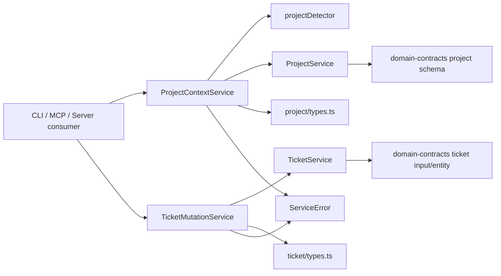

# Architecture: MDT-145

**Source**: [MDT-145](../MDT-145-refine-shared-layer-into-a-stable-service-framewor.md)
**Generated**: 2026-03-24

## Overview

This architecture turns `shared/` into a consumer-neutral service framework instead of a loose collection of reusable utilities. The target design keeps canonical entity schemas in `domain-contracts`, keeps low-level project and ticket persistence in existing shared core services, and adds a small set of explicit shared consumer services that own context resolution, attr-mutation semantics, result contracts, and error discipline. CLI behavior and command wiring stay under `MDT-143`; this ticket defines the shared framework those commands are expected to consume.

## Design Pattern

**Pattern**: Consumer-neutral shared framework over core project and ticket services

The new boundary has four layers:
1. `domain-contracts/` owns canonical persisted entity and input schemas.
2. shared core services (`ProjectService`, `TicketService`) own discovery, caching, filesystem policy, and markdown persistence.
3. new shared consumer services (`ProjectContextService`, `TicketMutationService`) own consumer-facing lookup, attr-mutation semantics, and structured results.
4. CLI, MCP, and server entrypoints consume the shared framework without re-implementing those rules.

## Build vs Use Decisions

| Capability | Decision | Why |
|------------|----------|-----|
| Project discovery/cache core | **Use** `shared/services/ProjectService.ts` | Existing project registry and discovery logic should remain the underlying source of truth |
| Ticket persistence core | **Use** `shared/services/TicketService.ts` | Existing read/write markdown persistence should remain the storage backend |
| Current-project detection | **Build** `shared/utils/projectDetector.ts` | The current detector is MCP-private and depth-limited; `shared/` needs one reusable root-up detector |
| Consumer-facing project lookup | **Build** `shared/services/project/ProjectContextService.ts` | Detection + explicit lookup + normalization need one public owner module |
| Consumer-facing ticket attr mutation | **Build** `shared/services/ticket/TicketMutationService.ts` | Add/remove semantics and structured attr-mutation results should not live in CLI or MCP adapters |
| Service contract types | **Extend** `shared/services/project/types.ts` and `shared/services/ticket/types.ts` | Service-layer request/result contracts belong in `shared`, not in `domain-contracts` |
| Error model | **Build** `shared/services/ServiceError.ts` | Shared code must stop depending on CLI-specific errors while still giving consumers typed failures |
| In-scope consumer migration | **Migrate** MCP-private shared logic now; leave CLI command adoption to `MDT-143` | MDT-145 owns the shared framework and the removal of duplicated shared logic, not CLI command-module behavior |

## Target Service Framework

### Core vs Consumer Services

| Layer | Owner | Responsibility |
|-------|-------|----------------|
| `domain-contracts` | Canonical data shapes | Persisted entity and input schemas, validation helpers, stable field naming |
| `shared/services/ProjectService.ts` | Core project backend | Discovery, config loading, caching, registry access, ticket listing by project |
| `shared/services/TicketService.ts` | Core ticket backend | Ticket reads, markdown persistence, worktree-aware file resolution |
| `shared/services/project/ProjectContextService.ts` | Consumer project contract | Detect current project from cwd, resolve explicit project identifiers/codes, return typed context results |
| `shared/services/ticket/TicketMutationService.ts` | Consumer ticket attr contract | Accept attr mutation operations, validate mutation intent, persist atomically, return structured results |
| `shared/services/ServiceError.ts` | Shared-neutral error model | Typed validation/not-found/conflict/internal failures with consumer-safe metadata |

### Module Boundaries

| Module | Owner | Responsibility |
|--------|-------|----------------|
| `shared/utils/projectDetector.ts` | Detection utility | Root-up `.mdt-config.toml` search with explicit no-project result |
| `shared/services/project/types.ts` | Project service contracts | Detection result, lookup request, lookup result, and shared-neutral project errors |
| `shared/services/project/ProjectContextService.ts` | Project context facade | Compose detector + `ProjectService` lookup rules and expose one consumer-facing API |
| `shared/tools/ProjectManager.ts` | Project write orchestration | Project bootstrap/update flows only; no consumer-facing read lookup and no CLI-specific errors |
| `shared/services/ticket/types.ts` | Ticket service contracts | Attr operation enums, mutation requests, structured attr-mutation results, and mutation error payloads |
| `shared/services/ticket/TicketMutationService.ts` | Ticket attr-mutation facade | Translate consumer attr-mutation intent into validated atomic writes through `TicketService` |
| `shared/services/TicketService.ts` | Persistence backend | Low-level ticket read/write operations, no direct terminal output in normal paths |
| `shared/index.ts` | Package entrypoint | Re-export the new shared framework surface for downstream consumers |

## Runtime Flow



## Structure

```text
domain-contracts/
  src/
    project/
      schema.ts
    ticket/
      input.ts

shared/
  index.ts
  utils/
    projectDetector.ts
    __tests__/
      projectDetector.test.ts
  services/
    ServiceError.ts
    ProjectService.ts
    TicketService.ts
    project/
      ProjectContextService.ts
      types.ts
      __tests__/
        ProjectContextService.test.ts
    ticket/
      TicketMutationService.ts
      types.ts
      __tests__/
        TicketMutationService.test.ts
  tools/
    ProjectManager.ts

mcp-server/
  src/
    index.ts
    services/
      crService.ts
    tools/
      handlers/
        crHandlers.ts
        projectHandlers.ts
```

## Runtime and Test Separation

- `domain-contracts/` remains the owner of persisted shapes and validation helpers only.
- shared core services keep filesystem and persistence logic; they are not the public contract surface for every consumer anymore.
- shared consumer services own the stable framework contract that CLI, MCP, and server code should call.
- CLI command adoption is downstream to this ticket and remains owned by `MDT-143`; MDT-145 only defines the shared contract that CLI will consume.
- shared verification lives beside the new shared modules and locks semantics before consumer migration is treated as complete.

## Invariants

1. **One current-project rule**: cwd detection is shared and root-up; no consumer keeps a private detector copy.
2. **One explicit project lookup rule**: exact identifier and case-insensitive project-code lookup are resolved by the same shared service.
3. **One attr-mutation owner**: shared attr write semantics are expressed through `TicketMutationService`, not reinterpreted independently by CLI or MCP code.
4. **One persistence backend**: `TicketService` and `ProjectService` remain the storage/discovery backends; facades do not fork filesystem logic.
5. **One contract boundary**: canonical entity schemas stay in `domain-contracts`, while service operation contracts stay in shared service type modules.
6. **Consumer controls presentation**: shared services do not own terminal formatting or uncontrolled console output.

## Extension Rule

When another cross-entrypoint behavior is added:
1. Decide first whether it is a persisted entity shape or a service operation contract.
2. Put persisted shape changes in `domain-contracts`; put service request/result contracts in shared service type modules.
3. Reuse `ProjectContextService` or `TicketMutationService` when the new behavior is lookup- or mutation-shaped.
4. Extend core services only when the behavior truly belongs to persistence/discovery, not to consumer-facing orchestration.
5. Add shared tests for the new semantic rule before migrating consumers.

## Review Notes

- The key redesign move is not “move everything into shared.” It is “make `shared/` explicit about which modules are core backends and which modules are consumer-facing facades.”
- `ProjectManager` currently imports CLI-specific error types. That coupling is a design defect and is explicitly out of bounds in the target architecture.
- `TicketService` currently exposes boolean write methods. The target design keeps it as the persistence backend but stops making booleans the consumer contract for the attr-mutation flow covered by this ticket.
- `shared/services/project/types.ts` and `shared/services/ticket/types.ts` are the right home for service-layer contracts. This preserves the documented `domain-contracts` boundary while avoiding ad hoc consumer-local interfaces.
- Consumer migration is part of the architecture, but the scope is still bounded. MDT-145 removes MCP-private shared logic and defines the framework boundary; CLI command-level adoption remains with `MDT-143`.

---
*Canonical artifact and obligation projection: [architecture.trace.md](./architecture.trace.md)*
*Rendered by /mdt:architecture via spec-trace*
