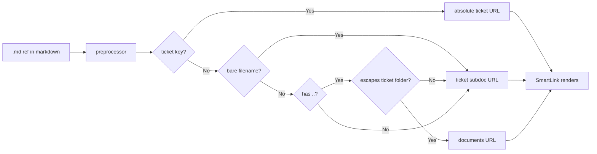

# Architecture — MDT-150

## Overview

SmartLink generates broken document URLs because `.md` references pass through as bare filenames or relative paths, resolving to 404s. The fix puts all link resolution in the **preprocessor**, which knows the source file path and can produce absolute URLs. SmartLink becomes a pure renderer.

## Pattern: Preprocessor Resolves, SmartLink Renders

The preprocessor already transforms ticket keys into absolute URLs (`MDT-151` → `/prj/MDT/ticket/MDT-151`). We extend it to resolve ALL `.md` references into absolute URLs using the source file's path as context.

SmartLink just renders whatever the preprocessor produces. No resolution logic, no path math.

## Real Example: Broken Links in MDT-150

**Source file**: `docs/CRs/MDT-150/requirements.md`
**Real broken link on line 3**: `[MDT-150](../MDT-150-smartlink-doc-urls.md)`

Current behavior: `../MDT-150-smartlink-doc-urls.md` passes through as a relative path → broken URL.

After fix: Preprocessor knows sourcePath is `MDT-150/requirements.md`. It resolves `../MDT-150-smartlink-doc-urls.md` relative to `docs/CRs/MDT-150/` → `docs/CRs/MDT-150-smartlink-doc-urls.md` → contains ticket key `MDT-150` → absolute ticket URL.

## Resolution Table

All resolution happens in the preprocessor. `sourcePath` = the subdocument's filePath relative to `ticketsPath`.

| Input href | sourcePath | Resolved | Output URL |
|---|---|---|---|
| `architecture.md` | `MDT-150/bdd.md` | bare filename → same ticket subdoc | `/prj/MDT/ticket/MDT-150/architecture.md` |
| `../MDT-150-smartlink-doc-urls.md` | `MDT-150/requirements.md` | ticket key in filename | `/prj/MDT/ticket/MDT-150` |
| `MDT-151.md` | any | ticket key in filename | `/prj/MDT/ticket/MDT-151` |
| `MDT-151` | any | ticket key (no .md) | `/prj/MDT/ticket/MDT-151` |
| `../../README.md` | `MDT-150/bdd.md` | escapes ticket folder → documents | `/prj/MDT/documents?file=docs/README.md` |
| `architecture.md#top` | `MDT-150/bdd.md` | bare filename + anchor | `/prj/MDT/ticket/MDT-150/architecture.md#top` |

## Responsibility Split

### Preprocessor (resolves all links)

Receives `sourcePath` (e.g. `MDT-150/requirements.md`) and resolves all `.md` references:

1. **Existing links** (already in `[text](href)` format): protect from modification (already works)
2. **Ticket keys** (`MDT-151`): convert to absolute ticket URL (already works via `convertTicketReferences`)
3. **Ticket-key filenames** (`MDT-151.md`, `MDT-150-smartlink-doc-urls.md`): convert to absolute ticket URL (new)
4. **Bare filenames** (`architecture.md`): resolve as current ticket subdoc (new)
5. **Relative paths** (`../../README.md`): resolve against sourcePath, route to documents if outside ticket folder (new)
6. **Anchors**: preserve on all types (new)

**New function**: `resolveDocumentRef(href, sourcePath, ticketKey, projectCode, ticketsPath)` in the preprocessor.

### SmartLink (pure renderer)

No changes needed. Receives absolute URLs from the preprocessor and renders them. `useParams` used as fallback for edge-case `DOCUMENT` type links that slip through without resolution.

### Backend (unchanged, MDT-151)

Receives clean resolved paths. Validates containment, serves files, returns errors.

## Module Boundaries

| Module | Responsibility | Change Scope |
|--------|---------------|-------------|
| `markdownPreprocessor.ts` | Resolve all `.md` refs to absolute URLs using sourcePath | **Modified** |
| `TicketViewer/index.tsx` | Pass `sourcePath` to MarkdownContent | **Modified** |
| `MarkdownContent/useMarkdownProcessor.ts` | Pass `sourcePath` to `preprocessMarkdown` | **Modified** |
| `MarkdownContent/index.tsx` | Accept and thread `sourcePath` prop | **Modified** |
| `SmartLink/index.tsx` | Unchanged (pure renderer) | **Unchanged** |
| `linkProcessor.ts` | Unchanged | **Unchanged** |
| `linkNormalization.ts` | Unchanged | **Unchanged** |
| `linkBuilder.ts` | Unchanged | **Unchanged** |
| `DocumentsLayout.tsx` | `useParams` for path-style routes | **Modified** (Task 3) |
| `App.tsx` | Route: `/prj/:projectCode/documents/*` | **Modified** (Task 3) |
| Backend | Unchanged (MDT-151) | **Unchanged** |

## sourcePath Plumbing

```text
TicketViewer (knows subdocument.filePath, e.g. "MDT-150/requirements.md")
  ↓ new prop: sourcePath
MarkdownContent (threads prop)
  ↓ new param
useMarkdownProcessor (passes to preprocessor)
  ↓ new param: sourcePath
preprocessMarkdown(markdown, project, linkConfig, sourcePath, ticketsPath)
```

Five files get new optional parameters: TicketViewer (sourcePath + ticketsPath), MarkdownContent (sourcePath + ticketsPath), useMarkdownProcessor (sourcePath + ticketsPath), App.tsx (wildcard documents route), DocumentsLayout (useParams). Plus the preprocessor itself. The sourcePath is the subdocument's filePath relative to `ticketsPath` (e.g. `MDT-150/requirements.md`) for subdocs, or `{ticketKey}.md` for the root doc. The ticketsPath comes from `getTicketsPath(projectConfig)` and defaults to `docs/CRs`.

## Invariants

1. **Preprocessor resolves, SmartLink renders** — no resolution logic in SmartLink
2. **Ticket-key pattern = ticket** — `MDT-151.md`, `MDT-150-anything.md` → ticket URL
3. **Bare filename = subdoc** — `architecture.md` → current ticket subdoc
4. **No `..` to backend** — all relative paths resolved by preprocessor
5. **Backend is authoritative** — validates containment, returns errors
6. **Ticket and external link rendering paths are untouchable**
7. **Anchor fragments pass through unchanged**

## Diagram



## Error Philosophy

- **Preprocessor does not block anything** — it resolves. If resolution fails, the original href passes through.
- **Backend returns errors** for traversal, missing files, out-of-scope paths
- **Target view displays backend error** to the user
