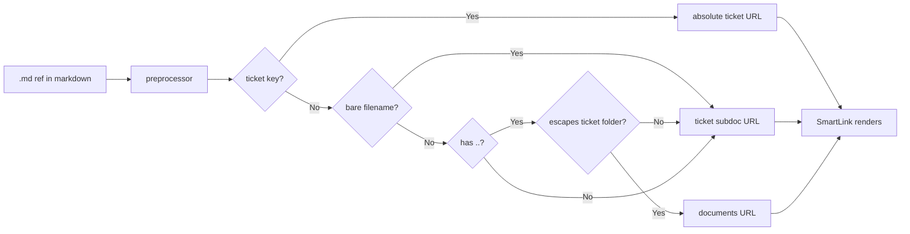

# Architecture — MDT-150

## Overview

SmartLink generates broken document URLs because `.md` references pass through as bare filenames or relative paths, resolving to 404s. The fix puts all link resolution in the **preprocessor**, which knows the source file path and can produce absolute URLs. SmartLink becomes a pure renderer.

**UAT 2026-07-21 addendum**: The same resolution model must apply in the documents view. Today `DocumentsView/MarkdownViewer.tsx` does not pass `sourcePath`, so the preprocessor's `resolveDocumentRef` is bypassed and relative `.md` hrefs fall through to raw relative URLs that the browser resolves against the URL root (dropping the source directory). Additionally, `resolveDocumentRef` assumes `sourcePath` is anchored at `ticketsPath` (e.g. `MDT-150/requirements.md`); a documents-view source path (e.g. `docs/architecture/aaaa.md`) does not match any ticket-key prefix branch and the function silently returns the href unchanged. Both layers need a fix: thread `sourcePath` from `MarkdownViewer`, **and** teach `resolveDocumentRef` to recognize documents-root-anchored source paths.

## Pattern: Preprocessor Resolves, SmartLink Renders

The preprocessor already transforms ticket keys into absolute URLs (`MDT-151` → `/prj/MDT/ticket/MDT-151`). We extend it to resolve ALL `.md` references into absolute URLs using the source file's path as context.

SmartLink just renders whatever the preprocessor produces. No resolution logic, no path math.

## Real Example: Broken Links in MDT-150

**Source file**: `docs/CRs/MDT-150/requirements.md`
**Real broken link on line 3**: `[MDT-150](../MDT-150-smartlink-doc-urls.md)`

Current behavior: `../MDT-150-smartlink-doc-urls.md` passes through as a relative path → broken URL.

After fix: Preprocessor knows sourcePath is `MDT-150/requirements.md`. It resolves `../MDT-150-smartlink-doc-urls.md` relative to `docs/CRs/MDT-150/` → `docs/CRs/MDT-150-smartlink-doc-urls.md` → contains ticket key `MDT-150` → absolute ticket URL.

## Resolution Table

All resolution happens in the preprocessor. `sourcePath` = the subdocument's filePath relative to `ticketsPath`.

**Two sourcePath forms (UAT 2026-07-21)**:

| Form | Example | Used by | Behavior |
|---|---|---|---|
| ticket-relative | `MDT-150/requirements.md` | `TicketViewer` (existing) | Bare filename → ticket subdoc; `..` → path math vs ticketsPath |
| documents-relative | `docs/architecture/aaaa.md` | `MarkdownViewer` (new) | Bare filename and `..` → resolve against source dir → documents view URL |

The resolver distinguishes the two by checking whether `sourcePath` starts with a ticket-key pattern (`^[A-Z]+-\d+/`). If yes → ticket mode (existing logic). If no → documents mode (new: bare and `..`-relative `.md` hrefs resolve against the source document's directory and route to `/prj/:code/documents/:resolvedPath`).

| Input href | sourcePath | Resolved | Output URL |
|---|---|---|---|
| `architecture.md` | `MDT-150/bdd.md` | bare filename → same ticket subdoc | `/prj/MDT/ticket/MDT-150/architecture.md` |
| `../MDT-150-smartlink-doc-urls.md` | `MDT-150/requirements.md` | ticket key in filename | `/prj/MDT/ticket/MDT-150` |
| `MDT-151.md` | any | ticket key in filename | `/prj/MDT/ticket/MDT-151` |
| `MDT-151` | any | ticket key (no .md) | `/prj/MDT/ticket/MDT-151` |
| `../../README.md` | `MDT-150/bdd.md` | escapes ticket folder → documents | `/prj/MDT/documents?file=docs/README.md` |
| `architecture.md#top` | `MDT-150/bdd.md` | bare filename + anchor | `/prj/MDT/ticket/MDT-150/architecture.md#top` |

## Responsibility Split

### Preprocessor (resolves all links)

Receives `sourcePath` and resolves all `.md` references:

1. **Existing links** (already in `[text](href)` format): protect from modification (already works)
2. **Ticket keys** (`MDT-151`): convert to absolute ticket URL (already works via `convertTicketReferences`)
3. **Ticket-key filenames** (`MDT-151.md`, `MDT-150-smartlink-doc-urls.md`): convert to absolute ticket URL (MDT-150)
4. **Bare filenames** (`architecture.md`) in ticket context: resolve as current ticket subdoc (MDT-150)
5. **Relative paths** (`../../README.md`) in ticket context: resolve against sourcePath, route to documents if outside ticket folder (MDT-150)
6. **Bare filenames and `..` paths** (`relative.md`, `../sibling.md`) in documents-view context: resolve against source document's directory → documents view URL (UAT 2026-07-21)
7. **Anchors**: preserve on all types

**Existing function**: `resolveDocumentRef(href, sourcePath, ticketKey, projectCode, ticketsPath)` in the preprocessor. UAT 2026-07-21 adds a documents-mode branch keyed off `sourcePath` not matching the ticket-key prefix pattern.

### SmartLink (pure renderer)

No changes needed. Receives absolute URLs from the preprocessor and renders them. `useParams` used as fallback for edge-case `DOCUMENT` type links that slip through without resolution.

### Backend (unchanged, MDT-151)

Receives clean resolved paths. Validates containment, serves files, returns errors.

## Module Boundaries

| Module | Responsibility | Change Scope |
|--------|---------------|-------------|
| `markdownPreprocessor.ts` | Resolve all `.md` refs to absolute URLs using sourcePath; distinguish ticket-relative vs documents-relative sourcePath | **Modified** (UAT 2026-07-21: add documents-mode branch to `resolveDocumentRef`) |
| `TicketViewer/index.tsx` | Pass `sourcePath` to MarkdownContent | **Modified** (shipped) |
| `MarkdownContent/useMarkdownProcessor.ts` | Pass `sourcePath` to `preprocessMarkdown` | **Modified** (shipped) |
| `MarkdownContent/index.tsx` | Accept and thread `sourcePath` prop | **Modified** (shipped) |
| `DocumentsView/MarkdownViewer.tsx` | Pass `sourcePath` (selected file path) to MarkdownContent | **Modified** (UAT 2026-07-21: new, was missing) |
| `SmartLink/index.tsx` | Unchanged (pure renderer) | **Unchanged** |
| `linkProcessor.ts` | Unchanged | **Unchanged** |
| `linkNormalization.ts` | Unchanged | **Unchanged** |
| `linkBuilder.ts` | Unchanged | **Unchanged** |
| `DocumentsLayout.tsx` | `useParams` for path-style routes | **Modified** (shipped, Task 3) |
| `App.tsx` | Route: `/prj/:projectCode/documents/*` | **Modified** (shipped, Task 3) |
| Backend | Unchanged (MDT-151) | **Unchanged** |

## sourcePath Plumbing

```text
TicketViewer (knows subdocument.filePath, e.g. "MDT-150/requirements.md")
  ↓ prop: sourcePath
MarkdownContent (threads prop)
  ↓ param
useMarkdownProcessor (passes to preprocessor)
  ↓ param: sourcePath
preprocessMarkdown(markdown, project, linkConfig, sourcePath, ticketsPath)

MarkdownViewer [NEW UAT 2026-07-21] (knows selectedFile from useParams, e.g. "docs/architecture/aaaa.md")
  ↓ prop: sourcePath
MarkdownContent (already threads prop)
  ↓ param
useMarkdownProcessor (already passes to preprocessor)
  ↓ param: sourcePath
preprocessMarkdown(...) — resolveDocumentRef detects documents-mode via non-ticket-key sourcePath prefix
```

`TicketViewer` passes `sourcePath` as the subdocument's filePath relative to `ticketsPath` (e.g. `MDT-150/requirements.md`). `MarkdownViewer` passes `sourcePath` as the document's full project-relative path (e.g. `docs/architecture/aaaa.md`). The preprocessor distinguishes the two by checking whether `sourcePath` matches `^[A-Z]+-\d+/`.

## Invariants

1. **Preprocessor resolves, SmartLink renders** — no resolution logic in SmartLink
2. **Ticket-key pattern = ticket** — `MDT-151.md`, `MDT-150-anything.md` → ticket URL
3. **Bare filename in ticket context = subdoc** — `architecture.md` → current ticket subdoc
4. **Bare filename in documents-view context = sibling doc** — `relative.md` next to `docs/architecture/aaaa.md` → `/prj/:code/documents/docs/architecture/relative.md` (UAT 2026-07-21)
5. **No `..` to backend** — all relative paths resolved by preprocessor
6. **Backend is authoritative** — validates containment, returns errors
7. **Ticket and external link rendering paths are untouchable**
8. **Anchor fragments pass through unchanged**
9. **sourcePath form is detected, not passed explicitly** — resolver branches on `^[A-Z]+-\d+/` prefix; no new "mode" parameter (UAT 2026-07-21)

## Diagram


```mermaid
flowchart LR
    A[".md ref in markdown"] --> B["preprocessor"]
    B --> C{"ticket key?"}
    C -->|Yes| D["absolute ticket URL"]
    C -->|No| E{"bare filename?"}
    E -->|Yes| F["ticket subdoc URL"]
    E -->|No| G{"has ..?"}
    G -->|Yes| H{"escapes ticket folder?"}
    H -->|No| F
    H -->|Yes| I["documents URL"]
    G -->|No| F
    D --> J["SmartLink renders"]
    F --> J
    I --> J
```

## Error Philosophy

- **Preprocessor does not block anything** — it resolves. If resolution fails, the original href passes through.
- **Backend returns errors** for traversal, missing files, out-of-scope paths
- **Target view displays backend error** to the user
