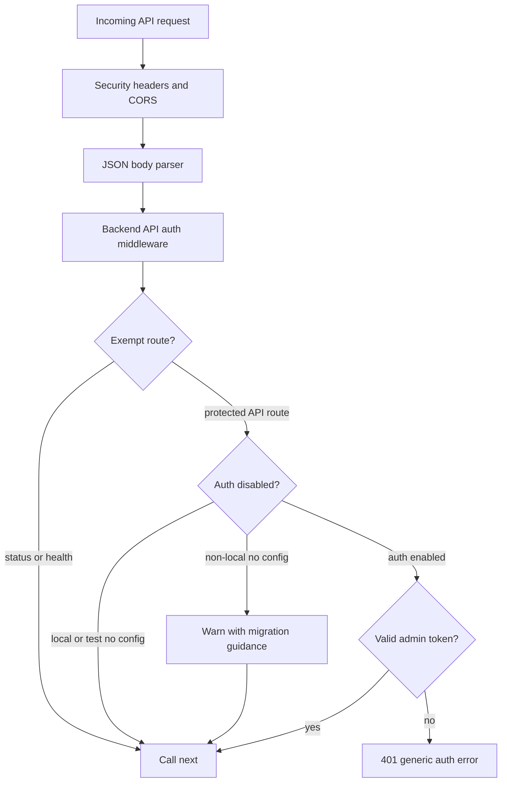
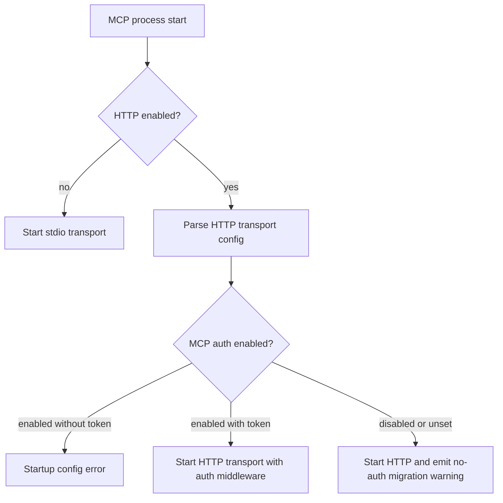

# Architecture: MDT-157

## Overview

MDT-157 adds an authentication gate for the backend REST API and locks MCP HTTP production authentication defaults without introducing sharing or authorization. Public sharing, project visibility filtering, read-only policy, scoped tokens, RBAC, TLS termination, and token rotation remain owned by MDT-172 or later work.

The design is a centralized Express middleware boundary plus environment-driven transport configuration. Existing MCP timing-safe token comparison and HTTP env parsing are preserved as runtime behavior and covered by regression tests; the remaining MCP change is Docker production auth default/migration behavior.

## Pattern

**Pattern name**: Centralized auth gate with transport-specific credential adapters.

**Rationale**: Backend controllers currently assume callers are trusted. A single middleware seam before protected `/api/*` routers prevents per-controller drift, keeps authorization out of MDT-157, and makes no-auth local/test compatibility explicit. MCP HTTP already has transport-specific bearer middleware, so the MCP architecture should not duplicate backend middleware; it should harden config/defaults and tests around the existing seam.

## Backend API Authentication Boundary

Canonical flow for protected backend routes:



Owner module: `server/security/apiAuth.ts` owns backend auth config parsing, credential extraction, timing-safe token matching, exempt-route classification, migration warning emission, and Express middleware creation.

The middleware must classify `GET /api/status` and `GET /api/health` before any auth-disabled or protected-route credential decision. Those two routes always call `next()` regardless of auth configuration, so they remain public in auth-enabled, auth-disabled, local/test, and non-local migration modes.

`server/server.ts` owns only middleware placement. It should mount backend API auth once after generic request middleware and before protected API routers. `server/tests/api/test-app-factory.ts` is the intended shared test factory; create it if it does not already exist. It must mirror the same placement so auth-enabled API tests exercise production wiring; auth-enabled API tests import it, and existing API tests migrate to it as needed when they need production-equivalent middleware placement.

## Backend Credential Contract

Supported credentials:

- `Authorization: Bearer <token>`
- `X-API-Key: <token>`

Rejected credentials:

- query-string tokens
- HTTP Basic
- cookies as an MDT-157 auth mechanism
- `Origin`, `Referer`, `X-Forwarded-*`, IP address, or reverse-proxy identity headers as credentials

Token comparison must use length-checked `crypto.timingSafeEqual` semantics. Empty, malformed, missing, and different-length tokens all fail with HTTP 401 and a generic authentication message. Raw token values must never be logged.

## Health, Status, and Migration Contract

`GET /api/status` and `GET /api/health` are the only backend unauthenticated API exemptions. Add `/api/health` as a minimal health alias because Docker config and acceptance criteria already reference it. Health/status responses must not expose project metadata, filesystem paths, auth env values, or configured tokens. Existing `/api/status` currently includes `tasksDir`; implementation must remove or avoid sensitive path/config disclosure for the unauthenticated contract.

Backend auth remains disabled when local development or test auth config is absent. Existing local/test API suites continue unchanged unless they opt into auth config. Non-local deployments that start without backend auth config continue functioning for migration compatibility but emit an observable warning with next-step guidance.

## Reverse-Proxy Contract

Authentication works with no `Origin` header. Curl, MCP clients, server-to-server callers, and nginx-proxied callers use the same token rules.

`nginx.conf` and Docker docs must preserve and document forwarding for:

- `Authorization`
- `X-API-Key`
- existing forwarded metadata such as `X-Forwarded-For` and `X-Forwarded-Proto` only for logging/proxy awareness, never authentication

If a proxy strips `Authorization` and `X-API-Key`, backend protected routes fail closed with HTTP 401. If nginx forwards either credential header unchanged, protected routes authenticate normally.

## MCP HTTP Auth and Production Defaults

Canonical MCP flow:



Owner modules:

- `mcp-server/src/transports/httpSecurity.ts` owns HTTP env parsing and config validation.
- `mcp-server/src/transports/middleware.ts` owns MCP bearer parsing and timing-safe token matching.
- `mcp-server/src/transports/http.ts` owns applying auth middleware to `/mcp` only when enabled.
- `mcp-server/src/index.ts` owns stdio-vs-HTTP transport selection and passing parsed config.
- `docker-compose.prod.yml` owns production Docker auth defaults.

MCP stdio remains unchanged and must not require HTTP auth settings. Production Docker MCP HTTP should set `MCP_SECURITY_AUTH=true` when `MCP_AUTH_TOKEN` is configured and must make no-auth production operation visibly transitional through documentation/warnings. Explicit MCP auth without `MCP_AUTH_TOKEN` remains a startup/config failure.

Production Docker compose must set `MCP_SECURITY_AUTH=${MCP_SECURITY_AUTH:-true}`. With that default, existing validation must fail clearly when MCP auth is enabled but `MCP_AUTH_TOKEN` is missing. The migration warning remains for non-local no-token/no-auth deployments outside that production Docker default path, such as legacy compose overrides or manually started MCP HTTP processes that explicitly disable auth.

## Module Boundaries

```text
server/security/apiAuth.ts                 # backend auth config, credential parsing, timing-safe compare, middleware
server/server.ts                           # production middleware placement only
server/tests/api/test-app-factory.ts       # test middleware placement mirror
server/routes/system.ts                    # /api/status and /api/health minimal public responses
server/tests/security/apiAuth.test.ts      # pure auth parser/comparison/exemption tests
server/tests/api/api-auth.test.ts          # Supertest auth-enabled route contract tests

mcp-server/src/transports/httpSecurity.ts  # MCP HTTP env parsing and validation
mcp-server/src/transports/middleware.ts    # MCP bearer auth and timing-safe compare
mcp-server/src/transports/http.ts          # MCP /mcp middleware wiring
mcp-server/src/index.ts                    # transport selection and migration warning placement
mcp-server/tests/http-security-config.test.ts
mcp-server/tests/http-auth-session-rate-limit.test.ts

docker-compose.yml                         # backend /api/health healthcheck compatibility
docker-compose.prod.yml                    # production MCP HTTP auth defaults
docs/DOCKER_GUIDE.md                       # backend/MCP migration and env guidance
docs/DOCKER_REFERENCE.md                   # production auth reference
docs/MCP_SERVER_GUIDE.md                   # MCP HTTP auth behavior
nginx.conf                                 # proxy header preservation contract
```

## Runtime vs Test Scaffolding

Runtime code must not infer auth-enabled behavior from Jest/Supertest helpers. Tests opt into auth by setting explicit env/config before app creation and reset that state afterward.

Test scaffolding responsibilities:

- Backend API tests verify unauthenticated 401, authenticated success, `Authorization` and `X-API-Key`, no-Origin behavior, `/api/status`, `/api/health`, proxy stripped-header failure, forwarded-header success, and local/test no-auth preservation.
- Backend unit tests verify env parsing, exempt-route classification, no raw-token logging behavior, and timing-safe comparison edge cases.
- MCP tests verify stdio independence, HTTP auth rejection/acceptance, env parsing, explicit-auth-without-token failure, production Docker auth defaults, and migration warning behavior.
- A lightweight backend auth overhead check must demonstrate less than 5ms median added latency under the project test harness.

## Invariants

- MDT-157 authenticates only; it does not authorize access levels or filter projects.
- Anonymous `GET /api/projects` returns 401 before MDT-172 public sharing exists.
- Authentication enforcement for backend REST is centralized before controllers.
- Health/status bypass is path- and method-specific and minimal.
- Tokens are accepted only from `Authorization: Bearer` and `X-API-Key` for backend API, and `Authorization: Bearer` for MCP HTTP.
- Raw credential values are never logged, persisted, or echoed.
- Timing-safe comparison is length checked for backend and MCP tokens.
- Origin and forwarded proxy headers are not credentials.
- Existing no-auth local/test behavior stays intact outside auth-enabled test contexts.
- Production Docker MCP HTTP defaults auth on via `MCP_SECURITY_AUTH=${MCP_SECURITY_AUTH:-true}` and must fail clearly when the token is missing.
- Non-local deployments that explicitly run MCP HTTP with no token and auth disabled outside production Docker defaults keep the migration warning.

## BDD Scenario Carryover

Architecture obligations carry BDD scenario coverage transitively through their derived BR IDs:

| Scenario ID | Covered BR IDs | Architecture obligation(s) |
|---|---|---|
| `backend_protected_requests_require_credentials` | BR-1.1, BR-1.3, BR-1.4 | `OBL-backend-central-auth-gate` |
| `backend_admin_token_allows_existing_route_behavior` | BR-1.2 | `OBL-backend-central-auth-gate`, `OBL-backend-token-contract` |
| `backend_health_endpoints_remain_public` | BR-1.5 | `OBL-backend-health-status-exemption` |
| `backend_no_auth_config_preserves_local_behavior` | BR-1.6 | `OBL-backend-local-test-compat` |
| `backend_no_origin_uses_token_rules` | BR-1.7 | `OBL-backend-origin-proxy-contract`, `OBL-backend-token-contract` |
| `mcp_stdio_ignores_http_auth_settings` | BR-2.1 | `OBL-mcp-stdio-http-separation` |
| `mcp_http_rejects_missing_or_invalid_bearer` | BR-2.2 | `OBL-mcp-http-auth-regression` |
| `mcp_http_accepts_production_bearer_default` | BR-2.3 | `OBL-mcp-production-docker-auth-default` |
| `mcp_existing_deployment_migration_warning` | BR-2.4 | `OBL-backend-local-test-compat`, `OBL-mcp-production-docker-auth-default` |

## Extension Rule

Future MDT-172 work may add access contexts, project visibility, read-only sharing, scoped read tokens, and frontend read-only capability rendering. It must build on this auth boundary rather than moving credential parsing into controllers or adding public visibility behavior to MDT-157.
