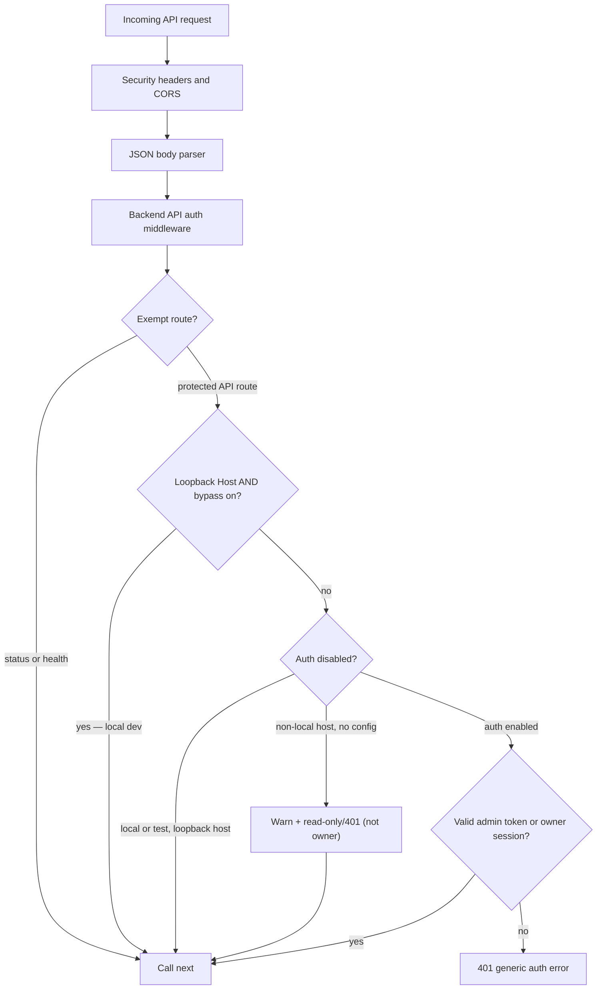
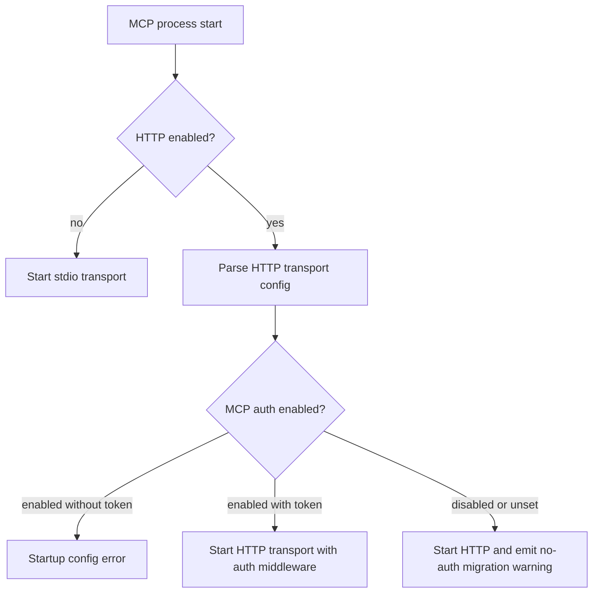

# Architecture: MDT-157

## Overview

MDT-157 adds an authentication gate for the backend REST API and locks MCP HTTP production authentication defaults without introducing sharing or authorization. Public sharing, project visibility filtering, read-only policy, scoped tokens, RBAC, TLS termination, and token rotation remain owned by MDT-172 or later work.

The design is a centralized Express middleware boundary plus environment-driven transport configuration. Existing MCP timing-safe token comparison and HTTP env parsing are preserved as runtime behavior and covered by regression tests; the remaining MCP change is Docker production auth default/migration behavior.

## Pattern

**Pattern name**: Centralized auth gate with transport-specific credential adapters.

**Rationale**: Backend controllers currently assume callers are trusted. A single middleware seam before protected `/api/*` routers prevents per-controller drift, keeps authorization out of MDT-157, and makes no-auth local/test compatibility explicit. MCP HTTP already has transport-specific bearer middleware, so the MCP architecture should not duplicate backend middleware; it should harden config/defaults and tests around the existing seam.

## Backend API Authentication Boundary

Canonical flow for protected backend routes:


```mermaid
flowchart TD
  A["Incoming API request"] --> B["Security headers and CORS"]
  B --> C["JSON body parser"]
  C --> D["Backend API auth middleware"]
  D --> F{"Exempt route?"}
  F -->|"status or health"| H["Call next"]
  F -->|"protected API route"| L{"Loopback Host AND bypass on?"}
  L -->|"yes — local dev"| H
  L -->|"no"| E{"Auth disabled?"}
  E -->|"local or test, loopback host"| H
  E -->|"non-local host, no config"| W["Warn + read-only/401 (not owner)"]
  W --> H
  E -->|"auth enabled"| G{"Valid admin token or owner session?"}
  G -->|"yes"| H
  G -->|"no"| I["401 generic auth error"]
```

(UAT 2026-08-06) The loopback-host check is the new first decision after the exempt-route classification. It is the single shared authority for "is this a local request" and is reused by `GET /api/auth/session` so the frontend does not show a spurious unlock panel when the protected API would pass locally.

Owner module: `server/security/apiAuth.ts` owns backend auth config parsing, credential extraction, timing-safe token matching, exempt-route classification, migration warning emission, and Express middleware creation.

The middleware must classify `GET /api/status` and `GET /api/health` before any auth-disabled or protected-route credential decision. Those two routes always call `next()` regardless of auth configuration, so they remain public in auth-enabled, auth-disabled, local/test, and non-local migration modes.

`server/server.ts` owns only middleware placement. It should mount backend API auth once after generic request middleware and before protected API routers. `server/tests/api/test-app-factory.ts` is the intended shared test factory; create it if it does not already exist. It must mirror the same placement so auth-enabled API tests exercise production wiring; auth-enabled API tests import it, and existing API tests migrate to it as needed when they need production-equivalent middleware placement.

## Backend Credential Contract

Supported credentials:

- `Authorization: Bearer <token>`
- `X-API-Key: <token>`

Rejected credentials:

- query-string tokens
- HTTP Basic
- cookies as an MDT-157 auth mechanism
- `Origin`, `Referer`, `X-Forwarded-*` (including `X-Forwarded-Host`), `CF-Connecting-IP`, IP address, or reverse-proxy identity headers as credentials

(UAT 2026-08-06) The loopback-host no-auth carve-out trusts **only** the request `Host` header hostname (parsed, lowercased) against `API_LOCAL_HOSTS`. `X-Forwarded-Host`, `Origin`, `Referer`, `X-Forwarded-For`, `CF-Connecting-IP`, and `socket.remoteAddress` are explicitly NOT authorities for the bypass — they are client-supplied and/or spoofable. The Vite `/api` proxy must run with `changeOrigin: false` so the backend observes the real browser `Host`; nginx already uses `Host $host`, so dev and Docker agree.

Token comparison must use length-checked `crypto.timingSafeEqual` semantics. Empty, malformed, missing, and different-length tokens all fail with HTTP 401 and a generic authentication message. Raw token values must never be logged.

## Health, Status, and Migration Contract

`GET /api/status` and `GET /api/health` are the only backend unauthenticated API exemptions. Add `/api/health` as a minimal health alias because Docker config and acceptance criteria already reference it. Health/status responses must not expose project metadata, filesystem paths, auth env values, or configured tokens. Existing `/api/status` currently includes `tasksDir`; implementation must remove or avoid sensitive path/config disclosure for the unauthenticated contract.

Backend auth remains disabled when local development or test auth config is absent. Existing local/test API suites continue unchanged unless they opt into auth config. Non-local deployments that start without backend auth config continue functioning for migration compatibility but emit an observable warning with next-step guidance.

## Reverse-Proxy Contract

Authentication works with no `Origin` header. Curl, MCP clients, server-to-server callers, and nginx-proxied callers use the same token rules.

`nginx.conf` and Docker docs must preserve and document forwarding for:

- `Authorization`
- `X-API-Key`
- existing forwarded metadata such as `X-Forwarded-For` and `X-Forwarded-Proto` only for logging/proxy awareness, never authentication

If a proxy strips `Authorization` and `X-API-Key`, backend protected routes fail closed with HTTP 401. If nginx forwards either credential header unchanged, protected routes authenticate normally.

## MCP HTTP Auth and Production Defaults

Canonical MCP flow:


```mermaid
flowchart TD
  A["MCP process start"] --> B{"HTTP enabled?"}
  B -->|"no"| C["Start stdio transport"]
  B -->|"yes"| D["Parse HTTP transport config"]
  D --> E{"MCP auth enabled?"}
  E -->|"enabled without token"| F["Startup config error"]
  E -->|"enabled with token"| G["Start HTTP transport with auth middleware"]
  E -->|"disabled or unset"| H["Start HTTP and emit no-auth migration warning"]
```

Owner modules:

- `mcp-server/src/transports/httpSecurity.ts` owns HTTP env parsing and config validation.
- `mcp-server/src/transports/middleware.ts` owns MCP bearer parsing and timing-safe token matching.
- `mcp-server/src/transports/http.ts` owns applying auth middleware to `/mcp` only when enabled.
- `mcp-server/src/index.ts` owns stdio-vs-HTTP transport selection and passing parsed config.
- `docker-compose.prod.yml` owns production Docker auth defaults.

MCP stdio remains unchanged and must not require HTTP auth settings. Production Docker MCP HTTP should set `MCP_SECURITY_AUTH=true` when `MCP_AUTH_TOKEN` is configured and must make no-auth production operation visibly transitional through documentation/warnings. Explicit MCP auth without `MCP_AUTH_TOKEN` remains a startup/config failure.

Production Docker compose must set `MCP_SECURITY_AUTH=${MCP_SECURITY_AUTH:-true}`. With that default, existing validation must fail clearly when MCP auth is enabled but `MCP_AUTH_TOKEN` is missing. The migration warning remains for non-local no-token/no-auth deployments outside that production Docker default path, such as legacy compose overrides or manually started MCP HTTP processes that explicitly disable auth.

## Module Boundaries

```text
server/security/apiAuth.ts                 # backend auth config, credential parsing, timing-safe compare, middleware
server/server.ts                           # production middleware placement only
server/tests/api/test-app-factory.ts       # test middleware placement mirror
server/routes/system.ts                    # /api/status and /api/health minimal public responses
server/tests/security/apiAuth.test.ts      # pure auth parser/comparison/exemption tests
server/tests/api/api-auth.test.ts          # Supertest auth-enabled route contract tests

mcp-server/src/transports/httpSecurity.ts  # MCP HTTP env parsing and validation
mcp-server/src/transports/middleware.ts    # MCP bearer auth and timing-safe compare
mcp-server/src/transports/http.ts          # MCP /mcp middleware wiring
mcp-server/src/index.ts                    # transport selection and migration warning placement
mcp-server/tests/http-security-config.test.ts
mcp-server/tests/http-auth-session-rate-limit.test.ts

docker-compose.yml                         # backend /api/health healthcheck compatibility
docker-compose.prod.yml                    # production MCP HTTP auth defaults
docs/DOCKER_GUIDE.md                       # backend/MCP migration and env guidance
docs/DOCKER_REFERENCE.md                   # production auth reference
docs/MCP_SERVER_GUIDE.md                   # MCP HTTP auth behavior
nginx.conf                                 # proxy header preservation contract
```

## Runtime vs Test Scaffolding

Runtime code must not infer auth-enabled behavior from Jest/Supertest helpers. Tests opt into auth by setting explicit env/config before app creation and reset that state afterward.

Test scaffolding responsibilities:

- Backend API tests verify unauthenticated 401, authenticated success, `Authorization` and `X-API-Key`, no-Origin behavior, `/api/status`, `/api/health`, proxy stripped-header failure, forwarded-header success, and local/test no-auth preservation.
- Backend unit tests verify env parsing, exempt-route classification, no raw-token logging behavior, and timing-safe comparison edge cases.
- MCP tests verify stdio independence, HTTP auth rejection/acceptance, env parsing, explicit-auth-without-token failure, production Docker auth defaults, and migration warning behavior.
- A lightweight backend auth overhead check must demonstrate less than 5ms median added latency under the project test harness.

## UAT: Vite Frontend Logging Boundary

Vite dev-server frontend logging endpoints under `/api/frontend/logs*` are not backend routes and do not pass through `server/security/apiAuth.ts`. They must remain local debugging endpoints only.

Owner module: `vite.config.ts` owns the Vite middleware boundary for:

- `GET /api/frontend/logs/status`
- `POST /api/frontend/logs/start`
- `POST /api/frontend/logs/stop`
- `GET /api/frontend/logs/stream`
- `POST /api/frontend/logs`
- `GET /api/frontend/logs`

The Vite middleware must reject non-loopback clients before reading request bodies or mutating logging state. Allowed client addresses are localhost/loopback forms only: `127.0.0.1`, `::1`, IPv4-mapped loopback, and local hostnames that resolve to loopback in the request context. LAN, tunnel, proxy, and arbitrary `X-Forwarded-*` identities must not be trusted as localhost credentials.

Malformed JSON submitted to `POST /api/frontend/logs` must fail with a controlled 400 response instead of crashing middleware processing.

## UAT: Loopback-Host No-Auth Scope (2026-08-06)

Owner modules:

- `server/security/apiAuth.ts` owns `isLocalHostRequest(req, localHosts)`, the `API_LOCAL_HOSTS`/`API_LOCAL_HOST_BYPASS` parsing in `parseApiAuthConfig`, and the narrowed `!config.enabled` branch.
- `server/routes/auth.ts` owns reusing `isLocalHostRequest` in `GET /api/auth/session` so the session endpoint and the protected-API gate report a consistent local-exempt state.
- `server/config/runtimeConfig.ts` carries `localHosts` and `localHostBypassEnabled` through runtime config.
- `server/server.ts` owns `API_BIND_ADDRESS` (default `127.0.0.1`) and the `app.listen(PORT, HOST, …)` form.
- `vite.config.ts` owns `changeOrigin: false` on the `/api`, `/api/events`, `/api-docs` proxy blocks and the `server.host`/`preview.host` loopback default.
- `docker-compose*.yml` own the explicit `API_BIND_ADDRESS=0.0.0.0` and `API_LOCAL_HOST_BYPASS=false` for the containerized nginx path.

Behavior contract (truth table):

| Request `Host` hostname | `API_SECURITY_AUTH` | `API_LOCAL_HOST_BYPASS` | Existing read-only session? | Result |
|---|---|---|---|---|
| loopback (`localhost`/`127.0.0.1`/`::1`) | any | on | no | owner / `no-auth-dev`, no token, no unlock panel |
| loopback | any | on | **yes (incl. empty/revoked scope)** | **read-only** — bypass does NOT escalate; keys on `readSession.authenticated`, not on non-empty scopes (C12) |
| non-loopback (tunnel/public) | `true` | any | any | normal auth: token or MDT-176 owner-session; else MDT-172 policy (200 public-read / 401 / 403) |
| non-loopback (tunnel/public) | `false`/unset | any | any | MDT-172 policy (public-read 200, read-only session honored, else 401/403) — **NOT owner** (closes the pre-UAT hole) |
| loopback or non-loopback | any | `false` | no | normal auth (Docker default — no host grants bypass) |
| missing / malformed / lookalike (e.g. `localhost.evil`) | any | any | any | fail closed |

Read-only precedence (C12): an authenticated read-only session is a higher-specificity credential than the loopback bypass. The bypass decision keys on `readSession.authenticated` **alone**, not on whether `projectRefs`/`shareIds` are populated — so a valid-but-empty/revoked-scope session still blocks the bypass. The bypass never promotes a read-only request to owner, on any host. `GET /api/auth/session` reports `localExempt` only when no authenticated read session is present. A single shared helper `isLoopbackBypassEligible(req, config, readSession)` enforces this identically in the protected `/api` gate and the session endpoint so the two cannot diverge.

Effective `authEnabled` for the UI: `GET /api/auth/session` reports an **effective** `authEnabled = runtimeConfig.auth.enabled || !localExempt`. A non-exempt caller on a disabled-auth backend (e.g. a tunnel `Host`) sees `authEnabled: true` so the UI shows locked — not `no-auth-dev`, which would offer owner controls that then fail on writes. Only genuinely loopback-exempt callers see `authEnabled: false`.

Default `API_LOCAL_HOST_BYPASS`: on when `NODE_ENV` is unset/`development`/`local` (the documented `bunx tsx server.ts` path sets none); off in `production`, `test`, and Docker. `test` is off because the suite runs on loopback — bypass-on would make every auth test silently pass through the carve-out; tests opt in explicitly.

Host parsing: parse with `new URL(\`http://${host}\`)`, take `.hostname`, lowercase, exact-match against `API_LOCAL_HOSTS`. This rejects lookalikes (`localhost.evil`, `127.0.0.1.evil`) because `.hostname` strips the port and the match is exact, and normalizes bracketed IPv6 (`[::1]:3001` → `::1`). Missing/malformed `Host` → fail closed.

Residual-risk note (stated honestly, not hand-wavy): if an operator sets `API_BIND_ADDRESS=0.0.0.0` AND `API_LOCAL_HOST_BYPASS=true` on a hostile LAN, a LAN client can forge `Host: localhost`. That is an operator decision and is documented as such; it is not the default in any shipped compose file.

## Invariants

- MDT-157 authenticates only; it does not authorize access levels or filter projects.
- Anonymous `GET /api/projects` returns 401 before MDT-172 public sharing exists.
- Authentication enforcement for backend REST is centralized before controllers.
- Health/status bypass is path- and method-specific and minimal.
- Tokens are accepted only from `Authorization: Bearer` and `X-API-Key` for backend API, and `Authorization: Bearer` for MCP HTTP.
- Raw credential values are never logged, persisted, or echoed.
- Timing-safe comparison is length checked for backend and MCP tokens.
- Origin and forwarded proxy headers are not credentials.
- Existing no-auth local/test behavior stays intact outside auth-enabled test contexts.
- Production Docker MCP HTTP defaults auth on via `MCP_SECURITY_AUTH=${MCP_SECURITY_AUTH:-true}` and must fail clearly when the token is missing.
- Non-local deployments that explicitly run MCP HTTP with no token and auth disabled outside production Docker defaults keep the migration warning.
- Vite-only frontend logging endpoints are localhost-only and are not exposed as unauthenticated LAN/tunnel APIs.
- (UAT 2026-08-06) The backend no-auth/`no-auth-dev` owner grant applies only when the request `Host` hostname is loopback AND `API_LOCAL_HOST_BYPASS` is on; non-loopback hosts are never granted owner by the disabled-auth branch.
- (UAT 2026-08-06) `X-Forwarded-Host`, `CF-Connecting-IP`, `Origin`, `Referer`, `X-Forwarded-For`, and `socket.remoteAddress` are not authorities for the loopback bypass; only the request `Host` is.
- (UAT 2026-08-06) The backend binds loopback by default (`API_BIND_ADDRESS=127.0.0.1`); Docker compose opts into `0.0.0.0` and defaults `API_LOCAL_HOST_BYPASS=false`.
- (UAT 2026-08-06) `GET /api/auth/session` and the protected `/api` gate share ONE helper (`isLoopbackBypassEligible`) for the loopback decision, so they cannot diverge on read-session scoping.
- (UAT 2026-08-06) `GET /api/auth/session` reports an EFFECTIVE `authEnabled = config.enabled || !localExempt`, so a non-exempt caller on a disabled-auth backend sees locked UI (not `no-auth-dev`).
- (UAT 2026-08-06) An authenticated read session — including the valid-but-empty/revoked-scope case — takes precedence over the loopback bypass on any host; the decision keys on `readSession.authenticated`, never on non-empty scopes (C12).
- (UAT 2026-08-06) `API_LOCAL_HOST_BYPASS` defaults on for `NODE_ENV` unset/`development`/`local` (the `bunx tsx server.ts` dev path) and off for `production`/`test`/Docker.
- (UAT 2026-08-06) Host parsing rejects lookalikes (`localhost.evil`) via exact-hostname match and normalizes bracketed IPv6/ports (Edge-5).

## BDD Scenario Carryover

Architecture obligations carry BDD scenario coverage transitively through their derived BR IDs:

| Scenario ID | Covered BR IDs | Architecture obligation(s) |
|---|---|---|
| `backend_protected_requests_require_credentials` | BR-1.1, BR-1.3, BR-1.4 | `OBL-backend-central-auth-gate` |
| `backend_admin_token_allows_existing_route_behavior` | BR-1.2 | `OBL-backend-central-auth-gate`, `OBL-backend-token-contract` |
| `backend_health_endpoints_remain_public` | BR-1.5 | `OBL-backend-health-status-exemption` |
| `backend_no_auth_config_preserves_local_behavior` | BR-1.6 | `OBL-backend-local-test-compat` |
| `backend_no_origin_uses_token_rules` | BR-1.7 | `OBL-backend-origin-proxy-contract`, `OBL-backend-token-contract` |
| `mcp_stdio_ignores_http_auth_settings` | BR-2.1 | `OBL-mcp-stdio-http-separation` |
| `mcp_http_rejects_missing_or_invalid_bearer` | BR-2.2 | `OBL-mcp-http-auth-regression` |
| `mcp_http_accepts_production_bearer_default` | BR-2.3 | `OBL-mcp-production-docker-auth-default` |
| `mcp_existing_deployment_migration_warning` | BR-2.4 | `OBL-backend-local-test-compat`, `OBL-mcp-production-docker-auth-default` |

## Extension Rule

Future MDT-172 work may add access contexts, project visibility, read-only sharing, scoped read tokens, and frontend read-only capability rendering. It must build on this auth boundary rather than moving credential parsing into controllers or adding public visibility behavior to MDT-157.
