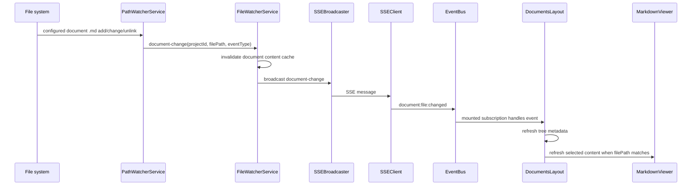
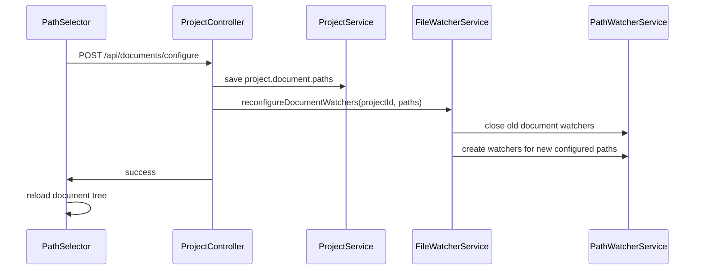

# Architecture

## Overview

MDT-160 uses a bounded watcher and route-mounted refresh pattern. The backend observes only configured document paths, emits a document-specific live update, and invalidates document content cache; the frontend reacts only while Documents View is mounted.

## Pattern

Bounded file watcher plus frontend event fanout.

- Backend owns filesystem observation and cache invalidation.
- Project configuration changes replace backend document watchers for that project.
- SSE remains one-way and global.
- Frontend owns view-specific refresh decisions.
- Ticket file watching remains separate from document file watching.

## Runtime Flow

## Module Boundaries

| Owner | Responsibility |
|-------|----------------|
| `server/server.ts` | Pass configured `project.document.paths` into watcher setup during active project bootstrap |
| `ProjectController` | Reconfigure project document watchers after saved path selections change |
| `PathWatcherService` | Normalize document watch paths, reject out-of-root paths, exclude ticket paths, emit project-relative document changes |
| `FileWatcherService` | Invalidate document content cache and broadcast document-specific SSE events |
| `SSEClient` | Map backend `document-change` messages to frontend `document:file:changed` events |
| `EventBus` | Type the document update event contract |
| `DocumentsLayout` | Own mounted-route refresh behavior for tree metadata, selected-file refresh, delete state, and reconnect |
| `MarkdownViewer` | Render refreshed content and deleted-file state |

## Invariants

- Document watchers must be created only from configured document paths.
- Saving a new document path selection must replace existing document watchers for that project.
- Ticket paths must not produce document events.
- Client-facing document events must use project-relative paths.
- Document freshness must not depend on manual cache clearing.
- Documents View must not interrupt the current preview for non-selected file updates.
- Reconnect handling must close missed-event gaps by refetching tree and selected content.

## Transport Decision

The current SSE connection is one-way. This ticket does not add server-side route awareness or topic subscription. The server may broadcast document updates globally; Documents View filters and reacts only while mounted.

## Configuration Change Flow

## Error Philosophy

- Invalid configured paths are skipped rather than widening the watcher.
- Deleted selected files render a stable viewer-level deleted state.
- Reconnect refresh is best effort and preserves visible content while refreshing.

## Test Strategy

- Unit-test document watcher scope and ticket-path exclusion.
- Unit-test watcher replacement when document paths are reconfigured.
- Unit-test controller-level reconfiguration after `/api/documents/configure`.
- Unit-test document cache invalidation and `document-change` broadcast.
- Unit-test frontend EventBus typing for `document:file:changed`.
- Later browser/API E2E can cover the full visible refresh journey if needed.

## Extension Rule

If document event volume becomes too high, add an explicit subscription/topic design as a separate CR. Do not make document watchers route-aware implicitly inside the global SSE connection.
