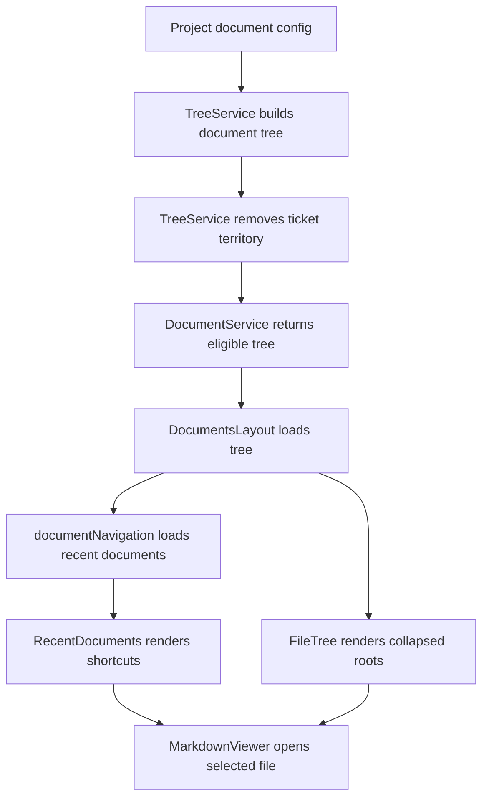

# Architecture: MDT-162

**Source**: [MDT-162](../MDT-162-document-tree-navigation.md)
**Generated**: 2026-05-11

## Overview

- Documents View keeps the existing two-pane reader and adds a focused navigation layer above the file tree.
- Backend discovery owns ticket-area exclusion; frontend navigation owns collapsed state, recent documents, and filter recovery.
- No full-text content search is introduced.

## Pattern

- Pattern: split navigation state from document discovery.
- Backend returns eligible document nodes only.
- Frontend composes user shortcuts and tree state on top of that eligible tree.
- Local browser config stores navigation preferences; project config remains the source of document roots.

## Runtime Flow



## Structure

```text
src/components/DocumentsView/
├── DocumentsLayout.tsx
├── FileTree.tsx
├── PathSelector.tsx
└── RecentDocuments.tsx

src/config/
├── documentSorting.ts
└── documentNavigation.ts

server/services/
├── DocumentService.ts
└── TreeService.ts

tests/e2e/documents/
└── navigation.spec.ts
```

## Module Boundaries

- `TreeService.ts`
  - Owns document tree eligibility.
  - Excludes `docs/CRs/` and any configured ticket path from broad document roots.
  - Does not store UI navigation state.
- `DocumentService.ts`
  - Remains the service facade for document tree and content requests.
  - Delegates tree filtering to `TreeService.ts`.
- `DocumentsLayout.tsx`
  - Owns sidebar composition and selected document coordination.
  - Owns tree filter text and active-document recovery behavior.
  - Does not perform backend discovery logic.
- `FileTree.tsx`
  - Owns folder expansion state and selected ancestor expansion.
  - Exposes imperative actions for collapse-all and scroll-to-selected.
- `RecentDocuments.tsx`
  - Owns rendering recent document shortcuts.
  - Does not own file loading.
- `documentNavigation.ts`
  - Owns project-scoped local persistence for recent files.
  - Sanitizes stored shortcuts against current eligible tree before use.

## State Rules

- Default tree state: root folders collapsed.
- Selected file state: selected ancestors expanded, row highlighted.
- Collapse-all state: unrelated folders collapsed; selected ancestors remain expanded.
- Recent documents: maximum five entries per project; section defaults expanded and can collapse without changing selection.
- Recent document rows mirror tree file rows: title first, filename second, same icon and truncation.
- Sidebar scroll containment: Recent stays outside the tree scroll area; FileTree is the only scrollable block in the sidebar.
- Documents View uses flex `min-h-0` containment and must not create page-level viewport scroll.
- Invalid shortcuts: removed or disabled after eligible tree reconciliation.

## Filter Boundary

- Filter matches file name, title, and project-relative path.
- Multi-word queries use AND matching.
- Filter does not search document contents.
- Target active document clears the filter only when the selected file is hidden.

## Test Contract

- Playwright selectors live in `tests/e2e/utils/selectors.ts`.
- New user-visible controls need stable `data-testid` selectors.
- Icon-only controls need accessible labels or tooltips.

## Invariants

- `docs/CRs/` never appears as a document root or recent document.
- Ticket navigation remains owned by Board and Ticket Viewer.
- PathSelector configures document roots.
- MarkdownViewer content loading is unchanged.
- No new global state library is introduced.

## Extension Rule

- If full-text document search is added later, implement it as a separate search mode or command surface, not by expanding the sidebar tree filter.
