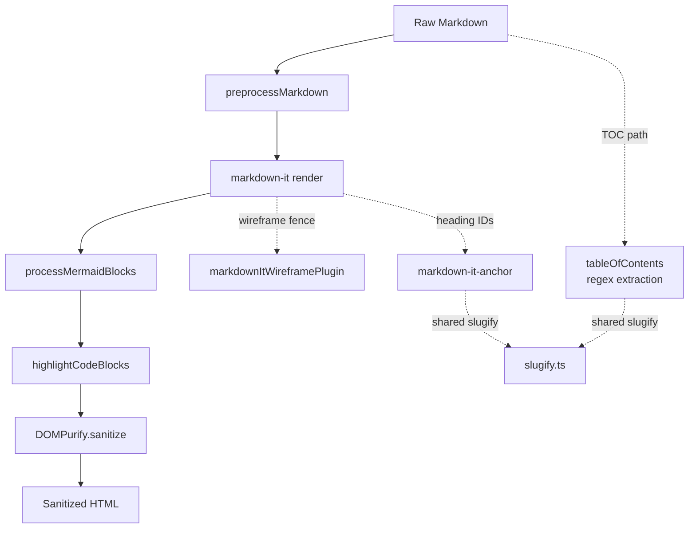

# Architecture: MDT-165

## Overview

MDT-165 replaces Showdown with markdown-it as the markdown rendering engine in `useMarkdownProcessor.ts`, adds a custom fence renderer plugin for labeled wireframe code blocks, decouples `tableOfContents.ts` from Showdown, and cleans up a Showdown-specific regex in `processMermaidBlocks`. The pipeline shape (preprocess → render → mermaid → highlight → sanitize) is preserved exactly.

## Design Philosophy

- **Single swap, minimal blast radius**: Replace the rendering step in one hook; keep all downstream processors (Mermaid, Prism, DOMPurify) operating on the same HTML structure they do today.
- **Plugin over fork**: Wireframe labels use a single markdown-it plugin function (`markdownItWireframePlugin`) via `md.use()`. No framework overhead, no subclassing.
- **Decouple, don't co-migrate**: `tableOfContents.ts` no longer renders markdown to HTML just to extract headings. It parses headings directly from raw markdown text via regex — simpler, faster, no Showdown dependency.

## Module Boundaries

| Module | Responsibility | Owner Artifact |
|--------|---------------|----------------|
| `useMarkdownProcessor.ts` | Rendering pipeline orchestration (5-step) | ART-markdown-processor |
| `markdownItWireframePlugin.ts` | Custom fence renderer for wireframe blocks with metadata labels | ART-wireframe-plugin |
| `slugify.ts` | Shared heading slug function used by markdown-it-anchor and TOC extraction | ART-slugify |
| `domPurifyConfig.ts` | HTML sanitization whitelist (tags + attributes) | ART-dom-purify-config |
| `tableOfContents.ts` | TOC extraction from raw markdown (no rendering) | ART-table-of-contents |
| `mermaid/core.ts` | Mermaid diagram post-processing (regex transform) | ART-mermaid-core |
| `mermaid/hooks.ts` | Browser-side Mermaid rendering from preserved decoded source | ART-mermaid-hooks |
| `usePostRender.ts` | Post-render orchestration scoped to the current Markdown container | ART-post-render |
| `markdownItWireloomPlugin.ts` | Detects `wireloom` fences and emits encoded async-render placeholders | ART-wireloom-plugin |
| `wireloomRenderer.ts` | Lazy-loads Wireloom, applies theme and annotation layout defaults, replaces placeholders, and handles errors/fallbacks | ART-wireloom-renderer |
| `wireloomFullscreen.ts` | Adds shared fullscreen inspection controls to rendered Wireloom artifacts | ART-wireloom-fullscreen |
| `syntaxHighlight.ts` | Prism syntax highlighting on rendered code blocks | ART-syntax-highlight |
| `markdownPreprocessor.ts` | Smart-link preprocessing (ticket/doc refs → links) | ART-preprocessor |
| `useHtmlParser.ts` | HTML → React parser; skips `header-anchor` links to prevent SmartLink wrapping | ART-html-parser |

## Canonical Runtime Flows

### Flow 1: Markdown Rendering Pipeline

```text
preprocessMarkdown(markdown, project, linkConfig, ...)
  → md.render(preprocessed)           // markdown-it replaces converter.makeHtml()
  → processMermaidBlocks(html)        // unchanged, one regex removed
  → highlightCodeBlocks(html)         // unchanged
  → DOMPurify.sanitize(html, config)  // config updated for label classes
```

**Owner**: `useMarkdownProcessor.ts`

### Flow 1a: Mermaid Browser Rendering

```text
processMermaidBlocks(html):
  Decode markdown-it code-block entities into Mermaid source
  Emit .mermaid node with data-source-encoded="{decoded source}"
  Keep visible fallback text escaped

usePostRender(container):
  renderMermaid(container)

renderMermaid(container):
  For each .mermaid-container in this MarkdownContent root:
    Reset diagram text from data-source-encoded
    Call mermaid.render(uniqueSvgId, decodedSource)
    Replace diagram contents with returned SVG
```

**Owner**: `mermaid/core.ts`, `mermaid/hooks.ts`, `usePostRender.ts`

### Flow 2: Wireframe Label Rendering

```text
markdown-it fence renderer override:
  IF token.info starts with "wireframe" AND remainder (metadata) is non-empty:
    emit <div class="code-block-label wireframe-label">{escapeHtml(metadata)}</div>
    emit standard <pre><code class="language-wireframe">...</code></pre>
  ELSE:
    default fence rendering (no label)
```

**Owner**: `markdownItWireframePlugin.ts`

### Flow 3: TOC Extraction

```text
extractTableOfContents(markdown, headerLevelStart):
  Parse heading lines from raw markdown via regex: /^(#{1,6})\s+(.+)$/gm
  Strip inline markdown syntax from captured text:
    - Bold (**text** or __text__) → text
    - Italic (*text* or _text_) → text
    - Code (`text`) → text
    - Links [text](url) → text
    Uses stripInlineMarkdown() helper in tableOfContents.ts
  Apply headerLevelStart offset to levels
  Generate slug IDs using shared slugify() from src/utils/slugify.ts
  Return TocItem[] with { id, text, level }
```

**Owner**: `tableOfContents.ts`

### Flow 4: Heading ID Generation

```text
markdown-it-anchor plugin configured with shared slugify() from src/utils/slugify.ts:
  slugify(text) = text.toLowerCase()
    .split(/\s+/).map(s => s.replace(/[^\p{L}\p{N}-]/gu, '')).join('-')
  Unicode-aware: preserves letters/numbers in all scripts (e.g., Über → über)
  Same function used by tableOfContents.ts (Flow 3)
  Must match Showdown's ghCompatibleHeaderId output character-for-character

Custom permalink wraps heading content in clickable anchor:
  <h2 id="getting-started"><a class="header-anchor" href="#getting-started">Getting Started</a></h2>
  Entire title is clickable, # appears on hover via CSS ::after
  HTML parser (useHtmlParser.ts) skips <a class="header-anchor"> to prevent SmartLink wrapping
```

**Owner**: `slugify.ts` (shared), consumed by `useMarkdownProcessor.ts` and `tableOfContents.ts`

## Invariants

1. **Pipeline order is fixed**: `preprocessMarkdown → md.render() → processMermaidBlocks → highlightCodeBlocks → DOMPurify.sanitize`. No steps may be reordered, merged, or skipped. (C4)
2. **Heading slug parity**: A single shared `slugify()` function in `src/utils/slugify.ts` is used by both `markdown-it-anchor` config and `tableOfContents.ts`. Any deviation breaks in-document anchor navigation silently. (C5)
3. **Wireframe labels are escaped**: All label text passes through `escapeHtml` before insertion into the DOM. Never render raw info string content as HTML. (C1)
4. **No Showdown remains**: After migration, zero source or test files import `showdown`, and `showdown` is absent from `package.json`. (C3)
5. **TOC extraction is rendering-free**: `extractTableOfContents` must never invoke a markdown-to-HTML converter. It parses raw markdown text directly.
6. **Performance non-regression**: markdown-it rendering step shall not be slower than Showdown baseline for equivalent non-wireframe content. (C2)
7. **Heading anchors are whole-title clickable**: The entire heading text is wrapped in `<a class="header-anchor">`. No separate `#` permalink text. The `#` symbol appears only on hover via CSS `::after`.
8. **Heading scroll offset**: All `[id]` elements inside `.prose` have `scroll-margin-top: 3rem` to clear the sticky tab bar during anchor navigation.
9. **HTML parser skips heading anchors**: `useHtmlParser.ts` must not convert `<a class="header-anchor">` elements into SmartLink components.
10. **Mermaid source preservation**: Mermaid browser rendering uses decoded fence source stored separately from rendered DOM. Do not depend on `mermaid.run()` reading escaped markdown-it HTML from the display node.
11. **Wireloom defaults are explicit**: `wireloomRenderer.ts` owns MDT's Wireloom defaults. Light mode renders with `theme: "default"`, dark mode renders with `theme: "dark"`, and long annotation bodies are compacted before render unless a future UAT explicitly changes that contract.
12. **Wireloom failures stay local**: malformed Wireloom source and missing package imports render inline fallback/error UI and must not throw through the markdown rendering surface.

## Asses-Driven Architecture Responses

The assess stage identified 5 mismatch points. Each has a concrete structural response:

| Mismatch | Structural Response | Obligation |
|----------|-------------------|------------|
| `tableOfContents.ts` uses Showdown | Replace with regex-based heading extraction from raw markdown | OBL-toc-extraction-decouple |
| Heading ID format compatibility | Add `markdown-it-anchor` with custom slug matching Showdown | OBL-heading-id-slug-compat |
| Test files import Showdown | Update to use markdown-it for rendering in assertions | OBL-showdown-full-removal |
| Mermaid HTML structure (Showdown double-class regex) | Remove dead first regex from `processMermaidBlocks` | OBL-mermaid-regex-cleanup |
| Task list plugin needed | Add `markdown-it-task-lists` as direct dependency | OBL-task-list-plugin |

**Dependency decisions**:
- `markdown-it`: Adopted (promote transitive → direct)
- `markdown-it-task-lists`: Adopted (new direct dep)
- `markdown-it-anchor`: Adopted (new direct dep, for heading IDs)
- `showdown`: Removed (no consumer remains)

**Verification gap response**: Assess identified missing unit tests for the processor. Obligation `OBL-processor-unit-tests` requires creation of `useMarkdownProcessor.test.ts` covering heading IDs, code block classes, wireframe labels, and Mermaid markup patterns.

## Error Philosophy

- The existing error boundary in `useMarkdownProcessor` (try/catch returning a red error div) is preserved unchanged.
- Wireframe plugin errors are defensive: if `token.info` is malformed or missing, the plugin falls through to default fence rendering rather than throwing.
- TOC extraction returns an empty array for malformed input rather than throwing.

## Extension Rule

New markdown rendering features should be added as markdown-it plugins via `md.use()` in `useMarkdownProcessor.ts`. The pipeline shape must not change — new transforms go between existing steps only if the pipeline invariant (C4) is explicitly revised.

### Wireloom Integration (optional)

`markdownItWireloomPlugin` was added as a fence renderer following this extension rule. Wireloom (`wireloom` package) is an optional dependency. When installed, `wireloom` fenced blocks render as SVG wireframes via post-render async rendering (same pattern as Mermaid). When not installed, blocks fall back to plain `<pre><code>` display. The plugin uses placeholder divs with base64-encoded sources; `renderWireloomElements()` in `usePostRender.ts` handles async rendering and DOM replacement.

**Theme reactivity**: `useTheme` dispatches a `theme-change` custom event on theme toggle. `usePostRender` listens for this event and re-renders both Mermaid diagrams and Wireloom wireframes with the correct theme. Wireloom SVGs cache by source+theme key, so toggling back is instant.

**UAT default contract**: Wireloom is upgraded to `^0.7.0` from upstream commit `bc075376`. MDT should not rely on implicit package defaults. `wireloomRenderer.ts` must centralize the render options and pass the selected theme explicitly on every `wireloom.render(id, source, options)` call. The first approved defaults are light mode `theme: "default"`, dark mode `theme: "dark"`, and compact annotation wrapping before render. Annotation compaction uses Wireloom's parse/serialize API so the original Markdown source stays unchanged while the rendered SVG uses shorter callout lines.

**Error surface**: Wireloom parse failures should render `.wireloom-error` inline. When the error exposes line/column data, that position must be included. Non-Wireloom code fences continue through the default markdown-it fence renderer.

### UAT Mermaid Rendering Follow-Up

UAT on 2026-05-22 compared MDT with `mdopen` and found the key discrepancy: `mdopen` renders each diagram with `mermaid.render(id, source)` from preserved fence source, while MDT used `mermaid.run()` over DOM that had passed through markdown-it escaping. The approved follow-up adopts the `mdopen` source-preservation pattern for MDT while keeping the existing markdown pipeline order.

## Diagrams



---
*Architecture notes for MDT-165. See [architecture.trace.md](./architecture.trace.md) for canonical artifact and obligation records.*
