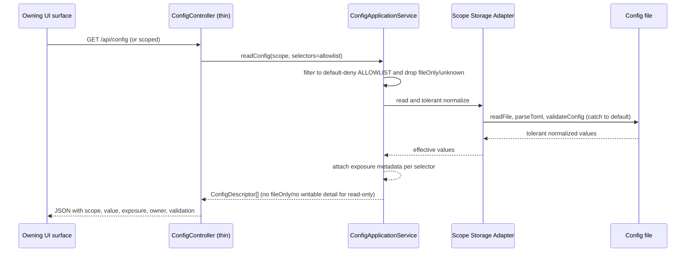
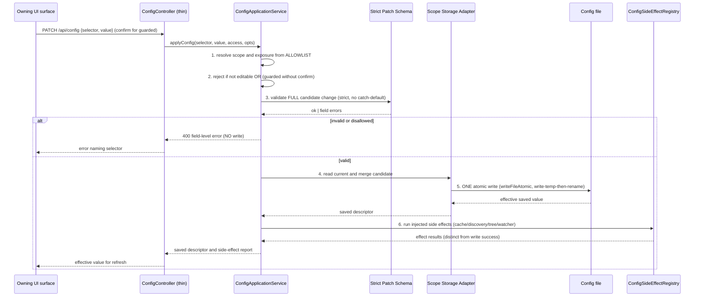

# Architecture

## Overview

MDT-168 introduces a **bounded configuration-management boundary** (Option 2 —
Redesign Inline). The redesign is deliberately scoped to the seams MDT-168
needs: a default-deny selector allowlist with exposure metadata, strict
mutation contracts separated from tolerant read schemas, one configuration
application service backed by scope-specific storage adapters, an explicit
post-write side-effect registry, and extracted thin routes/controllers. It does
not become a generic TOML editor and does not rewrite the foundation.

The pattern is **Allowlist-mediated application service over scope adapters**:
all configuration reads and writes pass through one typed application boundary
that knows the selector's scope, exposure, and validation rules, and delegates
persistence to a single adapter per config file.

## Module Boundaries and Ownership

```
domain-contracts/src/config-management/   NEW — pure contract layer
  ├── selectors.ts      Selector type, Exposure enum, default-deny ALLOWLIST registry
  ├── patch-schemas.ts  strict per-selector mutation Zod schemas (no catch-to-default)
  ├── defaults.ts       PROJECT_DOCUMENT_CONFIG_DEFAULTS + canonical config defaults
  └── index.ts          public barrel
server/services/config/                   NEW — application boundary + adapters
  ├── ConfigApplicationService.ts   THE one application boundary
  ├── ConfigSideEffectRegistry.ts   explicit injected post-write effects
  └── adapters/
        ├── GlobalConfigStorageAdapter.ts   config.toml (read normalize / atomic write)
        ├── UserConfigStorageAdapter.ts     user.toml
        ├── ProjectConfigStorageAdapter.ts  {project}/.mdt-config.toml
        └── RegistryConfigStorageAdapter.ts CONFIG_DIR/projects/*.toml
server/controllers/ConfigController.ts     NEW — thin transport delegate
server/routes/config.ts                    NEW — config endpoints extracted from system.ts
shared/services/project/ProjectDocumentPatch.ts  NEW — typed document patch command
src/hooks/useBackendConfig.ts              NEW — staged backend-config state/actions
src/config/configApiClient.ts              NEW — typed client + field-error handling
```

**Dependency direction**: `domain-contracts` ← `shared` ← `server`/`src`. The
contract layer has no filesystem/controller/UI behavior. Adapters depend on the
contract + shared atomic-write/TOML helpers; they never reach into routes.

**What stays put**: tolerant persisted-file read schemas
(`app-config/schema.ts` `.catch().default()`) remain for _reads_; only the
_mutation_ path uses the new strict `patch-schemas.ts`. The existing selector
JSON state endpoint (`/api/config/selector`, `project-selector.json`) stays on
its maintenance-gated path — it is mutable user state, not a TOML selector.

## Canonical Read Flow



Reads are owner-only for writable detail; read-only callers receive no writable
config detail (config scrubbed, BR-5.1/C-8).

## Canonical Write Flow



## Validation Order and Atomicity

The application service enforces a strict, fail-closed order:

1. **Authorize** — owner-only via `accessPolicy.ts` + `getRequestAccess`.
2. **Resolve & classify** — selector must exist on the default-deny ALLOWLIST;
   unknown/disallowed/readOnly/fileOnly selectors fail here (BR-2.2).
3. **Guard check** — guarded selectors require operation-specific confirmation
   and route to a guarded workflow, never the scalar writer (BR-4.1).
4. **Full-candidate validation** — the strict patch schema validates the
   _complete_ post-merge candidate (not just the incoming value), so an invalid
   value never reaches disk and is never converted to a default (BR-2.3/C-2).
5. **Single atomic write** — one `writeFileAtomic` per target file
   (write-temp-then-rename, SEC-002). Rejected requests write nothing; a mix of
   valid + invalid selectors rejects the whole request (Edge-1).
6. **Post-write effects** — explicit, injected, idempotent; failures are
   reported distinctly from write failures (Edge-3/C-5).

## Side-Effect Ownership

`ConfigSideEffectRegistry` maps selector scope → effect(s). Side effects are
_not_ in TOML helpers:

| Selector scope changed        | Effect(s)                                                        |
| ----------------------------- | ---------------------------------------------------------------- |
| `project.document.*`          | reconfigure document watchers; invalidate document tree          |
| `discovery.*` (global)        | invalidate `projectDiscovery` cache; refresh discovery           |
| `links.*` / `system.*`        | link/system runtime re-read (next request observes new value)    |
| `ui.projectSelector.*` (user) | no server/global effect; same-browser consumer refresh (see below) |
| project metadata              | project list refresh; registry identity unchanged unless guarded |

Effects accept failure reporting; a failed effect does not roll back the
persisted write (persisted config is the source of truth; the effect converges
on next refresh — Edge-4 idempotency).

### Same-Browser Consumer Refresh for `ui.projectSelector.*` (BR-7.1)

The `ui.projectSelector.*` row above is intentionally **not** "no effect". A
successful `applyConfig` for `ui.projectSelector.visibleCount` or
`ui.projectSelector.compactInactive` requires a **same-browser consumer
refresh** so the project selector rail (MDT-129 `useSelectorData`) converges
without a full page reload. This is distinct from a server/global side effect:

- **No server/global effect**: no discovery cache invalidation, no document
  watcher reconfiguration, no registry reload. The persisted `user.toml` value
  is the source of truth; subsequent fresh sessions read it on next mount.
- **Same-browser consumer refresh required**: the writer
  (`useBackendConfig.applyOne`) must notify live selector consumers in the
  current session. The transport is the narrow named window event already
  consumed by `useSelectorData` (`mdt:selector-prefs-updated` /
  `SELECTOR_PREFS_SYNC_EVENT`), dispatched only after a successful
  `ui.projectSelector.*` save — **not** a generic event bus and **not**
  broadcast on unrelated config writes.

On the refresh signal, `useSelectorData` re-fetches backend prefs from
`/api/config/selector` (the values for `visibleCount` and `compactInactive`)
and then layers browser-only localStorage overrides (`accentEnabled`,
`autocolor`, `accentStyle`) on top — the same merge order used at initial
load (`{...validatedPreferences, ...localOverrides}`). Browser-only prefs
never flow through this path (BR-6.1).

This split is the contract that closes the UAT-2026-07-26 freshness defect:
"no global effect" describes the server side only; the same-browser consumer
refresh is mandatory and is owned by `useBackendConfig` (writer) and
`useSelectorData` (consumer).

## Canonical Defaults (maxDepth Drift Resolution)

`domain-contracts/src/config-management/defaults.ts` defines:

```ts
export const PROJECT_DOCUMENT_CONFIG_DEFAULTS = {
  paths: [] as string[],
  excludeFolders: [] as string[],
  maxDepth: 5,
} as const;
```

**Decision: document `maxDepth` canonical default = 5.** Rationale: the runtime
document-tree behavior (TreeBuilder, PathSelector, PathSelectionStrategy) has
always used 5 as the effective default; the schema's `3` was never the value
users observed. Aligning to 5 preserves existing behavior while making it
truthful and single-sourced. Consumers updated to import this constant:
`project/schema.ts` DocumentConfigObjectSchema default, `ConfigRepository`
(returns 5 instead of undefined), `TreeBuilder` param default, registry
creation, UI reset, tests, and docs.

Discovery `maxDepth` (global, range 1–50) keeps its existing default of 3 and is
unchanged — it is a different concept and not part of the document drift.

## Guarded Operation Workflow

Code/ticketsPath/registry-path are never ordinary scalar patches. They flow
through an explicit operation method on `ConfigApplicationService` (e.g.
`applyGuardedProjectCodeChange`, `applyTicketsPathChange`) that:

1. Requires a confirmation token in the request.
2. Runs operation-specific validation (e.g. code uniqueness, ticketsPath path
   safety + directory creation, registry path resolution).
3. Writes registry and local config via their adapters in the correct order with
   invariant checks, so registry identity and local config stay consistent
   (BR-4.2). No partial desync.
4. Fires the full side-effect set (discovery, watchers, registry reload).

## Migration, Compatibility, and Rollback

- **Tolerant reads preserved**: existing `.mdt-config.toml`/`config.toml`/
  `user.toml` files with legacy or extra keys still read via tolerant schemas;
  unknown keys are ignored (passthrough), not deleted. Writes preserve all
  unrelated fields (BR-2.1).
- **`POST /api/documents/configure` compatibility**: the controller is
  re-wired to the new document patch command. The existing request shape
  (`projectId`, `documentPaths`) is accepted for backward compatibility and
  translated into a document patch; a new patch-capable endpoint carries
  `excludeFolders`/`maxDepth`. OpenAPI documents both.
- **Rollback**: because each change is one atomic file write with side effects
  as separate injected steps, a rollback is a single config-file revert; no
  multi-file transaction state exists. The old `configureDocumentsByPath` path
  can be temporarily restored if needed during rollout.
- **maxDepth migration**: files already on disk keep their explicit value; only
  _missing_ maxDepth (previously undefined) now resolves to 5 instead of 5-via-
  fallback — behaviorally identical, now truthful.

## Observability and Test Seams

- **Controller → service seam**: routes/controllers are transport-only, so the
  service is unit-testable without HTTP. Each storage adapter is independently
  testable against a temp config dir.
- **Side-effect injection**: `ConfigSideEffectRegistry` accepts its effects as
  dependencies, so tests inject no-op or spy effects and assert write/effect
  separation (Edge-3).
- **Contract tests**: the ALLOWLIST and exposure metadata are pure contract
  data, testable in `domain-contracts` with no server boot.
- **OpenAPI**: request/response components are registered components, so
  contract validation tests assert field-level error shapes (C-9).

## Architecture Invariants

1. No configuration write bypasses `ConfigApplicationService`.
2. No selector is read or written unless present on the default-deny ALLOWLIST.
3. Mutation schemas never recover invalid input to a default.
4. One atomic write per target config file per request; rejected = no write.
5. Side effects are explicit, injected, and never live in TOML helpers.
6. `domain-contracts` config-management is pure (no fs/controller/UI).
7. Routes/controllers are transport-only; no direct filesystem logic in routes.
8. Browser-only settings never reach backend TOML.
9. A successful `applyConfig` for `ui.projectSelector.visibleCount` or
   `ui.projectSelector.compactInactive` notifies live selector consumers in the
   same browser session via the narrow named window event already consumed by
   `useSelectorData`; no generic event bus, no broadcast on unrelated writes.

## Extension Rule

Adding a new editable selector is a contract-only change: add it to
`selectors.ts` ALLOWLIST with exposure + validation, add a strict patch schema
in `patch-schemas.ts`, and register any side effect. No route changes, no new
filesystem reader, no new validation policy — the application boundary and
adapters already own scope resolution, atomicity, and effects. This is the
core maintainability payoff of the Option 2 redesign.

## Tradeoffs and Alternatives

- **Chosen**: scope-specific adapters behind one application service. Cost: 4
  small adapter classes + 1 service. Benefit: per-scope atomicity and testability
  without a generic transaction framework.
- **Rejected**: a single generic config repository handling all files. Would
  violate C-6 (catch-all repository) and blur scope-specific side effects.
- **Rejected**: expanding `SettingsModal` to persist backend config inline.
  Would mix backend state with localStorage and create a persistence monolith
  (assess mismatch 5).
- **Deferred (debt)**: consolidating the four legacy config _read_ entry points
  (`system.ts`, `ProjectController`, `ProjectConfigService`, `ConfigRepository`)
  onto the new adapters fully. MDT-168 routes mutations and new reads through
  the boundary; full read-path consolidation is recorded as follow-up debt to
  keep the diff bounded.

## Constraint Carryover Confirmation

All constraints C-1..C-10 are addressed by obligations above (see
`architecture.trace.md` for the derived-from mapping). C-4 (maxDepth) is
resolved to 5 with rationale. C-10 (no new packages) holds — no dependency
additions; reuse of Zod, smol-toml, writeFileAtomic, auth middleware.

---

Use `architecture.trace.md` for canonical artifact and obligation records.
_Rendered by mdt:architecture via spec-trace_
